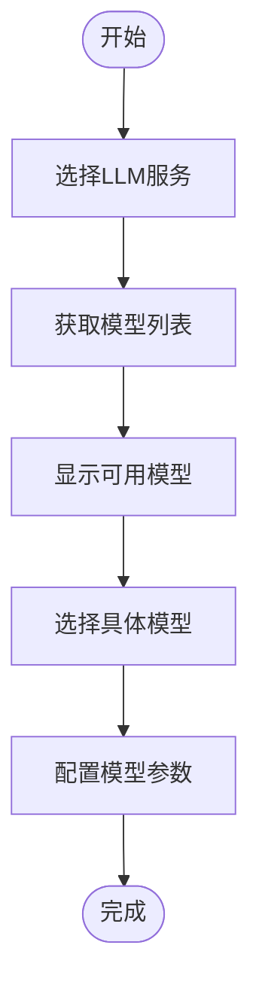
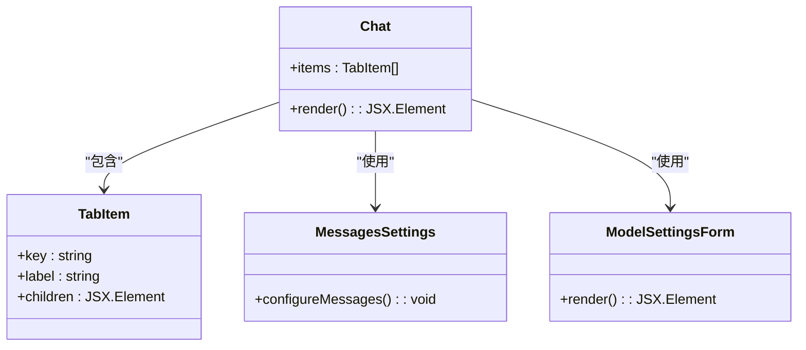
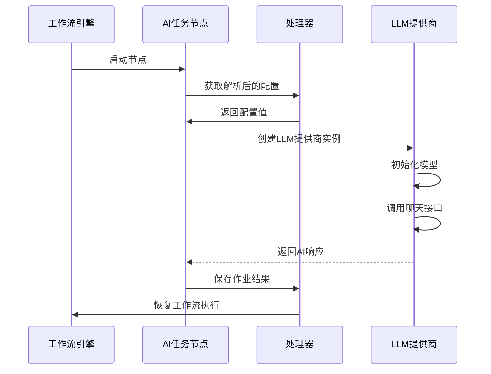

# AI任务配置

<cite>
**本文档中引用的文件**  
- [plugin.ts](file://packages/plugins/@nocobase/plugin-ai/src/server/plugin.ts)
- [ai-manager.ts](file://packages/plugins/@nocobase/plugin-ai/src/server/manager/ai-manager.ts)
- [provider.ts](file://packages/plugins/@nocobase/plugin-ai/src/server/llm-providers/provider.ts)
- [llm\index.ts](file://packages/plugins/@nocobase/plugin-ai/src/server/workflow/nodes/llm/index.ts)
- [ai.ts](file://packages/plugins/@nocobase/plugin-ai/src/server/resource/ai.ts)
- [ModelSettings.tsx](file://packages/plugins/@nocobase/plugin-ai/src/client/llm-providers/openai/ModelSettings.tsx)
- [ModelSettings.tsx](file://packages/plugins/@nocobase/plugin-ai/src/client/llm-providers/deepseek/ModelSettings.tsx)
- [ModelSelect.tsx](file://packages/plugins/@nocobase/plugin-ai/src/client/llm-providers/components/ModelSelect.tsx)
- [Chat.tsx](file://packages/plugins/@nocobase/plugin-ai/src/client/llm-providers/components/Chat.tsx)
- [index.tsx](file://packages/plugins/@nocobase/plugin-ai/src/client/workflow/nodes/llm/index.tsx)
</cite>

## 目录
1. [简介](#简介)
2. [AI任务输入参数定义](#ai任务输入参数定义)
3. [AI模型选择](#ai模型选择)
4. [提示模板设计](#提示模板设计)
5. [上下文配置方法](#上下文配置方法)
6. [执行条件与触发机制](#执行条件与触发机制)
7. [工作流集成方式](#工作流集成方式)
8. [不同类型AI任务配置示例](#不同类型ai任务配置示例)
9. [配置验证最佳实践](#配置验证最佳实践)
10. [结论](#结论)

## 简介
NocoBase的AI任务配置系统提供了一套完整的机制，用于定义和管理人工智能相关的自动化任务。该系统通过插件架构实现了与大型语言模型（LLM）的集成，支持多种AI服务提供商，并能够灵活地配置各种参数来满足不同的业务需求。AI任务可以作为工作流的一部分执行，实现复杂的自动化场景。

**Section sources**
- [plugin.ts](file://packages/plugins/@nocobase/plugin-ai/src/server/plugin.ts#L1-L52)

## AI任务输入参数定义
在NocoBase中，AI任务的输入参数通过工作流节点的配置字段进行定义。系统使用Schema组件来构建用户界面，允许用户配置LLM服务、模型选项和其他相关参数。核心输入参数包括LLM服务选择、模型名称、温度、频率惩罚等。

LLM服务选择是通过RemoteSelect组件实现的，它从llmServices资源中获取可用的服务列表。模型选项则根据所选的LLM提供商动态加载相应的配置表单。这种设计使得系统能够支持多种不同的AI服务提供商，同时保持用户界面的一致性和易用性。

**Section sources**
- [index.tsx](file://packages/plugins/@nocobase/plugin-ai/src/client/workflow/nodes/llm/index.tsx#L17-L50)
- [ModelSettings.tsx](file://packages/plugins/@nocobase/plugin-ai/src/client/llm-providers/openai/ModelSettings.tsx#L1-L175)

## AI模型选择
NocoBase的AI模型选择机制基于插件架构实现，支持多种LLM提供商。系统通过AIManager类管理不同的LLM提供商，并提供统一的接口来注册和访问这些提供商。目前支持OpenAI和DeepSeek等主流AI服务。

模型选择过程包括两个主要步骤：首先选择LLM服务，然后从该服务提供的模型列表中选择具体的模型。当用户选择一个LLM服务后，系统会通过API调用获取该服务支持的所有模型列表，并在下拉菜单中显示供用户选择。这个过程是动态的，确保用户总是能看到最新的模型选项。

**Diagram sources**
- [plugin.ts](file://packages/plugins/@nocobase/plugin-ai/src/server/plugin.ts#L18-L52)
- [ai.ts](file://packages/plugins/@nocobase/plugin-ai/src/server/resource/ai.ts#L16-L54)

**Section sources**
- [plugin.ts](file://packages/plugins/@nocobase/plugin-ai/src/server/plugin.ts#L18-L52)
- [ai.ts](file://packages/plugins/@nocobase/plugin-ai/src/server/resource/ai.ts#L16-L54)
- [ModelSelect.tsx](file://packages/plugins/@nocobase/plugin-ai/src/client/llm-providers/components/ModelSelect.tsx#L1-L76)

## 提示模板设计
NocoBase的提示模板设计采用了灵活的组件化架构，允许用户通过可视化界面构建复杂的提示词。系统提供了多种预设的提示模板组件，包括消息配置、变量插入和上下文管理等功能。

提示模板的核心是Chat组件，它通过Tabs界面组织不同的配置选项。每个选项卡对应一种特定的配置类型，如消息内容、模型参数或高级选项。这种设计使得用户可以轻松地在不同的配置部分之间切换，而不会感到界面过于拥挤。

系统还支持工作流变量的动态插入，允许用户将业务数据注入到提示模板中。这使得AI任务能够根据实际的业务上下文生成更加相关和准确的响应。

**Diagram sources**
- [Chat.tsx](file://packages/plugins/@nocobase/plugin-ai/src/client/llm-providers/components/Chat.tsx#L1-L28)
- [ModelSettings.tsx](file://packages/plugins/@nocobase/plugin-ai/src/client/llm-providers/openai/ModelSettings.tsx#L148-L174)

**Section sources**
- [Chat.tsx](file://packages/plugins/@nocobase/plugin-ai/src/client/llm-providers/components/Chat.tsx#L1-L28)
- [ModelSettings.tsx](file://packages/plugins/@nocobase/plugin-ai/src/client/llm-providers/openai/ModelSettings.tsx#L148-L174)

## 上下文配置方法
NocoBase的上下文配置方法通过数据模型提取和信息注入机制实现。系统允许从现有的数据模型中提取相关信息，并将其作为上下文注入到AI请求中。这种设计使得AI任务能够基于实际的业务数据生成更加准确和相关的响应。

上下文配置的核心是parseMessages处理器，它负责将工作流中的数据转换为适合LLM处理的格式。系统支持多种数据源，包括数据库记录、文件内容和API响应等。这些数据源可以通过工作流变量引用，并在运行时动态注入到提示模板中。

为了确保上下文的相关性和有效性，系统还提供了上下文长度限制和优先级排序功能。这有助于避免因上下文过长而导致的性能问题，同时确保最重要的信息能够优先被AI模型处理。

**Section sources**
- [provider.ts](file://packages/plugins/@nocobase/plugin-ai/src/server/llm-providers/provider.ts#L15-L90)
- [ModelSettings.tsx](file://packages/plugins/@nocobase/plugin-ai/src/client/llm-providers/openai/ModelSettings.tsx#L19-L146)

## 执行条件与触发机制
NocoBase的AI任务执行条件和触发机制通过工作流系统实现。AI任务作为工作流中的一个节点存在，其执行受到前置节点的输出和配置条件的控制。系统支持多种触发方式，包括手动触发、定时触发和事件触发等。

每个AI任务节点都可以配置忽略失败的选项，这在处理非关键性任务时非常有用。当任务执行失败时，如果启用了忽略失败选项，工作流将继续执行后续节点，而不是停止整个流程。这种设计提高了系统的容错能力和灵活性。

**Diagram sources**
- [llm\index.ts](file://packages/plugins/@nocobase/plugin-ai/src/server/workflow/nodes/llm/index.ts#L35-L106)
- [provider.ts](file://packages/plugins/@nocobase/plugin-ai/src/server/llm-providers/provider.ts#L51-L56)

**Section sources**
- [llm\index.ts](file://packages/plugins/@nocobase/plugin-ai/src/server/workflow/nodes/llm/index.ts#L35-L106)

## 工作流集成方式
NocoBase的AI任务通过插件机制与工作流系统深度集成。AI插件在加载时会向工作流系统注册新的指令类型和指令组，从而扩展工作流的功能。这种设计使得AI任务能够无缝地融入现有的工作流体系中。

集成过程包括三个主要步骤：首先，AI插件向工作流系统注册"AI"指令组；其次，注册具体的"llm"指令类型；最后，提供相应的客户端组件来配置和显示AI任务节点。这种分层的集成方式确保了系统的模块化和可扩展性。

工作流集成还支持权限控制，通过ACL（访问控制列表）机制管理用户对AI服务的访问权限。这确保了只有授权用户才能配置和执行AI任务，提高了系统的安全性。

**Section sources**
- [plugin.ts](file://packages/plugins/@nocobase/plugin-ai/src/server/plugin.ts#L39-L40)
- [index.tsx](file://packages/plugins/@nocobase/plugin-ai/src/client/index.tsx#L53-L55)

## 不同类型AI任务配置示例
NocoBase支持多种类型的AI任务配置，包括文本生成、分类和摘要等。这些任务的配置方式基本相同，但具体的参数设置会根据任务类型有所不同。

对于文本生成任务，关键参数包括温度、topP和最大完成令牌数。较高的温度值会产生更多样化的输出，而较低的值则会使输出更加确定和集中。分类任务通常需要设置响应格式为JSON，并提供明确的类别定义。摘要任务则需要关注上下文长度和关键信息提取的准确性。

所有这些任务都通过相同的LLMInstruction类执行，差异主要体现在配置参数上。这种统一的执行模型简化了系统的复杂性，同时保持了足够的灵活性来支持各种AI应用场景。

**Section sources**
- [ModelSettings.tsx](file://packages/plugins/@nocobase/plugin-ai/src/client/llm-providers/openai/ModelSettings.tsx#L41-L122)
- [ModelSettings.tsx](file://packages/plugins/@nocobase/plugin-ai/src/client/llm-providers/deepseek/ModelSettings.tsx#L41-L118)

## 配置验证最佳实践
为了确保AI任务的稳定性和可靠性，NocoBase提供了一系列配置验证的最佳实践。首先，在保存配置时进行基本的参数验证，确保所有必需的字段都已填写且格式正确。

其次，在执行任务前进行服务可用性检查，通过调用listModels接口验证LLM服务是否正常工作。这可以避免因服务中断或API密钥失效而导致的任务失败。

最后，建议在生产环境中启用详细的日志记录，以便在出现问题时能够快速定位和解决。系统提供了错误处理机制，包括重试策略和超时控制，这些都应该根据具体的应用场景进行合理配置。

**Section sources**
- [llm\index.ts](file://packages/plugins/@nocobase/plugin-ai/src/server/workflow/nodes/llm/index.ts#L16-L33)
- [provider.ts](file://packages/plugins/@nocobase/plugin-ai/src/server/llm-providers/provider.ts#L58-L88)

## 结论
NocoBase的AI任务配置系统提供了一套强大而灵活的机制，用于集成和管理人工智能功能。通过插件化的架构设计，系统能够支持多种LLM提供商，并提供丰富的配置选项来满足不同的业务需求。与工作流系统的深度集成使得AI任务能够作为自动化流程的一部分执行，极大地扩展了系统的应用范围。

该系统的模块化设计和清晰的接口定义使得它易于扩展和维护。随着AI技术的不断发展，这套配置系统为NocoBase平台提供了坚实的基础，使其能够快速适应新的AI服务和应用场景。