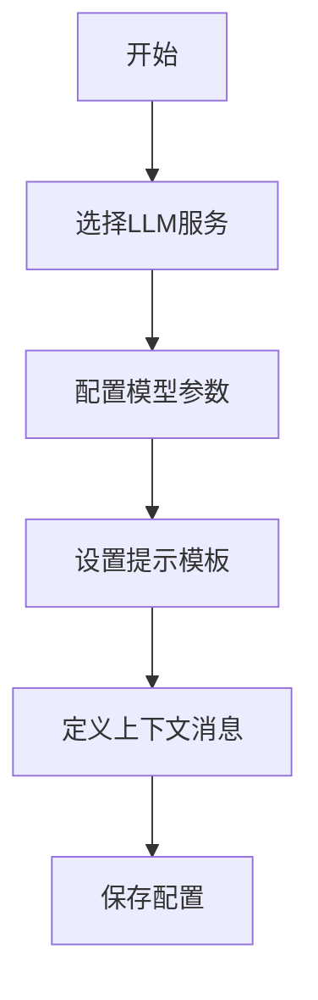
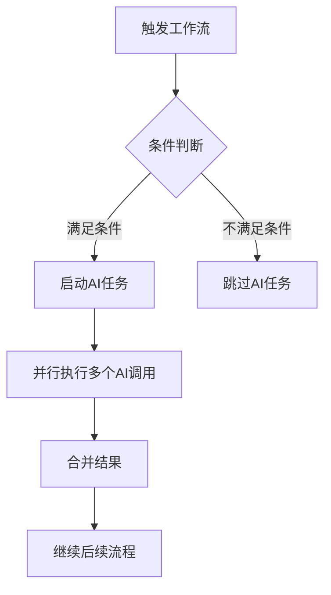
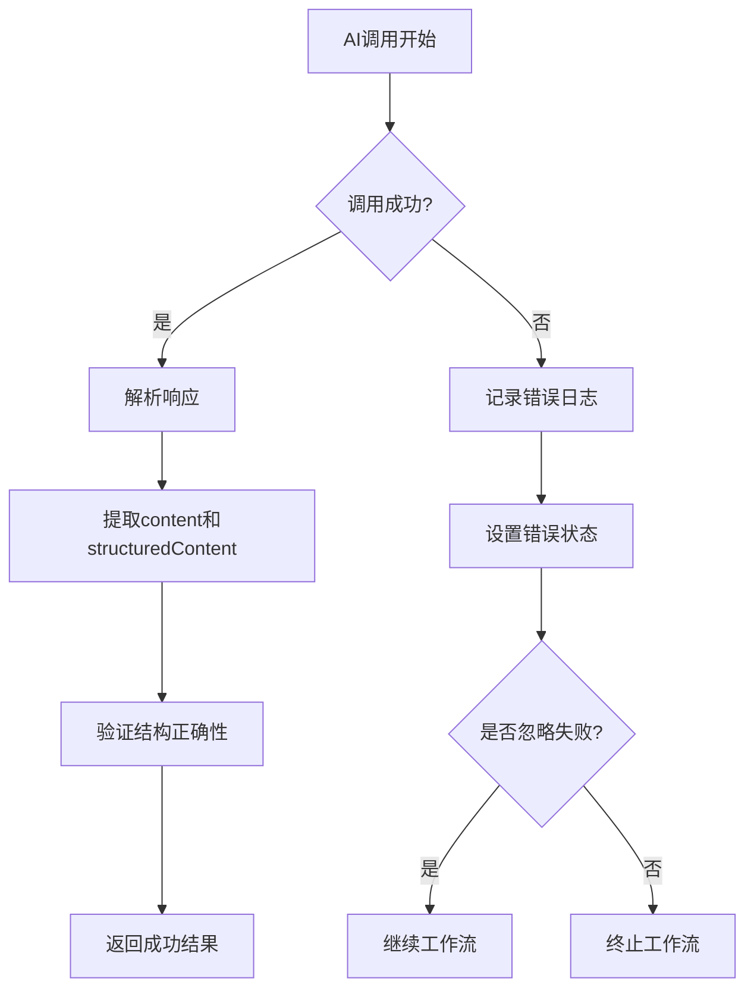
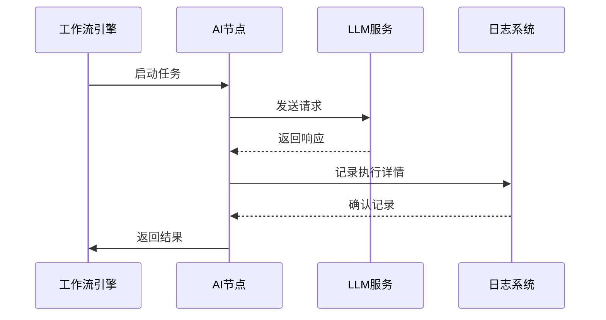

# AI功能指南

<cite>
**本文档中引用的文件**  
- [plugin.ts](file://packages/plugins/@nocobase/plugin-ai/src/server/plugin.ts)
- [ai-manager.ts](file://packages/plugins/@nocobase/plugin-ai/src/client/manager/ai-manager.ts)
- [LLMInstruction.tsx](file://packages/plugins/@nocobase/plugin-ai/src/client/workflow/nodes/llm/index.tsx)
- [llm/index.ts](file://packages/plugins/@nocobase/plugin-ai/src/server/workflow/nodes/llm/index.ts)
- [openai/ModelSettings.tsx](file://packages/plugins/@nocobase/plugin-ai/src/client/llm-providers/openai/ModelSettings.tsx)
- [openai/ProviderSettings.tsx](file://packages/plugins/@nocobase/plugin-ai/src/client/llm-providers/openai/ProviderSettings.tsx)
- [deepseek/ModelSettings.tsx](file://packages/plugins/@nocobase/plugin-ai/src/client/llm-providers/deepseek/ModelSettings.tsx)
- [ParallelInstruction.ts](file://packages/plugins/@nocobase/plugin-workflow-parallel/src/server/ParallelInstruction.ts)
- [workflows.ts](file://packages/plugins/@nocobase/plugin-workflow/src/server/actions/workflows.ts)
- [ai-manager.ts](file://packages/plugins/@nocobase/plugin-ai/src/server/manager/ai-manager.ts)
</cite>

## 目录
1. [简介](#简介)
2. [AI员工的创建与配置](#ai员工的创建与配置)
3. [通过工作流触发AI任务](#通过工作流触发ai任务)
4. [AI输出的解析与验证](#ai输出的解析与验证)
5. [在数据表单与内容管理中的AI集成](#在数据表单与内容管理中的ai集成)
6. [AI任务的监控与日志记录](#ai任务的监控与日志记录)
7. [故障排除指南](#故障排除指南)
8. [结论](#结论)

## 简介
NocoBase 提供了强大的AI集成能力，允许用户通过插件系统将大型语言模型（LLM）无缝集成到其应用中。本指南详细介绍了如何配置AI服务、通过工作流触发AI任务、处理AI输出以及监控和调试AI功能。

**本节不分析具体源文件，因此无来源**

## AI员工的创建与配置

NocoBase 的 AI 功能通过 `@nocobase/plugin-ai` 插件实现，支持多种 LLM 提供商（如 OpenAI 和 DeepSeek），并提供灵活的模型配置选项。

### 模型选择
用户可以在工作流节点中选择已配置的 LLM 服务。系统通过 `RemoteSelect` 组件从 `llmServices` 资源中获取可用的服务列表，并显示其标题和名称。

### 提示模板设计
在配置 LLM 节点时，用户可以设置各种参数以优化模型输出：
- **Temperature**：控制输出的随机性（默认值：0.7）
- **Top P**：核采样参数（默认值：1.0）
- **Frequency Penalty**：降低重复词汇的出现概率（默认值：0.0）
- **Presence Penalty**：鼓励模型探索新话题（默认值：0.0）

### 上下文配置
用户可以通过消息历史（messages）为模型提供上下文。系统支持结构化输出格式，包括纯文本、JSON 对象和 JSON Schema，确保输出符合预期结构。

**图示来源**
- [ModelSettingsForm.tsx](file://packages/plugins/@nocobase/plugin-ai/src/client/llm-providers/openai/ModelSettings.tsx#L148-L174)
- [ProviderSettingsForm.tsx](file://packages/plugins/@nocobase/plugin-ai/src/client/llm-providers/openai/ProviderSettings.tsx#L15-L38)

**本节来源**
- [ai-manager.ts](file://packages/plugins/@nocobase/plugin-ai/src/client/manager/ai-manager.ts#L13-L33)
- [openai/ModelSettings.tsx](file://packages/plugins/@nocobase/plugin-ai/src/client/llm-providers/openai/ModelSettings.tsx#L19-L175)

## 通过工作流触发AI任务

AI任务通过NocoBase的工作流系统触发，支持条件判断、并行处理和复杂的结果处理逻辑。

### 条件判断
工作流可以根据前序节点的执行状态决定是否执行AI任务。例如，只有当某个数据验证通过时才调用AI生成内容。

### 并行处理
NocoBase支持多种并行模式，允许同时执行多个AI任务：
- **ALL**：所有分支都必须成功
- **ANY**：任一分支成功即视为整体成功
- **RACE**：首个完成的分支决定结果
- **ALL_SETTLED**：等待所有分支完成，无论成功或失败

**图示来源**
- [ParallelInstruction.ts](file://packages/plugins/@nocobase/plugin-workflow-parallel/src/server/ParallelInstruction.ts#L12-L75)
- [workflows.ts](file://packages/plugins/@nocobase/plugin-workflow/src/server/actions/workflows.ts#L125-L174)

**本节来源**
- [LLMInstruction.tsx](file://packages/plugins/@nocobase/plugin-ai/src/client/workflow/nodes/llm/index.tsx#L17-L80)
- [llm/index.ts](file://packages/plugins/@nocobase/plugin-ai/src/server/workflow/nodes/llm/index.ts#L15-L106)

## AI输出的解析与验证

AI任务执行后，系统会对输出进行解析和验证，确保内容的准确性和安全性。

### 输出结构
AI节点返回的结果包含以下字段：
- `content`：模型生成的文本内容
- `structuredContent`：结构化解析后的内容（如JSON）
- `additionalKwargs`：附加参数
- `responseMetadata`：响应元数据
- `toolCalls`：工具调用信息

### 验证机制
系统通过以下方式确保输出质量：
1. 设置超时限制（默认60秒）
2. 配置最大重试次数（默认1次）
3. 捕获并记录错误信息
4. 支持忽略失败选项，使工作流继续执行

**图示来源**
- [llm/index.ts](file://packages/plugins/@nocobase/plugin-ai/src/server/workflow/nodes/llm/index.ts#L35-L106)
- [ModelSettings.tsx](file://packages/plugins/@nocobase/plugin-ai/src/client/llm-providers/openai/ModelSettings.tsx#L123-L136)

**本节来源**
- [llm/index.ts](file://packages/plugins/@nocobase/plugin-ai/src/server/workflow/nodes/llm/index.ts#L54-L90)
- [ai-manager.ts](file://packages/plugins/@nocobase/plugin-ai/src/server/manager/ai-manager.ts)

## 在数据表单与内容管理中的AI集成

AI功能可深度集成到数据表单和内容管理系统中，实现智能化的数据处理。

### 数据表单集成
在表单中，AI可用于：
- 自动生成字段内容
- 智能填充建议
- 内容摘要生成
- 数据验证与清洗

### 内容管理集成
在内容管理场景中，AI支持：
- 自动生成文章草稿
- 智能翻译
- 情感分析
- 关键词提取

实际集成通过工作流触发，在数据创建或更新时自动调用AI服务，并将结果写回相应字段。

**本节不包含具体代码分析，因此无来源**

## AI任务的监控与日志记录

系统提供了完善的监控和日志记录机制，便于跟踪AI任务的执行状态和性能指标。

### 执行状态跟踪
每个AI任务的执行状态包括：
- `PENDING`：等待中
- `RESOLVED`：成功完成
- `ERROR`：执行出错

### 性能指标收集
系统记录以下性能数据：
- 调用响应时间
- 重试次数
- 错误类型统计
- 成功率分析

日志信息包含节点ID、错误详情和去除了敏感信息的聊天选项，便于调试问题。

**图示来源**
- [llm/index.ts](file://packages/plugins/@nocobase/plugin-ai/src/server/workflow/nodes/llm/index.ts#L76-L85)
- [ParallelInstruction.ts](file://packages/plugins/@nocobase/plugin-workflow-parallel/src/server/ParallelInstruction.ts)

**本节来源**
- [llm/index.ts](file://packages/plugins/@nocobase/plugin-ai/src/server/workflow/nodes/llm/index.ts#L76-L85)
- [plugin.ts](file://packages/plugins/@nocobase/plugin-ai/src/server/plugin.ts#L18-L53)

## 故障排除指南

### 超时问题
**症状**：AI调用长时间无响应  
**解决方案**：
- 检查网络连接
- 增加超时设置（默认60000ms）
- 确认LLM服务端点可达

### 错误响应
**症状**：收到错误消息或空响应  
**解决方案**：
- 验证API密钥有效性
- 检查模型名称是否正确
- 确认账户配额未耗尽
- 查看服务提供商的状态页面

### 上下文丢失
**症状**：AI无法记住之前的对话内容  
**解决方案**：
- 确保消息历史正确传递
- 检查上下文长度是否超过模型限制
- 验证工作流变量引用正确

### 配置问题
**症状**：无法选择模型或服务  
**解决方案**：
- 确认LLM服务已正确配置
- 检查插件权限设置
- 验证服务状态为启用

**本节来源**
- [llm/index.ts](file://packages/plugins/@nocobase/plugin-ai/src/server/workflow/nodes/llm/index.ts#L40-L45)
- [openai/ProviderSettings.tsx](file://packages/plugins/@nocobase/plugin-ai/src/client/llm-providers/openai/ProviderSettings.tsx#L21-L26)

## 结论
NocoBase的AI功能提供了完整的端到端解决方案，从AI员工的创建配置，到通过工作流触发任务，再到输出解析和监控。该系统设计灵活，支持多种LLM提供商，并通过标准化接口确保安全性和可靠性。通过合理的配置和监控，用户可以构建强大的智能化应用。

**本节不分析具体源文件，因此无来源**