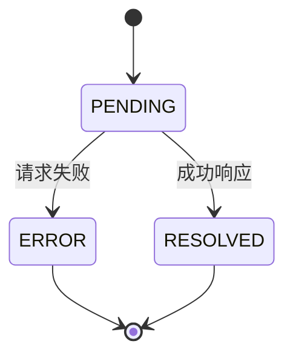
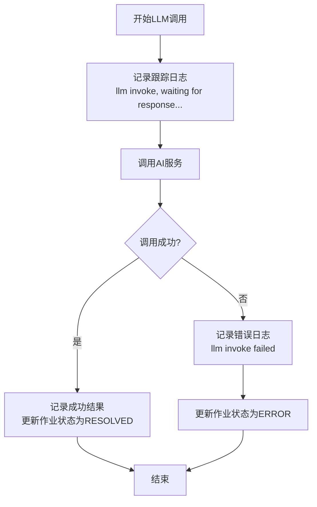
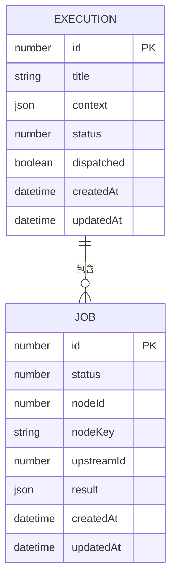
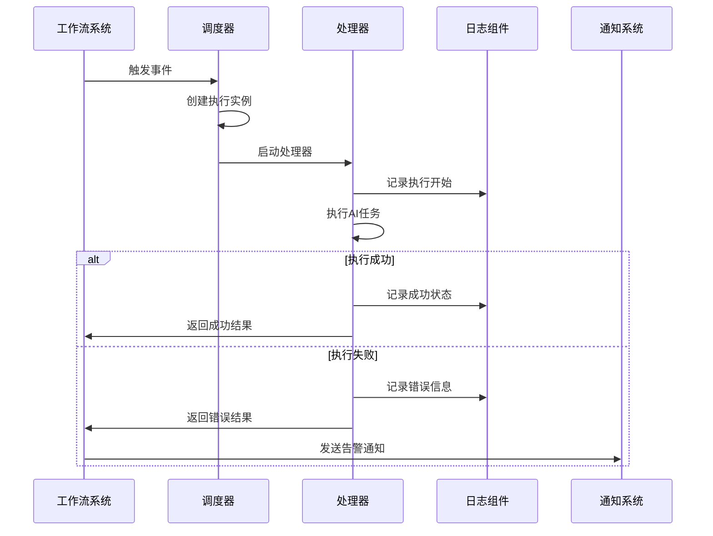
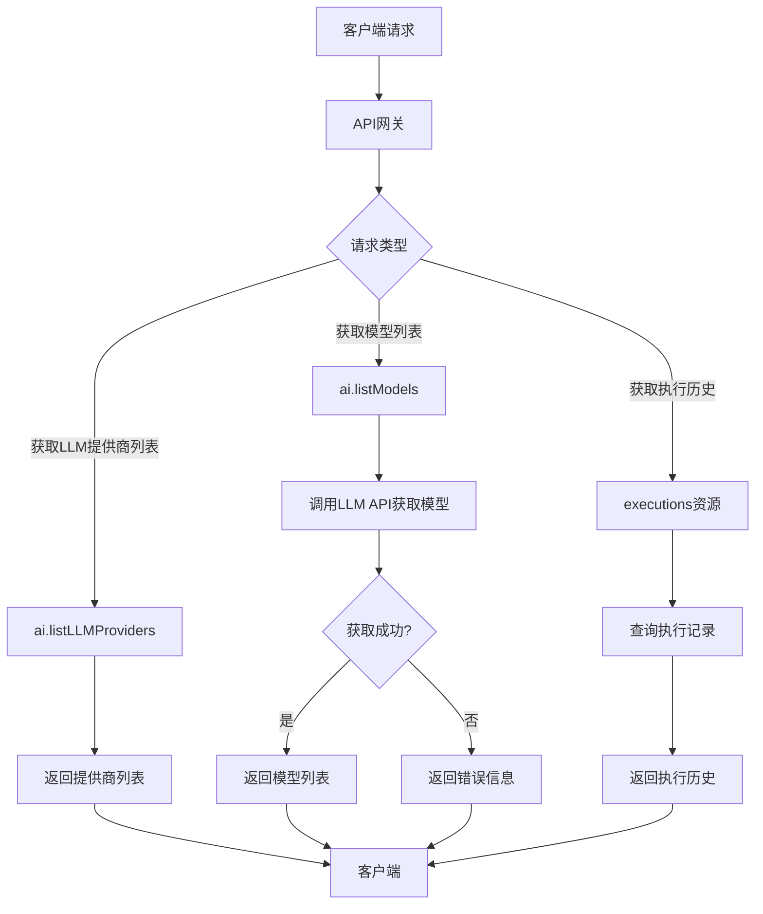
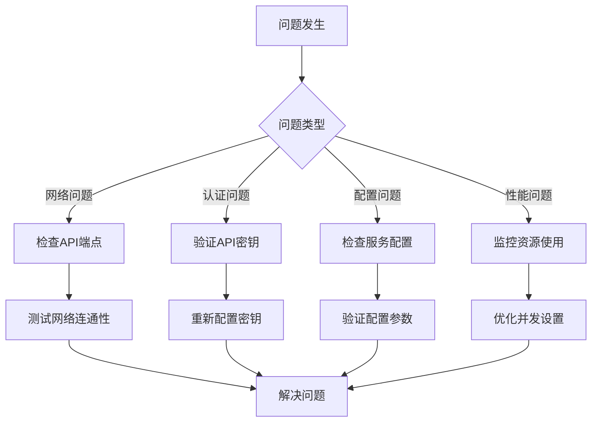

# AI执行监控

<cite>
**本文档中引用的文件**  
- [plugin.ts](file://packages/plugins/@nocobase/plugin-ai/src/server/plugin.ts)
- [ai-manager.ts](file://packages/plugins/@nocobase/plugin-ai/src/server/manager/ai-manager.ts)
- [ai.ts](file://packages/plugins/@nocobase/plugin-ai/src/server/resource/ai.ts)
- [provider.ts](file://packages/plugins/@nocobase/plugin-ai/src/server/llm-providers/provider.ts)
- [openai.ts](file://packages/plugins/@nocobase/plugin-ai/src/server/llm-providers/openai.ts)
- [deepseek.ts](file://packages/plugins/@nocobase/plugin-ai/src/server/llm-providers/deepseek.ts)
- [index.ts](file://packages/plugins/@nocobase/plugin-ai/src/server/workflow/nodes/llm/index.ts)
- [Dispatcher.ts](file://packages/plugins/@nocobase/plugin-workflow/src/server/Dispatcher.ts)
- [Processor.ts](file://packages/plugins/@nocobase/plugin-workflow/src/server/Processor.ts)
- [task-type.ts](file://packages/plugins/@nocobase/plugin-async-task-manager/src/server/task-type.ts)
- [executions.tsx](file://packages/plugins/@nocobase/plugin-workflow/src/client/schemas/executions.tsx)
- [workflows.ts](file://packages/plugins/@nocobase/plugin-workflow/src/client/schemas/workflows.ts)
</cite>

## 目录
1. [引言](#引言)
2. [AI任务执行状态跟踪](#ai任务执行状态跟踪)
3. [日志记录机制](#日志记录机制)
4. [性能指标收集](#性能指标收集)
5. [告警与通知设置](#告警与通知设置)
6. [执行历史查询与性能分析](#执行历史查询与性能分析)
7. [故障排除指南](#故障排除指南)
8. [结论](#结论)

## 引言
NocoBase平台通过AI插件和工作流系统实现了强大的AI任务执行监控能力。本指南详细说明了如何跟踪AI任务的执行状态、记录日志、收集性能指标、设置告警通知，并提供故障排除方法。

## AI任务执行状态跟踪

NocoBase的AI任务执行状态通过工作流系统进行管理，支持成功、失败和超时等多种状态的处理。AI任务作为工作流中的一个节点（LLM节点）执行，其状态由工作流处理器（Processor）统一管理。

在`LLMInstruction`类中，当调用大语言模型（LLM）时，系统会创建一个作业（Job），初始状态为`PENDING`。一旦收到AI响应，作业状态将更新为`RESOLVED`；如果发生错误，则状态变为`ERROR`。

**Diagram sources**
- [index.ts](file://packages/plugins/@nocobase/plugin-ai/src/server/workflow/nodes/llm/index.ts#L47-L85)

**Section sources**
- [index.ts](file://packages/plugins/@nocobase/plugin-ai/src/server/workflow/nodes/llm/index.ts#L35-L106)
- [Processor.ts](file://packages/plugins/@nocobase/plugin-workflow/src/server/Processor.ts#L34-L90)

## 日志记录机制

NocoBase采用结构化日志记录机制，完整记录AI任务的请求和响应信息。系统使用内置的日志组件，支持不同级别的日志输出。

在LLM调用过程中，系统会记录以下信息：
- 调用开始时的跟踪日志
- 错误发生时的详细错误信息
- 任务完成后的状态日志

日志记录包含节点ID、错误详情和聊天选项等上下文信息，便于问题排查。

**Diagram sources**
- [index.ts](file://packages/plugins/@nocobase/plugin-ai/src/server/workflow/nodes/llm/index.ts#L92-L95)
- [task-type.ts](file://packages/plugins/@nocobase/plugin-async-task-manager/src/server/task-type.ts#L74-L82)

**Section sources**
- [index.ts](file://packages/plugins/@nocobase/plugin-ai/src/server/workflow/nodes/llm/index.ts#L55-L85)
- [task-type.ts](file://packages/plugins/@nocobase/plugin-async-task-manager/src/server/task-type.ts#L74-L82)

## 性能指标收集

NocoBase系统收集多种性能指标，用于监控AI任务的执行情况。这些指标包括执行次数、执行时间、成功率等。

工作流系统会自动维护统计信息，每当创建新的执行实例时，相应的统计计数器就会递增。系统还支持进度报告功能，可以实时跟踪长时间运行任务的进度。

**Diagram sources**
- [Dispatcher.ts](file://packages/plugins/@nocobase/plugin-workflow/src/server/Dispatcher.ts#L308-L314)
- [task-type.ts](file://packages/plugins/@nocobase/plugin-async-task-manager/src/server/task-type.ts#L74-L82)

**Section sources**
- [Dispatcher.ts](file://packages/plugins/@nocobase/plugin-workflow/src/server/Dispatcher.ts#L277-L473)
- [task-type.ts](file://packages/plugins/@nocobase/plugin-async-task-manager/src/server/task-type.ts#L74-L82)

## 告警与通知设置

NocoBase通过事件驱动机制支持告警和通知功能。当AI任务执行出现异常时，系统可以通过多种渠道发送通知。

系统支持配置工作流的删除策略，当执行状态达到特定条件时自动清理执行记录。同时，可以通过插件扩展通知功能，如邮件通知、应用内消息等。

**Diagram sources**
- [Dispatcher.ts](file://packages/plugins/@nocobase/plugin-workflow/src/server/Dispatcher.ts#L450-L472)
- [index.ts](file://packages/plugins/@nocobase/plugin-ai/src/server/workflow/nodes/llm/index.ts#L35-L95)

**Section sources**
- [Dispatcher.ts](file://packages/plugins/@nocobase/plugin-workflow/src/server/Dispatcher.ts#L277-L473)
- [index.ts](file://packages/plugins/@nocobase/plugin-ai/src/server/workflow/nodes/llm/index.ts#L35-L106)

## 执行历史查询与性能分析

NocoBase提供完整的执行历史查询功能，用户可以通过API或管理界面查看AI任务的执行历史和性能数据。

系统提供了专门的资源端点用于查询LLM服务和模型列表，支持通过REST API获取执行统计信息。

**Diagram sources**
- [ai.ts](file://packages/plugins/@nocobase/plugin-ai/src/server/resource/ai.ts#L16-L48)
- [executions.tsx](file://packages/plugins/@nocobase/plugin-workflow/src/client/schemas/executions.tsx#L70-L83)

**Section sources**
- [ai.ts](file://packages/plugins/@nocobase/plugin-ai/src/server/resource/ai.ts#L16-L53)
- [executions.tsx](file://packages/plugins/@nocobase/plugin-workflow/src/client/schemas/executions.tsx#L70-L83)
- [workflows.ts](file://packages/plugins/@nocobase/plugin-workflow/src/client/schemas/workflows.ts#L345-L362)

## 故障排除指南

### 网络延迟问题
当遇到网络延迟导致AI调用超时的情况，可以检查以下方面：
- 确认LLM服务的API端点是否可达
- 检查网络连接质量
- 验证API密钥的有效性

### 模型错误
处理模型返回错误时，应：
- 检查服务配置中的API密钥
- 验证模型名称是否正确
- 确认服务提供商的API状态

### 资源限制
对于资源限制问题，建议：
- 监控系统资源使用情况
- 优化AI任务的并发执行
- 配置适当的超时设置

**Diagram sources**
- [provider.ts](file://packages/plugins/@nocobase/plugin-ai/src/server/llm-providers/provider.ts#L58-L87)
- [openai.ts](file://packages/plugins/@nocobase/plugin-ai/src/server/llm-providers/openai.ts#L13-L39)

**Section sources**
- [provider.ts](file://packages/plugins/@nocobase/plugin-ai/src/server/llm-providers/provider.ts#L58-L87)
- [openai.ts](file://packages/plugins/@nocobase/plugin-ai/src/server/llm-providers/openai.ts#L13-L45)
- [deepseek.ts](file://packages/plugins/@nocobase/plugin-ai/src/server/llm-providers/deepseek.ts#L14-L36)

## 结论
NocoBase平台提供了全面的AI执行监控解决方案，通过工作流系统、日志记录、性能指标收集和告警通知等功能，确保AI任务的可靠执行和问题及时发现。开发者可以利用这些功能构建稳定高效的AI应用。