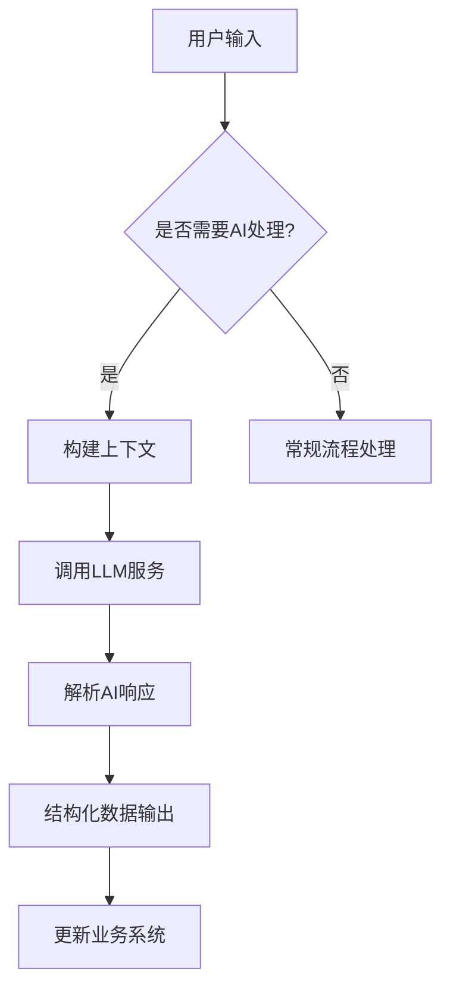
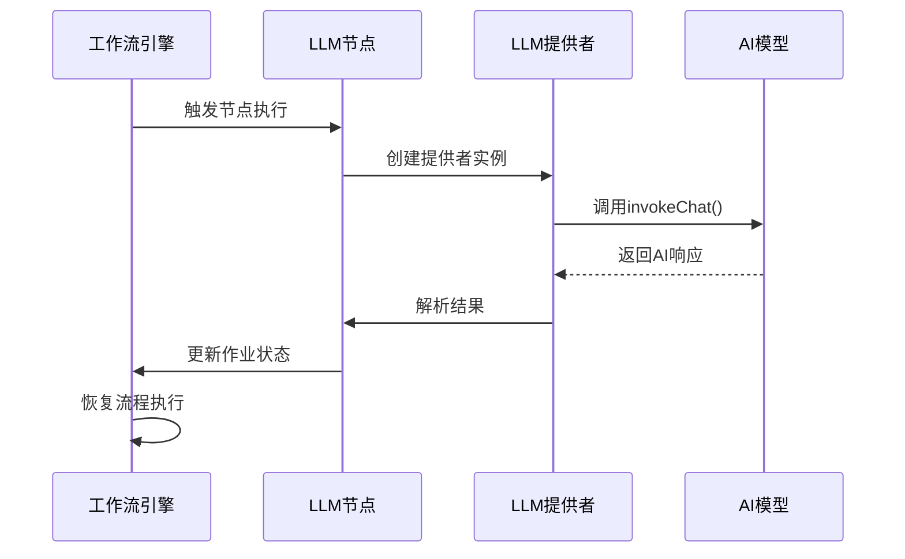

# AI集成

<cite>
**本文档中引用的文件**  
- [plugin.ts](file://packages/plugins/@nocobase/plugin-ai/src/server/plugin.ts)
- [ai-manager.ts](file://packages/plugins/@nocobase/plugin-ai/src/server/manager/ai-manager.ts)
- [provider.ts](file://packages/plugins/@nocobase/plugin-ai/src/server/llm-providers/provider.ts)
- [openai.ts](file://packages/plugins/@nocobase/plugin-ai/src/server/llm-providers/openai.ts)
- [deepseek.ts](file://packages/plugins/@nocobase/plugin-ai/src/server/llm-providers/deepseek.ts)
- [index.ts](file://packages/plugins/@nocobase/plugin-ai/src/server/workflow/nodes/llm/index.ts)
- [ai.ts](file://packages/plugins/@nocobase/plugin-ai/src/server/resource/ai.ts)
- [llm-services.ts](file://packages/plugins/@nocobase/plugin-ai/src/collections/llm-services.ts)
- [llms.ts](file://packages/plugins/@nocobase/plugin-ai/src/client/schemas/llms.ts)
</cite>

## 目录
1. [简介](#简介)
2. [AI员工概念与角色](#ai员工概念与角色)
3. [AI-人类协作模式](#ai-人类协作模式)
4. [AI模型集成机制](#ai模型集成机制)
5. [工作流中的AI能力嵌入](#工作流中的ai能力嵌入)
6. [安全性与隐私保护](#安全性与隐私保护)
7. [性能优化策略](#性能优化策略)
8. [实际应用案例](#实际应用案例)
9. [架构概览](#架构概览)

## 简介
NocoBase的AI集成插件为业务系统提供了强大的人工智能能力，允许用户通过配置大型语言模型（LLM）服务来实现智能自动化。该插件支持多种LLM提供商（如OpenAI和DeepSeek），并通过工作流节点将AI能力无缝嵌入到业务流程中。系统采用模块化设计，分离了客户端与服务器端逻辑，并通过资源管理、权限控制和可扩展架构确保安全性和灵活性。

## AI员工概念与角色
在NocoBase系统中，“AI员工”是指通过插件集成的AI服务，其行为类似于系统中的自动化角色，能够执行特定任务并与其他组件交互。AI员工的核心职责包括：
- **任务执行**：响应工作流触发，在业务流程中完成内容生成、数据分析等任务。
- **上下文理解**：基于输入消息和系统数据理解当前业务场景。
- **决策辅助**：提供结构化输出以支持人类决策过程。
- **持续学习**：通过反馈循环不断优化响应质量。

AI员工并非独立实体，而是作为现有业务逻辑的增强层存在，确保所有操作都在受控环境中进行。

## AI-人类协作模式
NocoBase实现了高效的AI-人类协同工作机制，包含任务分配、结果审核和反馈循环三个关键环节。

### 任务分配
AI任务通过工作流节点进行分配。当特定条件满足时（如表单提交或定时触发），系统自动调用配置好的LLM服务执行预定义指令。任务参数包括模型选择、提示词模板和上下文数据。

### 结果审核
AI生成的结果不会自动生效，而是作为待审状态提交给人类用户。用户可在界面中查看AI输出，进行修改或批准。这种机制确保了关键业务决策仍由人类掌控。

### 反馈循环
系统记录每次AI交互的结果及人工干预情况，用于后续分析和提示工程优化。长期来看，这些数据可用于训练定制化模型或调整提示策略，提升AI响应的相关性和准确性。

## AI模型集成机制
AI模型的集成涉及提示工程、上下文管理和输出解析三个核心技术层面。

### 提示工程
系统允许用户在LLM服务配置中定义模板化的提示结构。通过变量插值机制，可将业务数据动态注入提示中，从而生成上下文化请求。例如，在客户支持场景中，可自动填充客户历史记录以生成个性化回复建议。

### 上下文管理
AI请求的上下文由多部分组成：
- **系统上下文**：包含LLM服务配置、模型参数等元信息。
- **业务上下文**：来自数据库的实体数据，如用户资料、订单详情等。
- **对话上下文**：在多轮交互中维护的历史消息序列。

上下文通过标准化的消息数组格式传递给模型，确保一致性和可追溯性。

### 输出解析
系统支持结构化输出解析功能。通过指定JSON Schema，可要求LLM返回符合预定义结构的数据。这使得AI生成的内容可以直接映射到数据库字段或表单控件，减少后处理成本。



**图示来源**  
- [provider.ts](file://packages/plugins/@nocobase/plugin-ai/src/server/llm-providers/provider.ts#L51-L56)
- [index.ts](file://packages/plugins/@nocobase/plugin-ai/src/server/workflow/nodes/llm/index.ts#L55-L74)

## 工作流中的AI能力嵌入
AI能力通过工作流节点深度集成到业务流程中。核心实现位于`LLMInstruction`类，它作为工作流引擎的指令处理器注册。

### 节点配置
每个AI节点需配置以下参数：
- **LLM服务名称**：引用已注册的LLM服务实例。
- **聊天选项**：包括模型参数、消息历史和结构化输出要求。
- **错误处理策略**：定义调用失败时的行为（忽略或中断流程）。

### 执行流程
1. 工作流处理器解析节点配置。
2. 根据服务名称查找对应的LLM提供者。
3. 实例化模型并准备请求上下文。
4. 异步调用AI服务并监听响应。
5. 将结果写入工作流作业状态并恢复流程执行。

该机制确保AI调用不会阻塞主线程，同时保持事务完整性。



**图示来源**  
- [index.ts](file://packages/plugins/@nocobase/plugin-ai/src/server/workflow/nodes/llm/index.ts#L35-L96)
- [provider.ts](file://packages/plugins/@nocobase/plugin-ai/src/server/llm-providers/provider.ts#L51-L56)

## 安全性与隐私保护
系统实施多层次安全措施以保障AI集成的安全性与用户隐私。

### 数据隔离
所有LLM服务配置存储在独立的数据表`llmServices`中，包含服务名称、提供商类型和加密的认证信息。不同服务间严格隔离，防止配置泄露。

### 访问控制
基于角色的访问控制（RBAC）机制限制对AI功能的访问：
- `ai:*`权限控制AI核心功能。
- `llmServices:*`权限管理LLM服务配置。
- 通过权限片段（snippet）精确控制界面可见性和API访问。

### 敏感信息处理
系统自动过滤日志中的敏感字段（如API密钥），并在传输过程中使用HTTPS加密通信。用户可配置私有部署的LLM服务以满足合规要求。

**本节来源**  
- [plugin.ts](file://packages/plugins/@nocobase/plugin-ai/src/server/plugin.ts#L30-L37)
- [llm-services.ts](file://packages/plugins/@nocobase/plugin-ai/src/collections/llm-services.ts#L1-L42)

## 性能优化策略
为确保AI集成的高效运行，系统提供多项性能优化建议。

### 缓存策略
对频繁调用的模型列表等静态数据实施缓存机制。例如，`listModels`接口的结果可在一定时间内复用，减少对第三方API的重复请求。

### 速率限制
建议在LLM服务配置中设置合理的请求频率限制，避免超出提供商的配额限制。系统可扩展以支持分布式限流算法。

### 成本控制
通过以下方式优化AI使用成本：
- 使用较小模型处理简单任务。
- 设置最大token限制防止过度消耗。
- 批量处理多个请求以提高效率。

## 实际应用案例
以下是NocoBase AI集成的典型应用场景。

### 智能表单填充
利用AI分析用户输入的非结构化文本，自动提取关键信息并填充到相应表单字段。例如，从客户邮件中识别订单变更请求并更新数据库记录。

### 内容生成
基于模板和上下文数据自动生成报告、邮件回复或产品描述。支持多语言输出，提升内容生产效率。

### 数据分析
对大量文本数据进行情感分析、主题分类或趋势预测。结果可用于仪表板展示或触发后续业务动作。

这些案例展示了AI如何作为“智能助手”增强传统业务流程，而非完全取代人工操作。

## 架构概览
NocoBase AI插件采用分层架构设计，清晰分离关注点。

```mermaid
graph TB
subgraph Client["客户端"]
C1[AI管理器]
C2[LLM服务UI]
C3[工作流节点UI]
end
subgraph Server["服务器端"]
S1[AI插件主类]
S2[AI管理器]
S3[LLM提供者]
S4[工作流指令]
S5[资源控制器]
end
Database[(llmServices表)]
Client < --> Server
Server < --> Database
S1 --> S2
S2 --> S3
S3 --> S4
S4 --> S5
```

**图示来源**  
- [plugin.ts](file://packages/plugins/@nocobase/plugin-ai/src/server/plugin.ts)
- [ai-manager.ts](file://packages/plugins/@nocobase/plugin-ai/src/server/manager/ai-manager.ts)
- [llm-services.ts](file://packages/plugins/@nocobase/plugin-ai/src/collections/llm-services.ts)