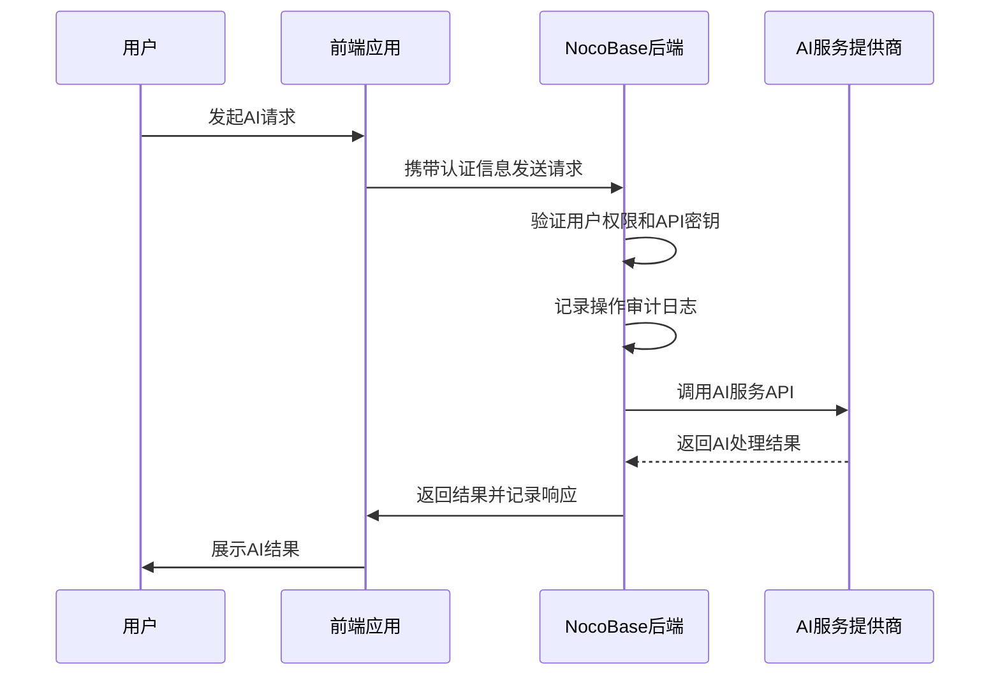

# 安全控制

<cite>
**本文档中引用的文件**  
- [ai-manager.ts](file://packages/plugins/@nocobase/plugin-ai/src/server/manager/ai-manager.ts)
- [plugin.ts](file://packages/plugins/@nocobase/plugin-ai/src/server/plugin.ts)
- [ai.ts](file://packages/plugins/@nocobase/plugin-ai/src/server/resource/ai.ts)
- [api-keys.ts](file://packages/plugins/@nocobase/plugin-api-keys/src/server/actions/api-keys.ts)
- [plugin.ts](file://packages/plugins/@nocobase/plugin-api-keys/src/server/plugin.ts)
- [index.ts](file://packages/core/server/src/audit-manager/index.ts)
- [openai.ts](file://packages/plugins/@nocobase/plugin-ai/src/server/llm-providers/openai.ts)
- [deepseek.ts](file://packages/plugins/@nocobase/plugin-ai/src/server/llm-providers/deepseek.ts)
- [index.ts](file://packages/core/server/src/acl/index.ts)
- [index.ts](file://packages/core/client/src/acl/ACLProvider.tsx)
- [index.tsx](file://packages/plugins/@nocobase/plugin-auth/src/server/plugin.ts)
</cite>

## 目录
1. [引言](#引言)
2. [AI功能访问控制机制](#ai功能访问控制机制)
3. [数据隐私保护措施](#数据隐私保护措施)
4. [AI模型安全调用方式](#ai模型安全调用方式)
5. [安全配置最佳实践](#安全配置最佳实践)
6. [安全事件应急响应流程](#安全事件应急响应流程)
7. [结论](#结论)

## 引言
NocoBase平台通过插件化架构实现了强大的AI集成能力，同时在安全性方面提供了全面的控制机制。本文档详细阐述了NocoBase中AI功能的安全控制体系，涵盖访问控制、数据隐私、调用安全、配置实践和应急响应等多个维度。系统通过角色权限分配、API密钥管理、操作审计等机制确保AI功能的安全使用，为用户提供可信赖的智能化服务。

## AI功能访问控制机制

NocoBase的AI功能访问控制基于角色权限系统和API密钥机制实现。系统通过权限片段（aclSnippet）对AI相关功能进行细粒度的权限划分，确保只有授权用户才能访问特定的AI功能。

在AI插件初始化时，系统注册了多个权限片段，包括`pm.ai`用于AI集成主功能，`pm.ai.llm-services`用于大语言模型服务管理。这些权限片段与具体的操作权限绑定，实现了基于角色的访问控制（RBAC）。当用户尝试访问AI功能时，系统会检查其角色是否具有相应的权限片段。

API密钥作为另一种访问控制机制，允许将密钥绑定到特定角色。创建API密钥时，系统会验证指定角色的存在性，并基于用户ID和角色名生成JWT令牌。这种设计确保了API密钥的权限范围与其绑定角色的权限完全一致，实现了密钥权限的精确控制。

此外，系统还实现了资源级别的访问控制。例如，API密钥的删除操作会被自动过滤，确保用户只能删除自己创建的密钥。这种基于上下文的访问控制策略进一步增强了系统的安全性。

**本节来源**
- [plugin.ts](file://packages/plugins/@nocobase/plugin-ai/src/server/plugin.ts#L30-L37)
- [api-keys.ts](file://packages/plugins/@nocobase/plugin-api-keys/src/server/actions/api-keys.ts#L13-L28)
- [plugin.ts](file://packages/plugins/@nocobase/plugin-api-keys/src/server/plugin.ts#L36-L43)

## 数据隐私保护措施

NocoBase在AI集成中实施了多层次的数据隐私保护措施。系统通过敏感信息过滤、数据脱敏和加密传输等技术手段，确保用户数据在处理过程中的安全性。

在环境变量管理中，系统支持将变量类型设置为"加密"，对敏感配置信息进行保护。这种机制特别适用于存储AI服务的API密钥等机密信息，防止敏感数据以明文形式暴露。

操作审计系统记录了所有关键操作的详细信息，包括请求的IP地址、用户代理、请求参数和响应数据等。为了保护隐私，系统在记录审计日志时会对敏感字段进行特殊处理。例如，在用户注册和密码修改操作中，密码字段会被明确排除在审计记录之外，避免敏感信息的意外泄露。

数据传输方面，系统通过HTTPS协议确保所有通信的安全性。对于AI服务调用，系统支持自定义API端点配置，允许用户选择安全的通信通道。同时，JWT令牌的使用确保了身份验证信息的安全传输，防止身份冒用。

**本节来源**
- [index.ts](file://packages/core/server/src/audit-manager/index.ts#L226-L249)
- [plugin.ts](file://packages/plugins/@nocobase/plugin-auth/src/server/plugin.ts#L240-L248)
- [EnvironmentTabs.tsx](file://packages/plugins/@nocobase/plugin-environment-variables/src/client/components/EnvironmentTabs.tsx#L347-L355)

## AI模型安全调用方式

NocoBase通过标准化的接口和安全机制实现AI模型的安全调用。系统支持多种大语言模型提供商，包括OpenAI和DeepSeek，并通过统一的抽象层进行管理，确保调用过程的安全性和一致性。

API密钥管理是AI模型调用安全的核心。系统通过JWT令牌对API密钥进行签名和验证，支持设置密钥的有效期。当密钥被删除时，系统会将其加入黑名单，防止后续使用。这种机制有效控制了密钥的生命周期，降低了密钥泄露带来的风险。

速率限制和异常检测机制保护系统免受滥用。虽然具体实现细节未在代码中直接体现，但系统架构支持通过中间件添加速率限制功能。操作审计系统能够记录所有AI调用的详细信息，为异常行为检测提供数据支持。

系统还实现了安全的模型配置管理。用户可以在UI界面中安全地配置AI服务参数，包括API密钥、基础URL等敏感信息。这些配置信息在存储和传输过程中都受到保护，确保不会被未授权访问。

**图示来源**
- [ai-manager.ts](file://packages/plugins/@nocobase/plugin-ai/src/server/manager/ai-manager.ts#L18-L30)
- [openai.ts](file://packages/plugins/@nocobase/plugin-ai/src/server/llm-providers/openai.ts#L13-L39)
- [deepseek.ts](file://packages/plugins/@nocobase/plugin-ai/src/server/llm-providers/deepseek.ts#L14-L36)

## 安全配置最佳实践

NocoBase推荐遵循最小权限原则进行安全配置。管理员应为每个用户和API密钥分配完成其工作所需的最小权限，避免过度授权带来的安全风险。通过权限片段的精细化控制，可以精确管理用户对AI功能的访问权限。

定期安全审计是维护系统安全的重要措施。系统内置的审计日志功能记录了所有关键操作，包括AI功能的使用情况。管理员应定期审查这些日志，识别异常行为模式，及时发现潜在的安全威胁。

漏洞监控和及时更新同样重要。NocoBase采用模块化架构，允许独立更新各个组件。管理员应密切关注安全公告，及时应用安全补丁，确保系统始终运行在最新、最安全的状态。

配置管理方面，建议将敏感信息存储在加密的环境变量中，而不是硬编码在配置文件里。对于AI服务集成，应使用专用的服务账户和API密钥，避免使用个人账户凭证，降低账户泄露的影响范围。

**本节来源**
- [plugin.ts](file://packages/plugins/@nocobase/plugin-ai/src/server/plugin.ts#L30-L37)
- [index.ts](file://packages/core/server/src/audit-manager/index.ts#L114-L178)
- [index.ts](file://packages/core/server/src/acl/index.ts#L13-L21)

## 安全事件应急响应流程

NocoBase建立了完善的安全事件应急响应机制。当发生数据泄露、未授权访问或恶意使用等安全事件时，管理员可以立即采取措施限制损害范围。

首先，系统支持快速撤销访问权限。对于API密钥，可以通过删除操作立即使其失效，系统会自动将已删除的密钥加入黑名单。对于用户账户，可以立即禁用账户或重置密码，阻止进一步的未授权访问。

其次，详细的审计日志为事件调查提供了有力支持。审计记录包含操作时间、IP地址、用户代理等信息，帮助安全团队追踪事件源头，分析攻击路径。这些日志还可以用于合规性报告和法律证据。

在事件处理过程中，建议遵循以下步骤：隔离受影响的系统组件、收集相关日志证据、修复安全漏洞、通知相关方、恢复服务并加强监控。系统应定期进行应急演练，确保团队熟悉响应流程，能够在真实事件发生时快速有效地应对。

**本节来源**
- [api-keys.ts](file://packages/plugins/@nocobase/plugin-api-keys/src/server/actions/api-keys.ts#L47-L58)
- [index.ts](file://packages/core/server/src/audit-manager/index.ts#L277-L327)
- [plugin.ts](file://packages/plugins/@nocobase/plugin-auth/src/server/plugin.ts#L225-L236)

## 结论
NocoBase通过多层次的安全控制机制，为AI功能的集成和使用提供了全面的保护。从访问控制到数据隐私，从调用安全到应急响应，系统构建了一个完整的安全防护体系。通过遵循最小权限原则、定期安全审计和及时漏洞修复等最佳实践，用户可以安全地利用AI技术提升业务价值，同时有效防范各种安全风险。随着AI技术的不断发展，NocoBase将持续完善其安全机制，为用户提供更加安全可靠的智能化服务。