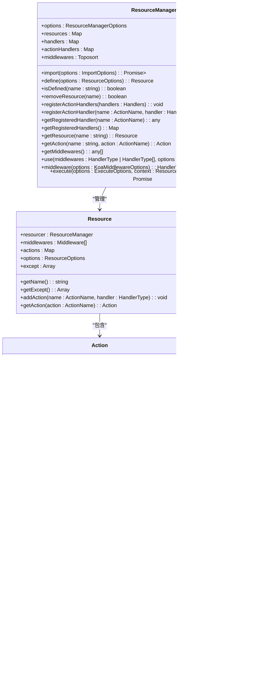

# API参考

<cite>
**本文档中引用的文件**  
- [index.ts](file://packages\core\resourcer\src\index.ts)
- [resource.ts](file://packages\core\resourcer\src\resource.ts)
- [action.ts](file://packages\core\resourcer\src\action.ts)
- [middleware.ts](file://packages\core\resourcer\src\middleware.ts)
- [resourcer.ts](file://packages\core\resourcer\src\resourcer.ts)
- [index.ts](file://packages\core\actions\src\index.ts)
- [index.ts](file://packages\core\auth\src\index.ts)
- [plugin.ts](file://packages\plugins\@nocobase\plugin-mobile\src\server\plugin.ts)
- [index.ts](file://packages\plugins\@nocobase\plugin-api-keys\src\swagger\index.ts)
- [server.ts](file://packages\plugins\@nocobase\plugin-api-doc\src\server\server.ts)
- [index.ts](file://packages\plugins\@nocobase\plugin-api-doc\src\server\swagger\index.ts)
- [swagger.ts](file://packages\plugins\@nocobase\plugin-api-doc\src\swagger.ts)
- [Execution.ts](file://packages\plugins\@nocobase\plugin-workflow\src\server\types\Execution.ts)
- [WorkflowTask.ts](file://packages\plugins\@nocobase\plugin-workflow\src\server\types\WorkflowTask.ts)
- [workflows.ts](file://packages\plugins\@nocobase\plugin-workflow\src\server\actions\workflows.ts)
- [Plugin.ts](file://packages\plugins\@nocobase\plugin-workflow\src\server\Plugin.ts)
- [actions.ts](file://packages\plugins\@nocobase\plugin-workflow-manual\src\server\actions.ts)
- [base-task-manager.ts](file://packages\plugins\@nocobase\plugin-async-task-manager\src\server\base-task-manager.ts)
- [sms-aliyun.ts](file://packages\plugins\@nocobase\plugin-verification\src\server\otp-verification\sms\providers\sms-aliyun.ts)
- [sms-otp.ts](file://packages\plugins\@nocobase\plugin-verification\src\server\otp-verification\sms\resource\sms-otp.ts)
- [error.ts](file://packages\plugins\@nocobase\plugin-user-data-sync\src\server\error.ts)
- [APIClient.ts](file://packages\core\client\src\api-client\APIClient.ts)
- [errors.ts](file://packages\core\server\src\gateway\errors.ts)
</cite>

## 目录
1. [介绍](#介绍)
2. [API架构概述](#api架构概述)
3. [资源管理器机制](#资源管理器机制)
4. [核心API端点](#核心api端点)
5. [工作流API](#工作流api)
6. [认证与授权](#认证与授权)
7. [错误处理与状态码](#错误处理与状态码)
8. [API版本控制](#api版本控制)

## 介绍
NocoBase提供了一套完整的RESTful API，用于管理数据、用户、插件和系统监控。本参考文档详细说明了API的HTTP方法、URL模式、请求/响应模式、认证方法以及资源管理器如何将API请求映射到相应的动作处理器。

**API参考文档**涵盖了NocoBase的核心功能，包括数据操作、用户管理、插件控制和系统监控等。文档还特别关注工作流相关的API，详细说明了任务创建、执行状态查询和结果获取的接口规范。通过详细的请求/响应示例和实际数据结构，开发者可以快速理解和使用NocoBase的API。

## API架构概述

**图源**  
- [resourcer.ts](file://packages\core\resourcer\src\resourcer.ts)
- [resource.ts](file://packages\core\resourcer\src\resource.ts)
- [action.ts](file://packages\core\resourcer\src\action.ts)
- [middleware.ts](file://packages\core\resourcer\src\middleware.ts)

**API架构概述**  
NocoBase的API架构基于资源管理器（Resourcer）模式，将API请求映射到相应的资源和动作处理器。整个流程从客户端发起HTTP请求开始，经过API网关解析，由资源管理器查找对应的资源和动作，执行中间件链，最终调用处理器完成数据库操作并返回响应。

## 资源管理器机制

**图源**  
- [resourcer.ts](file://packages\core\resourcer\src\resourcer.ts)
- [resource.ts](file://packages\core\resourcer\src\resource.ts)
- [action.ts](file://packages\core\resourcer\src\action.ts)
- [middleware.ts](file://packages\core\resourcer\src\middleware.ts)

**资源管理器机制**  
NocoBase的资源管理器（ResourceManager）是API的核心组件，负责管理所有资源、动作和中间件。它通过`define`方法定义资源，`registerActionHandler`方法注册动作处理器，并通过`middleware`方法创建Koa中间件来处理HTTP请求。

资源（Resource）代表一个数据实体，包含多个动作（Action），每个动作对应一个HTTP请求的处理逻辑。动作可以配置中间件，形成中间件链，在执行处理器之前进行预处理。

**资源管理器机制**的实现允许灵活的API扩展和定制，开发者可以通过插件系统注册新的资源、动作和中间件，而无需修改核心代码。

## 核心API端点

### 数据操作API
NocoBase提供了标准的CRUD操作API，通过资源管理器模式实现。每个数据表对应一个资源，支持以下标准动作：

- **list**: 获取资源列表
- **create**: 创建新资源
- **get**: 获取单个资源
- **update**: 更新资源
- **destroy**: 删除资源

**核心API端点**的URL模式遵循`/api/{resourceName}:{actionName}`的格式，其中`resourceName`是资源名称，`actionName`是动作名称。例如，获取用户列表的API端点为`/api/users:list`。

### 用户管理API
用户管理API提供了用户创建、更新、删除和查询功能。通过`plugin-users`插件实现，支持以下端点：

- `/api/users:create` - 创建用户
- `/api/users:list` - 获取用户列表
- `/api/users:get` - 获取用户详情
- `/api/users:update` - 更新用户
- `/api/users:destroy` - 删除用户

### 插件控制API
插件控制API允许动态管理NocoBase的插件系统。通过`plugin-manager`实现，支持以下功能：

- 插件安装
- 插件卸载
- 插件启用/禁用
- 插件配置

### 系统监控API
系统监控API提供了系统状态、性能指标和日志查询功能。通过`plugin-system-settings`和`plugin-logger`插件实现，支持以下端点：

- 系统状态查询
- 性能指标获取
- 日志查询和分析
- 错误日志查看

**核心API端点**的设计遵循RESTful原则，使用标准的HTTP方法和状态码，确保API的易用性和一致性。

## 工作流API

**图源**  
- [workflows.ts](file://packages\plugins\@nocobase\plugin-workflow\src\server\actions\workflows.ts)
- [Execution.ts](file://packages\plugins\@nocobase\plugin-workflow\src\server\types\Execution.ts)
- [WorkflowTask.ts](file://packages\plugins\@nocobase\plugin-workflow\src\server\types\WorkflowTask.ts)
- [actions.ts](file://packages\plugins\@nocobase\plugin-workflow-manual\src\server\actions.ts)
- [Plugin.ts](file://packages\plugins\@nocobase\plugin-workflow\src\server\Plugin.ts)

**工作流API**提供了完整的任务创建、执行状态查询和结果获取接口。主要端点包括：

- `/api/workflows:trigger` - 触发工作流执行
- `/api/executions:get` - 查询执行状态
- `/api/userWorkflowTasks:submit` - 提交用户任务
- `/api/userWorkflowTasks:listMine` - 获取当前用户任务列表

工作流API通过执行实例（Execution）和任务（Job）的层次结构管理复杂的工作流逻辑。每个执行实例包含多个任务，任务可以是自动执行的节点或需要用户交互的手动任务。

## 认证与授权

**图源**  
- [index.ts](file://packages\core\auth\src\index.ts)
- [plugin.ts](file://packages\plugins\@nocobase\plugin-mobile\src\server\plugin.ts)
- [sms-aliyun.ts](file://packages\plugins\@nocobase\plugin-verification\src\server\otp-verification\sms\providers\sms-aliyun.ts)
- [sms-otp.ts](file://packages\plugins\@nocobase\plugin-verification\src\server\otp-verification\sms\resource\sms-otp.ts)

**认证与授权**机制基于JWT（JSON Web Token）实现，支持多种认证方式：

- 基本认证（Basic Auth）
- API密钥认证
- 短信验证码认证
- 第三方认证

授权系统通过`plugin-acl`插件实现，基于角色的访问控制（RBAC）模型，支持细粒度的权限管理。每个API请求都会经过权限检查，确保用户只能访问其被授权的资源和操作。

## 错误处理与状态码

**图源**  
- [error.ts](file://packages\plugins\@nocobase\plugin-user-data-sync\src\server\error.ts)
- [errors.ts](file://packages\core\server\src\gateway\errors.ts)
- [APIClient.ts](file://packages\core\client\src\api-client\APIClient.ts)

**错误处理与状态码**遵循标准的HTTP状态码规范：

- **200 OK**: 请求成功
- **201 Created**: 资源创建成功
- **400 Bad Request**: 请求参数错误
- **401 Unauthorized**: 认证失败
- **403 Forbidden**: 权限不足
- **404 Not Found**: 资源不存在
- **429 Too Many Requests**: 请求过于频繁
- **500 Internal Server Error**: 服务器内部错误

错误响应包含详细的错误信息，包括错误代码、消息和可选的附加数据，帮助开发者快速定位和解决问题。

## API版本控制

**图源**  
- [resourcer.ts](file://packages\core\resourcer\src\resourcer.ts)
- [server.ts](file://packages\plugins\@nocobase\plugin-api-doc\src\server\server.ts)
- [index.ts](file://packages\plugins\@nocobase\plugin-api-doc\src\server\swagger\index.ts)

**API版本控制**策略确保向后兼容性，支持以下版本管理方法：

- URL路径版本控制（如`/api/v1/users`）
- 请求头版本控制（如`Accept: application/vnd.nocobase.v1+json`）
- 查询参数版本控制（如`?version=v1`）

NocoBase采用渐进式版本升级策略，旧版本API在新版本发布后继续支持一段时间，确保平滑过渡。API文档中明确标注了每个端点的版本信息和弃用状态。