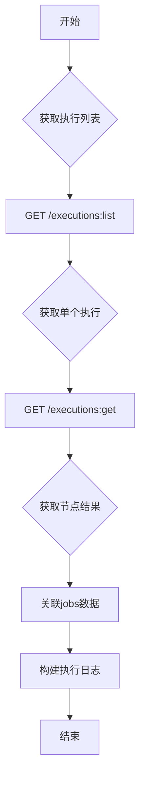
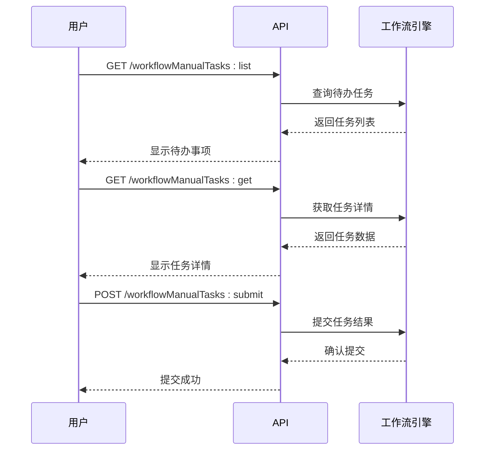
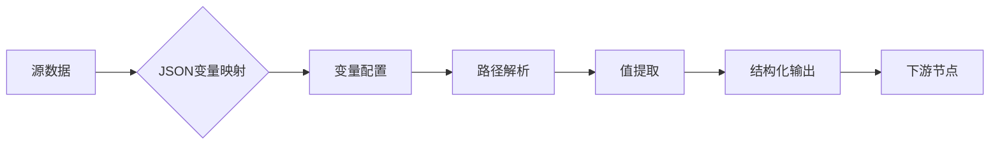

# 工作流API

<cite>
**本文档引用的文件**  
- [index.ts](file://packages/plugins/@nocobase/plugin-workflow/src/swagger/index.ts)
- [workflows.ts](file://packages/plugins/@nocobase/plugin-workflow/src/server/actions/workflows.ts)
- [Processor.ts](file://packages/plugins/@nocobase/plugin-workflow/src/server/Processor.ts)
- [workflowManualTasks.ts](file://packages/plugins/@nocobase/plugin-workflow-manual/src/server/collections/workflowManualTasks.ts)
- [JSONVariableMappingInstruction.ts](file://packages/plugins/@nocobase/plugin-workflow-json-variable-mapping/src/server/JSONVariableMappingInstruction.ts)
- [constants.ts](file://packages/plugins/@nocobase/plugin-workflow/src/server/constants.ts)
- [executions.ts](file://packages/plugins/@nocobase/plugin-workflow/src/server/collections/executions.ts)
- [workflows.ts](file://packages/plugins/@nocobase/plugin-workflow/src/common/collections/workflows.ts)
</cite>

## 目录
1. [工作流定义管理](#工作流定义管理)
2. [工作流实例控制](#工作流实例控制)
3. [执行状态与日志查询](#执行状态与日志查询)
4. [手动任务处理](#手动任务处理)
5. [工作流变量与数据映射](#工作流变量与数据映射)
6. [工作流定义JSON结构示例](#工作流定义json结构示例)

## 工作流定义管理

NocoBase工作流引擎提供了完整的RESTful API来管理工作流定义的生命周期，包括创建、更新、启用、禁用和删除操作。通过这些API，用户可以动态地配置和管理工作流。

工作流定义的创建通过`POST /workflows:create`端点实现，请求体中包含工作流的基本信息如标题、类型和描述。更新操作通过`POST /workflows:update`端点完成，支持修改工作流的标题、启用状态、描述和配置。特别需要注意的是，对于已经执行过的工作流，其配置不能被修改，以确保数据一致性。

工作流的启用和禁用通过更新`enabled`字段来实现。删除操作通过`POST /workflows:destroy`端点完成，该操作会同时删除工作流的所有节点和执行记录。此外，系统还提供了`POST /workflows:revision`端点用于创建工作流的新版本或副本，支持版本控制和迭代开发。

**节来源**
- [index.ts](file://packages/plugins/@nocobase/plugin-workflow/src/swagger/index.ts#L84-L161)
- [workflows.ts](file://packages/plugins/@nocobase/plugin-workflow/src/server/actions/workflows.ts#L17-L77)

## 工作流实例控制

工作流实例的控制API允许用户启动、暂停、恢复和终止工作流执行。这些操作通过执行记录（execution）来管理，每个执行实例代表一次工作流的运行。

工作流的启动可以通过多种方式触发，包括通过`POST /workflows:trigger`端点手动触发，或通过事件监听器自动触发。执行实例的终止可以通过更新执行记录的状态来实现。系统通过执行状态机来管理工作流的生命周期，确保状态转换的正确性和一致性。

**节来源**
- [index.ts](file://packages/plugins/@nocobase/plugin-workflow/src/swagger/index.ts#L235-L258)
- [Processor.ts](file://packages/plugins/@nocobase/plugin-workflow/src/server/Processor.ts#L241-L251)

## 执行状态与日志查询

工作流执行状态和日志的查询API提供了对工作流执行过程的全面监控能力。用户可以通过这些API获取执行状态、查看执行日志和检查节点执行结果。

执行列表可以通过`GET /executions:list`端点获取，返回所有执行记录的摘要信息。单个执行的详细信息可以通过`GET /executions:get`端点获取，包括执行上下文、状态和所有节点的执行结果。执行状态使用枚举值表示，包括队列中（QUEUEING）、已启动（STARTED）、已解决（RESOLVED）、失败（FAILED）等。

节点执行结果存储在`jobs`集合中，每个job记录包含节点ID、状态和结果数据。通过关联查询，可以构建完整的执行轨迹和日志流。



**图来源**
- [index.ts](file://packages/plugins/@nocobase/plugin-workflow/src/swagger/index.ts#L373-L428)
- [executions.ts](file://packages/plugins/@nocobase/plugin-workflow/src/server/collections/executions.ts)
- [constants.ts](file://packages/plugins/@nocobase/plugin-workflow/src/server/constants.ts)

**节来源**
- [index.ts](file://packages/plugins/@nocobase/plugin-workflow/src/swagger/index.ts#L373-L428)
- [constants.ts](file://packages/plugins/@nocobase/plugin-workflow/src/server/constants.ts)

## 手动任务处理

手动任务处理API支持工作流中的人工干预节点，如审批、确认等需要人工参与的步骤。这些API允许用户领取任务、提交审批结果和查看待办事项。

手动任务通过`workflowManualTasks`资源进行管理。任务列表可以通过`GET /workflowManualTasks:list`端点获取，返回当前用户的所有待办任务。单个任务的详细信息可以通过`GET /workflowManualTasks:get`端点获取，包括任务上下文和关联的执行信息。

任务提交通过`POST /workflowManualTasks:submit`端点完成，请求体中包含任务结果数据。系统会验证任务状态，确保只有处于待处理状态的任务才能被提交。任务结果会作为节点执行结果存储，并触发后续节点的执行。



**图来源**
- [index.ts](file://packages/plugins/@nocobase/plugin-workflow/src/swagger/index.ts#L429-L528)
- [workflowManualTasks.ts](file://packages/plugins/@nocobase/plugin-workflow-manual/src/server/collections/workflowManualTasks.ts)

**节来源**
- [index.ts](file://packages/plugins/@nocobase/plugin-workflow/src/swagger/index.ts#L429-L528)
- [workflowManualTasks.ts](file://packages/plugins/@nocobase/plugin-workflow-manual/src/server/collections/workflowManualTasks.ts)

## 工作流变量与数据映射

工作流变量传递和数据映射机制是NocoBase工作流引擎的核心功能之一，它允许在不同节点之间传递和转换数据。系统提供了专门的JSON变量映射指令来处理复杂的数据转换需求。

变量映射通过`json-variable-mapping`指令实现，该指令允许用户定义源数据路径和目标变量之间的映射关系。配置中包含数据源表达式和变量映射规则，支持嵌套对象和数组的复杂映射。解析器会根据配置从源数据中提取值，并构建结构化的输出对象。

数据传递通过执行上下文（context）实现，每个节点都可以访问上游节点的输出结果。系统使用`$jobsMapByNodeKey`这样的表达式来引用特定节点的结果，确保数据的准确传递和引用。



**图来源**
- [JSONVariableMappingInstruction.ts](file://packages/plugins/@nocobase/plugin-workflow-json-variable-mapping/src/server/JSONVariableMappingInstruction.ts)
- [workflows.ts](file://packages/plugins/@nocobase/plugin-workflow/src/common/collections/workflows.ts)

**节来源**
- [JSONVariableMappingInstruction.ts](file://packages/plugins/@nocobase/plugin-workflow-json-variable-mapping/src/server/JSONVariableMappingInstruction.ts)
- [JSONVariableMapping.tsx](file://packages/plugins/@nocobase/plugin-workflow-json-variable-mapping/src/client/JSONVariableMapping.tsx)

## 工作流定义JSON结构示例

以下是一个完整的工作流定义JSON结构示例，包含了触发器、条件判断、并行执行等复杂结构：

```json
{
  "title": "订单处理工作流",
  "type": "collection",
  "enabled": true,
  "config": {
    "triggers": [
      {
        "type": "create",
        "collection": "orders"
      }
    ],
    "nodes": [
      {
        "id": 1,
        "title": "开始",
        "type": "start",
        "upstreamId": null
      },
      {
        "id": 2,
        "title": "金额检查",
        "type": "condition",
        "upstreamId": 1,
        "config": {
          "conditions": [
            {
              "name": "大额订单",
              "branchIndex": 0,
              "condition": "{{ $context.data.amount > 1000 }}"
            }
          ]
        }
      },
      {
        "id": 3,
        "title": "普通处理",
        "type": "action",
        "upstreamId": 2,
        "branchIndex": 1
      },
      {
        "id": 4,
        "title": "审批流程",
        "type": "parallel",
        "upstreamId": 2,
        "branchIndex": 0,
        "branches": [
          {
            "id": 5,
            "title": "财务审批",
            "type": "manual",
            "upstreamId": 4
          },
          {
            "id": 6,
            "title": "经理审批",
            "type": "manual",
            "upstreamId": 4
          }
        ]
      },
      {
        "id": 7,
        "title": "完成",
        "type": "end",
        "upstreamId": 3
      },
      {
        "id": 8,
        "title": "归档",
        "type": "action",
        "upstreamId": 4
      }
    ]
  }
}
```

这个示例展示了一个典型的订单处理流程，包括基于金额的条件分支和并行审批流程。工作流从订单创建事件触发，根据订单金额大小决定处理路径，大额订单需要经过并行的财务和经理审批，而普通订单则直接处理完成。

**节来源**
- [index.ts](file://packages/plugins/@nocobase/plugin-workflow/src/swagger/index.ts#L531-L773)
- [workflows.ts](file://packages/plugins/@nocobase/plugin-workflow/src/common/collections/workflows.ts)