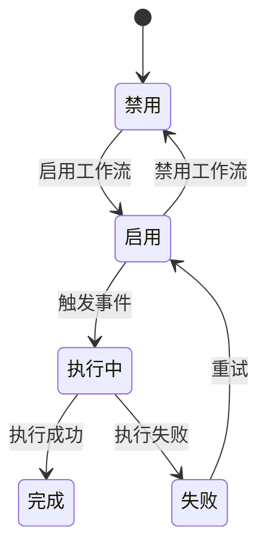
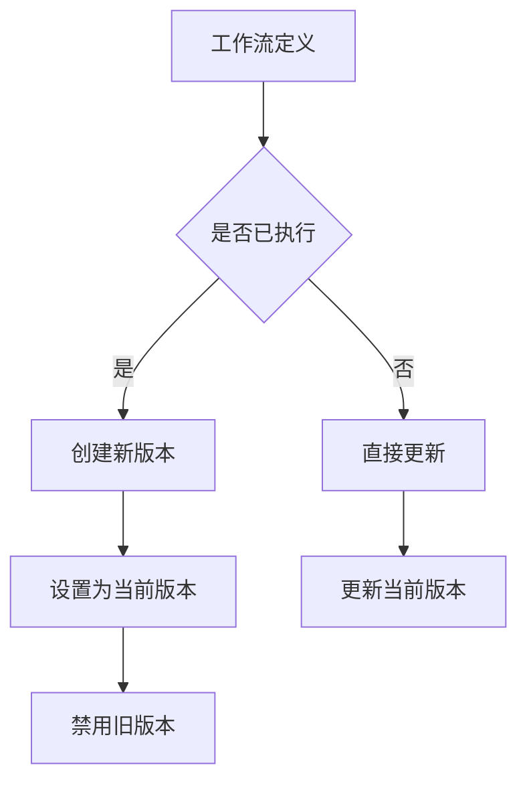
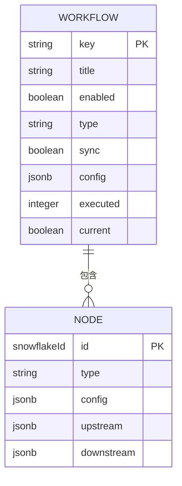
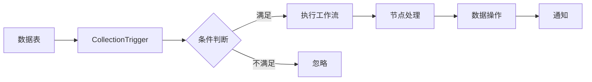

# 工作流定义API

<cite>
**本文档引用的文件**
- [workflows.ts](file://packages/plugins/@nocobase/plugin-workflow/src/common/collections/workflows.ts)
- [workflows.ts](file://packages/plugins/@nocobase/plugin-workflow/src/client/schemas/workflows.ts)
- [workflows.ts](file://packages/plugins/@nocobase/plugin-workflow/src/server/actions/workflows.ts)
- [Plugin.ts](file://packages/plugins/@nocobase/plugin-workflow/src/server/Plugin.ts)
- [CollectionTrigger.ts](file://packages/plugins/@nocobase/plugin-workflow/src/server/triggers/CollectionTrigger.ts)
- [workflowSchema.ts](file://packages/plugins/@nocobase/plugin-workflow/src/client/schemas/workflows.ts)
</cite>

## 目录
1. [简介](#简介)
2. [工作流定义CRUD操作](#工作流定义crud操作)
3. [状态管理接口](#状态管理接口)
4. [版本控制机制](#版本控制机制)
5. [工作流定义JSON结构](#工作流定义json结构)
6. [模板导入导出功能](#模板导入导出功能)
7. [与数据模型的关联机制](#与数据模型的关联机制)

## 简介
NocoBase工作流定义API提供了一套完整的接口来管理工作流的创建、读取、更新和删除（CRUD）操作。该API支持工作流的启用/禁用状态管理、版本控制、模板导入导出等功能。工作流可以绑定到特定的数据表和字段，通过触发器配置实现自动化业务流程。本文档详细说明了工作流定义API的各项功能和使用方法。

## 工作流定义CRUD操作
工作流定义的CRUD操作通过RESTful API端点实现，支持标准的HTTP方法。创建、读取、更新和删除操作都通过`/workflows`端点进行管理。工作流定义包含标题、描述、启用状态、触发器类型、执行模式等核心属性。在创建工作流时，系统会自动生成唯一标识符(key)并设置当前版本(current)。更新操作受到严格限制，已执行过的工作流其配置(config)不能被修改。

**Section sources**
- [workflows.ts](file://packages/plugins/@nocobase/plugin-workflow/src/common/collections/workflows.ts#L10-L229)
- [workflows.ts](file://packages/plugins/@nocobase/plugin-workflow/src/server/actions/workflows.ts#L17-L34)

## 状态管理接口
工作流的状态管理接口允许用户启用或禁用工作流。通过`enabled`字段控制工作流的激活状态，当设置为`true`时工作流处于启用状态，可以响应触发事件；设置为`false`时工作流被禁用，不会执行任何操作。状态变更会触发相应的生命周期钩子，包括`onBeforeSave`、`onAfterUpdate`等。同步模式(sync)决定了工作流是异步执行还是同步执行，该设置在创建工作流后不可更改。

**Diagram sources**
- [workflows.ts](file://packages/plugins/@nocobase/plugin-workflow/src/common/collections/workflows.ts#L40-L55)
- [Plugin.ts](file://packages/plugins/@nocobase/plugin-workflow/src/server/Plugin.ts#L395-L442)

**Section sources**
- [workflows.ts](file://packages/plugins/@nocobase/plugin-workflow/src/common/collections/workflows.ts#L40-L55)
- [Plugin.ts](file://packages/plugins/@nocobase/plugin-workflow/src/server/Plugin.ts#L62-L102)

## 版本控制机制
NocoBase工作流系统实现了完整的版本控制机制。每个工作流都有一个唯一的key用于标识，而current字段标记当前活跃的版本。当更新已执行过的工作流时，系统会创建一个新的版本而不是修改现有版本。`revision`操作用于创建工作流的新版本，保留历史配置的同时允许进行修改。删除操作会同时删除该工作流的所有版本及其关联的执行记录。版本统计信息(versionStats)跟踪每个版本的执行情况，包括成功、失败等状态的计数。

**Diagram sources**
- [workflows.ts](file://packages/plugins/@nocobase/plugin-workflow/src/common/collections/workflows.ts#L137-L146)
- [workflows.ts](file://packages/plugins/@nocobase/plugin-workflow/src/server/actions/workflows.ts#L79-L89)

**Section sources**
- [workflows.ts](file://packages/plugins/@nocobase/plugin-workflow/src/common/collections/workflows.ts#L137-L146)
- [workflows.ts](file://packages/plugins/@nocobase/plugin-workflow/src/server/actions/workflows.ts#L79-L89)

## 工作流定义JSON结构
工作流定义采用JSON结构存储，包含触发器配置、节点定义、连接线规则等核心元素。config字段存储工作流的图形化定义，包括节点类型、位置、输入输出参数等。nodes字段定义了工作流中的各个处理节点，如条件判断、数据创建、更新等。连接线规则通过source和target属性定义节点间的执行顺序。条件表达式语法支持基于数据模型字段的复杂逻辑判断，允许使用AND、OR等操作符构建复合条件。

**Diagram sources**
- [workflows.ts](file://packages/plugins/@nocobase/plugin-workflow/src/common/collections/workflows.ts#L84-L88)
- [workflowSchema.ts](file://packages/plugins/@nocobase/plugin-workflow/src/client/schemas/workflows.ts#L115-L501)

**Section sources**
- [workflows.ts](file://packages/plugins/@nocobase/plugin-workflow/src/common/collections/workflows.ts#L84-L88)
- [workflowSchema.ts](file://packages/plugins/@nocobase/plugin-workflow/src/client/schemas/workflows.ts#L115-L501)

## 模板导入导出功能
工作流模板的导入导出功能允许用户在不同环境间迁移工作流定义。导出操作将工作流的完整定义（包括配置、节点、连接线等）序列化为JSON格式，便于备份或共享。导入操作支持从JSON文件恢复工作流定义，系统会自动处理ID冲突和引用关系。模板功能支持批量操作，可以一次性导入或导出多个工作流。导出的内容不包含执行历史记录，仅包含工作流的结构定义和配置参数。

**Section sources**
- [workflows.ts](file://packages/plugins/@nocobase/plugin-workflow/src/common/collections/workflows.ts#L13-L14)
- [Plugin.ts](file://packages/plugins/@nocobase/plugin-workflow/src/server/Plugin.ts#L306-L333)

## 与数据模型的关联机制
工作流定义通过触发器配置与特定的数据模型建立关联。CollectionTrigger类型的触发器允许绑定到指定的数据表(collection)，并在数据创建、更新或删除时触发工作流执行。config字段中的collection属性指定目标数据表，mode属性定义触发的操作类型（创建、更新、删除）。条件表达式(condition)可以引用数据表的字段进行过滤，只有满足条件的数据变更才会触发工作流。appends属性指定需要加载的关联字段，确保工作流执行时能获取完整的数据上下文。

**Diagram sources**
- [CollectionTrigger.ts](file://packages/plugins/@nocobase/plugin-workflow/src/server/triggers/CollectionTrigger.ts#L25-L31)
- [workflows.ts](file://packages/plugins/@nocobase/plugin-workflow/src/common/collections/workflows.ts#L78-L79)

**Section sources**
- [CollectionTrigger.ts](file://packages/plugins/@nocobase/plugin-workflow/src/server/triggers/CollectionTrigger.ts#L25-L31)
- [workflows.ts](file://packages/plugins/@nocobase/plugin-workflow/src/common/collections/workflows.ts#L78-L79)