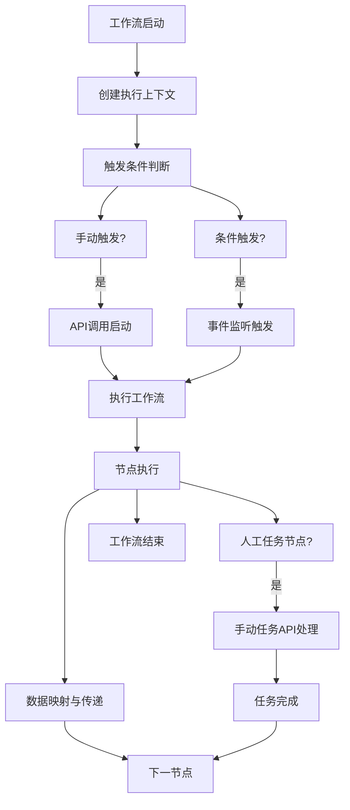

# 工作流实例API

<cite>
**本文档中引用的文件**  
- [plugin-workflow](file://packages/plugins/@nocobase/plugin-workflow)
- [plugin-workflow-manual](file://packages/plugins/@nocobase/plugin-workflow-manual)
- [plugin-workflow-action-trigger](file://packages/plugins/@nocobase/plugin-workflow-action-trigger)
- [plugin-workflow-json-variable-mapping](file://packages/plugins/@nocobase/plugin-workflow-json-variable-mapping)
</cite>

## 目录
1. [简介](#简介)
2. [工作流实例控制API](#工作流实例控制api)
3. [工作流执行状态查询](#工作流执行状态查询)
4. [工作流执行日志与节点详情](#工作流执行日志与节点详情)
5. [手动任务处理API](#手动任务处理api)
6. [工作流变量与数据传递机制](#工作流变量与数据传递机制)
7. [总结](#总结)

## 简介
NocoBase的工作流系统提供了一套完整的API接口，用于管理工作流实例的生命周期、执行状态、日志记录和手动任务处理。本文档详细说明了如何通过API启动、暂停、恢复和终止工作流实例，以及如何查询执行状态、获取执行日志、处理手动任务和管理变量传递。

## 工作流实例控制API
NocoBase提供了对工作流实例的完整控制能力，包括启动、暂停、恢复和终止操作。这些操作可以通过API端点进行调用，支持手动触发和条件触发两种模式。

手动触发是通过直接调用API来启动工作流实例，而条件触发则是基于预设的条件（如数据变更、时间触发等）自动启动工作流。两种触发方式在底层都通过相同的核心机制执行，但触发源不同。

工作流实例的控制操作包括：
- **启动**：创建新的工作流实例并开始执行
- **暂停**：暂时停止正在运行的工作流实例
- **恢复**：继续执行被暂停的工作流实例
- **终止**：强制结束工作流实例的执行

这些操作通过RESTful API提供，使用标准的HTTP方法（POST、PUT等）进行调用。

**Section sources**
- [plugin-workflow](file://packages/plugins/@nocobase/plugin-workflow)

## 工作流执行状态查询
系统提供了工作流执行状态的查询接口，支持多种过滤条件来检索工作流实例。查询接口支持按以下条件过滤：
- 工作流定义ID
- 执行状态（运行中、已完成、已失败、已暂停等）
- 时间范围（创建时间、更新时间）
- 实例ID或其他自定义条件

查询接口返回工作流实例的基本信息，包括实例ID、关联的工作流定义、当前状态、创建时间、更新时间等元数据。通过分页支持，可以处理大量工作流实例的查询需求。

**Section sources**
- [plugin-workflow](file://packages/plugins/@nocobase/plugin-workflow)

## 工作流执行日志与节点详情
工作流执行过程中会生成详细的执行日志，记录每个节点的执行时序、输入输出数据和执行结果。通过API可以获取：
- 工作流整体执行日志
- 各节点的执行顺序和时间戳
- 节点执行的输入参数和输出结果
- 错误信息和异常堆栈（如发生）

执行日志以结构化格式返回，便于分析和调试。节点执行详情包括节点类型、执行耗时、状态（成功、失败、跳过等）以及与上下文数据的交互情况。

**Section sources**
- [plugin-workflow](file://packages/plugins/@nocobase/plugin-workflow)

## 手动任务处理API
对于包含人工干预节点的工作流，系统提供了手动任务处理API，支持完整的任务生命周期管理：

### 待办任务管理
- 获取当前用户待办任务列表
- 查询任务详情，包括表单数据和上下文信息

### 任务处理操作
- **任务领取**：将任务分配给特定处理人
- **审批决策**：通过或拒绝任务
- **表单提交**：提交任务相关的表单数据
- **任务转交**：将任务转交给其他用户处理

这些API确保了人工节点的灵活处理，支持复杂的审批流程和协作场景。

**Section sources**
- [plugin-workflow-manual](file://packages/plugins/@nocobase/plugin-workflow-manual)

## 工作流变量与数据传递机制
工作流系统实现了完整的变量传递和上下文继承机制，确保数据在节点间正确流动。

### 变量传递
工作流支持在不同节点间传递变量，包括：
- 全局变量：在整个工作流实例中可用
- 局部变量：在特定作用域内可用
- 输入/输出变量：节点间的参数传递

### 上下文数据继承
每个工作流实例维护一个执行上下文，包含：
- 初始触发数据
- 中间节点的输出结果
- 系统自动生成的元数据（如实例ID、时间戳等）

### 节点间数据映射
通过JSON变量映射机制，可以灵活配置节点间的输入输出映射关系。系统支持：
- 静态值映射
- 动态表达式计算
- 路径引用（如从上一个节点的输出中提取特定字段）

这种机制实现了高度灵活的数据流转，支持复杂的工作流逻辑。

**Diagram sources**
- [plugin-workflow](file://packages/plugins/@nocobase/plugin-workflow)
- [plugin-workflow-json-variable-mapping](file://packages/plugins/@nocobase/plugin-workflow-json-variable-mapping)

**Section sources**
- [plugin-workflow-json-variable-mapping](file://packages/plugins/@nocobase/plugin-workflow-json-variable-mapping)

## 总结
NocoBase的工作流实例API提供了一套全面的接口，用于控制工作流生命周期、查询执行状态、获取执行日志、处理人工任务和管理数据传递。通过这些API，可以实现工作流的自动化管理和集成，支持从简单到复杂的各种业务流程需求。