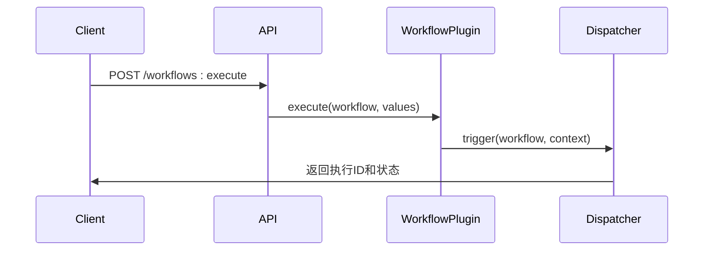
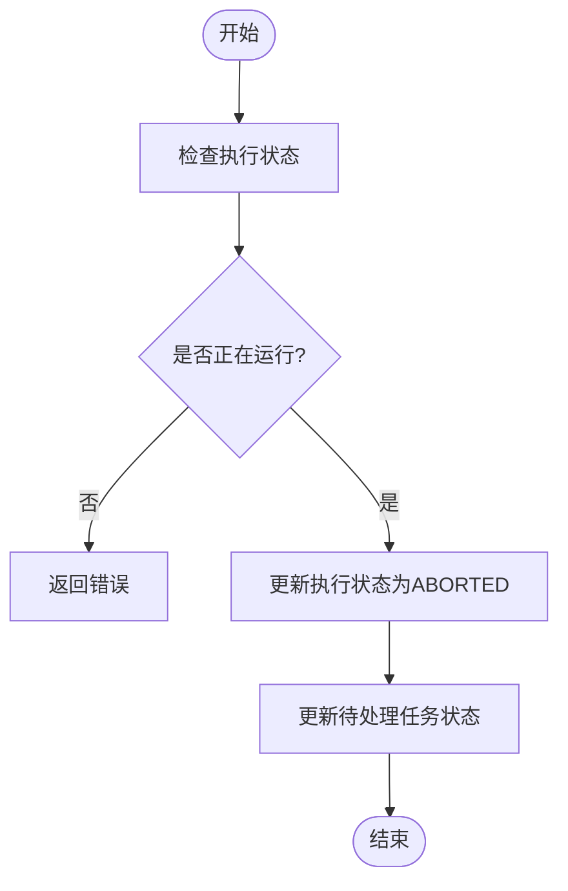
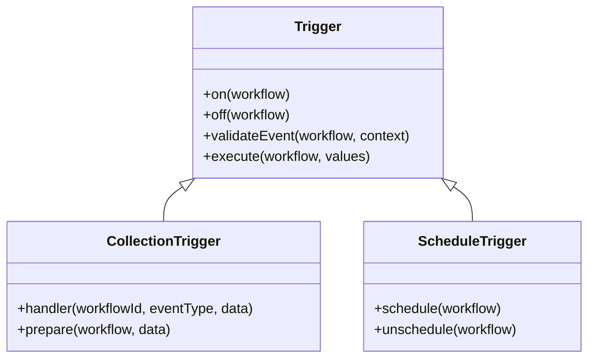
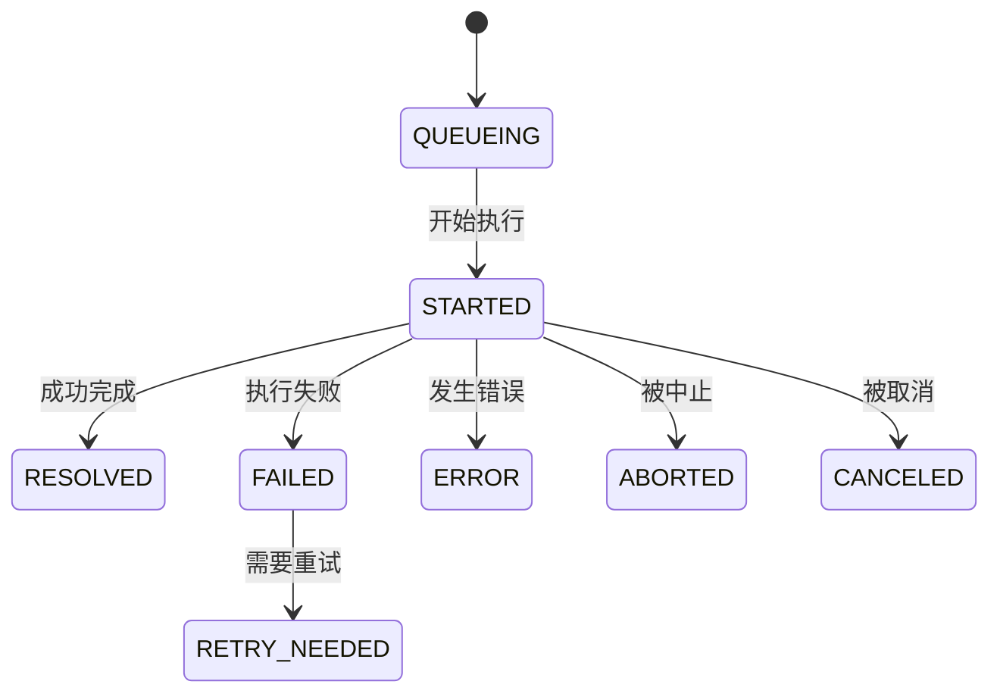
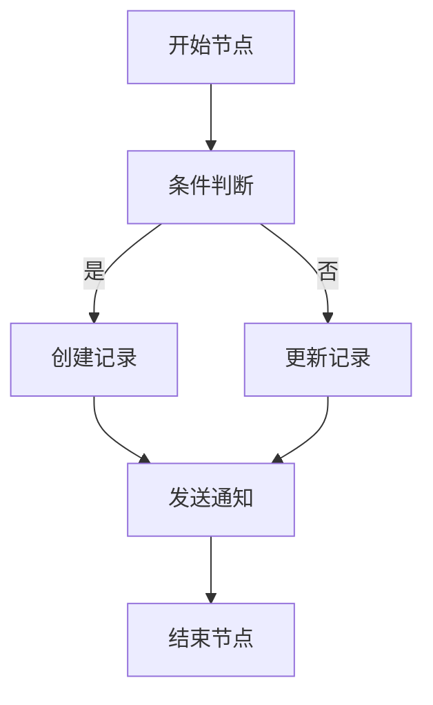

# 工作流实例管理API

<cite>
**本文档引用的文件**
- [executions.ts](file://packages/plugins/@nocobase/plugin-workflow/src/server/actions/executions.ts)
- [workflows.ts](file://packages/plugins/@nocobase/plugin-workflow/src/server/actions/workflows.ts)
- [Plugin.ts](file://packages/plugins/@nocobase/plugin-workflow/src/server/Plugin.ts)
- [constants.ts](file://packages/plugins/@nocobase/plugin-workflow/src/server/constants.ts)
- [CollectionTrigger.ts](file://packages/plugins/@nocobase/plugin-workflow/src/server/triggers/CollectionTrigger.ts)
- [useTriggerWorkflowActionProps.ts](file://packages/plugins/@nocobase/plugin-workflow/src/client/hooks/useTriggerWorkflowActionProps.ts)
- [ActionTrigger.ts](file://packages/plugins/@nocobase/plugin-workflow-action-trigger/src/server/ActionTrigger.ts)
</cite>

## 目录
1. [简介](#简介)
2. [工作流实例生命周期管理](#工作流实例生命周期管理)
3. [触发方式差异](#触发方式差异)
4. [执行状态查询](#执行状态查询)
5. [执行日志获取](#执行日志获取)
6. [节点执行时序与结果详情](#节点执行时序与结果详情)
7. [API使用示例](#api使用示例)
8. [结论](#结论)

## 简介
NocoBase工作流实例管理API提供了一套完整的接口来管理工作流的执行实例。该API支持工作流的启动、暂停、恢复和终止等核心操作，允许用户通过多种条件查询工作流执行状态，并获取详细的执行日志和节点执行信息。本文档详细说明了这些功能的API端点、请求参数、响应格式以及使用方法。

**Section sources**
- [Plugin.ts](file://packages/plugins/@nocobase/plugin-workflow/src/server/Plugin.ts#L1-L551)

## 工作流实例生命周期管理
工作流实例的生命周期管理包括启动、暂停、恢复和终止等操作。这些操作通过RESTful API端点实现，每个操作都有相应的HTTP方法和请求路径。

### 启动工作流实例
启动工作流实例通过`POST /workflows:execute`端点实现。该操作需要提供工作流ID和触发参数。当工作流被成功触发时，系统会创建一个新的执行实例并返回其ID和状态。



**Diagram sources**
- [workflows.ts](file://packages/plugins/@nocobase/plugin-workflow/src/server/actions/workflows.ts#L121-L174)
- [Plugin.ts](file://packages/plugins/@nocobase/plugin-workflow/src/server/Plugin.ts#L444-L450)

### 终止工作流实例
终止工作流实例通过`POST /executions:cancel`端点实现。该操作会将正在运行的工作流实例标记为已中止状态，并取消所有待处理的任务。



**Diagram sources**
- [executions.ts](file://packages/plugins/@nocobase/plugin-workflow/src/server/actions/executions.ts#L26-L64)
- [constants.ts](file://packages/plugins/@nocobase/plugin-workflow/src/server/constants.ts#L10-L20)

**Section sources**
- [executions.ts](file://packages/plugins/@nocobase/plugin-workflow/src/server/actions/executions.ts#L1-L65)
- [constants.ts](file://packages/plugins/@nocobase/plugin-workflow/src/server/constants.ts#L1-L32)

## 触发方式差异
NocoBase支持多种工作流触发方式，包括手动触发和条件触发。不同的触发方式在API调用上有所差异。

### 手动触发
手动触发通过`POST /workflows:execute`端点实现。调用者需要提供工作流ID和触发参数。这种触发方式通常用于需要用户干预的场景。

**请求参数**
- `filterByTk`: 工作流ID
- `values`: 触发参数
- `autoRevision`: 是否自动创建新版本

**认证方式**
使用标准的JWT认证，需要具有`workflows:execute`权限。

### 条件触发
条件触发包括基于数据变更的触发和定时触发。基于数据变更的触发在特定数据表发生增删改操作时自动触发，而定时触发则按照预设的时间计划执行。



**Diagram sources**
- [CollectionTrigger.ts](file://packages/plugins/@nocobase/plugin-workflow/src/server/triggers/CollectionTrigger.ts#L55-L269)
- [ActionTrigger.ts](file://packages/plugins/@nocobase/plugin-workflow-action-trigger/src/server/ActionTrigger.ts#L38-L145)

**Section sources**
- [CollectionTrigger.ts](file://packages/plugins/@nocobase/plugin-workflow/src/server/triggers/CollectionTrigger.ts#L1-L269)
- [ActionTrigger.ts](file://packages/plugins/@nocobase/plugin-workflow-action-trigger/src/server/ActionTrigger.ts#L1-L200)

## 执行状态查询
工作流执行状态查询接口支持多维度条件过滤，允许用户根据不同的需求获取工作流执行实例。

### 查询参数
- `filter`: 按工作流定义ID、执行状态等条件过滤
- `createdAt`: 按创建时间范围过滤
- `updatedAt`: 按更新时间范围过滤
- `sort`: 排序字段

### 执行状态
工作流执行状态由`EXECUTION_STATUS`常量定义，包括：
- `QUEUEING`: 排队中
- `STARTED`: 已开始
- `RESOLVED`: 已完成
- `FAILED`: 已失败
- `ERROR`: 错误
- `ABORTED`: 已中止
- `CANCELED`: 已取消
- `REJECTED`: 已拒绝
- `RETRY_NEEDED`: 需要重试



**Diagram sources**
- [constants.ts](file://packages/plugins/@nocobase/plugin-workflow/src/server/constants.ts#L10-L20)

**Section sources**
- [constants.ts](file://packages/plugins/@nocobase/plugin-workflow/src/server/constants.ts#L1-L32)

## 执行日志获取
工作流执行日志提供了详细的执行过程信息，包括日志级别、时间戳和节点执行详情。

### 日志级别
- `DEBUG`: 调试信息
- `INFO`: 一般信息
- `WARN`: 警告信息
- `ERROR`: 错误信息

### 日志结构
日志信息以JSON格式返回，包含以下字段：
- `timestamp`: 时间戳
- `level`: 日志级别
- `message`: 日志消息
- `nodeId`: 节点ID
- `executionId`: 执行实例ID

**Section sources**
- [Plugin.ts](file://packages/plugins/@nocobase/plugin-workflow/src/server/Plugin.ts#L229-L245)

## 节点执行时序与结果详情
工作流的节点执行时序和结果详情提供了对工作流执行过程的深入洞察。

### 节点执行时序
节点执行时序以有向图的形式表示，展示了各个节点之间的依赖关系和执行顺序。



**Diagram sources**
- [Plugin.ts](file://packages/plugins/@nocobase/plugin-workflow/src/server/Plugin.ts#L468-L470)
- [Processor.ts](file://packages/plugins/@nocobase/plugin-workflow/src/server/Processor.ts#L1-L200)

### 结果详情结构
结果详情以结构化数据格式返回，包含每个节点的输入、输出和执行状态。

**Section sources**
- [Processor.ts](file://packages/plugins/@nocobase/plugin-workflow/src/server/Processor.ts#L1-L200)

## API使用示例
以下是一些常见的API使用示例，展示了不同场景下的调用方式。

### curl示例
```bash
# 启动工作流实例
curl -X POST https://api.nocobase.com/workflows:execute \
  -H "Authorization: Bearer <token>" \
  -H "Content-Type: application/json" \
  -d '{
    "filterByTk": "1",
    "values": {
      "data": {
        "name": "John Doe",
        "email": "john@example.com"
      }
    },
    "autoRevision": true
  }'

# 查询工作流执行状态
curl -X GET "https://api.nocobase.com/executions?filter[status]=0&createdAt[$gte]=2023-01-01" \
  -H "Authorization: Bearer <token>"
```

### SDK调用示例
```typescript
// 使用NocoBase客户端SDK
import { APIClient } from '@nocobase/client';

const api = new APIClient({
  baseURL: 'https://api.nocobase.com',
  auth: {
    bearerToken: '<token>'
  }
});

// 启动工作流
const result = await api.resource('workflows').execute({
  filterByTk: '1',
  values: {
    data: {
      name: 'John Doe',
      email: 'john@example.com'
    }
  }
});

// 查询执行实例
const executions = await api.resource('executions').list({
  filter: {
    status: 0
  },
  createdAt: {
    $gte: '2023-01-01'
  }
});
```

**Section sources**
- [useTriggerWorkflowActionProps.ts](file://packages/plugins/@nocobase/plugin-workflow/src/client/hooks/useTriggerWorkflowActionProps.ts#L1-L151)

## 结论
NocoBase工作流实例管理API提供了一套强大而灵活的接口，用于管理工作流的整个生命周期。通过这些API，用户可以轻松地启动、监控和控制工作流的执行，同时获取详细的执行日志和节点执行信息。无论是手动触发还是条件触发，该API都提供了统一的接口和一致的响应格式，使得集成和使用变得简单而高效。