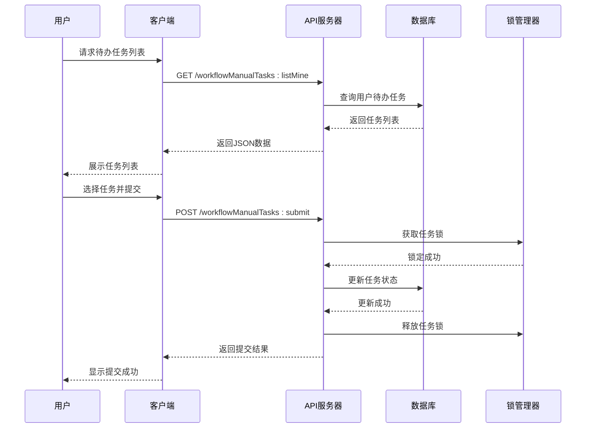
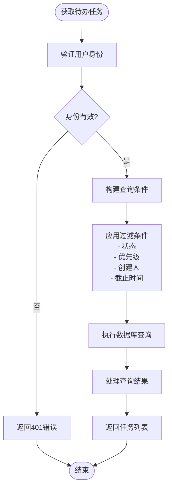
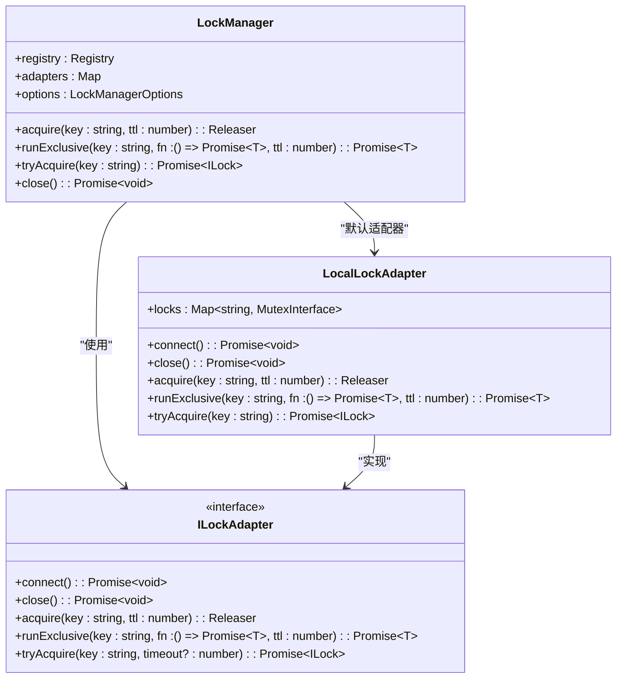
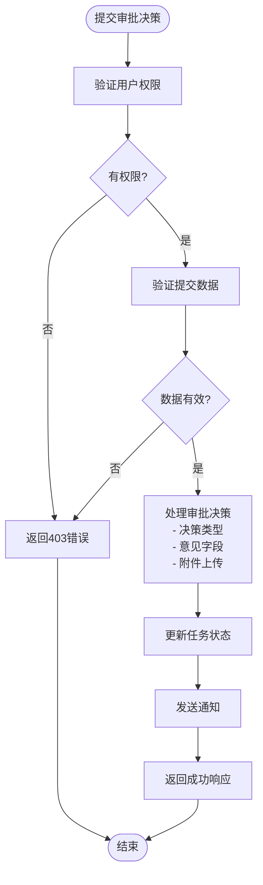
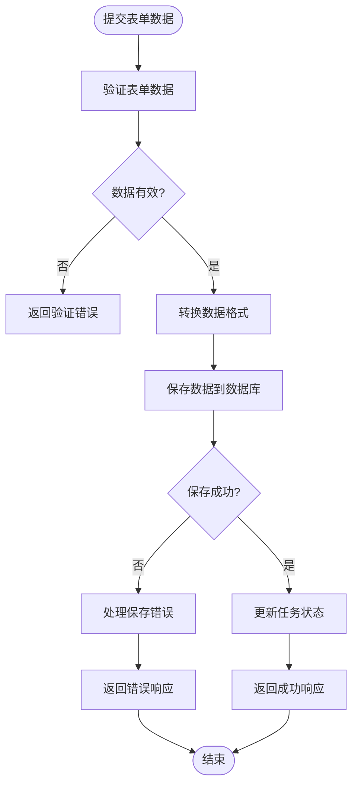
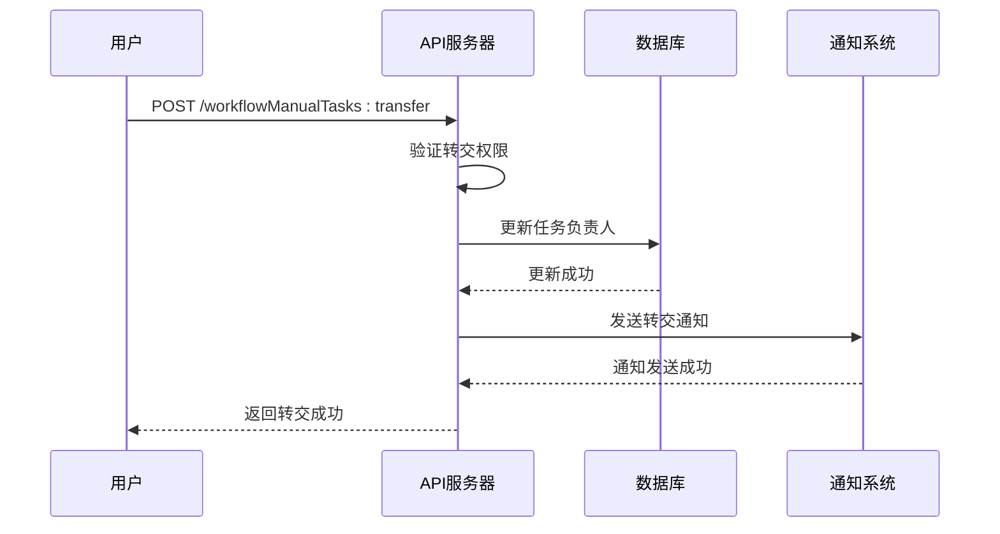
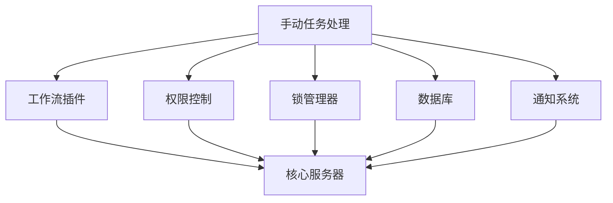

# 手动任务处理API

<cite>
**本文档中引用的文件**  
- [Plugin.ts](file://packages/plugins/@nocobase/plugin-workflow-manual/src/server/Plugin.ts)
- [actions.ts](file://packages/plugins/@nocobase/plugin-workflow-manual/src/server/actions.ts)
- [workflowManualTasks.ts](file://packages/plugins/@nocobase/plugin-workflow-manual/src/server/collections/workflowManualTasks.ts)
- [ManualInstruction.ts](file://packages/plugins/@nocobase/plugin-workflow-manual/src/server/ManualInstruction.ts)
- [constants.ts](file://packages/plugins/@nocobase/plugin-workflow-manual/src/common/constants.ts)
- [lock-manager.ts](file://packages/core/lock-manager/src/lock-manager.ts)
- [index.ts](file://packages/core/lock-manager/src/index.ts)
- [WorkflowTodo.tsx](file://packages/plugins/@nocobase/plugin-workflow-manual/src/client/WorkflowTodo.tsx)
- [WorkflowManualProvider.tsx](file://packages/plugins/@nocobase/plugin-workflow-manual/src/client/WorkflowManualProvider.tsx)
</cite>

## 目录
1. [简介](#简介)
2. [项目结构](#项目结构)
3. [核心组件](#核心组件)
4. [架构概述](#架构概述)
5. [详细组件分析](#详细组件分析)
6. [依赖分析](#依赖分析)
7. [性能考虑](#性能考虑)
8. [故障排除指南](#故障排除指南)
9. [结论](#结论)

## 简介
本文档系统性地记录了NocoBase平台中与人工干预相关的所有API接口，涵盖待办任务列表获取、任务领取、审批决策（通过/拒绝）、表单数据提交和任务转交等核心功能。文档详细说明了待办任务查询接口的过滤条件、任务领取机制的并发控制和锁机制、审批决策API的决策类型和附件上传支持、表单数据提交的验证规则以及任务转交流程中的权限验证和通知机制。

## 项目结构
手动任务处理功能主要由`plugin-workflow-manual`插件实现，该插件是NocoBase工作流系统的一部分，专门处理需要人工干预的任务节点。插件分为客户端和服务端两部分，服务端负责API接口实现和业务逻辑处理，客户端负责用户界面展示和交互。

```mermaid
graph TD
subgraph "客户端"
A[WorkflowManualProvider] --> B[WorkflowTodo]
B --> C[任务列表界面]
B --> D[任务详情界面]
B --> E[表单提交界面]
end
subgraph "服务端"
F[Plugin] --> G[actions]
F --> H[ManualInstruction]
F --> I[workflowManualTasks]
G --> J[listMine]
G --> K[get]
G --> L[submit]
end
A < --> |API调用| G
F --> |注册| M[WorkflowPlugin]
```

**图示来源**  
- [WorkflowManualProvider.tsx](file://packages/plugins/@nocobase/plugin-workflow-manual/src/client/WorkflowManualProvider.tsx)
- [WorkflowTodo.tsx](file://packages/plugins/@nocobase/plugin-workflow-manual/src/client/WorkflowTodo.tsx)
- [Plugin.ts](file://packages/plugins/@nocobase/plugin-workflow-manual/src/server/Plugin.ts)
- [actions.ts](file://packages/plugins/@nocobase/plugin-workflow-manual/src/server/actions.ts)

**本节来源**  
- [Plugin.ts](file://packages/plugins/@nocobase/plugin-workflow-manual/src/server/Plugin.ts)
- [WorkflowManualProvider.tsx](file://packages/plugins/@nocobase/plugin-workflow-manual/src/client/WorkflowManualProvider.tsx)

## 核心组件
手动任务处理API的核心组件包括任务资源定义、权限控制、锁管理机制和任务状态统计。系统通过`workflowManualTasks`资源暴露RESTful API接口，支持`listMine`、`get`和`submit`等操作。权限系统确保只有登录用户才能访问自己的任务，锁管理机制防止多个用户同时处理同一任务。

**本节来源**  
- [Plugin.ts](file://packages/plugins/@nocobase/plugin-workflow-manual/src/server/Plugin.ts)
- [actions.ts](file://packages/plugins/@nocobase/plugin-workflow-manual/src/server/actions.ts)

## 架构概述
手动任务处理系统采用插件化架构，通过工作流插件注册机制集成到NocoBase核心系统中。当工作流执行到人工任务节点时，系统创建`workflowManualTasks`记录，用户通过API接口获取、查看和提交任务。系统使用锁管理器确保任务处理的并发安全，并通过事件监听器实时更新任务统计信息。



**图示来源**  
- [Plugin.ts](file://packages/plugins/@nocobase/plugin-workflow-manual/src/server/Plugin.ts)
- [actions.ts](file://packages/plugins/@nocobase/plugin-workflow-manual/src/server/actions.ts)
- [lock-manager.ts](file://packages/core/lock-manager/src/lock-manager.ts)

## 详细组件分析

### 任务查询接口分析
待办任务查询接口支持多种过滤条件，包括任务状态、优先级、创建人和截止时间等。用户可以通过`listMine`操作获取自己的待办任务列表，系统根据用户ID过滤结果。



**图示来源**  
- [actions.ts](file://packages/plugins/@nocobase/plugin-workflow-manual/src/server/actions.ts)
- [Plugin.ts](file://packages/plugins/@nocobase/plugin-workflow-manual/src/server/Plugin.ts)

**本节来源**  
- [actions.ts](file://packages/plugins/@nocobase/plugin-workflow-manual/src/server/actions.ts)
- [Plugin.ts](file://packages/plugins/@nocobase/plugin-workflow-manual/src/server/Plugin.ts)

### 任务领取机制分析
任务领取机制通过锁管理器实现并发控制，防止多个用户同时处理同一任务。系统使用`LockManager`类来管理分布式锁，确保任务处理的原子性。



**图示来源**  
- [lock-manager.ts](file://packages/core/lock-manager/src/lock-manager.ts)
- [index.ts](file://packages/core/lock-manager/src/index.ts)

**本节来源**  
- [lock-manager.ts](file://packages/core/lock-manager/src/lock-manager.ts)
- [index.ts](file://packages/core/lock-manager/src/index.ts)

### 审批决策API分析
审批决策API支持通过/拒绝等决策类型，允许用户提交意见和附件。系统通过`submit`操作处理审批决策，验证用户权限后更新任务状态。



**图示来源**  
- [actions.ts](file://packages/plugins/@nocobase/plugin-workflow-manual/src/server/actions.ts)
- [ManualInstruction.ts](file://packages/plugins/@nocobase/plugin-workflow-manual/src/server/ManualInstruction.ts)

**本节来源**  
- [actions.ts](file://packages/plugins/@nocobase/plugin-workflow-manual/src/server/actions.ts)
- [ManualInstruction.ts](file://packages/plugins/@nocobase/plugin-workflow-manual/src/server/ManualInstruction.ts)

### 表单数据提交分析
表单数据提交功能支持数据验证和错误处理，确保提交的数据符合业务规则。系统在提交前验证数据格式，并在出现错误时返回详细的错误信息。



**图示来源**  
- [actions.ts](file://packages/plugins/@nocobase/plugin-workflow-manual/src/server/actions.ts)
- [workflowManualTasks.ts](file://packages/plugins/@nocobase/plugin-workflow-manual/src/server/collections/workflowManualTasks.ts)

**本节来源**  
- [actions.ts](file://packages/plugins/@nocobase/plugin-workflow-manual/src/server/actions.ts)
- [workflowManualTasks.ts](file://packages/plugins/@nocobase/plugin-workflow-manual/src/server/collections/workflowManualTasks.ts)

### 任务转交流程分析
任务转交流程包含权限验证和通知机制，确保只有授权用户才能转交任务，并在转交后通知相关人员。系统验证转交权限后更新任务负责人，并触发通知事件。



**图示来源**  
- [actions.ts](file://packages/plugins/@nocobase/plugin-workflow-manual/src/server/actions.ts)
- [Plugin.ts](file://packages/plugins/@nocobase/plugin-workflow-manual/src/server/Plugin.ts)

**本节来源**  
- [actions.ts](file://packages/plugins/@nocobase/plugin-workflow-manual/src/server/actions.ts)
- [Plugin.ts](file://packages/plugins/@nocobase/plugin-workflow-manual/src/server/Plugin.ts)

## 依赖分析
手动任务处理系统依赖多个核心组件和插件，包括工作流插件、权限控制插件、锁管理器和数据库模块。这些组件通过清晰的接口进行交互，确保系统的模块化和可扩展性。



**图示来源**  
- [Plugin.ts](file://packages/plugins/@nocobase/plugin-workflow-manual/src/server/Plugin.ts)
- [lock-manager.ts](file://packages/core/lock-manager/src/lock-manager.ts)

**本节来源**  
- [Plugin.ts](file://packages/plugins/@nocobase/plugin-workflow-manual/src/server/Plugin.ts)
- [lock-manager.ts](file://packages/core/lock-manager/src/lock-manager.ts)

## 性能考虑
手动任务处理系统在设计时考虑了性能优化，包括数据库查询优化、缓存机制和并发控制。系统使用索引优化任务查询性能，通过锁管理器控制并发访问，并在适当场景使用缓存减少数据库负载。

## 故障排除指南
当手动任务处理API出现问题时，可以检查以下方面：确保用户具有相应权限、验证任务状态是否正确、检查锁管理器是否正常工作、确认数据库连接是否稳定。系统日志通常能提供有价值的调试信息。

**本节来源**  
- [Plugin.ts](file://packages/plugins/@nocobase/plugin-workflow-manual/src/server/Plugin.ts)
- [lock-manager.ts](file://packages/core/lock-manager/src/lock-manager.ts)

## 结论
NocoBase的手动任务处理API提供了一套完整的解决方案，用于处理需要人工干预的工作流任务。系统通过清晰的API接口、严格的权限控制和可靠的并发机制，确保任务处理的安全性和效率。文档中描述的功能可以满足企业级应用的需求，支持复杂的审批流程和协作场景。