# 插件管理API

<cite>
**本文档中引用的文件**  
- [plugin-manager.ts](file://packages/core/server/src/plugin-manager/plugin-manager.ts)
- [resource.ts](file://packages/core/server/src/plugin-manager/options/resource.ts)
- [plugin-manager-repository.ts](file://packages/core/server/src/plugin-manager/plugin-manager-repository.ts)
- [server.ts](file://packages/plugins/@nocobase/plugin-system-settings/src/server/server.ts)
</cite>

## 目录
1. [简介](#简介)
2. [插件生命周期管理](#插件生命周期管理)
3. [插件状态查询](#插件状态查询)
4. [插件配置管理](#插件配置管理)
5. [系统设置管理](#系统设置管理)
6. [插件生命周期事件](#插件生命周期事件)
7. [插件市场集成](#插件市场集成)

## 简介
NocoBase插件管理系统提供了一套完整的API接口，用于管理插件的安装、启用、禁用、更新和卸载操作。该系统通过RESTful API和命令行接口（CLI）两种方式提供服务，支持对插件状态的查询、依赖关系的管理以及版本信息的获取。插件管理API还提供了系统设置的全局配置管理功能，允许管理员通过API调用修改系统级别的配置参数。

**Section sources**
- [plugin-manager.ts](file://packages/core/server/src/plugin-manager/plugin-manager.ts#L1-L1167)

## 插件生命周期管理
插件生命周期管理API提供了对插件全生命周期的控制能力，包括安装、启用、禁用、更新和卸载操作。这些操作通过`pm`资源的特定动作来实现，每个操作都有相应的HTTP端点和CLI命令。

### 插件安装
插件安装操作通过`pm:add`动作实现，支持从npm包注册表、压缩文件URL或本地上传文件进行安装。安装过程会自动处理依赖关系，并在数据库中记录插件信息。

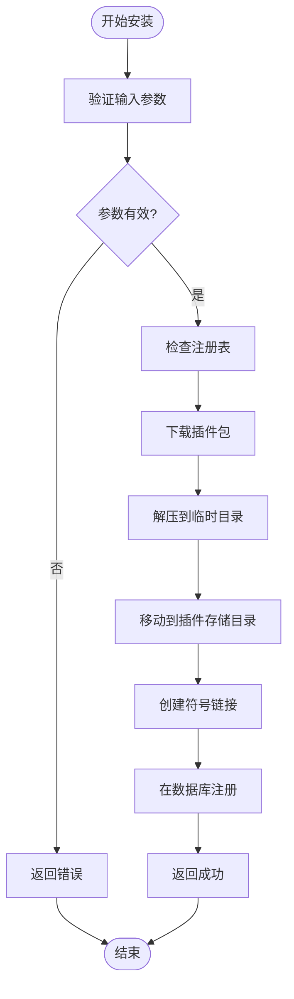

**Diagram sources**
- [plugin-manager.ts](file://packages/core/server/src/plugin-manager/plugin-manager.ts#L773-L800)
- [resource.ts](file://packages/core/server/src/plugin-manager/options/resource.ts#L20-L49)

### 插件启用
插件启用操作通过`pm:enable`动作实现，会触发一系列生命周期事件和数据库操作。启用过程包括依赖检查、前置处理、数据库同步和后置处理等步骤。

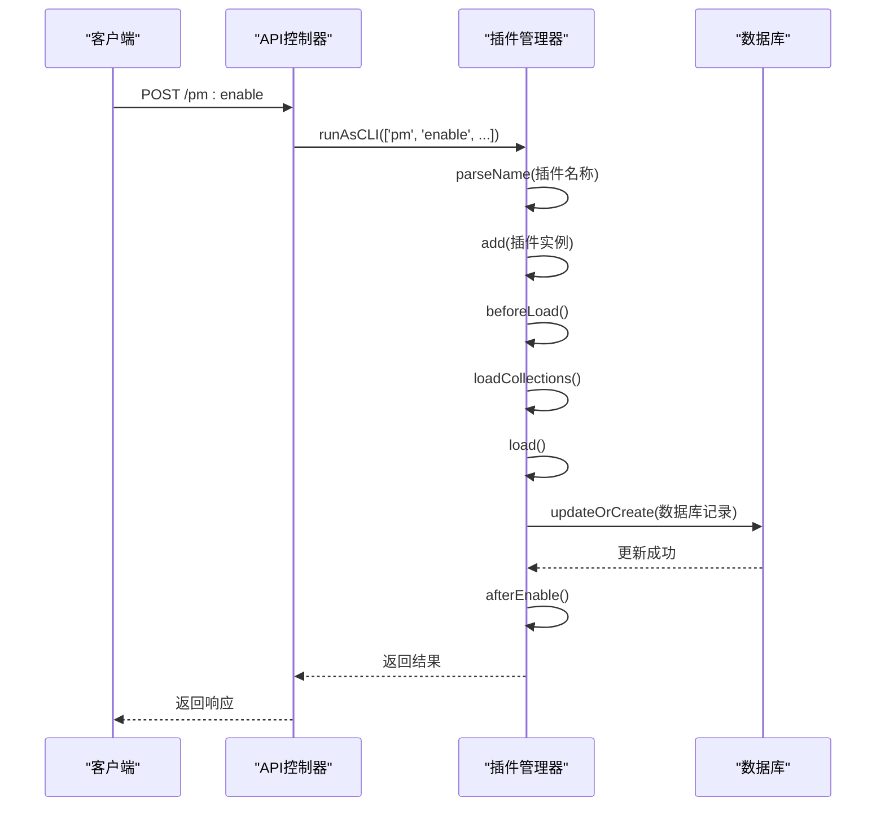

**Diagram sources**
- [plugin-manager.ts](file://packages/core/server/src/plugin-manager/plugin-manager.ts#L553-L683)
- [resource.ts](file://packages/core/server/src/plugin-manager/options/resource.ts#L93-L103)

### 插件禁用
插件禁用操作通过`pm:disable`动作实现，会执行前置处理、状态更新和后置处理。禁用操作不会删除插件文件，仅更新数据库中的启用状态。

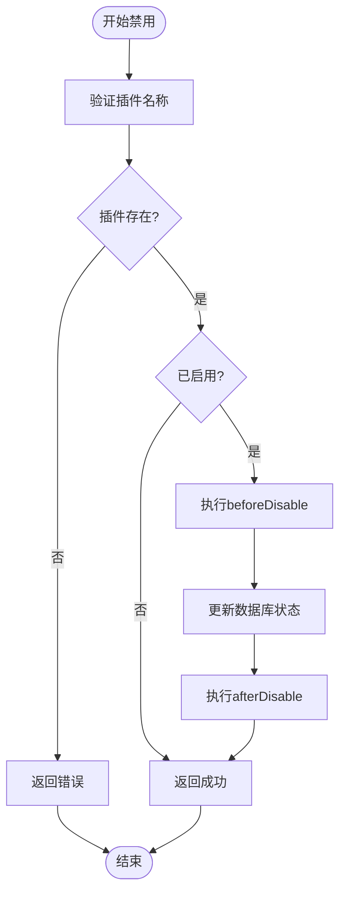

**Diagram sources**
- [plugin-manager.ts](file://packages/core/server/src/plugin-manager/plugin-manager.ts#L686-L730)
- [resource.ts](file://packages/core/server/src/plugin-manager/options/resource.ts#L104-L113)

### 插件卸载
插件卸载操作通过`pm:remove`动作实现，会从数据库中删除插件记录，并可选择性地删除插件文件目录。卸载操作是不可逆的，需要谨慎执行。

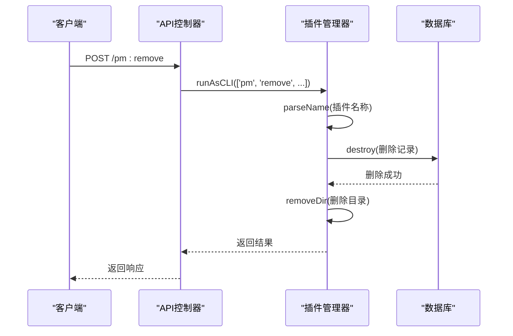

**Diagram sources**
- [plugin-manager.ts](file://packages/core/server/src/plugin-manager/plugin-manager.ts#L733-L769)
- [resource.ts](file://packages/core/server/src/plugin-manager/options/resource.ts#L114-L123)

## 插件状态查询
插件状态查询API提供了多种方式来获取插件的当前状态信息，包括已安装插件列表、插件详细信息和版本信息等。

### 已安装插件列表
通过`pm:list`和`pm:listEnabled`动作可以获取所有已安装插件或仅已启用插件的列表。返回信息包括插件名称、包名、版本、启用状态等。

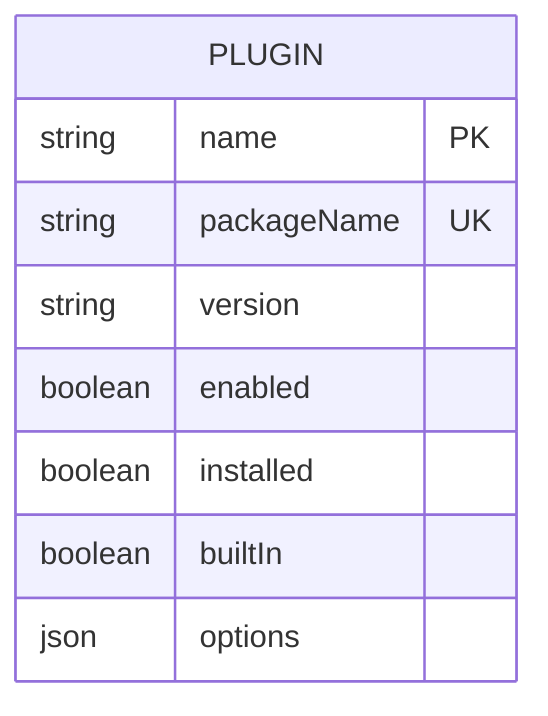

**Diagram sources**
- [collection.ts](file://packages/core/server/src/plugin-manager/options/collection.ts#L12-L28)
- [resource.ts](file://packages/core/server/src/plugin-manager/options/resource.ts#L124-L131)

### 插件详细信息查询
通过`pm:get`动作可以获取单个插件的详细信息，包括显示名称、描述、主页URL、README和变更日志URL等元数据。

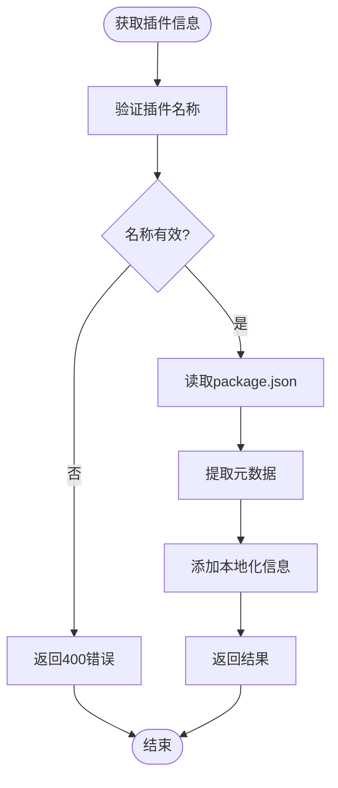

**Diagram sources**
- [resource.ts](file://packages/core/server/src/plugin-manager/options/resource.ts#L162-L173)
- [plugin-manager.ts](file://packages/core/server/src/plugin-manager/plugin-manager.ts#L228-L253)

### 版本信息管理
插件管理器提供了版本信息的自动更新功能，可以通过`updateVersions`方法同步数据库中的版本信息与实际的package.json版本。

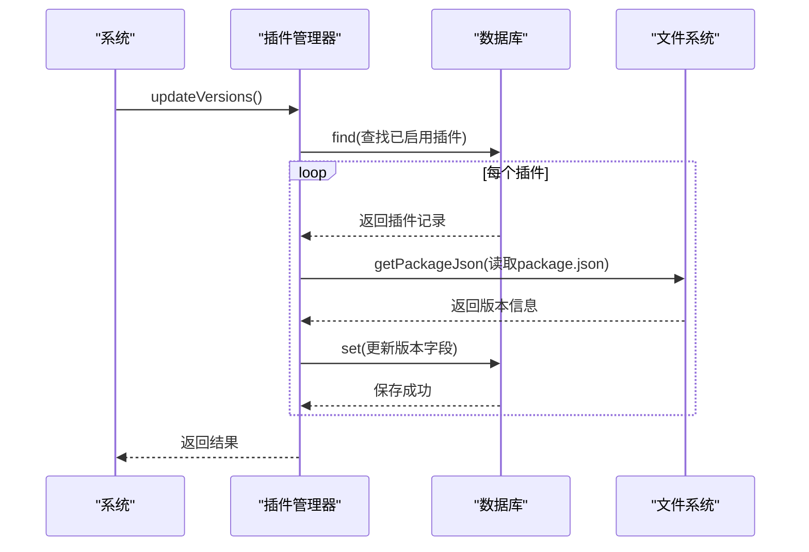

**Diagram sources**
- [plugin-manager-repository.ts](file://packages/core/server/src/plugin-manager/plugin-manager-repository.ts#L84-L99)

## 插件配置管理
插件配置管理API允许读取和更新插件的配置选项，这些配置存储在数据库的`options`字段中，以JSON格式保存。

### 配置读取
插件配置可以通过插件实例的`options`属性直接访问，也可以通过API接口获取。配置信息在插件加载时从数据库加载到内存中。

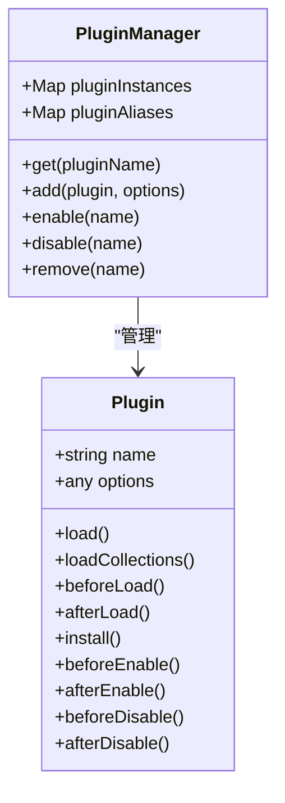

**Diagram sources**
- [plugin-manager.ts](file://packages/core/server/src/plugin-manager/plugin-manager.ts#L73-L83)
- [plugin.ts](file://packages/core/server/src/plugin.ts)

### 配置更新
插件配置的更新通常在插件启用或安装时通过`updateOrCreate`方法实现，也可以通过特定的API端点进行更新。

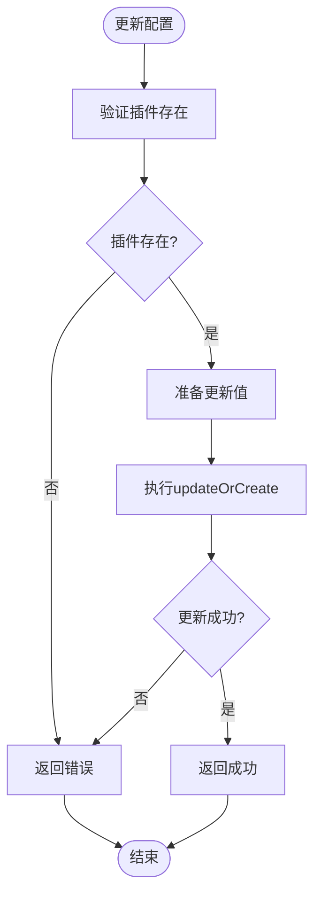

**Diagram sources**
- [plugin-manager.ts](file://packages/core/server/src/plugin-manager/plugin-manager.ts#L654-L668)

## 系统设置管理
系统设置管理API提供了对全局配置的管理功能，通过`systemSettings`资源实现。这些设置包括系统标题、语言配置、Logo等。

### 系统设置读取
通过`systemSettings:get`动作可以获取当前的系统设置，返回信息包括标题、语言配置、Logo等。

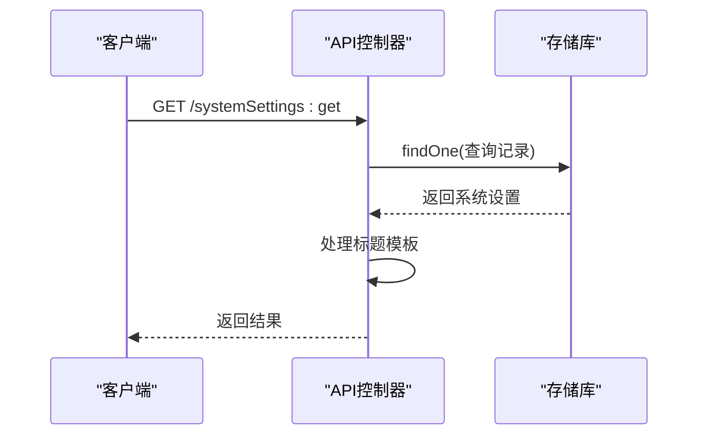

**Diagram sources**
- [server.ts](file://packages/plugins/@nocobase/plugin-system-settings/src/server/server.ts#L81-L88)

### 系统设置更新
通过`systemSettings:put`动作可以更新系统设置，支持部分更新，即只更新提供的字段。

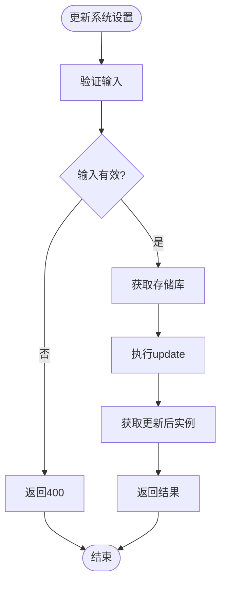

**Diagram sources**
- [server.ts](file://packages/plugins/@nocobase/plugin-system-settings/src/server/server.ts#L89-L102)

## 插件生命周期事件
插件生命周期事件系统提供了在关键操作前后触发自定义逻辑的机制。这些事件通过`app.emitAsync`方法触发，并允许插件注册事件处理器。

### 事件触发顺序
插件生命周期事件按照特定顺序触发，确保操作的原子性和一致性。每个主要操作都有对应的前后事件。

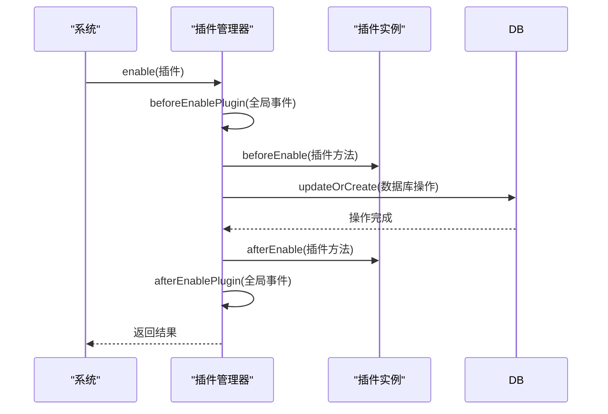

**Diagram sources**
- [plugin-manager.ts](file://packages/core/server/src/plugin-manager/plugin-manager.ts#L626-L676)

### 事件类型
插件管理系统定义了多种生命周期事件，包括插件添加、启用、禁用、安装和加载等。

```mermaid
classDiagram
class PluginManager {
+registerActions(actions)
+emitAsync(event, ...)
}
class AuditManager {
+registerActions(actions)
}
PluginManager --> AuditManager : "使用"
class Action {
+string name
+function getSourceAndTarget
}
AuditManager --> Action : "包含"
Action : name = 'pm : add'
Action : name = 'pm : update'
Action : name = 'pm : enable'
Action : name = 'pm : disable'
Action : name = 'pm : remove'
```

**Diagram sources**
- [plugin-manager.ts](file://packages/core/server/src/plugin-manager/plugin-manager.ts#L498-L504)

## 插件市场集成
插件市场集成功能允许从远程市场获取插件信息和版本列表，支持从私有或公共npm注册表安装插件。

### 版本列表查询
通过`pm:npmVersionList`动作可以查询指定插件在npm注册表中的可用版本列表。

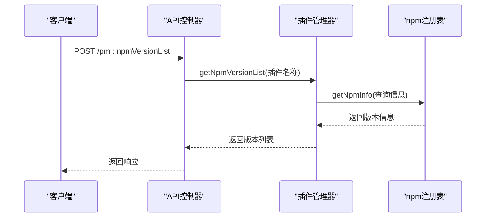

**Diagram sources**
- [resource.ts](file://packages/core/server/src/plugin-manager/options/resource.ts#L84-L92)
- [utils.ts](file://packages/core/server/src/plugin-manager/utils.ts#L118-L130)

### 市场功能状态
根据代码分析，NocoBase的插件市场功能目前处于"Coming soon..."状态，表示该功能正在开发中或尚未完全实现。

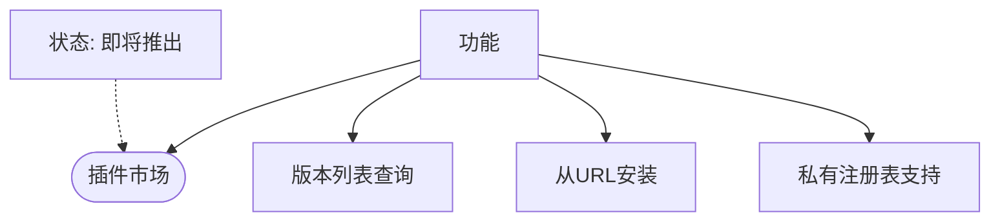

**Diagram sources**
- [PluginManager.tsx](file://packages/core/client/src/pm/PluginManager.tsx#L357-L358)