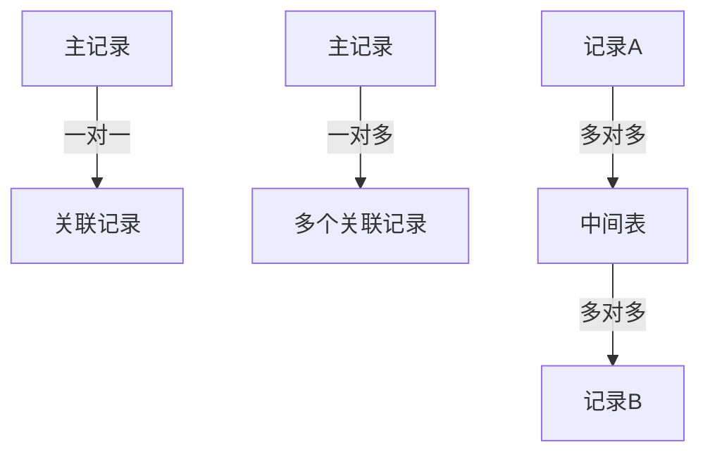
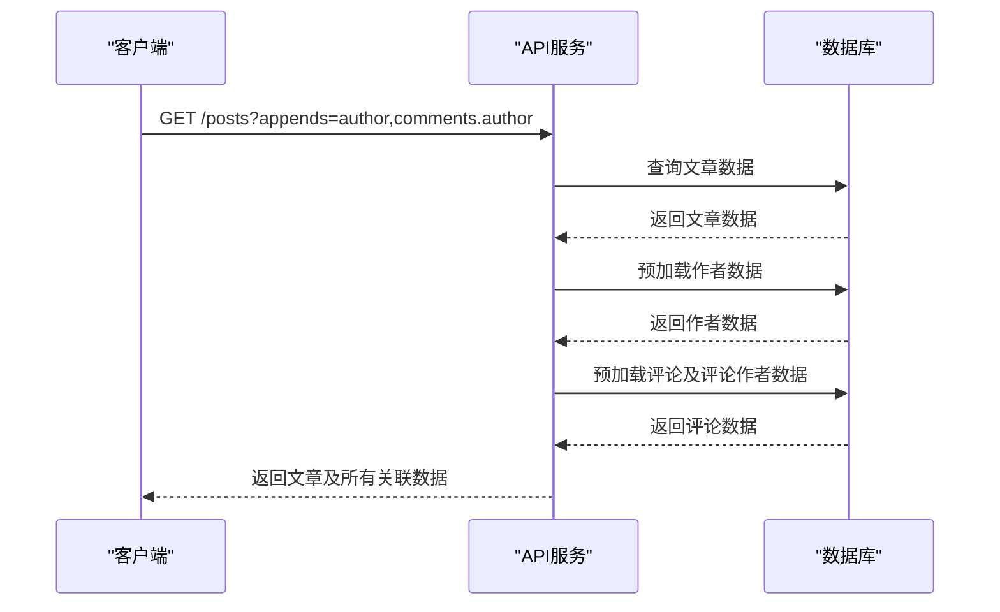
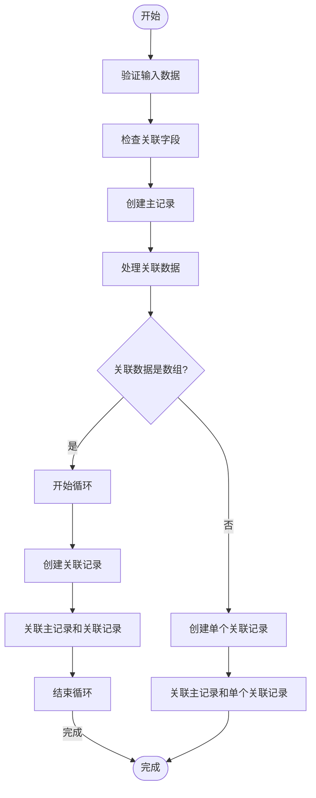
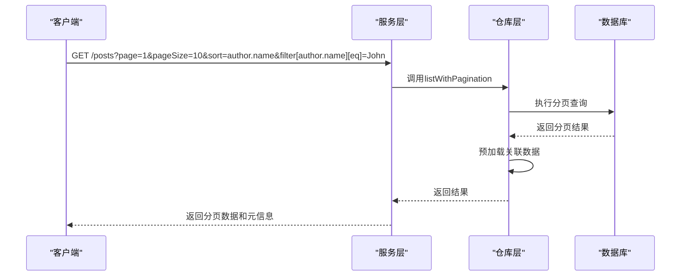
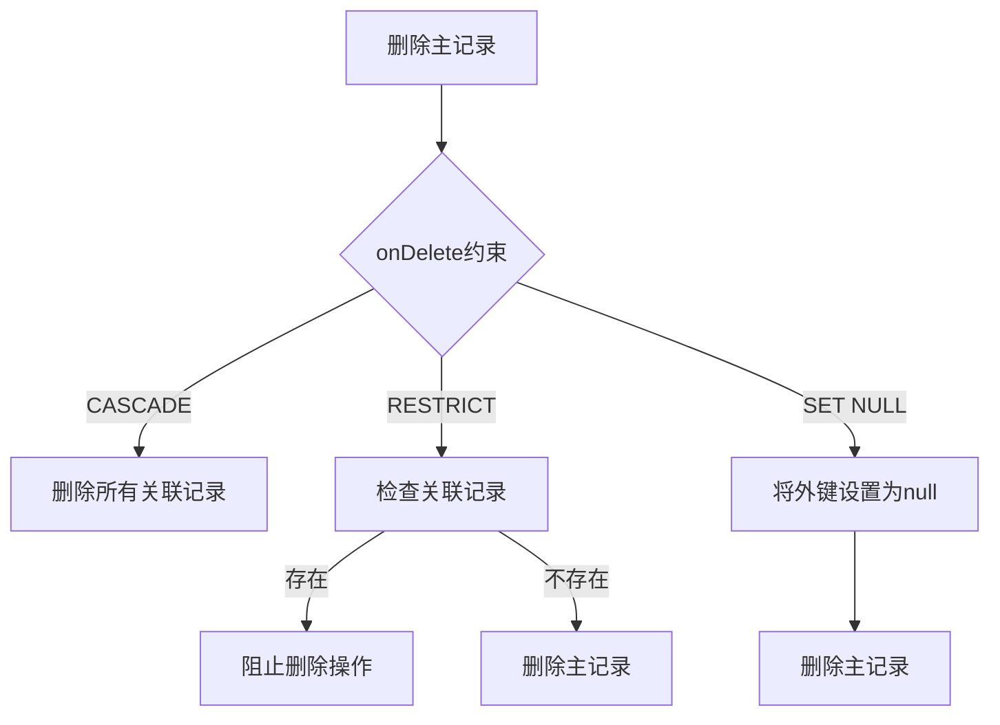
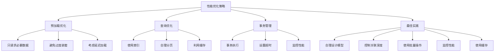

# 关联数据API

<cite>
**本文档中引用的文件**   
- [VariablesProvider.tsx](file://packages/core/client/src/variables/VariablesProvider.tsx)
- [relation-repository.ts](file://packages/core/database/src/relation-repository/relation-repository.ts)
- [options-parser.ts](file://packages/core/database/src/options-parser.ts)
- [belongs-to-array-repository.ts](file://packages/core/database/src/belongs-to-array/belongs-to-array-repository.ts)
- [eager-loading-tree.ts](file://packages/core/database/src/eager-loading/eager-loading-tree.ts)
- [update-or-create.ts](file://packages/core/actions/src/actions/update-or-create.ts)
- [index.json](file://packages/core/server/src/swagger/index.json)
- [list.ts](file://packages/core/data-source-manager/src/default-actions/list.ts)
- [referential-integrity-check.ts](file://packages/core/database/src/features/referential-integrity-check.ts)
- [update-guard.ts](file://packages/core/database/src/update-guard.ts)
- [single-relation-repository.ts](file://packages/core/database/src/relation-repository/single-relation-repository.ts)
- [repository.ts](file://packages/core/database/src/repository.ts)
- [multiple-relation-repository.ts](file://packages/core/database/src/relation-repository/multiple-relation-repository.ts)
- [create.ts](file://packages/core/actions/src/actions/create.ts)
</cite>

## 目录
1. [简介](#简介)
2. [关系类型操作](#关系类型操作)
3. [预加载关联数据](#预加载关联数据)
4. [嵌套创建和更新](#嵌套创建和更新)
5. [关联数据过滤、排序和分页](#关联数据过滤排序和分页)
6. [复杂关联场景处理](#复杂关联场景处理)
7. [性能考虑和最佳实践](#性能考虑和最佳实践)

## 简介
NocoBase提供了一套完整的关联数据API，用于处理一对多、多对多、一对一等关系类型的数据操作。该API通过appends参数实现关联数据的预加载，并支持在单个请求中进行嵌套创建和更新操作。系统还提供了完整的过滤、排序和分页功能，以及处理级联删除、关联数据验证和双向关系同步等复杂场景的能力。

**Section sources**
- [VariablesProvider.tsx](file://packages/core/client/src/variables/VariablesProvider.tsx#L126-L198)
- [index.json](file://packages/core/server/src/swagger/index.json#L477-L924)

## 关系类型操作
NocoBase支持多种关系类型的操作，包括一对一、一对多和多对多关系。每种关系类型都有相应的API端点来处理创建、更新、删除和查询操作。

### 一对一关系
一对一关系通过`oneToOneAssociation`参数进行操作，支持以下API端点：
- `:create` - 创建并关联记录
- `:update` - 更新关联记录
- `:destroy` - 删除并解除关联
- `:set` - 关联现有记录
- `:remove` - 解除关联

### 一对多关系
一对多关系通过`manyToOneAssociation`和`oneToManyAssociation`参数进行操作，支持以下API端点：
- `:get` - 获取关联记录
- `:create` - 创建并关联记录
- `:update` - 更新关联记录
- `:destroy` - 删除并解除关联

### 多对多关系
多对多关系通过`belongsToMany`关联类型实现，使用中间表（through table）来管理关系。系统提供了完整的CRUD操作支持，包括批量创建、更新和删除关联记录。



**Diagram sources **
- [index.json](file://packages/core/server/src/swagger/index.json#L498-L628)
- [relation-repository.ts](file://packages/core/database/src/relation-repository/relation-repository.ts#L30-L72)

**Section sources**
- [index.json](file://packages/core/server/src/swagger/index.json#L498-L628)
- [relation-repository.ts](file://packages/core/database/src/relation-repository/relation-repository.ts#L30-L72)

## 预加载关联数据
NocoBase通过`appends`参数实现关联数据的预加载机制，允许在单个请求中获取主记录及其关联数据。

### appends参数机制
`appends`参数用于指定需要预加载的关联字段，支持嵌套关联的预加载。例如：
- `appends=user` - 预加载用户关联数据
- `appends=user.profile` - 预加载用户及其个人资料
- `appends=user.posts.comments` - 预加载用户、文章和评论的完整关联链



**Diagram sources **
- [options-parser.ts](file://packages/core/database/src/options-parser.ts#L378-L422)
- [VariablesProvider.tsx](file://packages/core/client/src/variables/VariablesProvider.tsx#L126-L160)

**Section sources**
- [options-parser.ts](file://packages/core/database/src/options-parser.ts#L378-L422)
- [VariablesProvider.tsx](file://packages/core/client/src/variables/VariablesProvider.tsx#L126-L160)

## 嵌套创建和更新
NocoBase支持在单个请求中进行嵌套创建和更新操作，允许同时创建主记录及其关联记录。

### 嵌套创建语法
在创建请求中，可以通过关联字段名直接包含关联记录的数据：
```json
{
  "title": "主文章",
  "content": "文章内容",
  "author": {
    "name": "作者姓名",
    "email": "作者邮箱"
  },
  "comments": [
    {
      "content": "评论1"
    },
    {
      "content": "评论2"
    }
  ]
}
```

### 嵌套更新语法
更新操作支持类似的嵌套结构，允许同时更新主记录和关联记录：
```json
{
  "id": 1,
  "title": "更新后的标题",
  "author": {
    "id": 1,
    "name": "更新后的作者名"
  }
}
```



**Diagram sources **
- [create.ts](file://packages/core/actions/src/actions/create.ts#L1-L27)
- [update-guard.ts](file://packages/core/database/src/update-guard.ts#L126-L170)

**Section sources**
- [create.ts](file://packages/core/actions/src/actions/create.ts#L1-L27)
- [update-guard.ts](file://packages/core/database/src/update-guard.ts#L126-L170)

## 关联数据过滤、排序和分页
NocoBase提供了完整的关联数据过滤、排序和分页功能，支持复杂的查询需求。

### 过滤行为
关联数据的过滤可以通过`filter`参数实现，支持嵌套过滤条件：
- `filter[author.name][$eq]=John` - 过滤作者名为John的文章
- `filter[comments.content][$like]=%good%` - 过滤评论内容包含"good"的文章

### 排序行为
排序功能通过`sort`参数实现，支持按关联字段排序：
- `sort=author.name` - 按作者姓名排序
- `sort=-comments.createdAt` - 按评论创建时间降序排序

### 分页行为
分页功能通过`page`和`pageSize`参数实现，支持对关联数据进行分页：
- `page=1&pageSize=10` - 获取第一页，每页10条记录
- 系统还支持简单分页模式，当数据量较大时自动切换



**Diagram sources **
- [list.ts](file://packages/core/data-source-manager/src/default-actions/list.ts#L35-L77)
- [options-parser.ts](file://packages/core/database/src/options-parser.ts#L135-L174)

**Section sources**
- [list.ts](file://packages/core/data-source-manager/src/default-actions/list.ts#L35-L77)
- [options-parser.ts](file://packages/core/database/src/options-parser.ts#L135-L174)

## 复杂关联场景处理
NocoBase提供了处理复杂关联场景的能力，包括级联删除、关联数据验证和双向关系同步。

### 级联删除
系统支持多种删除行为，通过`onDelete`约束定义：
- `CASCADE` - 级联删除，删除主记录时同时删除关联记录
- `RESTRICT` - 限制删除，当存在关联记录时阻止删除操作
- `SET NULL` - 设置为空，删除主记录时将外键设置为null



**Diagram sources **
- [referential-integrity-check.ts](file://packages/core/database/src/features/referential-integrity-check.ts#L41-L79)

### 关联数据验证
系统在创建和更新操作中自动验证关联数据的完整性：
- 验证外键约束
- 验证关联记录的存在性
- 验证数据类型匹配

### 双向关系同步
对于双向关系，系统确保两端的数据一致性：
- 当一端的关系发生变化时，自动更新另一端
- 提供事务支持，确保关系同步的原子性

**Section sources**
- [referential-integrity-check.ts](file://packages/core/database/src/features/referential-integrity-check.ts#L41-L79)
- [update-guard.ts](file://packages/core/database/src/update-guard.ts#L1-L199)

## 性能考虑和最佳实践
为了优化关联数据操作的性能，NocoBase提供了一系列最佳实践和优化策略。

### 预加载优化
- 使用`appends`参数时，只请求必要的关联数据
- 避免过度嵌套的预加载，防止N+1查询问题
- 对于大型数据集，考虑使用延迟加载

### 查询优化
- 使用适当的索引优化关联查询性能
- 合理使用分页，避免一次性加载大量数据
- 利用缓存机制减少数据库查询

### 事务管理
- 复杂的关联操作应放在事务中执行
- 设置适当的超时时间，防止长时间运行的事务
- 监控事务的性能，及时发现潜在问题

### 最佳实践
1. **合理设计数据模型**：根据业务需求选择合适的关系类型
2. **控制关联深度**：避免过深的关联嵌套，影响性能
3. **使用批量操作**：对于大量数据操作，使用批量API减少请求次数
4. **监控性能指标**：定期检查关联查询的执行时间，及时优化慢查询
5. **合理使用缓存**：对于不经常变化的关联数据，使用缓存提高访问速度



**Diagram sources **
- [eager-loading-tree.ts](file://packages/core/database/src/eager-loading/eager-loading-tree.ts#L76-L460)
- [repository.ts](file://packages/core/database/src/repository.ts#L788-L837)

**Section sources**
- [eager-loading-tree.ts](file://packages/core/database/src/eager-loading/eager-loading-tree.ts#L76-L460)
- [repository.ts](file://packages/core/database/src/repository.ts#L788-L837)