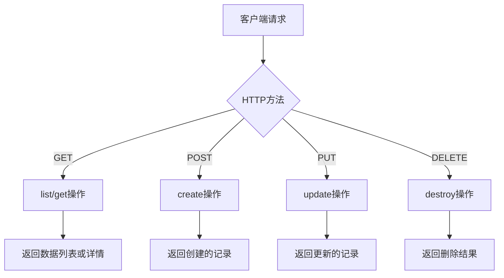
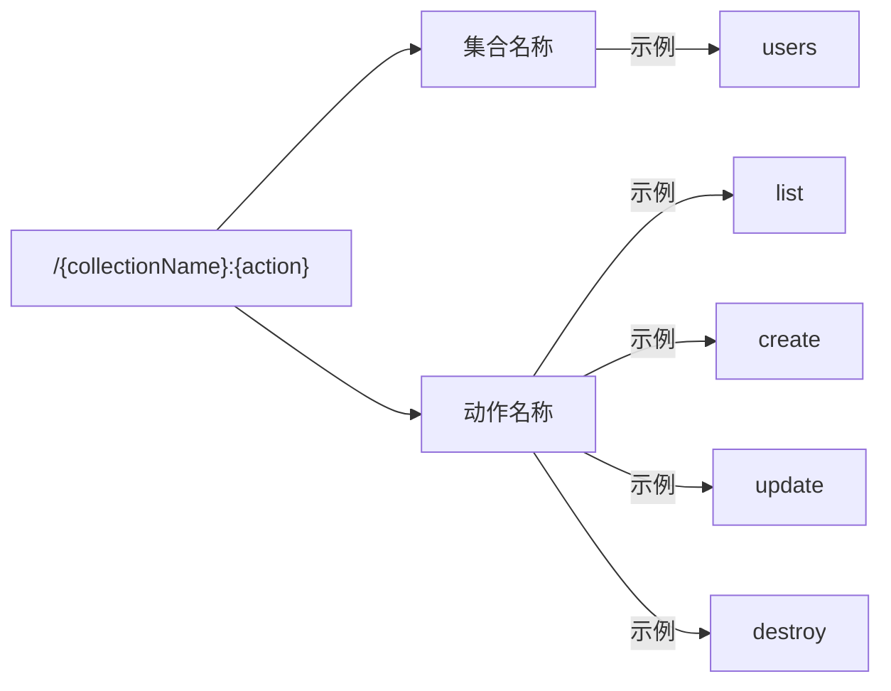
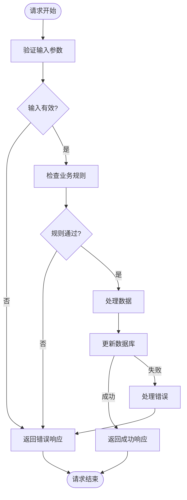
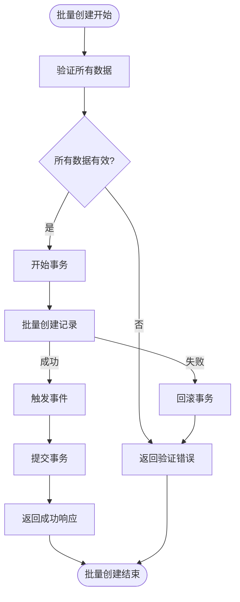
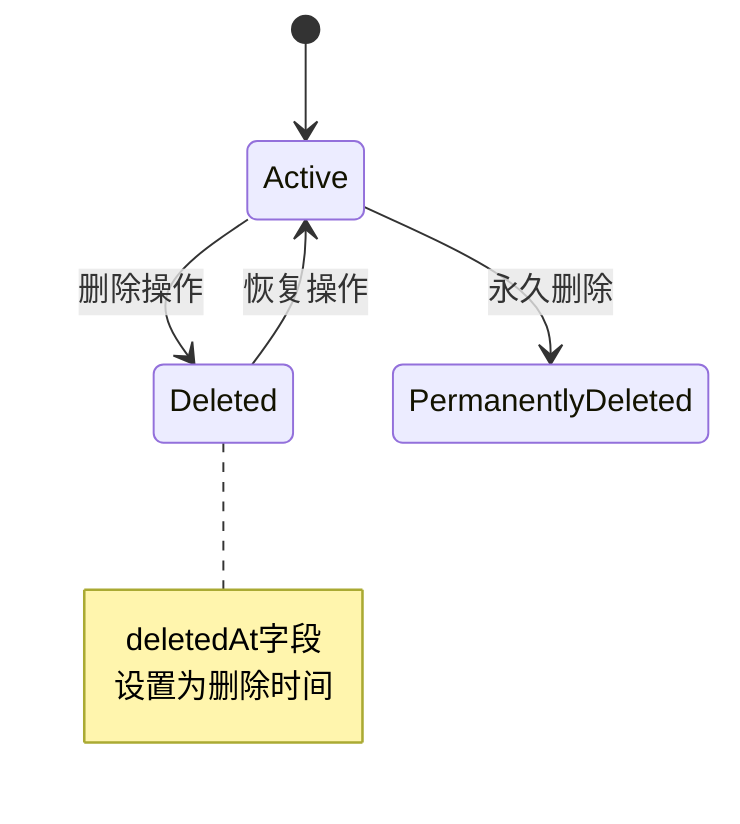
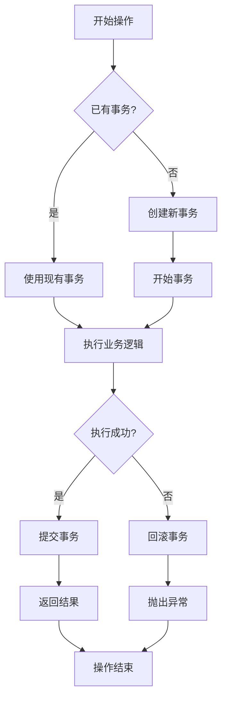

# 基础操作API

<cite>
**本文档中引用的文件**  
- [collection.ts](file://packages/core/database/src/collection.ts)
- [repository.ts](file://packages/core/database/src/repository.ts)
- [action.ts](file://packages/core/resourcer/src/action.ts)
- [resource.ts](file://packages/core/resourcer/src/resource.ts)
- [list.ts](file://packages/core/actions/src/actions/list.ts)
- [create.ts](file://packages/core/actions/src/actions/create.ts)
- [update.ts](file://packages/core/actions/src/actions/update.ts)
- [destroy.ts](file://packages/core/actions/src/actions/destroy.ts)
- [load-default-actions.ts](file://packages/core/data-source-manager/src/load-default-actions.ts)
- [swagger\helpers.ts](file://packages/plugins/@nocobase/plugin-api-doc/src/server/swagger/helpers.ts)
</cite>

## 目录
1. [简介](#简介)
2. [核心CRUD操作](#核心crud操作)
3. [HTTP方法与URL模式](#http方法与url模式)
4. [请求与响应格式](#请求与响应格式)
5. [参数约束与数据验证](#参数约束与数据验证)
6. [批量操作API](#批量操作api)
7. [数据库特殊行为](#数据库特殊行为)
8. [事务处理](#事务处理)

## 简介

NocoBase提供了一套完整的RESTful风格的基础数据操作API，支持标准的CRUD（创建、读取、更新、删除）操作。这些API通过资源（Resource）和动作（Action）的概念进行组织，为开发者提供了灵活且强大的数据管理能力。本文档详细说明了list、get、create、update、destroy等核心动作的实现机制和使用方法。

**Section sources**
- [collection.ts](file://packages/core/database/src/collection.ts#L1-L200)
- [resource.ts](file://packages/core/resourcer/src/resource.ts#L1-L126)

## 核心CRUD操作

NocoBase的基础操作API提供了以下核心动作：

- **list**: 查询记录列表
- **get**: 获取单条记录详情
- **create**: 创建新记录
- **update**: 更新现有记录
- **destroy**: 删除记录

这些操作通过`Repository`类实现，每个操作都有相应的参数约束和行为规范。API设计遵循RESTful原则，使用标准的HTTP方法进行操作。



**Diagram sources**
- [repository.ts](file://packages/core/database/src/repository.ts#L574-L837)
- [action.ts](file://packages/core/resourcer/src/action.ts#L1-L410)

**Section sources**
- [repository.ts](file://packages/core/database/src/repository.ts#L574-L837)
- [action.ts](file://packages/core/resourcer/src/action.ts#L1-L410)

## HTTP方法与URL模式

基础操作API使用标准的HTTP方法映射到相应的动作，URL模式遵循统一的格式：



具体映射关系如下：

| 动作 | HTTP方法 | URL模式 |
|------|---------|--------|
| list | GET | /{collectionName}:list |
| get | GET | /{collectionName}:get |
| create | POST | /{collectionName}:create |
| update | POST | /{collectionName}:update |
| destroy | POST | /{collectionName}:destroy |

**Diagram sources**
- [load-default-actions.ts](file://packages/core/data-source-manager/src/load-default-actions.ts#L1-L83)
- [helpers.ts](file://packages/plugins/@nocobase/plugin-api-doc/src/server/swagger/helpers.ts#L1-L67)

**Section sources**
- [load-default-actions.ts](file://packages/core/data-source-manager/src/load-default-actions.ts#L1-L83)
- [helpers.ts](file://packages/plugins/@nocobase/plugin-api-doc/src/server/swagger/helpers.ts#L1-L67)

## 请求与响应格式

### 成功响应示例

**list操作成功响应：**
```json
{
  "count": 10,
  "rows": [
    {
      "id": 1,
      "name": "示例记录",
      "createdAt": "2024-01-01T00:00:00Z",
      "updatedAt": "2024-01-01T00:00:00Z"
    }
  ],
  "page": 1,
  "pageSize": 10,
  "totalPage": 1
}
```

**create操作成功响应：**
```json
{
  "id": 1,
  "name": "新建记录",
  "createdAt": "2024-01-01T00:00:00Z",
  "updatedAt": "2024-01-01T00:00:00Z"
}
```

### 错误响应示例

**参数验证错误：**
```json
{
  "errors": [
    {
      "message": "名称不能为空",
      "code": "VALIDATION_ERROR"
    }
  ],
  "status": 400
}
```

**记录不存在错误：**
```json
{
  "errors": [
    {
      "message": "记录未找到",
      "code": "NOT_FOUND"
    }
  ],
  "status": 404
}
```

**Section sources**
- [list.ts](file://packages/core/actions/src/actions/list.ts#L1-L112)
- [create.ts](file://packages/core/actions/src/actions/create.ts#L1-L28)
- [update.ts](file://packages/core/actions/src/actions/update.ts#L1-L25)
- [destroy.ts](file://packages/core/actions/src/actions/destroy.ts#L1-L26)

## 参数约束与数据验证

### 核心参数

每个操作都支持特定的参数，这些参数用于控制查询条件、字段选择和数据处理：

- **filter**: 查询过滤条件
- **fields**: 指定返回的字段
- **appends**: 附加关联数据
- **except**: 排除的字段
- **sort**: 排序规则
- **page/pageSize**: 分页参数

### 数据验证规则

系统自动执行以下验证规则：

1. **必填字段验证**: 标记为必填的字段必须提供值
2. **数据类型验证**: 确保数据类型匹配字段定义
3. **唯一性验证**: 确保唯一字段的值不重复
4. **长度限制**: 验证字符串长度是否在允许范围内
5. **数值范围**: 验证数值是否在指定范围内



**Diagram sources**
- [repository.ts](file://packages/core/database/src/repository.ts#L645-L647)
- [collection.ts](file://packages/core/database/src/collection.ts#L30-L31)

**Section sources**
- [repository.ts](file://packages/core/database/src/repository.ts#L645-L647)
- [collection.ts](file://packages/core/database/src/collection.ts#L30-L31)

## 批量操作API

NocoBase支持批量创建和批量更新操作，这些API在处理大量数据时具有重要的性能优势。

### 批量创建

批量创建API允许一次性创建多条记录，减少了数据库连接和事务开销。



### 批量更新

批量更新API支持对符合条件的多条记录进行更新操作。

**性能考虑：**
- 使用数据库原生的批量操作提高性能
- 减少网络往返次数
- 通过事务确保数据一致性
- 支持大数量级的数据处理

**Diagram sources**
- [repository.ts](file://packages/core/database/src/repository.ts#L708-L719)
- [repository.ts](file://packages/core/database/src/repository.ts#L811-L827)

**Section sources**
- [repository.ts](file://packages/core/database/src/repository.ts#L708-L827)

## 数据库特殊行为

### 自动时间戳处理

系统自动管理记录的创建和更新时间戳：

- **createdAt**: 记录创建时自动设置，之后不再更改
- **updatedAt**: 每次记录更新时自动更新为当前时间

这些字段在数据库层面有默认值和更新触发器，确保时间戳的准确性和一致性。

### 软删除机制

NocoBase支持软删除功能，通过标记而不是物理删除记录来实现：

- 删除操作会设置`deletedAt`字段为当前时间
- 查询时自动过滤已删除的记录
- 支持恢复已删除的记录
- 保留删除历史用于审计



**Diagram sources**
- [repository.ts](file://packages/core/database/src/repository.ts#L835-L837)
- [collection.ts](file://packages/core/database/src/collection.ts#L1-L200)

**Section sources**
- [repository.ts](file://packages/core/database/src/repository.ts#L835-L837)
- [collection.ts](file://packages/core/database/src/collection.ts#L1-L200)

## 事务处理

所有数据修改操作都在事务保护下执行，确保数据的一致性和完整性。

### 事务行为

- **自动事务管理**: 大多数操作自动在事务中执行
- **嵌套事务支持**: 支持复杂的业务逻辑中的嵌套操作
- **错误回滚**: 操作失败时自动回滚所有更改
- **事件触发**: 在事务提交后触发相应的事件

### 事务装饰器

系统使用`@transaction()`装饰器来管理事务生命周期：



**Diagram sources**
- [transaction-decorator.ts](file://packages/core/database/src/decorators/transaction-decorator.ts#L39-L83)
- [repository.ts](file://packages/core/database/src/repository.ts#L655-L656)

**Section sources**
- [transaction-decorator.ts](file://packages/core/database/src/decorators/transaction-decorator.ts#L39-L83)
- [repository.ts](file://packages/core/database/src/repository.ts#L655-L656)