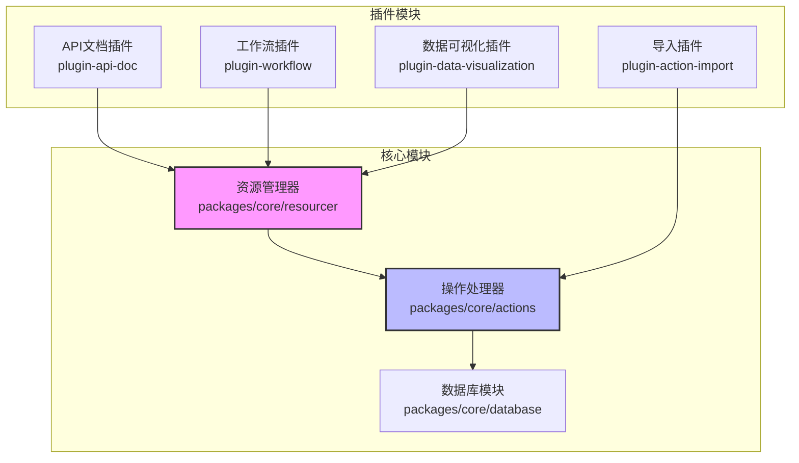
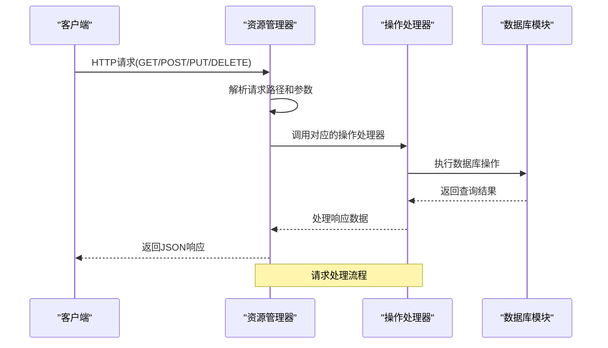
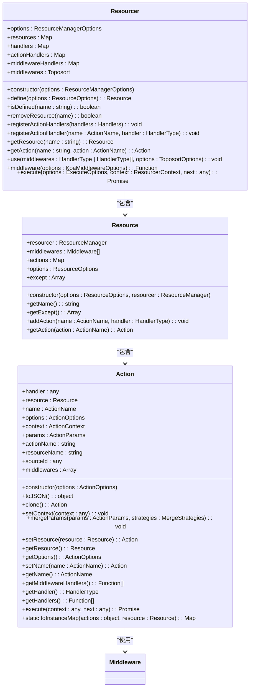
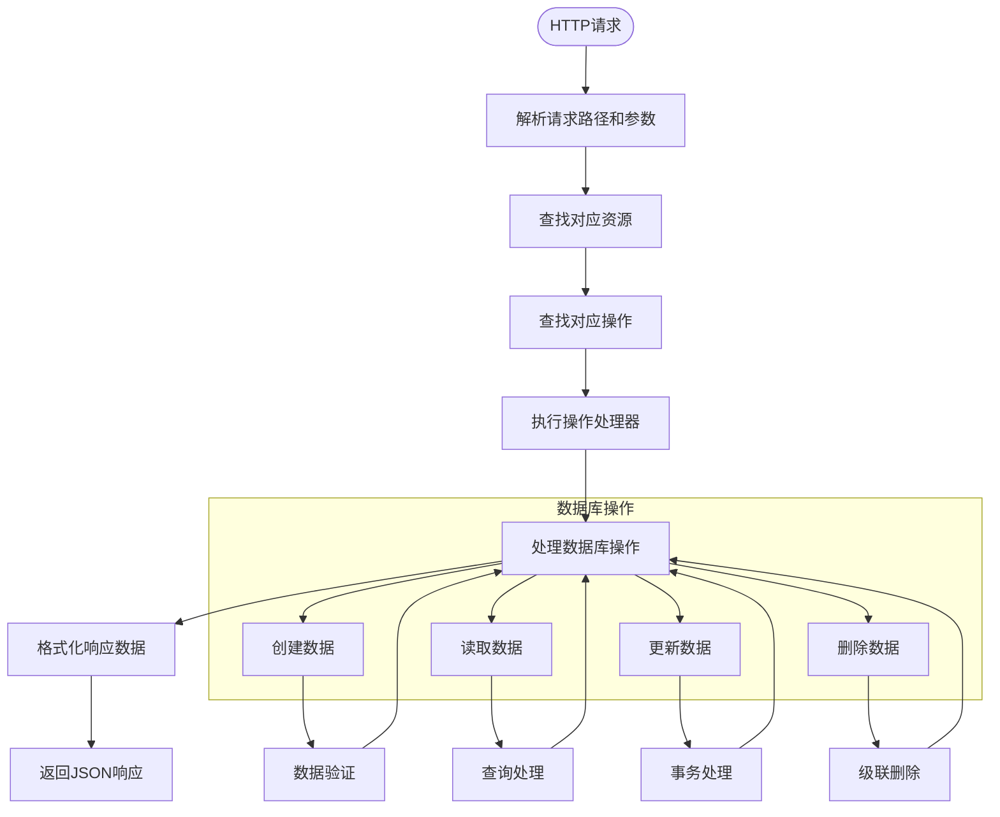
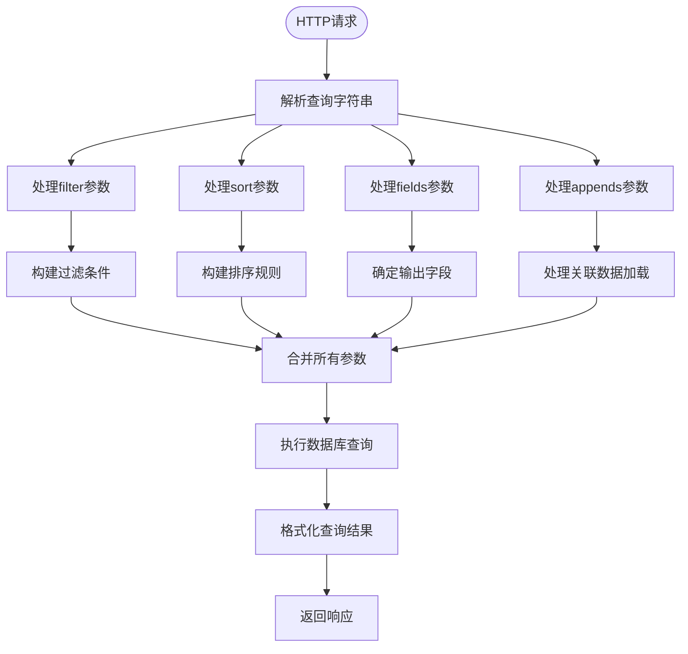
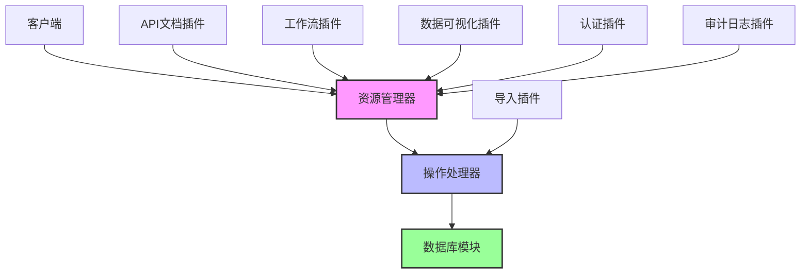

# 数据API

<cite>
**本文档中引用的文件**   
- [list.ts](file://packages/core/actions/src/actions/list.ts)
- [create.ts](file://packages/core/actions/src/actions/create.ts)
- [get.ts](file://packages/core/actions/src/actions/get.ts)
- [update.ts](file://packages/core/actions/src/actions/update.ts)
- [destroy.ts](file://packages/core/actions/src/actions/destroy.ts)
- [utils.ts](file://packages/core/resourcer/src/utils.ts)
- [resourcer.ts](file://packages/core/resourcer/src/resourcer.ts)
- [action.ts](file://packages/core/resourcer/src/action.ts)
- [resource.ts](file://packages/core/resourcer/src/resource.ts)
- [index.ts](file://packages/core/actions/src/index.ts)
- [collection.ts](file://packages/plugins/@nocobase/plugin-api-doc/src/server/swagger/collections/paths/collection.ts)
- [xlsx-importer.ts](file://packages/plugins/@nocobase/plugin-action-import/src/server/services/xlsx-importer.ts)
- [CreateInstruction.ts](file://packages/plugins/@nocobase/plugin-workflow/src/server/instructions/CreateInstruction.ts)
- [AggregateInstruction.ts](file://packages/plugins/@nocobase/plugin-workflow-aggregate/src/server/AggregateInstruction.ts)
- [query-parser.ts](file://packages/plugins/@nocobase/plugin-data-visualization/src/server/query-parser/query-parser.ts)
</cite>

## 目录
1. [简介](#简介)
2. [项目结构](#项目结构)
3. [核心组件](#核心组件)
4. [架构概述](#架构概述)
5. [详细组件分析](#详细组件分析)
6. [依赖分析](#依赖分析)
7. [性能考虑](#性能考虑)
8. [故障排除指南](#故障排除指南)
9. [结论](#结论)
10. [附录](#附录)（如有必要）

## 简介
本文档详细介绍了NocoBase平台的数据操作API，重点阐述了用于数据创建、读取、更新和删除（CRUD）操作的RESTful端点。文档解释了资源管理器如何将HTTP请求映射到数据库操作，包括list、get、create、update、destroy等动作。同时，文档还涵盖了查询参数的使用方法，如filter、sort、fields、appends等，并提供了请求和响应的JSON示例，以展示实际的数据结构。此外，文档还说明了批量操作API的使用方法和限制，记录了与数据验证、事务处理和关联数据加载相关的特殊行为，并解释了如何通过API进行复杂查询和聚合操作。

## 项目结构
NocoBase的数据API主要由核心包和插件组成，其中核心包`@nocobase/core`提供了基础的数据操作功能，而各种插件则扩展了特定的功能。数据API的核心实现位于`packages/core/resourcer`和`packages/core/actions`目录下，这些模块负责处理HTTP请求与数据库操作之间的映射。

**图示来源**
- [resourcer.ts](file://packages/core/resourcer/src/resourcer.ts)
- [actions](file://packages/core/actions/src)
- [database](file://packages/core/database/src)

**本节来源**
- [resourcer](file://packages/core/resourcer)
- [actions](file://packages/core/actions/src)
- [database](file://packages/core/database/src)

## 核心组件
NocoBase数据API的核心组件主要包括资源管理器（Resourcer）、操作处理器（Actions）和数据库模块。资源管理器负责将HTTP请求映射到相应的资源和操作，操作处理器则实现了具体的CRUD逻辑，而数据库模块提供了与底层数据库的交互能力。

**本节来源**
- [resourcer.ts](file://packages/core/resourcer/src/resourcer.ts)
- [action.ts](file://packages/core/resourcer/src/action.ts)
- [resource.ts](file://packages/core/resourcer/src/resource.ts)

## 架构概述
NocoBase的数据API采用分层架构设计，从HTTP请求到数据库操作的整个流程如下：首先，HTTP请求通过Koa中间件被资源管理器捕获；然后，资源管理器根据请求路径和方法解析出对应的资源和操作；接着，操作处理器执行具体的业务逻辑；最后，数据库模块完成实际的数据存取操作。

**图示来源**
- [resourcer.ts](file://packages/core/resourcer/src/resourcer.ts)
- [action.ts](file://packages/core/resourcer/src/action.ts)
- [actions](file://packages/core/actions/src)

## 详细组件分析
本节将深入分析NocoBase数据API的各个关键组件，包括CRUD操作的实现细节、查询参数的处理机制以及特殊行为的实现。

### CRUD操作分析
NocoBase通过统一的资源管理器模式实现了标准化的CRUD操作。每个操作都对应一个特定的HTTP端点，并通过预定义的动作处理器来执行。

#### CRUD操作类图

**图示来源**
- [resourcer.ts](file://packages/core/resourcer/src/resourcer.ts)
- [resource.ts](file://packages/core/resourcer/src/resource.ts)
- [action.ts](file://packages/core/resourcer/src/action.ts)

#### CRUD操作流程图

**图示来源**
- [resourcer.ts](file://packages/core/resourcer/src/resourcer.ts)
- [actions](file://packages/core/actions/src)

**本节来源**
- [resourcer.ts](file://packages/core/resourcer/src/resourcer.ts)
- [action.ts](file://packages/core/resourcer/src/action.ts)
- [resource.ts](file://packages/core/resourcer/src/resource.ts)
- [actions](file://packages/core/actions/src)

### 查询参数处理
NocoBase支持丰富的查询参数，允许客户端对数据进行灵活的筛选、排序和字段控制。这些参数通过HTTP查询字符串传递，并在服务器端被解析和应用。

#### 查询参数处理流程

**图示来源**
- [utils.ts](file://packages/core/resourcer/src/utils.ts)
- [options-parser.ts](file://packages/core/database/src/options-parser.ts)

**本节来源**
- [utils.ts](file://packages/core/resourcer/src/utils.ts)
- [options-parser.ts](file://packages/core/database/src/options-parser.ts)

## 依赖分析
NocoBase数据API的各个组件之间存在明确的依赖关系。资源管理器依赖于操作处理器来执行具体的业务逻辑，而操作处理器又依赖于数据库模块来完成数据存取。同时，各种插件通过扩展机制与核心模块集成，提供了额外的功能。

**图示来源**
- [resourcer.ts](file://packages/core/resourcer/src/resourcer.ts)
- [actions](file://packages/core/actions/src)
- [database](file://packages/core/database/src)
- [plugins](file://packages/plugins)

**本节来源**
- [resourcer.ts](file://packages/core/resourcer/src/resourcer.ts)
- [actions](file://packages/core/actions/src)
- [database](file://packages/core/database/src)
- [plugins](file://packages/plugins)

## 性能考虑
在设计和使用NocoBase数据API时，需要考虑以下几个性能方面的因素：

1. **分页处理**：对于大量数据的查询，应使用分页参数（page和pageSize）来限制返回结果的数量，避免一次性加载过多数据导致性能问题。
2. **字段选择**：通过fields参数精确指定需要返回的字段，避免不必要的数据传输。
3. **关联数据加载**：合理使用appends参数来控制关联数据的加载，避免N+1查询问题。
4. **索引优化**：确保数据库中的常用查询字段已建立适当的索引，以提高查询效率。
5. **缓存机制**：对于不经常变化的数据，可以考虑使用缓存来减少数据库查询次数。

**本节来源**
- [list.ts](file://packages/core/actions/src/actions/list.ts)
- [database](file://packages/core/database/src)

## 故障排除指南
在使用NocoBase数据API时，可能会遇到一些常见问题。以下是一些故障排除的建议：

1. **请求失败**：检查请求路径和参数是否正确，确保资源名称和操作名称拼写无误。
2. **权限问题**：确认当前用户是否有执行相应操作的权限，检查ACL配置。
3. **数据验证错误**：检查请求体中的数据是否符合模型定义的约束条件，如必填字段、数据类型等。
4. **性能问题**：如果查询响应缓慢，检查是否缺少必要的数据库索引，或考虑优化查询条件。
5. **关联数据问题**：当加载关联数据时出现问题，检查关联关系的配置是否正确，以及相关资源是否存在。

**本节来源**
- [actions](file://packages/core/actions/src)
- [acl](file://packages/core/acl/src)
- [database](file://packages/core/database/src)

## 结论
NocoBase提供了一套完整且灵活的数据操作API，通过资源管理器模式实现了标准化的CRUD操作。该API支持丰富的查询参数，允许客户端对数据进行精细的控制。同时，通过插件机制，NocoBase能够轻松扩展功能，满足各种复杂的业务需求。开发者可以利用这套API快速构建高效的数据驱动应用。