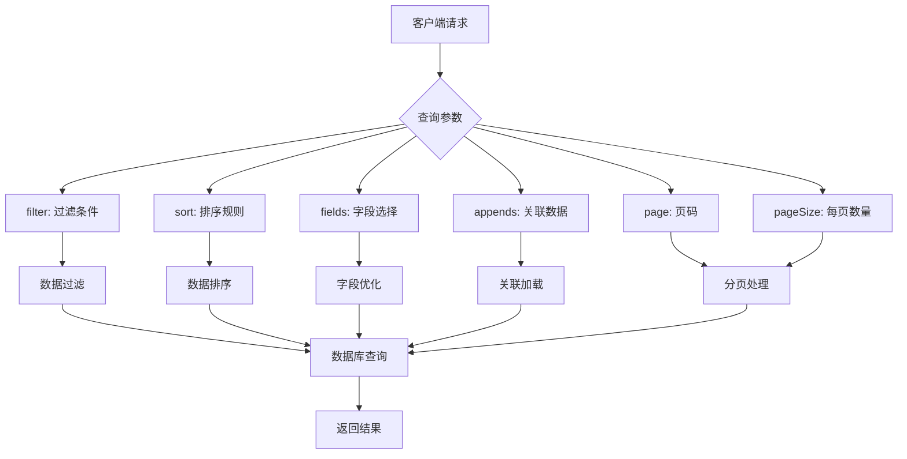
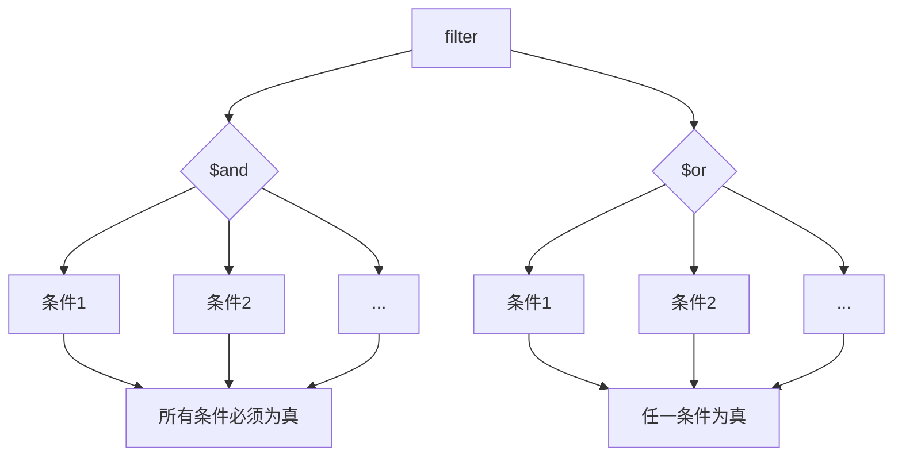
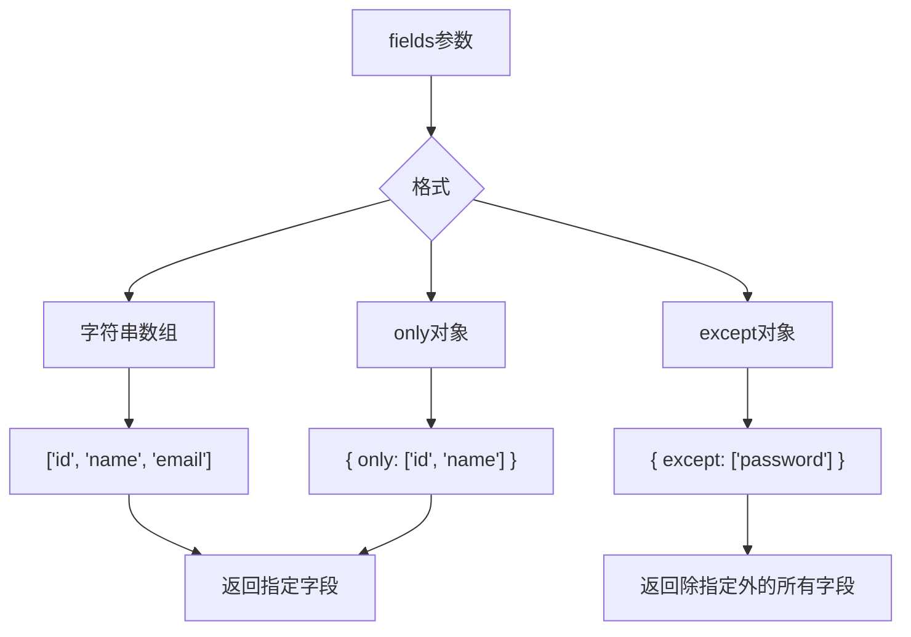
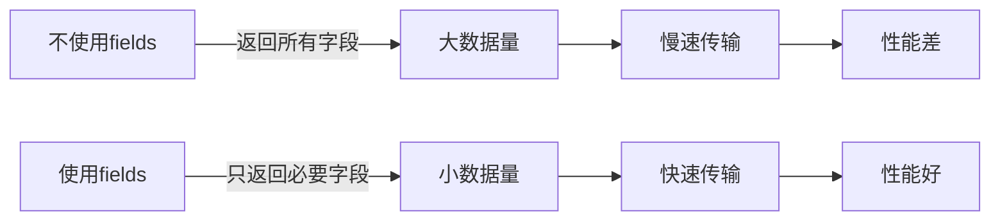
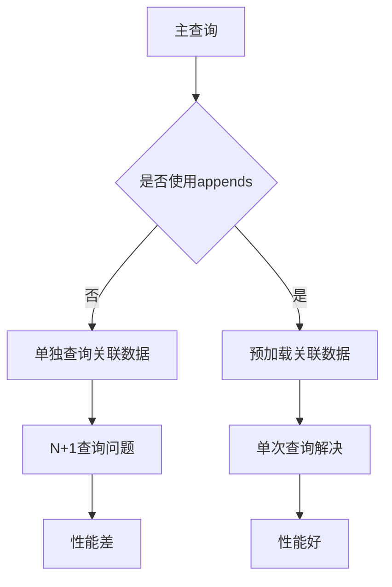
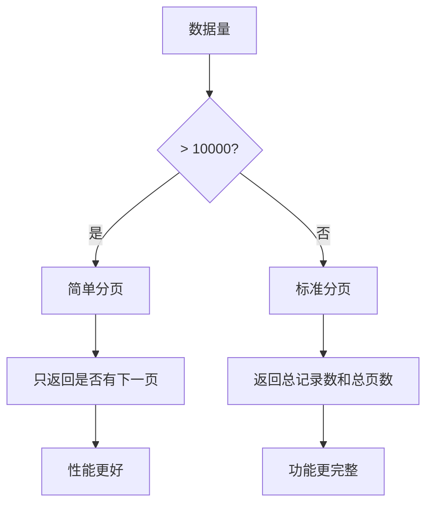

# 查询参数API

<cite>
**本文档引用的文件**  
- [action.ts](file://packages/core/resourcer/src/action.ts)
- [list.ts](file://packages/core/data-source-manager/src/default-actions/list.ts)
- [filter-match.ts](file://packages/core/database/src/filter-match.ts)
- [index.ts](file://packages/core/database/src/operators/index.ts)
- [empty.ts](file://packages/core/database/src/operators/empty.ts)
- [in.ts](file://packages/core/database/src/operators/in.ts)
- [notIn.ts](file://packages/core/database/src/operators/notIn.ts)
- [eq.ts](file://packages/core/database/src/operators/eq.ts)
- [ne.ts](file://packages/core/database/src/operators/ne.ts)
- [date.ts](file://packages/core/database/src/operators/date.ts)
- [array.ts](file://packages/core/database/src/operators/array.ts)
- [string.ts](file://packages/core/database/src/operators/string.ts)
- [boolean.ts](file://packages/core/database/src/operators/boolean.ts)
- [child-collection.ts](file://packages/core/database/src/operators/child-collection.ts)
- [association.ts](file://packages/core/database/src/operators/association.ts)
- [utils.ts](file://packages/core/data-source-manager/src/default-actions/utils.ts)
</cite>

## 目录
1. [简介](#简介)
2. [查询参数概述](#查询参数概述)
3. [filter参数详解](#filter参数详解)
4. [排序规则](#排序规则)
5. [字段选择](#字段选择)
6. [关联数据加载](#关联数据加载)
7. [分页控制](#分页控制)
8. [复杂查询组合示例](#复杂查询组合示例)

## 简介
NocoBase提供了一套强大的查询参数API，允许用户通过HTTP请求参数对数据进行精确的过滤、排序、字段选择和分页操作。本文档详细说明了filter、sort、fields、appends、page和pageSize等核心查询参数的使用方法和语法。

**Section sources**
- [action.ts](file://packages/core/resourcer/src/action.ts#L28-L125)

## 查询参数概述
NocoBase的查询参数API支持多种参数来控制数据查询行为。这些参数可以通过URL查询字符串或请求体传递，为数据检索提供了极大的灵活性。



**Diagram sources**
- [action.ts](file://packages/core/resourcer/src/action.ts#L28-L125)
- [list.ts](file://packages/core/data-source-manager/src/default-actions/list.ts#L36-L38)

## filter参数详解
filter参数是NocoBase查询API中最强大的功能之一，支持复杂的逻辑和比较操作符来构建精确的过滤条件。

### 逻辑操作符
filter参数支持$and和$or逻辑操作符来组合多个条件。



**Diagram sources**
- [filter-match.ts](file://packages/core/database/src/filter-match.ts#L45-L46)

### 比较操作符
NocoBase支持多种比较操作符用于字段值的比较。

| 操作符 | 描述 | 示例 |
|--------|------|------|
| $eq | 等于 | `filter[name][$eq]=John` |
| $ne | 不等于 | `filter[name][$ne]=John` |
| $gt | 大于 | `filter[age][$gt]=18` |
| $gte | 大于等于 | `filter[age][$gte]=18` |
| $lt | 小于 | `filter[age][$lt]=65` |
| $lte | 小于等于 | `filter[age][$lte]=65` |
| $in | 在列表中 | `filter[status][$in]=active,inactive` |
| $notIn | 不在列表中 | `filter[status][$notIn]=deleted` |
| $empty | 为空 | `filter[email][$empty]=true` |
| $notEmpty | 不为空 | `filter[email][$notEmpty]=true` |

**Section sources**
- [filter-match.ts](file://packages/core/database/src/filter-match.ts#L16-L44)
- [index.ts](file://packages/core/database/src/operators/index.ts#L22-L34)

### 嵌套查询构建
filter参数支持嵌套查询，可以对关联数据进行过滤。

```mermaid
flowchart TD
A[主表] --> B{关联表}
B --> C[一对一关联]
B --> D[一对多关联]
B --> E[多对多关联]
C --> F[filter[关联字段.属性]]
D --> G[filter[关联字段.属性]]
E --> H[filter[关联字段.属性]]
F --> I[单个关联对象过滤]
G --> J[多个关联对象过滤]
H --> K[通过中间表过滤]
```

**Diagram sources**
- [association.ts](file://packages/core/database/src/operators/association.ts)
- [child-collection.ts](file://packages/core/database/src/operators/child-collection.ts)

## 排序规则
sort参数用于指定查询结果的排序方式，支持单字段和多字段排序。

### 排序语法
sort参数接受一个字符串数组，每个元素代表一个排序字段，前缀`-`表示降序。

```mermaid
flowchart TD
A[sort参数] --> B{排序字段}
B --> C[字段名]
B --> D[-字段名]
C --> E[升序排序]
D --> F[降序排序]
A --> G[多字段排序]
G --> H[sort[0]: 字段1]
G --> I[sort[1]: 字段2]
G --> J[...]
H --> K[先按字段1排序]
I --> L[再按字段2排序]
J --> M[依此类推]
```

**Diagram sources**
- [action.ts](file://packages/core/resourcer/src/action.ts#L92-L93)
- [list.ts](file://packages/core/data-source-manager/src/default-actions/list.ts#L36)

### 多字段排序示例
```json
// 按创建时间降序，然后按名称升序
{
  "sort": ["-createdAt", "name"]
}
```

**Section sources**
- [action.ts](file://packages/core/resourcer/src/action.ts#L158-L159)

## 字段选择
fields参数用于优化查询性能，只返回指定的字段。

### 字段选择语法
fields参数支持多种格式来指定需要返回的字段。



**Diagram sources**
- [action.ts](file://packages/core/resourcer/src/action.ts#L75-L80)
- [action.ts](file://packages/core/resourcer/src/action.ts#L139-L144)

### 性能优化
使用fields参数可以显著减少网络传输数据量和提高查询性能。



**Section sources**
- [action.ts](file://packages/core/resourcer/src/action.ts#L62-L74)

## 关联数据加载
appends参数用于加载关联数据，避免N+1查询问题。

### 关联加载机制
appends参数通过预加载关联数据来优化查询性能。



**Diagram sources**
- [action.ts](file://packages/core/resourcer/src/action.ts#L77)
- [action.ts](file://packages/core/resourcer/src/action.ts#L141)

### 关联路径语法
appends参数支持点号分隔的路径来指定深层关联。

```json
// 加载用户及其角色和权限
{
  "appends": ["roles", "roles.permissions"]
}
```

**Section sources**
- [options-parser.ts](file://packages/core/database/src/options-parser.ts#L378-L422)

## 分页控制
page和pageSize参数用于实现分页功能，控制查询结果的分页行为。

### 分页参数
| 参数 | 描述 | 默认值 |
|------|------|--------|
| page | 当前页码 | 1 |
| pageSize | 每页记录数 | 50 |
| paginate | 是否分页 | true |

```mermaid
flowchart TD
A[分页参数] --> B[page]
A --> C[pageSize]
A --> D[paginate]
B --> E[页码计算]
C --> F[偏移量计算]
D --> G{是否分页}
G --> |true| H[分页结果]
G --> |false| I[全部结果]
E --> J[offset = (page-1) * pageSize]
F --> J
J --> K[数据库查询]
```

**Diagram sources**
- [list.ts](file://packages/core/data-source-manager/src/default-actions/list.ts#L42-L43)
- [utils.ts](file://packages/core/data-source-manager/src/default-actions/utils.ts#L10-L21)

### 简单分页模式
当数据量很大时，系统会自动切换到简单分页模式以提高性能。



**Section sources**
- [list.ts](file://packages/core/data-source-manager/src/default-actions/list.ts#L60-L77)

## 复杂查询组合示例
以下示例展示了如何组合使用各种查询参数来实现复杂的查询需求。

### 综合查询示例
```json
{
  "filter": {
    "$and": [
      { "status": { "$eq": "active" } },
      { "age": { "$gte": 18 } },
      { "$or": [
        { "department.name": { "$eq": "IT" } },
        { "salary": { "$gt": 50000 } }
      ]}
    ]
  },
  "sort": ["-createdAt", "name"],
  "fields": ["id", "name", "email", "department.name"],
  "appends": ["department", "roles"],
  "page": 2,
  "pageSize": 25
}
```

**Section sources**
- [action.ts](file://packages/core/resourcer/src/action.ts#L28-L125)
- [list.ts](file://packages/core/data-source-manager/src/default-actions/list.ts#L36-L38)

### API请求示例
```http
GET /api/users?filter[status][$eq]=active&filter[age][$gte]=18&sort=-createdAt,name&fields=id,name,email&appends=department,roles&page=2&pageSize=25
```

**Section sources**
- [action.ts](file://packages/core/resourcer/src/action.ts#L28-L125)