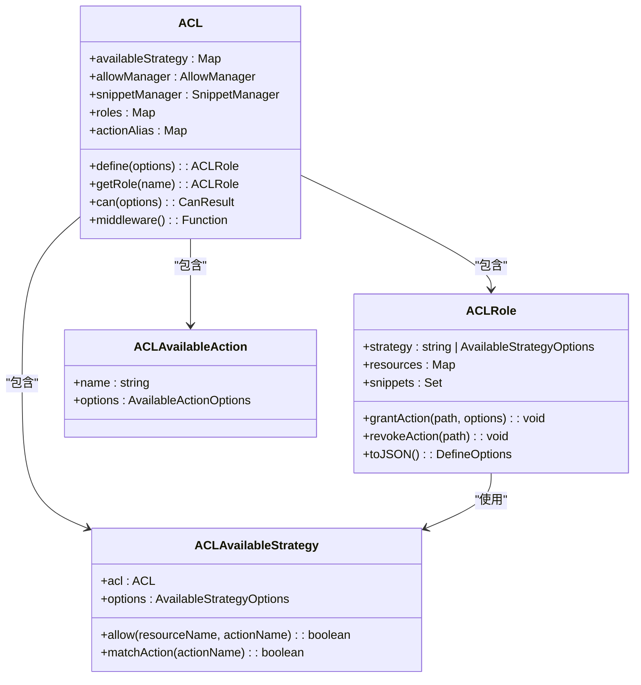
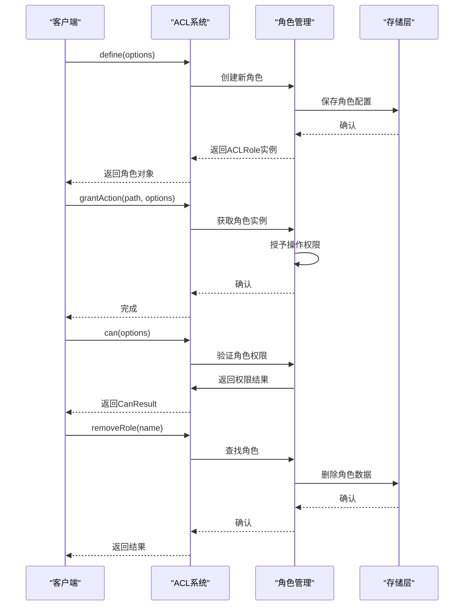
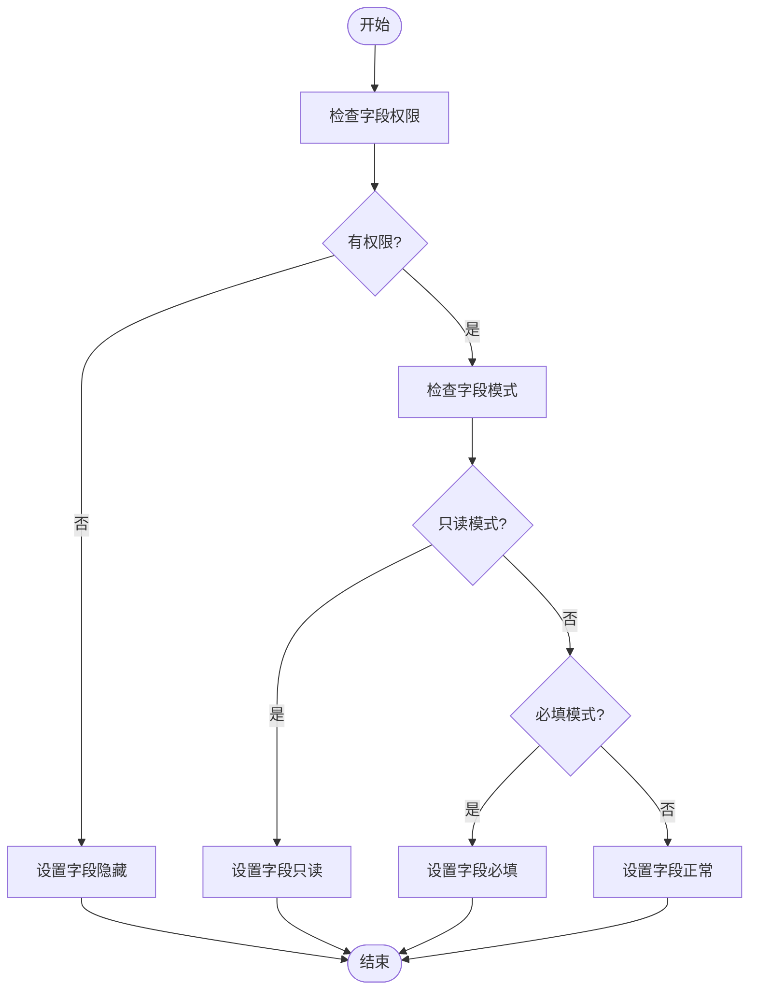
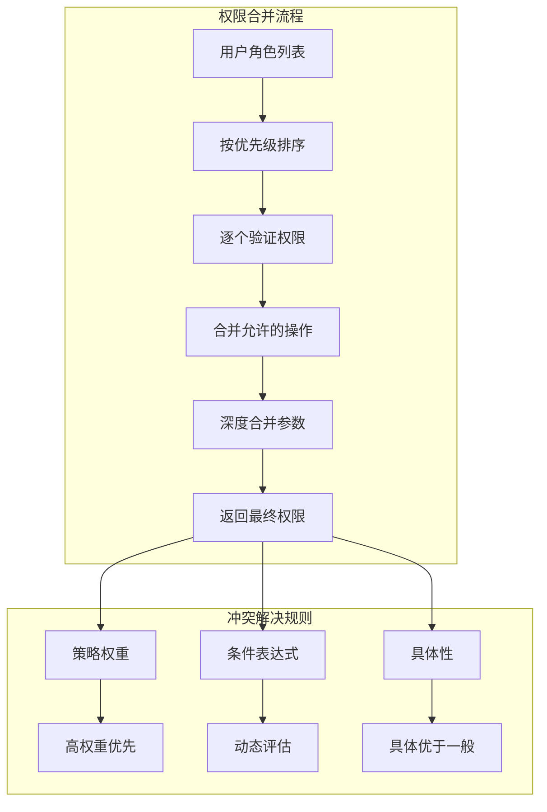
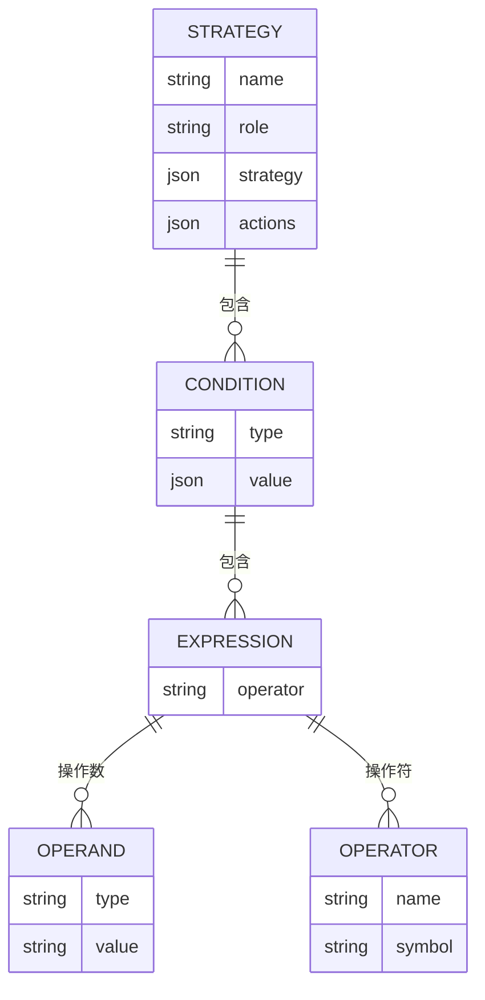
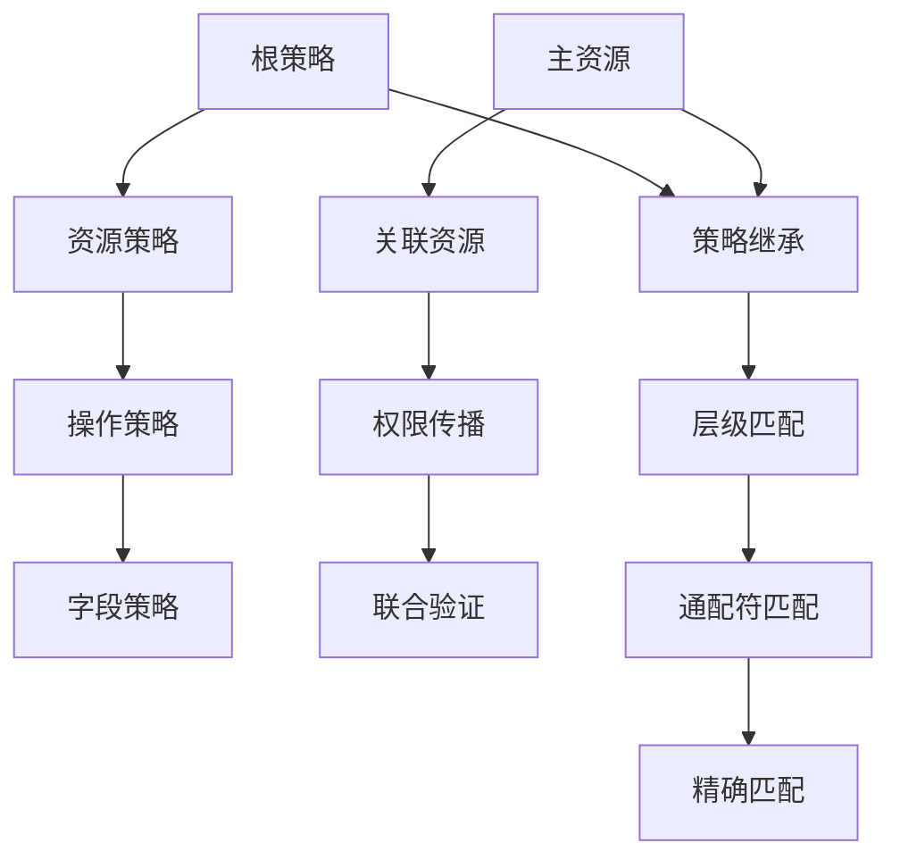
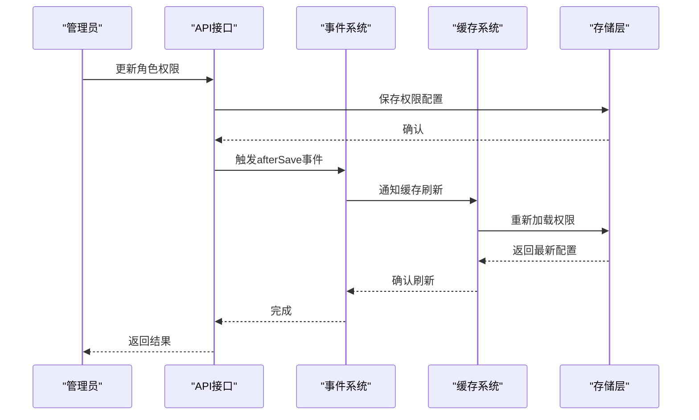

# 权限策略API

<cite>
**本文档引用的文件**
- [acl.ts](file://packages/core/acl/src/acl.ts)
- [acl-role.ts](file://packages/core/acl/src/acl-role.ts)
- [acl-available-strategy.ts](file://packages/core/acl/src/acl-available-strategy.ts)
- [acl-available-action.ts](file://packages/core/acl/src/acl-available-action.ts)
- [server.ts](file://packages/plugins/@nocobase/plugin-acl/src/server/server.ts)
- [ACLProvider.tsx](file://packages/core/client/src/acl/ACLProvider.tsx)
</cite>

## 目录
1. [简介](#简介)
2. [权限策略API概述](#权限策略api概述)
3. [策略的创建、更新、删除和查询](#策略的创建更新删除和查询)
4. [字段级别权限控制](#字段级别权限控制)
5. [权限策略优先级与冲突解决](#权限策略优先级与冲突解决)
6. [条件表达式与动态权限规则](#条件表达式与动态权限规则)
7. [权限策略继承与作用域传播](#权限策略继承与作用域传播)
8. [策略缓存与刷新机制](#策略缓存与刷新机制)
9. [总结](#总结)

## 简介

NocoBase权限系统提供了一套完整的权限策略API，用于管理基于角色的访问控制（RBAC）。该系统允许通过API对权限策略进行细粒度的配置，包括资源、操作和条件的定义。权限策略支持字段级别的控制，如只读、隐藏和必填字段的配置。系统实现了复杂的优先级处理机制和冲突解决规则，并支持基于用户属性、时间条件和数据状态的动态权限逻辑。本文档详细说明了权限策略API的各个方面，为开发者提供全面的参考。

**Section sources**
- [acl.ts](file://packages/core/acl/src/acl.ts#L1-L603)
- [server.ts](file://packages/plugins/@nocobase/plugin-acl/src/server/server.ts#L1-L685)

## 权限策略API概述

NocoBase的权限策略API基于ACL（访问控制列表）系统构建，核心功能由`ACL`类实现。该系统通过角色（Role）来组织权限，每个角色可以定义对特定资源的操作权限。权限策略的定义包括资源、操作和条件三个核心要素。系统支持通过API创建、更新、删除和查询权限策略，同时提供了字段级别的权限控制能力。

权限系统的核心组件包括：
- **ACL类**：权限系统的核心管理器，负责权限的验证和策略的管理
- **ACLRole类**：表示角色，包含角色的权限配置
- **AvailableStrategy**：可用策略的定义，用于配置默认的权限行为
- **AvailableAction**：可用操作的定义，用于配置系统支持的操作类型

权限验证流程通过中间件实现，在请求处理过程中自动验证用户权限，并根据策略配置合并请求参数。

**Diagram sources**
- [acl.ts](file://packages/core/acl/src/acl.ts#L66-L603)
- [acl-role.ts](file://packages/core/acl/src/acl-role.ts#L33-L215)
- [acl-available-strategy.ts](file://packages/core/acl/src/acl-available-strategy.ts#L34-L81)
- [acl-available-action.ts](file://packages/core/acl/src/acl-available-action.ts#L24-L27)

**Section sources**
- [acl.ts](file://packages/core/acl/src/acl.ts#L66-L603)
- [acl-role.ts](file://packages/core/acl/src/acl-role.ts#L33-L215)

## 策略的创建、更新、删除和查询

权限策略的管理通过ACL系统提供的API接口实现。策略的创建通过`define`方法完成，该方法接受角色定义选项，包括角色名称、策略配置、操作权限和代码片段等。每个策略都与特定的角色关联，通过角色来应用权限控制。

策略的更新可以通过直接修改角色的权限配置来实现。系统提供了`grantAction`和`revokeAction`方法来授予或撤销特定操作的权限。这些操作可以针对特定的资源和操作组合进行配置。

策略的删除通过`removeRole`方法实现，该方法从ACL系统中移除指定角色的所有权限配置。当角色被删除时，与其关联的所有权限策略也会被清除。

策略的查询功能通过`getRole`和`getRoles`方法提供，可以获取特定角色或多个角色的权限配置。`can`方法用于检查特定角色是否具有对某个资源的特定操作权限，返回包含权限详情的结果对象。

**Diagram sources**
- [acl.ts](file://packages/core/acl/src/acl.ts#L151-L180)
- [acl-role.ts](file://packages/core/acl/src/acl-role.ts#L82-L107)
- [server.ts](file://packages/plugins/@nocobase/plugin-acl/src/server/server.ts#L79-L98)

**Section sources**
- [acl.ts](file://packages/core/acl/src/acl.ts#L151-L180)
- [acl-role.ts](file://packages/core/acl/src/acl-role.ts#L82-L107)

## 字段级别权限控制

NocoBase权限系统提供了精细的字段级别权限控制功能，允许对特定字段设置不同的访问权限。字段权限控制主要通过策略参数中的`fields`、`whitelist`和`blacklist`属性实现。系统支持三种主要的字段控制模式：只读字段、隐藏字段和必填字段。

只读字段通过在策略中排除字段的更新权限来实现。当用户尝试更新只读字段时，系统会自动过滤掉这些字段的修改。隐藏字段通过从查询结果中排除特定字段来实现，确保敏感数据不会暴露给无权限的用户。必填字段则通过验证机制确保在创建或更新记录时必须提供特定字段的值。

字段权限的配置在客户端通过`ACLProvider`组件实现。该组件根据用户的权限配置，动态调整表单字段的显示状态和验证规则。当字段不在用户的权限白名单中时，字段将被隐藏或设置为只读状态。

**Diagram sources**
- [ACLProvider.tsx](file://packages/core/client/src/acl/ACLProvider.tsx#L355-L417)
- [acl.ts](file://packages/core/acl/src/acl.ts#L115-L121)

**Section sources**
- [ACLProvider.tsx](file://packages/core/client/src/acl/ACLProvider.tsx#L355-L417)
- [acl.ts](file://packages/core/acl/src/acl.ts#L115-L121)

## 权限策略优先级与冲突解决

NocoBase权限系统实现了复杂的优先级处理机制和冲突解决规则，确保在多个策略同时作用时能够产生一致且可预测的结果。系统的优先级处理遵循"具体优于一般"的原则，即针对特定资源和操作的策略优先于通配符策略。

当多个角色同时作用于一个用户时，系统会按照角色的优先级顺序合并权限。权限合并遵循"取并集"的原则，即只要有一个角色允许某项操作，该操作就被允许。对于参数的合并，系统采用深度合并策略，确保所有角色的权限参数都被正确应用。

冲突解决机制主要通过策略权重和条件表达式实现。系统支持为策略设置权重值，权重较高的策略优先级更高。条件表达式允许基于运行时环境动态决定策略的有效性，从而解决静态配置无法处理的复杂场景。

**Diagram sources**
- [acl.ts](file://packages/core/acl/src/acl.ts#L224-L241)
- [acl-role.ts](file://packages/core/acl/src/acl-role.ts#L149-L175)

**Section sources**
- [acl.ts](file://packages/core/acl/src/acl.ts#L224-L241)
- [acl-role.ts](file://packages/core/acl/src/acl-role.ts#L149-L175)

## 条件表达式与动态权限规则

NocoBase权限系统支持通过条件表达式实现动态权限规则，允许基于用户属性、时间条件和数据状态等上下文信息进行复杂的权限决策。条件表达式通过`parseJsonTemplate`方法解析，支持模板语法和变量替换。

系统内置了多种预定义的条件谓词，如`own`和`all`，分别表示"仅自己的记录"和"所有记录"。这些谓词通过模板变量`{{ ctx.state.currentUser.id }}`实现用户上下文的绑定。开发者还可以注册自定义的条件函数，以支持更复杂的业务逻辑。

动态权限规则的配置通过策略参数中的`filter`属性实现。过滤条件可以包含逻辑运算符（如`$and`、`$or`）和比较操作符，支持对数据字段进行复杂的查询条件设置。系统在权限验证时会自动解析这些条件表达式，并与当前请求上下文进行匹配。

**Diagram sources**
- [acl.ts](file://packages/core/acl/src/acl.ts#L359-L378)
- [acl-available-strategy.ts](file://packages/core/acl/src/acl-available-strategy.ts#L25-L32)

**Section sources**
- [acl.ts](file://packages/core/acl/src/acl.ts#L359-L378)
- [acl-available-strategy.ts](file://packages/core/acl/src/acl-available-strategy.ts#L25-L32)

## 权限策略继承与作用域传播

NocoBase权限系统实现了策略继承和作用域传播机制，确保权限配置能够在相关资源之间正确传递。策略继承允许子资源自动继承父资源的权限配置，减少重复配置的工作量。作用域传播确保在关联操作中，权限检查能够跨越资源边界进行。

策略继承通过资源名称的层级结构实现。例如，名为`posts.comments`的资源会继承`posts`资源的权限策略。系统在权限验证时会检查资源的完整路径，并逐级向上查找匹配的策略配置。

作用域传播主要在关联操作中体现。当用户对一个资源的关联数据进行操作时，系统会同时检查主资源和关联资源的权限。例如，在查看文章评论时，系统会验证用户是否有权查看文章本身以及是否有权查看评论。

**Diagram sources**
- [acl.ts](file://packages/core/acl/src/acl.ts#L278-L293)
- [server.ts](file://packages/plugins/@nocobase/plugin-acl/src/server/server.ts#L642-L646)

**Section sources**
- [acl.ts](file://packages/core/acl/src/acl.ts#L278-L293)
- [server.ts](file://packages/plugins/@nocobase/plugin-acl/src/server/server.ts#L642-L646)

## 策略缓存与刷新机制

NocoBase权限系统实现了高效的策略缓存机制，以提高权限验证的性能。系统将角色的权限配置缓存在内存中，并在角色或权限配置发生变化时自动刷新缓存。缓存机制减少了数据库查询的次数，显著提升了系统的响应速度。

缓存刷新通过事件驱动机制实现。当角色、资源或操作权限发生变化时，系统会触发相应的事件，通知ACL系统更新缓存。例如，当角色的权限被修改时，`roles.afterSaveWithAssociations`事件会被触发，导致相关角色的权限缓存被刷新。

系统还提供了显式的缓存管理API，允许管理员手动刷新权限缓存。这对于在批量更新权限配置后立即生效的场景非常有用。缓存管理考虑了分布式环境下的同步问题，确保在多节点部署时各节点的权限状态保持一致。

**Diagram sources**
- [server.ts](file://packages/plugins/@nocobase/plugin-acl/src/server/server.ts#L204-L250)
- [server.ts](file://packages/plugins/@nocobase/plugin-acl/src/server/server.ts#L342-L355)

**Section sources**
- [server.ts](file://packages/plugins/@nocobase/plugin-acl/src/server/server.ts#L204-L250)
- [server.ts](file://packages/plugins/@nocobase/plugin-acl/src/server/server.ts#L342-L355)

## 总结

NocoBase权限策略API提供了一套完整且灵活的权限管理系统，支持从基本的CRUD操作到复杂的动态权限规则的配置。系统通过角色为基础的权限模型，实现了资源、操作和条件的细粒度控制。字段级别的权限控制功能使得敏感数据的保护更加精确。

权限策略的优先级处理和冲突解决机制确保了在复杂场景下的行为一致性。条件表达式和动态规则的支持使得权限系统能够适应各种业务需求。策略继承和作用域传播机制减少了配置的复杂性，提高了系统的可维护性。

高效的缓存和刷新机制保证了系统的性能，即使在大规模部署环境下也能保持快速的响应。整体而言，NocoBase的权限策略API为构建安全可靠的应用程序提供了坚实的基础。