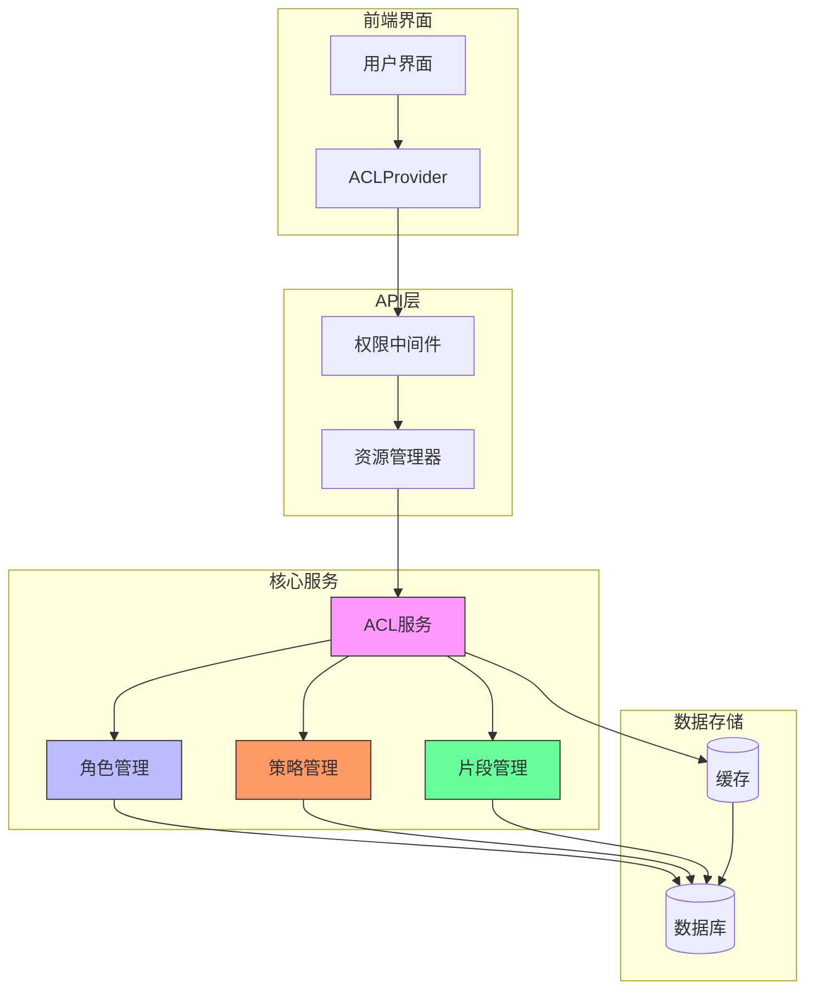
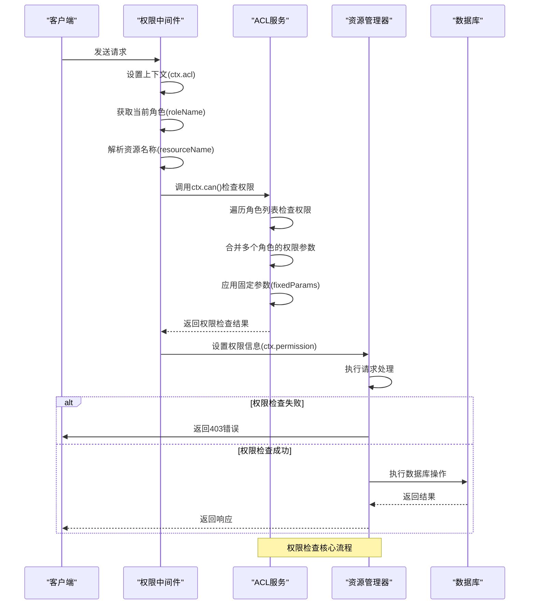
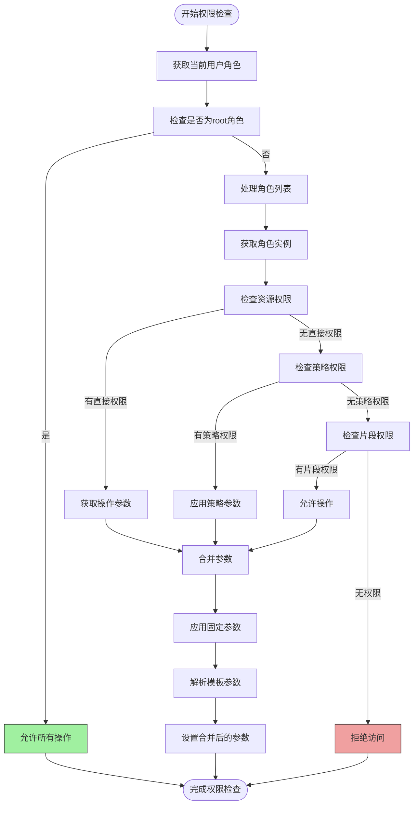
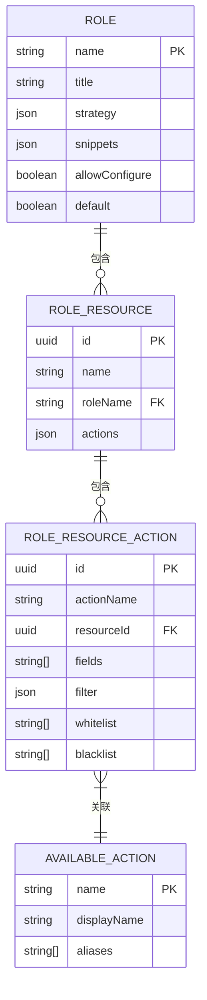
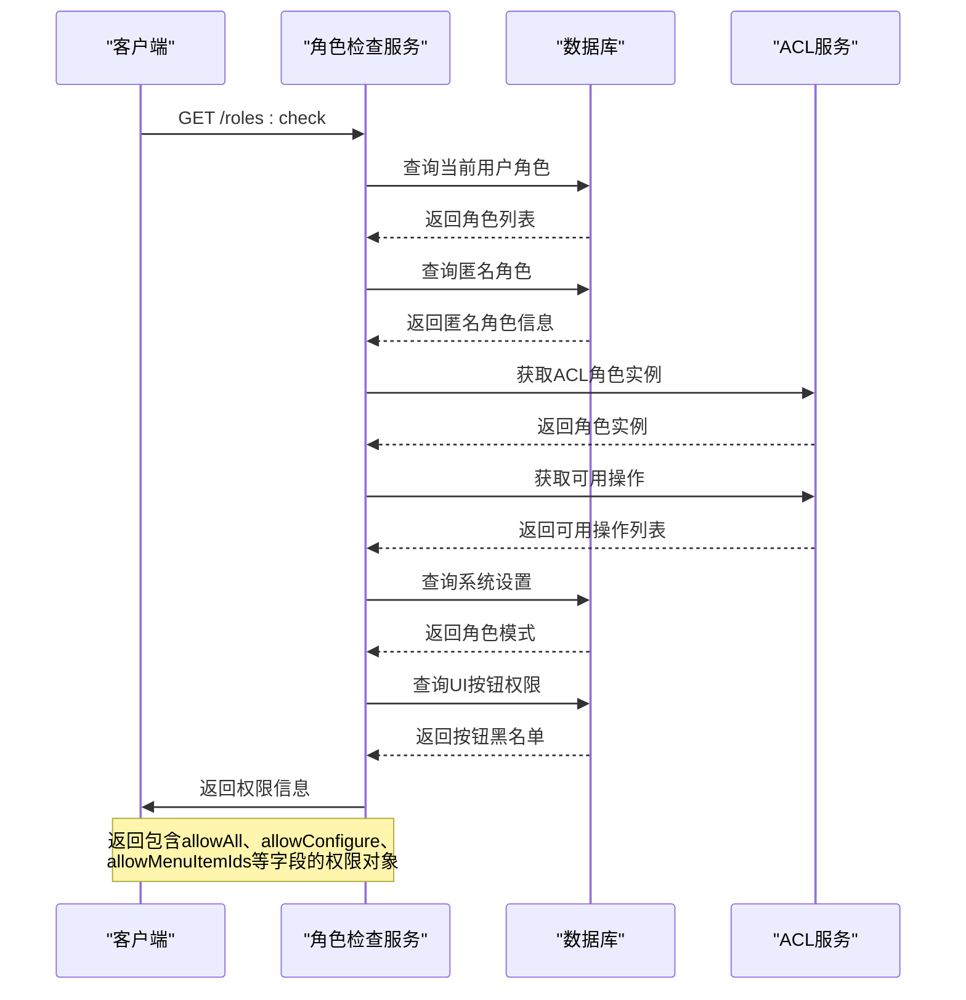
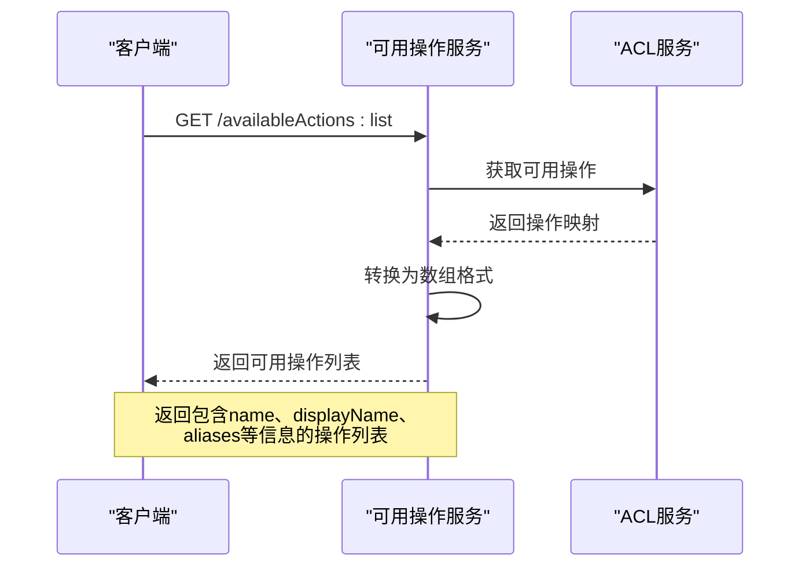
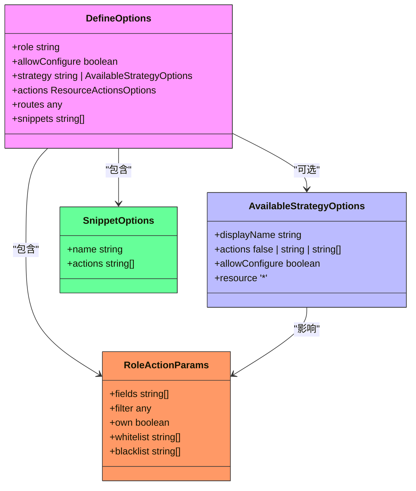
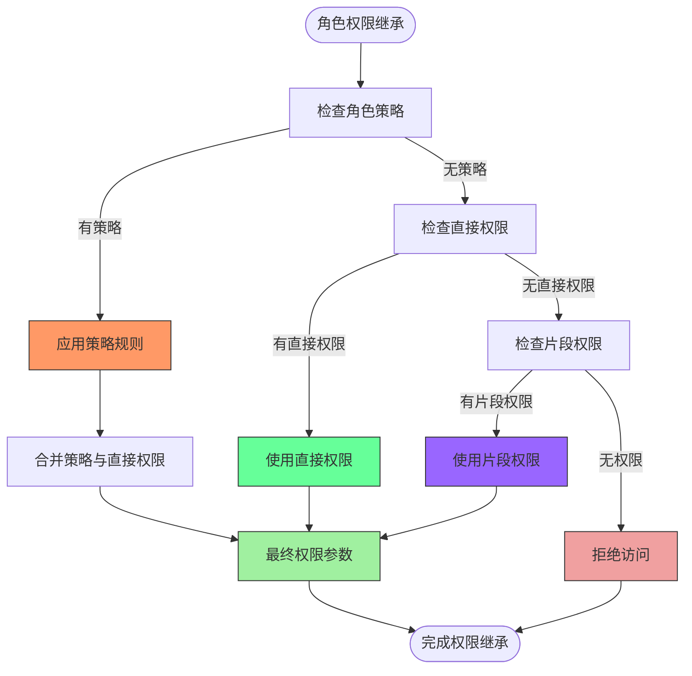
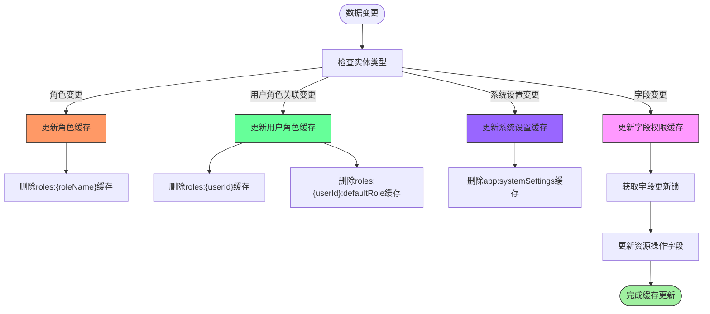

# 权限管理API

<cite>
**本文档引用的文件**   
- [acl.ts](file://packages/core/acl/src/acl.ts)
- [acl-role.ts](file://packages/core/acl/src/acl-role.ts)
- [acl-resource.ts](file://packages/core/acl/src/acl-resource.ts)
- [server.ts](file://packages/plugins/@nocobase/plugin-acl/src/server/server.ts)
- [role-check.ts](file://packages/plugins/@nocobase/plugin-acl/src/server/actions/role-check.ts)
- [available-actions.ts](file://packages/plugins/@nocobase/plugin-acl/src/server/actions/available-actions.ts)
- [RoleModel.ts](file://packages/plugins/@nocobase/plugin-acl/src/server/model/RoleModel.ts)
- [setCurrentRole.ts](file://packages/plugins/@nocobase/plugin-acl/src/server/middlewares/setCurrentRole.ts)
- [snippet-manager.ts](file://packages/core/acl/src/snippet-manager.ts)
- [acl-available-strategy.ts](file://packages/core/acl/src/acl-available-strategy.ts)
</cite>

## 目录
1. [简介](#简介)
2. [权限管理架构](#权限管理架构)
3. [核心组件分析](#核心组件分析)
4. [权限检查机制](#权限检查机制)
5. [权限查询API](#权限查询api)
6. [ACL策略配置](#acl策略配置)
7. [权限继承与合并](#权限继承与合并)
8. [权限缓存优化](#权限缓存优化)
9. [结论](#结论)

## 简介

NocoBase权限管理系统基于角色的访问控制（RBAC）模型，提供了一套完整的权限管理API。该系统支持角色创建、权限分配、策略定义和用户角色关联等操作，实现了资源级别、操作级别和字段级别的精细权限控制。

权限系统通过插件化架构实现，核心功能位于`@nocobase/plugin-acl`插件中，提供了丰富的API端点用于管理权限配置。系统支持权限继承、策略合并和缓存优化，确保在高并发场景下的性能表现。

**Section sources**
- [server.ts](file://packages/plugins/@nocobase/plugin-acl/src/server/server.ts#L28-L685)

## 权限管理架构

NocoBase权限管理系统的架构基于RBAC模型，包含角色、资源、操作和策略四个核心概念。系统通过中间件链实现权限检查，确保每个请求都经过适当的权限验证。



**Diagram sources **
- [server.ts](file://packages/plugins/@nocobase/plugin-acl/src/server/server.ts#L28-L685)
- [acl.ts](file://packages/core/acl/src/acl.ts#L66-L603)

## 核心组件分析

### ACL服务组件

ACL服务是权限管理系统的核心，负责管理所有权限相关的操作。它提供了定义角色、检查权限、注册可用操作等功能。

```mermaid
classDiagram
class ACL {
+availableStrategy Map[string, ACLAvailableStrategy]
+allowManager AllowManager
+snippetManager SnippetManager
+roles Map[string, ACLRole]
+actionAlias Map[string, string]
+availableActions Map[string, ACLAvailableAction]
+fixedParamsManager FixedParamsManager
+define(options : DefineOptions) ACLRole
+getRole(name : string) ACLRole
+getRoles(names : string[]) ACLRole[]
+removeRole(name : string) boolean
+setAvailableAction(name : string, options : AvailableActionOptions) void
+getAvailableAction(name : string) ACLAvailableAction
+can(options : CanArgs) CanResult | null
+use(fn : any, options? : ToposortOptions) void
+allow(resourceName : string, actionNames : string[] | string, condition? : string | ConditionFunc) void
+addFixedParams(resource : string, action : string, merger : Merger) void
+registerSnippet(snippet : SnippetOptions) void
}
class ACLRole {
+strategy string | AvailableStrategyOptions
+resources Map[string, ACLResource]
+snippets Set[string]
+acl ACL
+name string
+setStrategy(value : string | AvailableStrategyOptions) void
+getStrategy() ACLAvailableStrategy | null
+getResource(name : string) ACLResource | undefined
+grantAction(path : string, options? : RoleActionParams) void
+revokeResource(resourceName : string) void
+toJSON() DefineOptions
}
class ACLResource {
+actions Map[string, RoleActionParams]
+acl ACL
+role ACLRole
+name string
+getActions() ResourceActions
+getAction(name : string) RoleActionParams | null
+setAction(name : string, params : RoleActionParams) void
+removeAction(name : string) void
}
class ACLAvailableStrategy {
+acl ACL
+options AvailableStrategyOptions
+actionsAsObject { [key : string] : string }
+allowConfigure boolean
+matchAction(actionName : string) boolean | object
+allow(resourceName : string, actionName : string) boolean | object
}
class SnippetManager {
+snippets Map[string, Snippet]
+register(snippet : SnippetOptions) void
+allow(actionPath : string, snippetName : string) boolean | null
}
ACL --> ACLRole : "包含"
ACL --> ACLAvailableStrategy : "包含"
ACL --> SnippetManager : "包含"
ACLRole --> ACLResource : "包含"
ACLRole --> ACLAvailableStrategy : "使用"
ACLAvailableStrategy --> ACL : "引用"
SnippetManager --> ACL : "引用"
```

**Diagram sources **
- [acl.ts](file://packages/core/acl/src/acl.ts#L66-L603)
- [acl-role.ts](file://packages/core/acl/src/acl-role.ts#L33-L215)
- [acl-resource.ts](file://packages/core/acl/src/acl-resource.ts#L22-L84)
- [acl-available-strategy.ts](file://packages/core/acl/src/acl-available-strategy.ts#L34-L81)
- [snippet-manager.ts](file://packages/core/acl/src/snippet-manager.ts#L29-L69)

### 权限中间件组件

权限中间件负责在请求处理过程中执行权限检查，确保只有具有适当权限的用户才能访问特定资源。



**Diagram sources **
- [server.ts](file://packages/plugins/@nocobase/plugin-acl/src/server/server.ts#L381-L418)
- [acl.ts](file://packages/core/acl/src/acl.ts#L419-L574)

## 权限检查机制

NocoBase权限系统实现了多层次的权限检查机制，包括资源级别、操作级别和字段级别的控制。

### 权限检查流程



**Diagram sources **
- [acl.ts](file://packages/core/acl/src/acl.ts#L210-L323)
- [acl.ts](file://packages/core/acl/src/acl.ts#L495-L574)

### 字段级别权限控制

系统支持字段级别的权限控制，通过`fields`、`whitelist`和`blacklist`参数实现精细的字段访问控制。



**Diagram sources **
- [RoleModel.ts](file://packages/plugins/@nocobase/plugin-acl/src/server/model/RoleModel.ts#L13-L35)
- [acl-role.ts](file://packages/core/acl/src/acl-role.ts#L16-L24)
- [acl-resource.ts](file://packages/core/acl/src/acl-resource.ts#L14-L20)

## 权限查询API

NocoBase提供了丰富的权限查询API，用于获取当前用户的权限范围和检查特定操作的权限。

### 角色检查API

角色检查API用于获取当前用户的权限信息，包括允许的操作、字段和UI配置等。



**Diagram sources **
- [role-check.ts](file://packages/plugins/@nocobase/plugin-acl/src/server/actions/role-check.ts#L20-L88)
- [server.ts](file://packages/plugins/@nocobase/plugin-acl/src/server/server.ts#L170-L171)

### 可用操作查询API

可用操作查询API用于获取系统中所有可用的操作类型。



**Diagram sources **
- [available-actions.ts](file://packages/plugins/@nocobase/plugin-acl/src/server/actions/available-actions.ts#L10-L28)
- [server.ts](file://packages/plugins/@nocobase/plugin-acl/src/server/server.ts#L165-L166)

## ACL策略配置

ACL策略配置允许通过JSON结构定义复杂的权限规则，支持动态更新权限配置。

### 策略配置结构



**Diagram sources **
- [acl.ts](file://packages/core/acl/src/acl.ts#L31-L44)
- [acl-available-strategy.ts](file://packages/core/acl/src/acl-available-strategy.ts#L15-L23)
- [acl-role.ts](file://packages/core/acl/src/acl-role.ts#L16-L24)
- [snippet-manager.ts](file://packages/core/acl/src/snippet-manager.ts#L12-L15)

### 策略配置示例

```json
{
  "role": "admin",
  "strategy": {
    "actions": ["create", "view", "update", "destroy"],
    "allowConfigure": true
  },
  "actions": {
    "users:view": {
      "fields": ["id", "name", "email"],
      "filter": {
        "status": "active"
      }
    },
    "users:create": {
      "whitelist": ["name", "email", "department"]
    }
  },
  "snippets": ["ui.*", "pm", "pm.*"]
}
```

**Section sources**
- [acl.ts](file://packages/core/acl/src/acl.ts#L151-L168)
- [RoleModel.ts](file://packages/plugins/@nocobase/plugin-acl/src/server/model/RoleModel.ts#L20-L23)

## 权限继承与合并

NocoBase权限系统支持复杂的权限继承和合并策略，确保多角色用户的权限能够正确组合。

### 权限继承机制



**Diagram sources **
- [acl.ts](file://packages/core/acl/src/acl.ts#L243-L323)
- [acl-role.ts](file://packages/core/acl/src/acl-role.ts#L55-L67)

### 权限合并策略

当用户拥有多个角色时，系统会合并这些角色的权限，遵循特定的合并规则。

```mermaid
sequenceDiagram
participant User as "用户"
participant ACL as "ACL服务"
participant Merger as "权限合并器"
User->>ACL : 请求操作
ACL->>ACL : 获取用户所有角色
ACL->>Merger : 初始化权限结果
loop 每个角色
Merger->>Merger : 获取角色权限
Merger->>Merger : 检查是否为root角色
alt 是root角色
Merger->>Merger : 设置允许所有操作
break
end
Merger->>Merger : 获取角色的权限参数
Merger->>Merger : 合并到结果中
end
Merger->>ACL : 返回合并后的权限
ACL->>User : 处理请求
Note over Merger : 权限合并遵循<br/>"有权限则允许"原则<br/>root角色优先级最高
```

**Diagram sources **
- [acl.ts](file://packages/core/acl/src/acl.ts#L224-L241)
- [utils/acl-role.ts](file://packages/core/acl/src/utils/acl-role.ts#L59-L91)

## 权限缓存优化

为提高高并发场景下的性能，NocoBase实现了权限缓存优化方案，减少数据库查询次数。

### 缓存更新机制



**Diagram sources **
- [server.ts](file://packages/plugins/@nocobase/plugin-acl/src/server/server.ts#L341-L355)
- [server.ts](file://packages/plugins/@nocobase/plugin-acl/src/server/server.ts#L347-L350)
- [server.ts](file://packages/plugins/@nocobase/plugin-acl/src/server/server.ts#L311-L339)

### 当前角色设置中间件

当前角色设置中间件负责解析和验证用户的角色，是权限系统的关键组件之一。

```mermaid
sequenceDiagram
participant Client as "客户端"
participant Middleware as "当前角色中间件"
participant Cache as "缓存"
participant DB as "数据库"
Client->>Middleware : 发送请求(X-Role头)
Middleware->>Middleware : 检查是否为匿名角色
alt 是匿名角色
Middleware->>Client : 设置当前角色
break
end
Middleware->>Middleware : 检查用户登录状态
alt 未登录
Middleware->>Client : 继续处理
break
end
Middleware->>Cache : 获取用户角色缓存
alt 缓存存在
Cache-->>Middleware : 返回缓存的角色
else 缓存不存在
Cache->>DB : 查询用户角色
DB-->>Cache : 返回角色列表
Cache->>Cache : 缓存角色信息
Cache-->>Middleware : 返回角色
end
Middleware->>DB : 查询系统设置
DB-->>Middleware : 返回角色模式
Middleware->>Middleware : 处理联合角色模式
Middleware->>Middleware : 验证X-Role有效性
alt X-Role无效
Middleware->>Client : 返回401错误
break
end
Middleware->>Middleware : 设置当前角色和角色列表
Middleware->>Client : 继续处理请求
Note over Middleware : 处理角色模式、默认角色<br/>和联合角色逻辑
```

**Diagram sources **
- [setCurrentRole.ts](file://packages/plugins/@nocobase/plugin-acl/src/server/middlewares/setCurrentRole.ts#L17-L105)
- [server.ts](file://packages/plugins/@nocobase/plugin-acl/src/server/server.ts#L464-L465)

## 结论

NocoBase权限管理系统提供了一套完整且灵活的RBAC解决方案，具有以下特点：

1. **完整的API支持**：提供了角色创建、权限分配、策略定义和用户角色关联等完整的API端点
2. **精细的权限控制**：支持资源级别、操作级别和字段级别的权限控制
3. **灵活的策略配置**：通过JSON结构定义ACL策略，支持动态更新权限规则
4. **高效的权限检查**：实现了多层次的权限检查机制，确保安全性和性能的平衡
5. **智能的权限合并**：支持多角色用户的权限继承和合并，遵循合理的合并策略
6. **优化的缓存机制**：在高并发场景下通过缓存优化减少数据库查询，提高系统性能

该权限系统通过插件化架构设计，易于扩展和定制，能够满足各种复杂应用场景的权限管理需求。