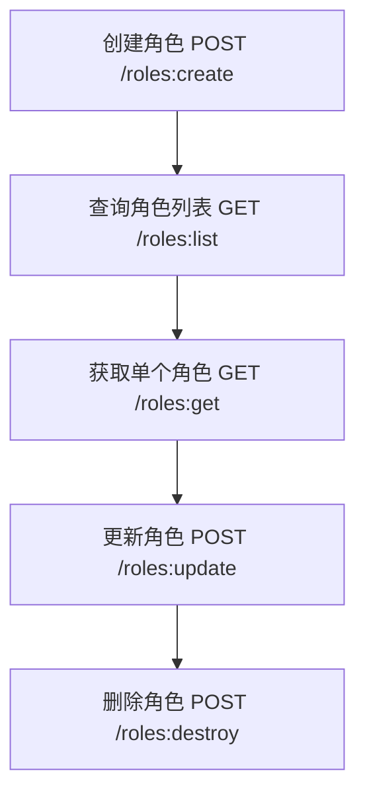
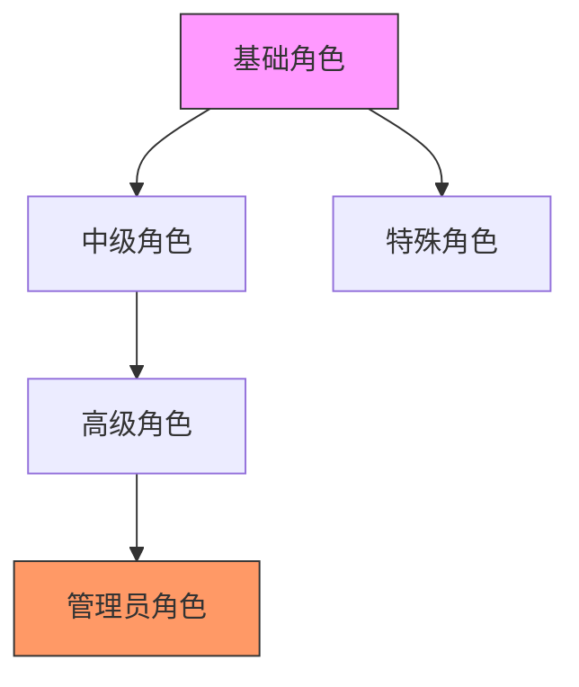
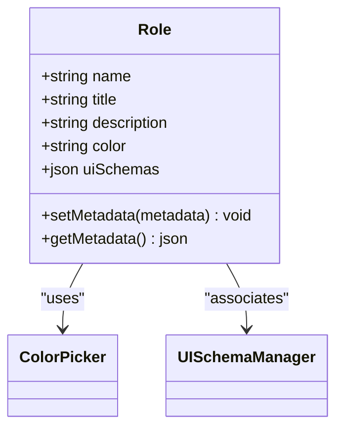
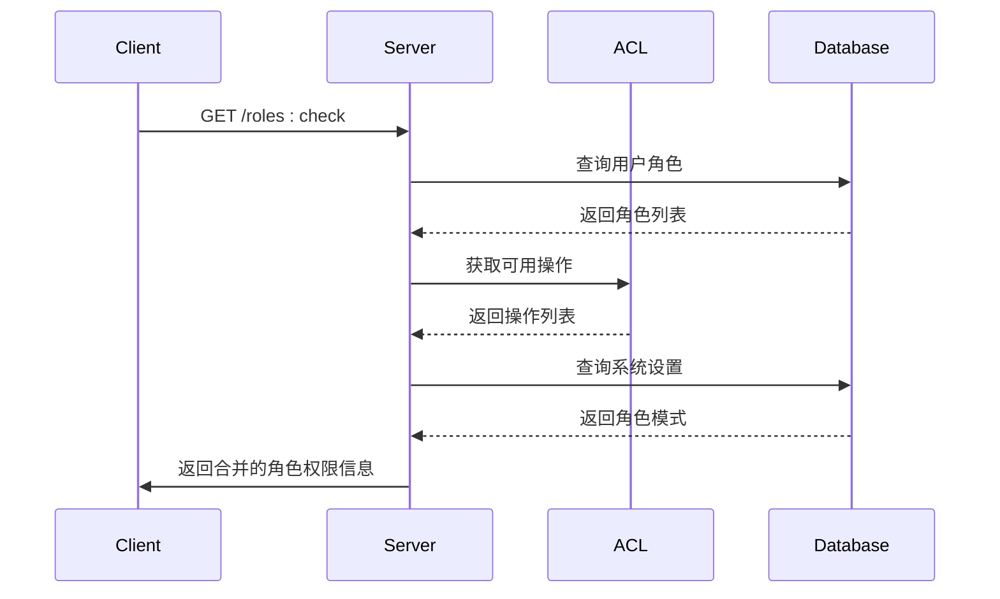

# 角色管理API

<cite>
**本文档引用的文件**  
- [RoleModel.ts](file://packages\plugins\@nocobase\plugin-acl\src\server\model\RoleModel.ts)
- [server.ts](file://packages\plugins\@nocobase\plugin-acl\src\server\server.ts)
- [index.ts](file://packages\plugins\@nocobase\plugin-acl\src\swagger\index.ts)
- [union-role.ts](file://packages\plugins\@nocobase\plugin-acl\src\server\actions\union-role.ts)
- [role-check.ts](file://packages\plugins\@nocobase\plugin-acl\src\server\actions\role-check.ts)
- [users.ts](file://packages\plugins\@nocobase\plugin-users\src\server\actions\users.ts)
- [dataSourceMainCollections.json](file://packages\core\client\src\demo-utils\dataSourceMainCollections.json)
</cite>

## 目录
1. [简介](#简介)
2. [角色增删改查API](#角色增删改查api)
3. [用户角色关联API](#用户角色关联api)
4. [角色继承关系API](#角色继承关系api)
5. [角色元数据管理API](#角色元数据管理api)
6. [角色状态管理API](#角色状态管理api)
7. [权限检查API](#权限检查api)

## 简介
NocoBase的角色管理API提供了一套完整的RESTful接口，用于管理系统中的角色。该API支持角色的创建、更新、删除和查询操作，以及用户与角色的关联管理。系统实现了基于角色的访问控制（RBAC）模型，允许通过API建立复杂的角色层级结构和继承关系。角色可以配置各种可视化属性，如颜色、图标和描述，以增强用户体验。API还支持角色状态管理，包括启用/禁用角色和设置默认角色等功能。

**Section sources**
- [server.ts](file://packages\plugins\@nocobase\plugin-acl\src\server\server.ts#L28-L685)

## 角色增删改查API
角色增删改查API提供了对角色资源的完整CRUD操作。创建角色使用POST请求到`/roles:create`端点，请求体包含角色的详细信息。查询角色列表通过GET请求`/roles:list`端点实现，支持分页和过滤参数。更新角色信息使用POST请求`/roles:update`端点，需要在查询参数中指定角色名称。删除角色通过POST请求`/roles:destroy`端点完成，同样需要指定角色名称作为过滤条件。



**Diagram sources**
- [index.ts](file://packages\plugins\@nocobase\plugin-acl\src\swagger\index.ts#L67-L153)

**Section sources**
- [index.ts](file://packages\plugins\@nocobase\plugin-acl\src\swagger\index.ts#L16-L153)
- [server.ts](file://packages\plugins\@nocobase\plugin-acl\src\server\server.ts#L204-L252)

## 用户角色关联API
用户角色关联API提供了管理用户与角色关系的功能。系统通过多对多关联表`rolesUsers`来维护用户与角色的关系。为用户分配角色使用`roles.users`资源的`add`操作，移除用户角色使用`remove`操作。查询用户所属角色可以通过`users`资源的`list`操作，并通过`roles`关联字段获取角色信息。系统还提供了查询未分配特定角色的用户列表的功能，便于进行角色分配管理。

```mermaid
erDiagram
USER ||--o{ ROLES_USERS }o--|| ROLE
USER {
string id PK
string name
string email
}
ROLES_USERS {
string userId FK
string roleName FK
boolean default
}
ROLE {
string name PK
string title
string description
}
```

**Diagram sources**
- [dataSourceMainCollections.json](file://packages\core\client\src\demo-utils\dataSourceMainCollections.json#L193-L240)
- [dataSourceMainCollections.json](file://packages\core\client\src\demo-utils\dataSourceMainCollections.json#L430-L439)

**Section sources**
- [users.ts](file://packages\plugins\@nocobase\plugin-users\src\server\actions\users.ts#L121-L138)
- [server.ts](file://packages\plugins\@nocobase\plugin-acl\src\server\server.ts#L342-L355)

## 角色继承关系API
角色继承关系API支持通过API建立角色的层级结构和继承权限。系统通过`inherits`字段定义角色的继承关系，允许角色继承父角色的权限配置。当创建或更新角色时，可以通过设置`inherits`字段来建立继承关系。系统会自动处理继承链的解析和权限合并，确保子角色获得父角色的所有权限。这种机制支持多层继承，可以构建复杂的权限体系。



**Diagram sources**
- [RoleModel.ts](file://packages\plugins\@nocobase\plugin-acl\src\server\model\RoleModel.ts#L13-L34)

**Section sources**
- [RoleModel.ts](file://packages\plugins\@nocobase\plugin-acl\src\server\model\RoleModel.ts#L13-L34)

## 角色元数据管理API
角色元数据管理API提供了对角色可视化属性的设置功能。角色可以配置颜色、描述、图标等元数据属性。颜色属性通过`color`字段管理，支持十六进制颜色值。描述属性通过`description`字段存储角色的详细说明。系统还支持通过`uiSchemas`字段关联UI配置，实现角色特定的界面定制。这些元数据属性可以在角色创建或更新时一并设置。



**Diagram sources**
- [dataSourceMainCollections.json](file://packages\core\client\src\demo-utils\dataSourceMainCollections.json#L452-L468)

**Section sources**
- [dataSourceMainCollections.json](file://packages\core\client\src\demo-utils\dataSourceMainCollections.json#L290-L479)

## 角色状态管理API
角色状态管理API提供了启用/禁用角色和设置默认角色的功能。系统通过`default`字段标识默认角色，新用户将自动分配默认角色。禁用角色通过删除角色实现，但系统保护了`root`、`admin`和`member`等核心角色不被删除。设置系统角色模式使用`roles:setSystemRoleMode`端点，可以切换不同的角色管理模式。角色状态的变更会触发相应的事件，确保权限系统的同步更新。

```mermaid
stateDiagram-v2
[*] --> Active
Active --> Disabled : "删除角色"
Disabled --> Active : "重新创建"
Active --> Default : "设置为默认"
Default --> Active : "取消默认"
Default --> Disabled : "删除默认角色"
note right of Active
可分配给用户
可用于权限检查
end note
note right of Disabled
不能分配给用户
不参与权限检查
end note
```

**Diagram sources**
- [server.ts](file://packages\plugins\@nocobase\plugin-acl\src\server\server.ts#L497-L503)
- [union-role.ts](file://packages\plugins\@nocobase\plugin-acl\src\server\actions\union-role.ts#L12-L22)

**Section sources**
- [server.ts](file://packages\plugins\@nocobase\plugin-acl\src\server\server.ts#L497-L503)
- [union-role.ts](file://packages\plugins\@nocobase\plugin-acl\src\server\actions\union-role.ts#L12-L22)

## 权限检查API
权限检查API提供了验证当前用户角色和权限的功能。`/roles:check`端点返回当前用户的角色信息和可用操作列表。系统会合并用户所有角色的权限，生成最终的权限集合。API还返回角色模式、允许的菜单项ID等信息，用于前端界面的权限控制。权限检查结果包含`allowAll`标志，标识用户是否具有超级管理员权限，以及`allowConfigure`标志，标识用户是否可以进行系统配置。



**Diagram sources**
- [role-check.ts](file://packages\plugins\@nocobase\plugin-acl\src\server\actions\role-check.ts#L47-L84)
- [index.ts](file://packages\plugins\@nocobase\plugin-acl\src\swagger\index.ts#L154-L168)

**Section sources**
- [role-check.ts](file://packages\plugins\@nocobase\plugin-acl\src\server\actions\role-check.ts#L47-L84)
- [index.ts](file://packages\plugins\@nocobase\plugin-acl\src\swagger\index.ts#L154-L168)