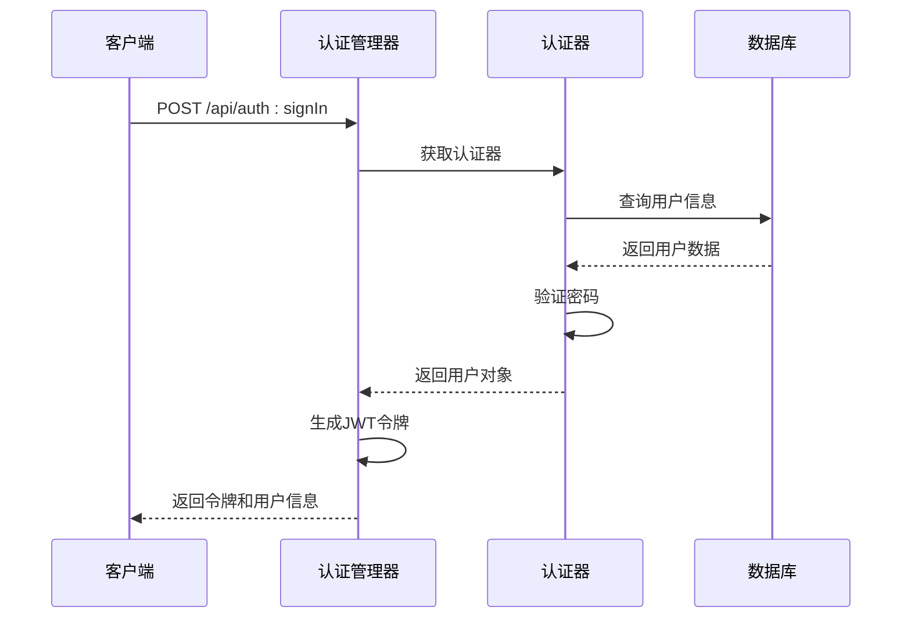
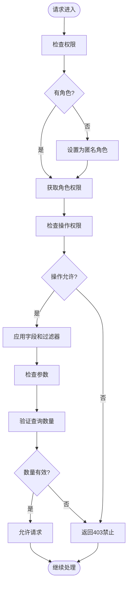
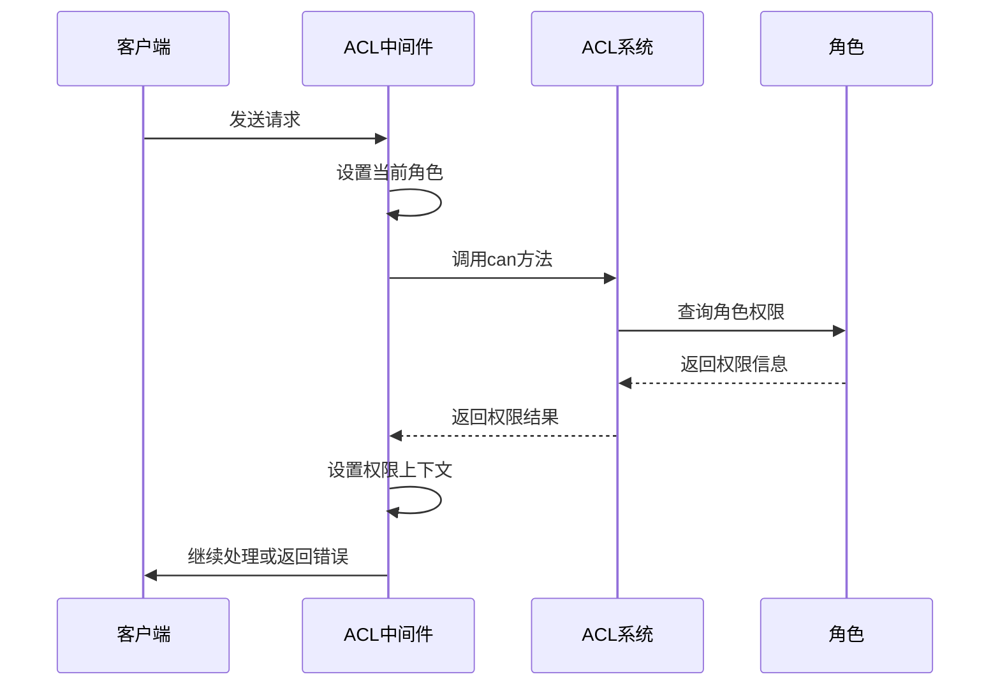

# 用户与权限API

<cite>
**本文档中引用的文件**  
- [auth-manager.ts](file://packages/core/auth/src/auth-manager.ts)
- [auth.ts](file://packages/core/auth/src/auth.ts)
- [jwt-service.ts](file://packages/core/auth/src/base/jwt-service.ts)
- [token-control-service.ts](file://packages/core/auth/src/base/token-control-service.ts)
- [token-blacklist-service.ts](file://packages/core/auth/src/base/token-blacklist-service.ts)
- [plugin.ts](file://packages/plugins/@nocobase/plugin-auth/src/server/plugin.ts)
- [server.ts](file://packages/plugins/@nocobase/plugin-acl/src/server/server.ts)
- [server.ts](file://packages/plugins/@nocobase/plugin-users/src/server/server.ts)
- [acl.ts](file://packages/core/acl/src/acl.ts)
- [allow-manager.ts](file://packages/core/acl/src/allow-manager.ts)
</cite>

## 目录
1. [简介](#简介)
2. [认证机制](#认证机制)
3. [会话与令牌管理](#会话与令牌管理)
4. [基于角色的访问控制（RBAC）](#基于角色的访问控制rbac)
5. [用户信息管理API](#用户信息管理api)
6. [认证头与错误处理](#认证头与错误处理)
7. [权限检查实现](#权限检查实现)
8. [API网关层权限控制](#api网关层权限控制)

## 简介
NocoBase提供了一套完整的用户管理和访问控制API系统，支持用户注册、登录、身份验证、会话管理和基于角色的访问控制（RBAC）。该系统通过JWT令牌实现无状态认证，并提供灵活的权限策略配置。核心功能包括用户身份验证、令牌刷新、角色权限分配、策略定义以及用户信息查询和更新等操作。

**Section sources**
- [auth-manager.ts](file://packages/core/auth/src/auth-manager.ts#L1-L87)
- [acl.ts](file://packages/core/acl/src/acl.ts#L97-L424)

## 认证机制
NocoBase的认证系统基于`AuthManager`类实现，支持多种认证类型。系统默认使用基本认证（basic），通过用户名/邮箱和密码进行身份验证。认证流程由`AuthManager`的中间件处理，该中间件在请求处理链中执行认证检查。

用户可以通过`/api/auth:signIn`端点进行登录，系统会验证凭据并返回包含JWT令牌的响应。注册功能通过`/api/auth:signUp`端点提供，允许新用户创建账户。对于已认证用户，系统会自动维护其会话状态。



**Diagram sources**
- [auth-manager.ts](file://packages/core/auth/src/auth-manager.ts#L123-L173)
- [plugin.ts](file://packages/plugins/@nocobase/plugin-auth/src/server/plugin.ts#L113-L118)

**Section sources**
- [auth.ts](file://packages/core/auth/src/auth.ts#L42-L85)
- [plugin.ts](file://packages/plugins/@nocobase/plugin-auth/src/server/plugin.ts#L75-L111)

## 会话与令牌管理
NocoBase使用JWT（JSON Web Token）实现会话管理。令牌的生成和验证由`JwtService`类处理，该类配置了默认的密钥和过期时间。系统支持令牌刷新机制，允许在令牌过期前获取新的有效令牌。

令牌控制服务（`TokenController`）负责管理令牌的生命周期，包括令牌的创建、刷新和失效。系统还实现了令牌黑名单机制，通过`ITokenBlacklistService`接口阻止已注销令牌的使用。令牌策略配置存储在数据库中，可动态调整令牌过期时间、会话过期时间和令牌刷新限制。

```mermaid
classDiagram
class JwtService {
+options : JwtOptions
+blacklist : ITokenBlacklistService
+sign(payload : SignPayload, options? : SignOptions) : string
+decode(token : string) : Promise~JwtPayload~
+block(token : string) : Promise~any~
}
class TokenController {
+cache : Cache
+app : Application
+getConfig() : Promise~NumericTokenPolicyConfig~
+setConfig(config : TokenPolicyConfig) : Promise~any~
+renew(jti : string) : Promise~{ jti : string; issuedTime : EpochTimeStamp }~
+add({ userId } : { userId : number }) : Promise~TokenInfo~
}
class ITokenBlacklistService {
<<interface>>
+has(token : string) : Promise~boolean~
+add(values : { token : string; expiration : string | Date }) : Promise~any~
}
JwtService --> ITokenBlacklistService : "使用"
TokenController --> JwtService : "依赖"
```

**Diagram sources**
- [jwt-service.ts](file://packages/core/auth/src/base/jwt-service.ts#L20-L78)
- [token-control-service.ts](file://packages/core/auth/src/base/token-control-service.ts#L16-L36)
- [token-blacklist-service.ts](file://packages/core/auth/src/base/token-blacklist-service.ts#L10-L13)

**Section sources**
- [auth-manager.ts](file://packages/core/auth/src/auth-manager.ts#L54-L61)
- [plugin.ts](file://packages/plugins/@nocobase/plugin-auth/src/server/plugin.ts#L36-L38)

## 基于角色的访问控制（RBAC）
NocoBase的RBAC系统通过`Acl`类实现，支持细粒度的权限控制。系统预定义了root、admin和member三种角色，每种角色具有不同的权限级别。权限配置存储在数据库中，并在应用启动时同步到内存中的ACL实例。

权限检查通过中间件链执行，首先检查是否允许公共访问，然后根据当前用户的角色验证具体操作权限。系统支持权限策略的动态更新，当角色或权限配置发生变化时，会自动重新加载权限规则。权限检查结果包含允许的操作、字段限制和过滤条件。



**Diagram sources**
- [acl.ts](file://packages/core/acl/src/acl.ts#L381-L532)
- [server.ts](file://packages/plugins/@nocobase/plugin-acl/src/server/server.ts#L357-L370)

**Section sources**
- [acl.ts](file://packages/core/acl/src/acl.ts#L236-L532)
- [server.ts](file://packages/plugins/@nocobase/plugin-acl/src/server/server.ts#L399-L459)

## 用户信息管理API
用户信息管理API提供用户资料查询、更新和个人设置管理功能。用户可以通过`/api/users:updateProfile`端点更新个人资料，系统会验证当前用户身份并更新相应的用户记录。管理员可以管理所有用户的信息，包括角色分配和状态管理。

系统为用户资料管理提供了预定义的UI模式，包括管理员创建表单、管理员编辑表单和用户编辑表单。这些模式存储在`uiSchemas`集合中，确保用户界面的一致性。当用户更新密码时，系统会自动清除相关的缓存，确保安全。

**Section sources**
- [server.ts](file://packages/plugins/@nocobase/plugin-users/src/server/server.ts#L160-L183)
- [server.ts](file://packages/plugins/@nocobase/plugin-users/src/server/server.ts#L273-L281)

## 认证头与错误处理
NocoBase使用标准的HTTP认证头进行身份验证。客户端需要在请求头中包含`Authorization: Bearer <token>`来传递JWT令牌。系统还支持`X-Authenticator`头来指定认证类型，默认为"basic"。

错误处理遵循标准的HTTP状态码规范。认证失败返回401未授权，权限不足返回403禁止，无效请求返回400错误请求。系统提供了详细的错误信息，包括错误代码和描述，便于客户端进行错误处理和用户提示。

**Section sources**
- [auth-manager.ts](file://packages/core/auth/src/auth-manager.ts#L126-L151)
- [plugin.ts](file://packages/plugins/@nocobase/plugin-auth/src/server/plugin.ts#L130-L134)

## 权限检查实现
权限检查在API网关层通过中间件链实现。`AclMiddleware`是权限检查的核心，它在请求处理过程中验证用户权限。中间件首先确定当前角色，然后检查该角色是否允许执行请求的操作。

权限检查支持条件判断，可以基于请求上下文动态决定权限。系统提供了`can`方法，允许在代码中查询当前用户对特定资源和操作的权限。权限检查结果包含详细的参数信息，包括允许的字段、过滤条件和关联数据。



**Diagram sources**
- [acl.ts](file://packages/core/acl/src/acl.ts#L381-L417)
- [allow-manager.ts](file://packages/core/acl/src/allow-manager.ts#L97-L110)

**Section sources**
- [acl.ts](file://packages/core/acl/src/acl.ts#L381-L532)
- [allow-manager.ts](file://packages/core/acl/src/allow-manager.ts#L74-L93)

## API网关层权限控制
API网关层的权限控制通过多层中间件实现。认证中间件首先验证用户身份，然后ACL中间件检查具体操作权限。中间件的执行顺序确保了安全性的分层保护。

系统支持权限的动态更新，当数据库中的权限配置发生变化时，会通过事件机制通知所有相关组件重新加载权限规则。这种设计确保了权限变更的实时性和一致性。权限控制还支持跨数据源的访问管理，允许在多数据源环境中统一管理用户权限。

**Section sources**
- [server.ts](file://packages/core/server/src/application.ts#L1330-L1331)
- [server.ts](file://packages/plugins/@nocobase/plugin-acl/src/server/server.ts#L464-L465)