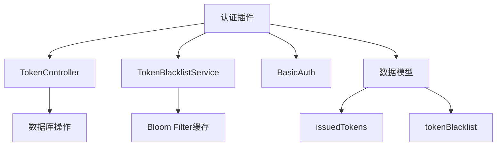
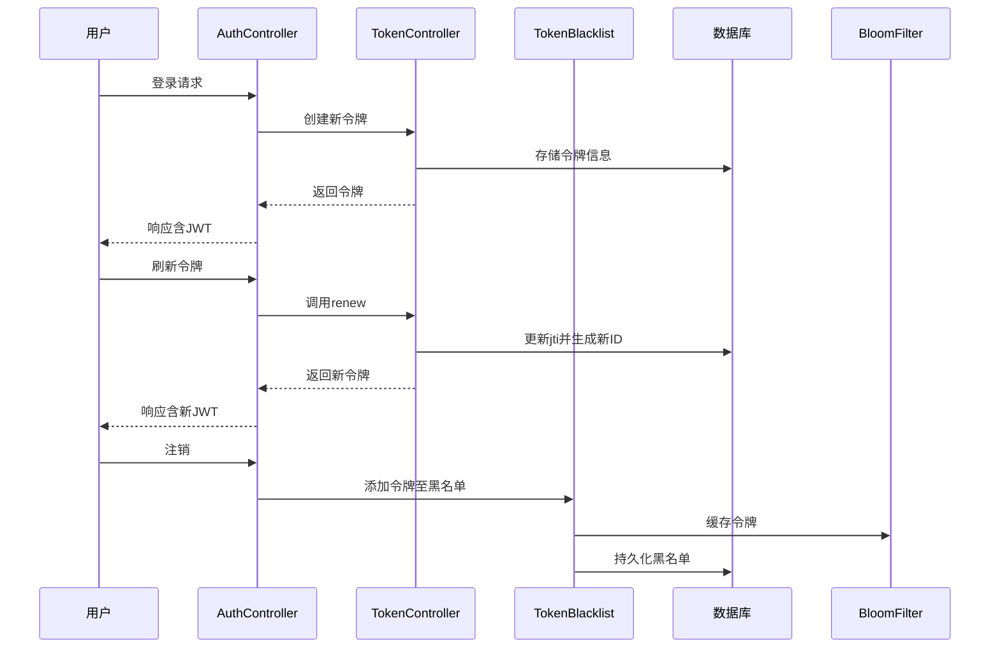
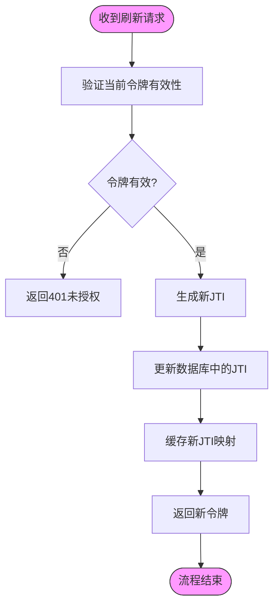
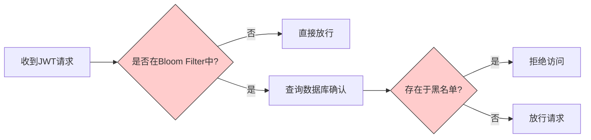
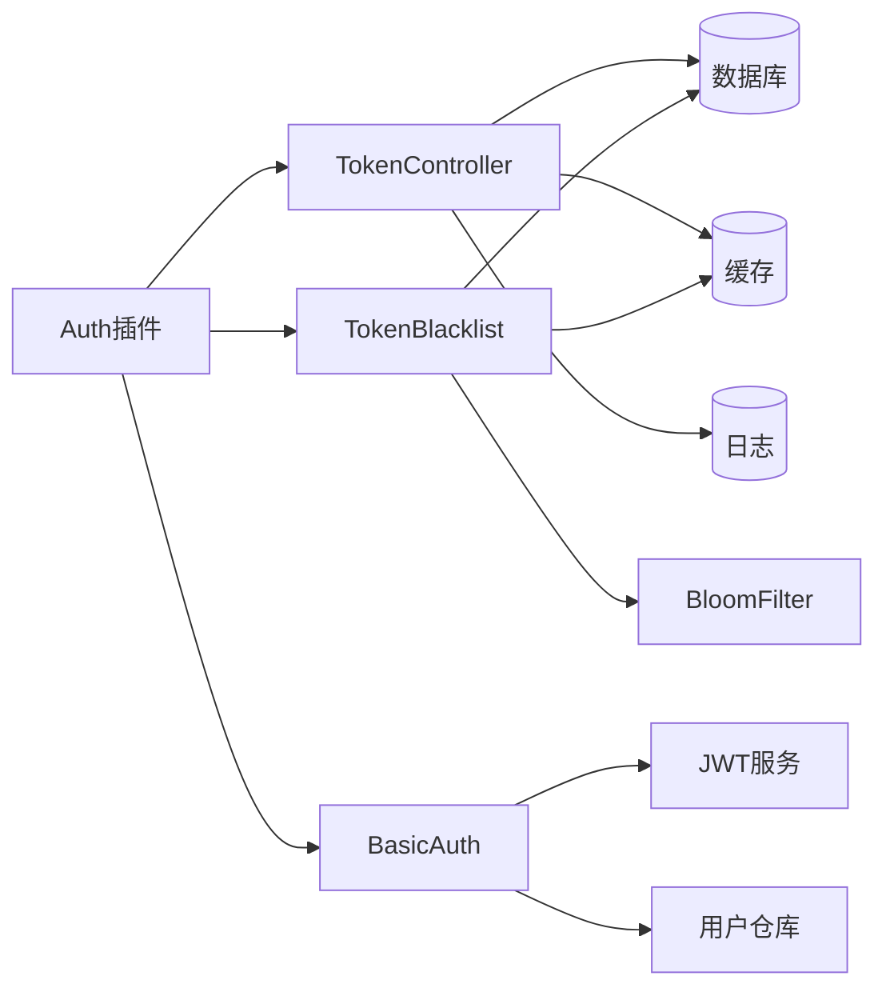

# 令牌管理

<cite>
**本文档中引用的文件**  
- [token-controller.ts](file://packages/plugins/@nocobase/plugin-auth/src/server/token-controller.ts)
- [token-blacklist.ts](file://packages/plugins/@nocobase/plugin-auth/src/server/token-blacklist.ts)
- [basic-auth.ts](file://packages/plugins/@nocobase/plugin-auth/src/server/basic-auth.ts)
- [plugin.ts](file://packages/plugins/@nocobase/plugin-auth/src/server/plugin.ts)
- [issued-tokens.ts](file://packages/plugins/@nocobase/plugin-auth/src/server/collections/issued-tokens.ts)
- [token-blacklist-collection.ts](file://packages/plugins/@nocobase/plugin-auth/src/server/collections/token-blacklist.ts)
- [constants.ts](file://packages/plugins/@nocobase/plugin-auth/src/constants.ts)
</cite>

## 目录
1. [简介](#简介)
2. [项目结构](#项目结构)
3. [核心组件](#核心组件)
4. [架构概述](#架构概述)
5. [详细组件分析](#详细组件分析)
6. [依赖分析](#依赖分析)
7. [性能考虑](#性能考虑)
8. [故障排除指南](#故障排除指南)
9. [结论](#结论)

## 简介
本文档详细描述了NocoBase平台中的令牌管理API，涵盖JWT令牌的生成、验证、刷新和注销机制。文档重点介绍访问令牌与刷新令牌的安全策略、令牌黑名单管理以防止重放攻击，以及令牌刷新流程中的轮换策略。通过清晰的API端点说明和请求/响应示例，帮助开发者理解完整的认证流程及错误处理机制。

## 项目结构
NocoBase的令牌管理系统位于`packages/plugins/@nocobase/plugin-auth`插件中，采用模块化设计，分离了令牌控制、黑名单管理、认证逻辑与数据模型。



**图示来源**  
- [token-controller.ts](file://packages/plugins/@nocobase/plugin-auth/src/server/token-controller.ts#L34-L150)
- [token-blacklist.ts](file://packages/plugins/@nocobase/plugin-auth/src/server/token-blacklist.ts#L16-L98)
- [issued-tokens.ts](file://packages/plugins/@nocobase/plugin-auth/src/server/collections/issued-tokens.ts#L1-L51)
- [token-blacklist.ts](file://packages/plugins/@nocobase/plugin-auth/src/server/collections/token-blacklist.ts#L1-L32)

**本节来源**  
- [plugin.ts](file://packages/plugins/@nocobase/plugin-auth/src/server/plugin.ts#L24-L324)
- [constants.ts](file://packages/plugins/@nocobase/plugin-auth/src/constants.ts#L10-L15)

## 核心组件
系统核心包括令牌控制器（TokenController）、令牌黑名单服务（TokenBlacklistService）和基础认证类（BasicAuth），分别负责令牌生命周期管理、已注销令牌追踪和用户身份验证。

**本节来源**  
- [token-controller.ts](file://packages/plugins/@nocobase/plugin-auth/src/server/token-controller.ts#L34-L150)
- [token-blacklist.ts](file://packages/plugins/@nocobase/plugin-auth/src/server/token-blacklist.ts#L16-L98)
- [basic-auth.ts](file://packages/plugins/@nocobase/plugin-auth/src/server/basic-auth.ts#L16-L361)

## 架构概述
NocoBase使用JWT进行无状态认证，结合数据库持久化令牌状态和Redis Bloom Filter实现高效的令牌黑名单检查。令牌策略可配置，支持动态调整过期时间。



**图示来源**  
- [token-controller.ts](file://packages/plugins/@nocobase/plugin-auth/src/server/token-controller.ts#L87-L111)
- [token-blacklist.ts](file://packages/plugins/@nocobase/plugin-auth/src/server/token-blacklist.ts#L74-L86)
- [basic-auth.ts](file://packages/plugins/@nocobase/plugin-auth/src/server/basic-auth.ts#L28-L61)

## 详细组件分析

### 令牌控制器分析
TokenController负责管理已颁发令牌的状态，包括创建、刷新和清理过期会话。

#### 类图
```mermaid
classDiagram
class TokenController {
+cache : Cache
+app : Application
+logger : SystemLogger
+getConfig() : Promise~NumericTokenPolicyConfig~
+setConfig(config : TokenPolicyConfig) : void
+add(userId : number) : Promise~TokenInfo~
+renew(jti : string) : Promise~{jti, issuedTime}~
+removeSessionExpiredTokens(userId : number) : Promise~number~
}
class TokenBlacklistService {
+repo : Repository
+bloomFilter : BloomFilter
+has(token : string) : Promise~boolean~
+add(values : {token, expiration}) : Promise~void~
+deleteExpiredTokens() : Promise~number~
}
TokenController --> "使用" Database : 持久化令牌
TokenBlacklistService --> "使用" BloomFilter : 高效查询
TokenBlacklistService --> "使用" Database : 持久化黑名单
```

**图示来源**  
- [token-controller.ts](file://packages/plugins/@nocobase/plugin-auth/src/server/token-controller.ts#L34-L150)
- [token-blacklist.ts](file://packages/plugins/@nocobase/plugin-auth/src/server/token-blacklist.ts#L16-L98)

### 令牌刷新流程
系统采用令牌轮换策略，每次刷新时生成新的jti（JWT ID），旧令牌立即失效，防止重放攻击。



**图示来源**  
- [token-controller.ts](file://packages/plugins/@nocobase/plugin-auth/src/server/token-controller.ts#L113-L149)
- [plugin.ts](file://packages/plugins/@nocobase/plugin-auth/src/server/plugin.ts#L36-L38)

**本节来源**  
- [token-controller.ts](file://packages/plugins/@nocobase/plugin-auth/src/server/token-controller.ts#L113-L149)
- [plugin.ts](file://packages/plugins/@nocobase/plugin-auth/src/server/plugin.ts#L27-L48)

### 令牌黑名单管理
为防止已注销令牌被重用，系统使用Bloom Filter结合数据库实现高效黑名单检查。



**图示来源**  
- [token-blacklist.ts](file://packages/plugins/@nocobase/plugin-auth/src/server/token-blacklist.ts#L60-L72)
- [basic-auth.ts](file://packages/plugins/@nocobase/plugin-auth/src/server/basic-auth.ts#L347-L351)

**本节来源**  
- [token-blacklist.ts](file://packages/plugins/@nocobase/plugin-auth/src/server/token-blacklist.ts#L16-L98)

## 依赖分析
令牌管理系统依赖多个核心模块，包括数据库、缓存、日志和认证管理器。



**图示来源**  
- [plugin.ts](file://packages/plugins/@nocobase/plugin-auth/src/server/plugin.ts#L24-L324)
- [token-controller.ts](file://packages/plugins/@nocobase/plugin-auth/src/server/token-controller.ts#L34-L150)
- [token-blacklist.ts](file://packages/plugins/@nocobase/plugin-auth/src/server/token-blacklist.ts#L16-L98)

**本节来源**  
- [plugin.ts](file://packages/plugins/@nocobase/plugin-auth/src/server/plugin.ts#L24-L324)
- [token-controller.ts](file://packages/plugins/@nocobase/plugin-auth/src/server/token-controller.ts#L34-L150)
- [token-blacklist.ts](file://packages/plugins/@nocobase/plugin-auth/src/server/token-blacklist.ts#L16-L98)

## 性能考虑
系统通过多种机制优化令牌管理性能：
- 使用Bloom Filter减少数据库查询
- 缓存令牌策略配置
- 异步清理过期令牌
- 内存缓存用户信息

对于高并发场景，建议使用Redis作为缓存后端以提高Bloom Filter性能。

## 故障排除指南
常见问题及解决方案：

| 问题现象 | 可能原因 | 解决方案 |
|--------|--------|--------|
| 令牌刷新失败 | 旧令牌已被刷新或过期 | 检查`renewed`状态和`issuedTime` |
| 注销后仍可访问 | 黑名单未正确写入 | 确认`tokenBlacklist`表写入权限 |
| 登录缓慢 | Bloom Filter初始化耗时 | 检查Redis连接和内存配置 |
| 令牌立即过期 | 时钟不同步 | 确保服务器时间同步 |

**本节来源**  
- [token-controller.ts](file://packages/plugins/@nocobase/plugin-auth/src/server/token-controller.ts#L131-L134)
- [token-blacklist.ts](file://packages/plugins/@nocobase/plugin-auth/src/server/token-blacklist.ts#L48-L49)
- [basic-auth.ts](file://packages/plugins/@nocobase/plugin-auth/src/server/basic-auth.ts#L144-L153)

## 结论
NocoBase的令牌管理系统提供了安全、可扩展的JWT认证解决方案。通过结合数据库持久化、Bloom Filter高效查询和可配置的令牌策略，实现了高性能的令牌生命周期管理。建议生产环境启用Redis缓存以最大化黑名单查询性能，并定期监控令牌表大小以优化清理策略。