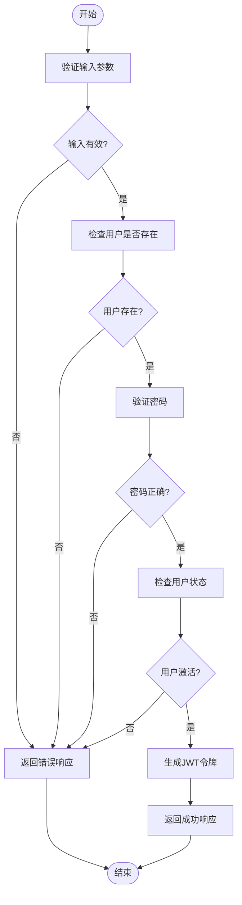
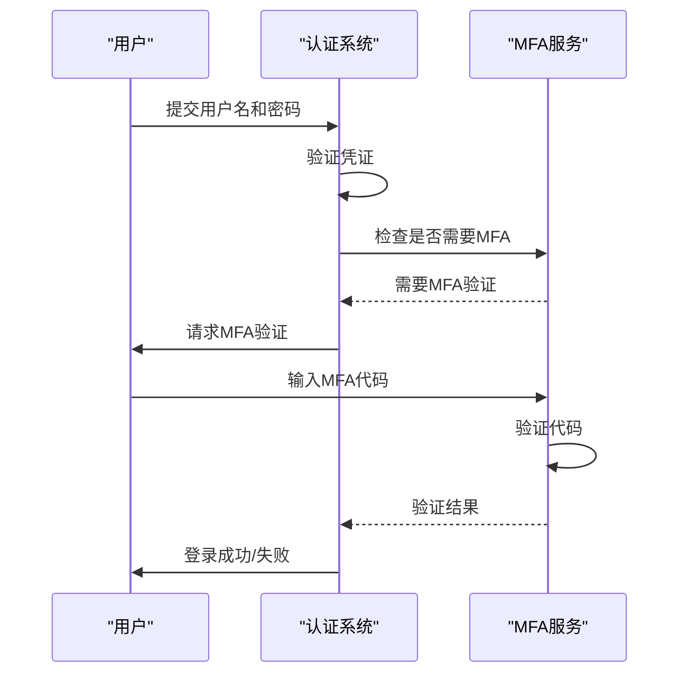
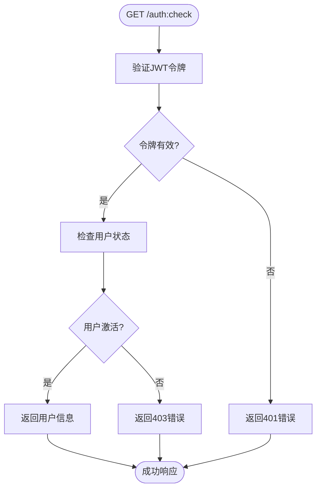

# 用户认证

<cite>
**本文档引用的文件**
- [index.ts](file://packages\plugins\@nocobase\plugin-auth\src\swagger\index.ts)
- [actions.ts](file://packages\core\auth\src\actions.ts)
- [plugin.ts](file://packages\plugins\@nocobase\plugin-auth\src\server\plugin.ts)
- [auth-manager.ts](file://packages\core\auth\src\auth-manager.ts)
- [auth.ts](file://packages\core\auth\src\auth.ts)
- [basic-auth.ts](file://packages\plugins\@nocobase\plugin-auth\src\server\basic-auth.ts)
- [APIClient.ts](file://packages\core\sdk\src\APIClient.ts)
</cite>

## 目录
1. [简介](#简介)
2. [核心API端点](#核心api端点)
3. [认证流程](#认证流程)
4. [多因素认证(MFA)](#多因素认证mfa)
5. [第三方登录集成](#第三方登录集成)
6. [请求/响应示例](#请求响应示例)
7. [错误码说明](#错误码说明)
8. [会话管理](#会话管理)

## 简介
NocoBase用户认证系统提供了一套完整的身份验证解决方案，支持基本的用户名/密码认证、多因素认证以及第三方登录集成。系统通过JWT（JSON Web Token）实现安全的用户会话管理，并提供了丰富的API接口来处理用户注册、登录、密码重置等操作。

**Section sources**
- [index.ts](file://packages\plugins\@nocobase\plugin-auth\src\swagger\index.ts#L1-L752)

## 核心API端点
NocoBase用户认证系统提供了以下核心API端点：

### 用户登录
- **POST /auth:signIn** - 用户登录接口
- 请求头：`X-Authenticator` (认证方式标识，默认为'basic')
- 请求体包含`email`和`password`字段

### 用户注册
- **POST /auth:signUp** - 用户注册接口
- 请求体包含`email`、`password`和`confirm_password`字段

### 会话检查
- **GET /auth:check** - 检查用户登录状态
- 返回当前用户信息和角色

### 用户登出
- **POST /auth:signOut** - 用户登出接口

### 密码管理
- **POST /auth:changePassword** - 修改密码
- **POST /auth:lostPassword** - 忘记密码（发送重置链接）
- **POST /auth:resetPassword** - 重置密码

### 认证器管理
- **authenticators:listTypes** - 列出认证器类型
- **authenticators:publicList** - 列出启用的认证器
- **authenticators:create** - 创建认证器
- **authenticators:list** - 列出所有认证器
- **authenticators:get** - 获取认证器信息
- **authenticators:update** - 更新认证器
- **authenticators:destroy** - 删除认证器

**Section sources**
- [index.ts](file://packages\plugins\@nocobase\plugin-auth\src\swagger\index.ts#L15-L554)

## 认证流程
NocoBase的用户认证流程包括凭证验证、用户状态检查和认证策略应用。

### 凭证验证流程
1. 系统首先检查请求头中的`X-Authenticator`字段来确定认证方式
2. 对于基本认证，系统会验证提供的邮箱/用户名和密码
3. 密码验证使用安全的哈希处理机制
4. 系统检查用户账户状态（是否激活、是否被禁用等）



**Diagram sources**
- [basic-auth.ts](file://packages\plugins\@nocobase\plugin-auth\src\server\basic-auth.ts#L28-L61)
- [auth.ts](file://packages\core\auth\src\auth.ts#L84-L93)

### 密码哈希处理
系统使用安全的密码哈希算法来存储用户密码，确保即使数据库泄露，用户密码也不会被轻易破解。密码在存储前会经过加盐哈希处理。

### 用户状态检查
在认证过程中，系统会检查用户的以下状态：
- 账户是否被禁用
- 账户是否需要激活
- 多因素认证是否已绑定
- 登录尝试次数是否超过限制

**Section sources**
- [basic-auth.ts](file://packages\plugins\@nocobase\plugin-auth\src\server\basic-auth.ts#L48-L59)
- [auth-manager.ts](file://packages\core\auth\src\auth-manager.ts#L123-L152)

## 多因素认证(MFA)
NocoBase支持多因素认证（MFA），通过`plugin-verification`插件实现。系统支持基于时间的一次性密码（TOTP）等验证方式。

### MFA API接口
- **verifiers:send** - 发送验证代码
- **verifiers:verify** - 验证代码
- **verifiers:bind** - 绑定验证器

### MFA工作流程
1. 用户登录时，如果系统要求MFA，会返回需要验证的提示
2. 系统生成一次性验证码并发送到用户设备
3. 用户输入收到的验证码
4. 系统验证验证码的有效性
5. 验证通过后，完成登录流程



**Diagram sources**
- [plugin-verification\index.ts](file://packages\plugins\@nocobase\plugin-verification\src\server\otp-verification\index.ts#L81-L126)
- [plugin.ts](file://packages\plugins\@nocobase\plugin-auth\src\server\plugin.ts#L144-L181)

## 第三方登录集成
NocoBase支持通过OAuth2等协议集成第三方登录，如微信、GitHub等。

### 认证器类型管理
系统通过`authenticators:listTypes`接口列出所有可用的认证器类型，包括：
- basic（基本认证）
- oauth2（OAuth2认证）
- sms（短信认证）

### 第三方登录流程
1. 客户端请求可用的第三方登录方式
2. 用户选择特定的第三方登录方式
3. 系统重定向到第三方认证服务器
4. 用户在第三方服务器完成认证
5. 第三方服务器回调NocoBase系统
6. 系统创建或更新用户信息并生成会话令牌

**Section sources**
- [plugin.ts](file://packages\plugins\@nocobase\plugin-auth\src\server\plugin.ts#L75-L118)
- [index.ts](file://packages\plugins\@nocobase\plugin-auth\src\swagger\index.ts#L342-L362)

## 请求/响应示例
### 登录请求示例
```http
POST /auth:signIn HTTP/1.1
Host: api.nocobase.com
Content-Type: application/json
X-Authenticator: basic

{
  "email": "user@example.com",
  "password": "user_password"
}
```

### 登录成功响应
```json
{
  "data": {
    "token": "eyJhbGciOiJIUzI1NiIsInR5cCI6IkpXVCJ9...",
    "user": {
      "id": 1,
      "nickname": "John Doe",
      "email": "user@example.com",
      "roles": [
        {
          "name": "admin",
          "title": "管理员"
        }
      ]
    }
  }
}
```

### 注册请求示例
```http
POST /auth:signUp HTTP/1.1
Host: api.nocobase.com
Content-Type: application/json

{
  "email": "newuser@example.com",
  "password": "new_password",
  "confirm_password": "new_password"
}
```

**Section sources**
- [index.ts](file://packages\plugins\@nocobase\plugin-auth\src\swagger\index.ts#L58-L122)
- [APIClient.ts](file://packages\core\sdk\src\APIClient.ts#L209-L222)

## 错误码说明
NocoBase认证系统使用标准的HTTP状态码和自定义错误码来指示错误类型。

### 常见错误码
- **401 Unauthorized** - 未授权访问
  - 原因：凭证无效、令牌过期、MFA验证失败
- **400 Bad Request** - 请求参数错误
  - 原因：缺少必要参数、参数格式错误
- **403 Forbidden** - 禁止访问
  - 原因：权限不足、账户被禁用
- **422 Unprocessable Entity** - 验证失败
  - 原因：密码不匹配、邮箱已存在

### 错误响应结构
```json
{
  "errors": [
    {
      "code": "INCORRECT_PASSWORD",
      "message": "用户名/邮箱或密码不正确，请重新输入"
    }
  ]
}
```

**Section sources**
- [index.ts](file://packages\plugins\@nocobase\plugin-auth\src\swagger\index.ts#L111-L120)
- [basic-auth.ts](file://packages\plugins\@nocobase\plugin-auth\src\server\basic-auth.ts#L49-L58)

## 会话管理
NocoBase通过JWT实现安全的会话管理，支持令牌刷新和过期控制。

### 令牌配置
系统默认配置：
- 令牌过期时间：1天
- 会话过期时间：7天
- 过期令牌续期限制：1天

### 会话检查流程
1. 客户端发送`GET /auth:check`请求
2. 服务器验证JWT令牌的有效性
3. 如果令牌有效，返回当前用户信息
4. 如果令牌即将过期，自动续期



**Diagram sources**
- [actions.ts](file://packages\core\auth\src\actions.ts#L26-L29)
- [auth-manager.ts](file://packages\core\auth\src\auth-manager.ts#L123-L152)

**Section sources**
- [plugin.ts](file://packages\plugins\@nocobase\plugin-auth\src\server\plugin.ts#L307-L317)
- [actions.ts](file://packages\core\auth\src\actions.ts#L26-L29)