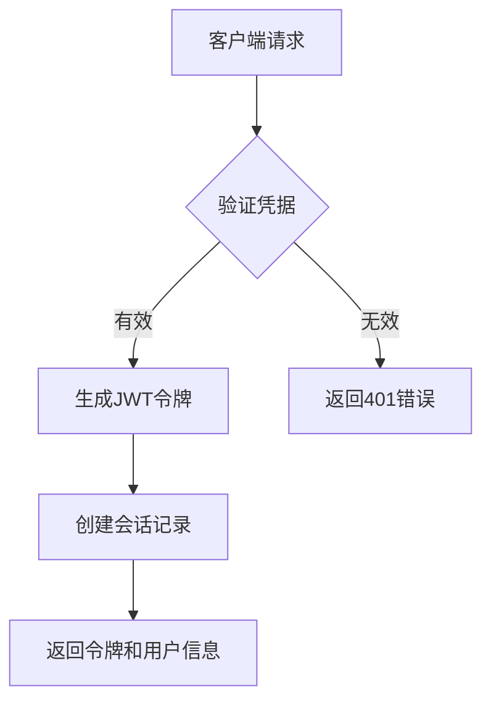
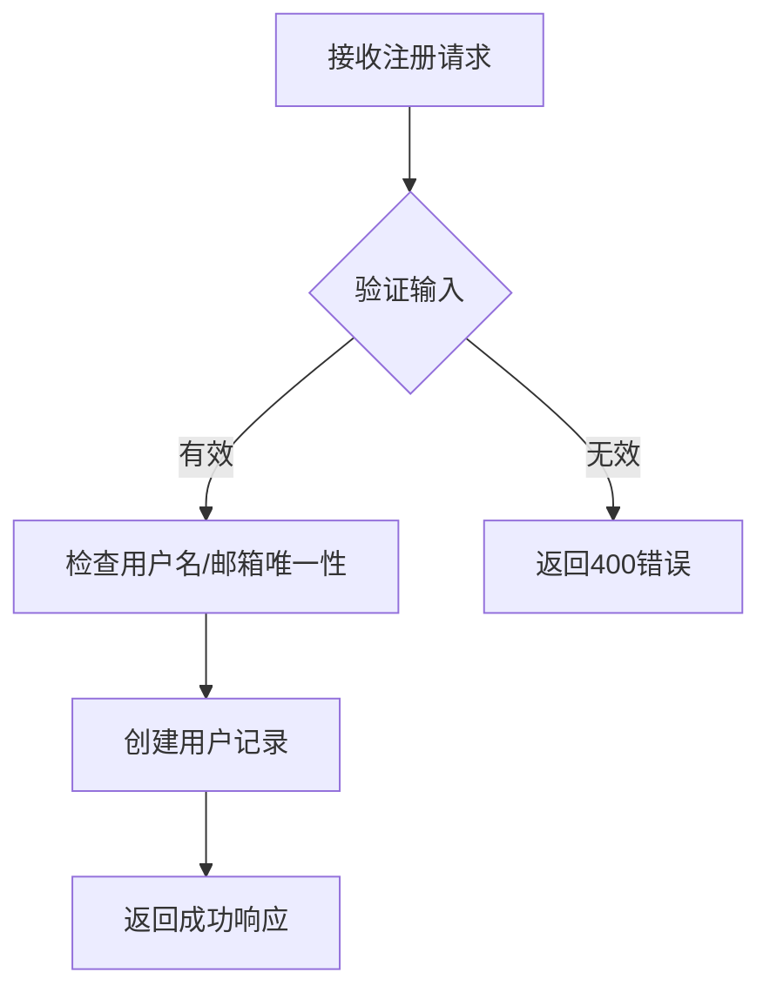
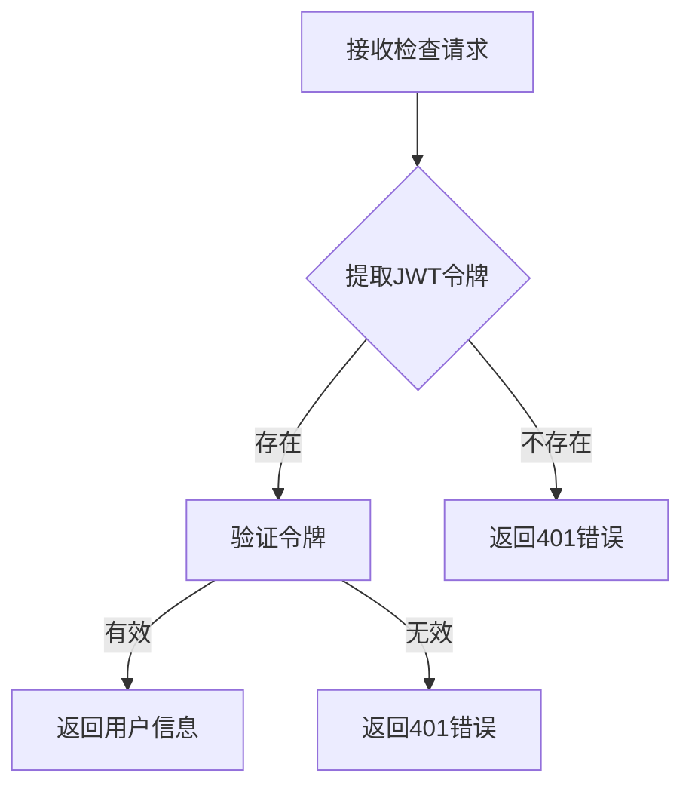
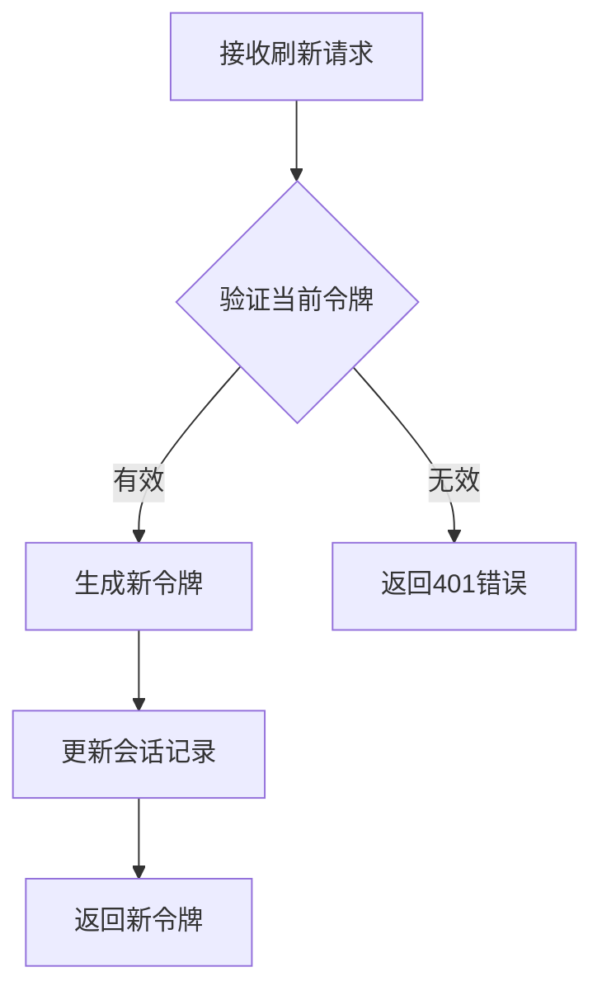
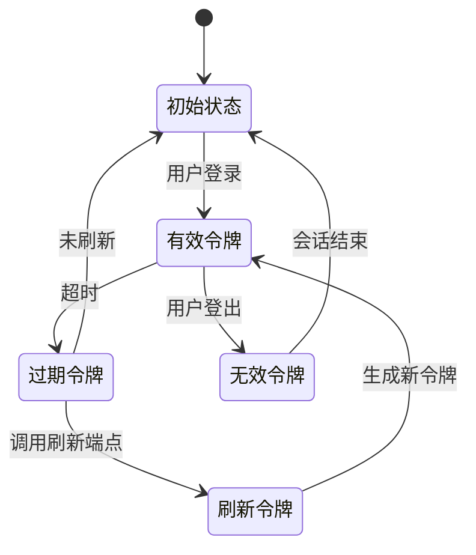
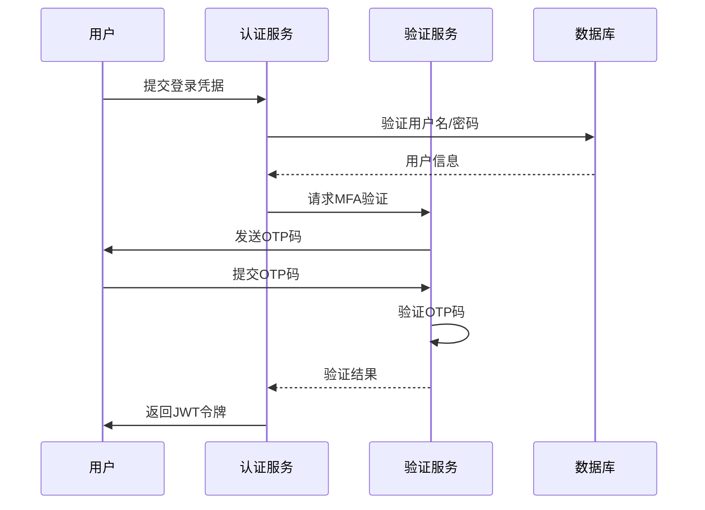
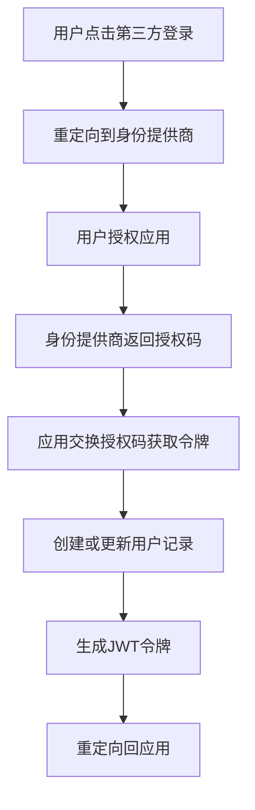
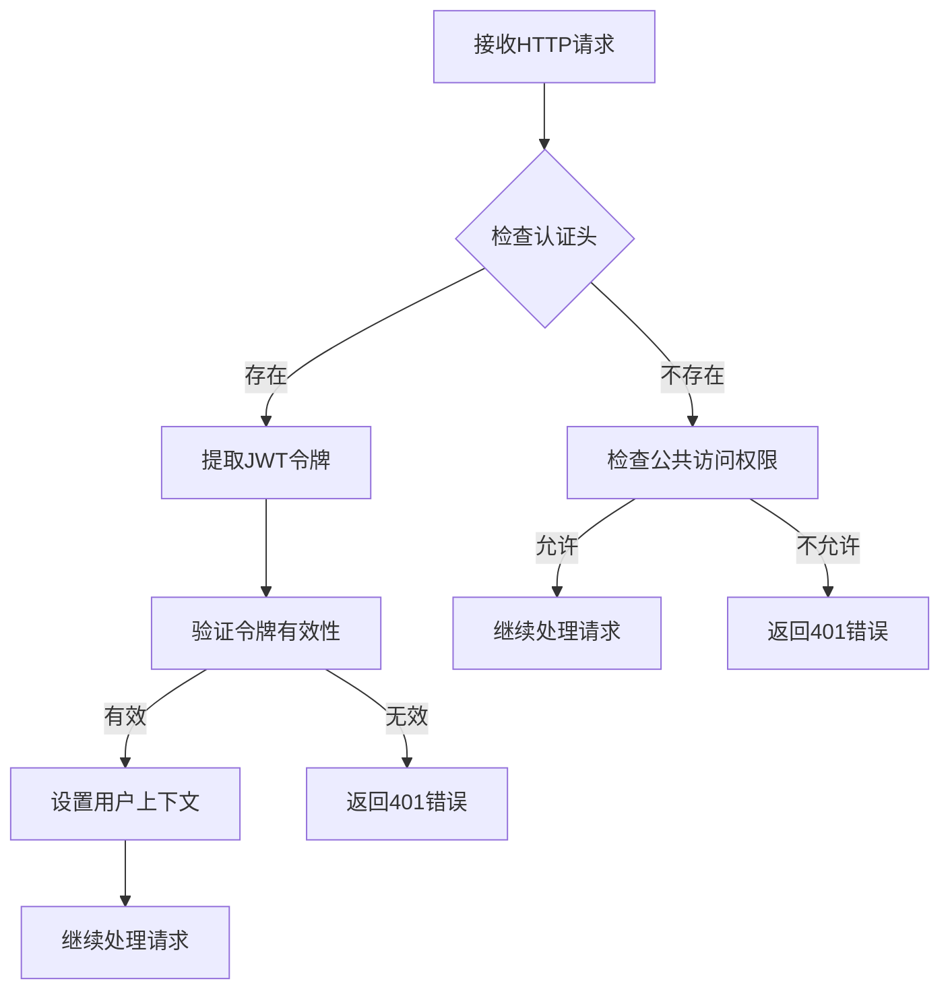
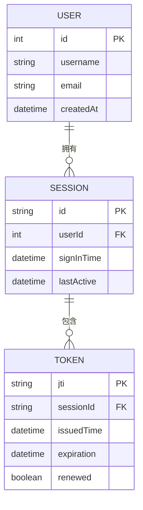

# 认证API

<cite>
**本文档中引用的文件**  
- [plugin.ts](file://packages/plugins/@nocobase/plugin-auth/src/server/plugin.ts)
- [auth-manager.ts](file://packages/core/auth/src/auth-manager.ts)
- [auth.ts](file://packages/core/auth/src/auth.ts)
- [jwt-service.ts](file://packages/core/auth/src/base/jwt-service.ts)
- [token-controller.ts](file://packages/plugins/@nocobase/plugin-auth/src/server/token-controller.ts)
- [basic-auth.ts](file://packages/plugins/@nocobase/plugin-auth/src/server/basic-auth.ts)
- [actions.ts](file://packages/core/auth/src/actions.ts)
- [auth.ts](file://packages/plugins/@nocobase/plugin-auth/src/server/actions/auth.ts)
- [storer.ts](file://packages/plugins/@nocobase/plugin-auth/src/server/storer.ts)
- [APIClient.ts](file://packages/core/sdk/src/APIClient.ts)
- [index.ts](file://packages/plugins/@nocobase/plugin-auth/src/swagger/index.ts)
</cite>

## 目录
1. [介绍](#介绍)
2. [核心API端点](#核心api端点)
3. [JWT令牌管理](#jwt令牌管理)
4. [多因素认证(MFA)支持](#多因素认证mfa支持)
5. [第三方登录集成](#第三方登录集成)
6. [认证中间件](#认证中间件)
7. [会话管理](#会话管理)
8. [错误处理](#错误处理)
9. [请求/响应示例](#请求响应示例)

## 介绍

NocoBase认证API提供了一套完整的用户身份验证和会话管理解决方案。该系统支持用户注册、登录、密码重置、会话刷新等功能，并通过JWT令牌实现安全的身份验证机制。认证系统设计为可扩展的插件架构，允许通过不同的认证类型（如基本认证、OAuth2等）进行身份验证。

认证系统的核心组件包括认证管理器、JWT服务、令牌控制器和存储器，它们协同工作以确保安全可靠的用户身份验证流程。系统还集成了访问控制列表（ACL）以管理不同操作的权限。

**Section sources**
- [plugin.ts](file://packages/plugins/@nocobase/plugin-auth/src/server/plugin.ts#L1-L324)
- [auth-manager.ts](file://packages/core/auth/src/auth-manager.ts#L1-L174)

## 核心API端点

NocoBase认证API提供了一系列RESTful端点来处理用户身份验证操作。主要端点包括用户登录、注册、会话检查和登出。

### 登录端点 (POST /auth:signIn)

此端点用于用户登录，接受用户名/邮箱和密码作为输入，并返回包含JWT令牌的响应。



**Diagram sources**
- [basic-auth.ts](file://packages/plugins/@nocobase/plugin-auth/src/server/basic-auth.ts#L24-L61)
- [auth.ts](file://packages/plugins/@nocobase/plugin-auth/src/server/actions/auth.ts#L15-L18)

### 注册端点 (POST /auth:signUp)

此端点允许新用户注册账户，支持可配置的注册表单字段。



**Diagram sources**
- [basic-auth.ts](file://packages/plugins/@nocobase/plugin-auth/src/server/basic-auth.ts#L115-L140)
- [auth.ts](file://packages/plugins/@nocobase/plugin-auth/src/server/actions/auth.ts#L124-L127)

### 会话检查端点 (GET /auth:check)

此端点用于检查当前用户会话状态，验证JWT令牌的有效性。



**Diagram sources**
- [actions.ts](file://packages/core/auth/src/actions.ts#L26-L29)
- [auth-manager.ts](file://packages/core/auth/src/auth-manager.ts#L123-L152)

### 令牌刷新端点 (GET /auth:refresh)

此端点用于刷新过期的访问令牌，延长用户会话。



**Diagram sources**
- [token-controller.ts](file://packages/plugins/@nocobase/plugin-auth/src/server/token-controller.ts#L113-L149)
- [jwt-service.ts](file://packages/core/auth/src/base/jwt-service.ts#L39-L46)

## JWT令牌管理

NocoBase使用JWT（JSON Web Token）作为主要的身份验证机制。JWT令牌包含用户身份信息，并通过数字签名确保其完整性和安全性。

### 令牌生成与验证

JWT服务负责令牌的生成、验证和黑名单管理。系统使用HS256算法进行签名，并支持自定义密钥。

```mermaid
classDiagram
class JwtService {
+secret : Buffer | string
+expiresIn : string
+blacklist : ITokenBlacklistService
+sign(payload : SignPayload, options? : SignOptions) : string
+decode(token : string) : Promise~JwtPayload~
+block(token : string) : Promise~void~
}
class ITokenBlacklistService {
<<interface>>
+add(token : { token : string, expiration : string }) : Promise~void~
+has(token : string) : Promise~boolean~
}
JwtService --> ITokenBlacklistService : "使用"
```

**Diagram sources**
- [jwt-service.ts](file://packages/core/auth/src/base/jwt-service.ts#L20-L79)
- [token-controller.ts](file://packages/plugins/@nocobase/plugin-auth/src/server/token-controller.ts#L34-L151)

### 令牌生命周期

系统实现了完整的令牌生命周期管理，包括令牌的创建、刷新和失效。



**Diagram sources**
- [token-controller.ts](file://packages/plugins/@nocobase/plugin-auth/src/server/token-controller.ts#L87-L111)
- [auth-manager.ts](file://packages/core/auth/src/auth-manager.ts#L146-L150)

## 多因素认证(MFA)支持

NocoBase支持多因素认证，通过插件架构实现OTP（一次性密码）等MFA方法。

### MFA架构

系统通过验证插件实现MFA功能，允许在关键操作中添加额外的身份验证层。



**Diagram sources**
- [plugin-verification](file://packages/plugins/@nocobase/plugin-verification/src/server/otp-verification/index.ts#L81-L126)
- [basic-auth.ts](file://packages/plugins/@nocobase/plugin-auth/src/server/basic-auth.ts#L24-L61)

## 第三方登录集成

NocoBase支持通过OAuth2等协议集成第三方登录服务。

### OAuth2集成流程

系统提供可扩展的认证类型注册机制，允许轻松集成各种第三方身份提供商。



**Diagram sources**
- [auth-manager.ts](file://packages/core/auth/src/auth-manager.ts#L83-L85)
- [plugin.ts](file://packages/plugins/@nocobase/plugin-auth/src/server/plugin.ts#L74-L77)

## 认证中间件

认证中间件是请求处理链中的关键组件，负责在每个请求中验证用户身份。

### 中间件工作流程



**Diagram sources**
- [auth-manager.ts](file://packages/core/auth/src/auth-manager.ts#L123-L152)
- [actions.ts](file://packages/core/auth/src/actions.ts#L13-L30)

## 会话管理

NocoBase实现了一套完整的会话管理系统，包括会话创建、刷新和失效。

### 会话生命周期



**Diagram sources**
- [token-controller.ts](file://packages/plugins/@nocobase/plugin-auth/src/server/token-controller.ts#L46-L50)
- [storer.ts](file://packages/plugins/@nocobase/plugin-auth/src/server/storer.ts#L16-L94)

## 错误处理

认证系统实现了全面的错误处理机制，为不同的错误情况提供明确的错误码和消息。

### 错误码说明

| 错误码 | 状态码 | 描述 |
|--------|--------|------|
| 400 | 400 | 请求参数无效 |
| 401 | 401 | 未授权，认证失败 |
| 403 | 403 | 禁止访问，权限不足 |
| 429 | 429 | 请求过于频繁 |
| 500 | 500 | 服务器内部错误 |

**Section sources**
- [auth.ts](file://packages/plugins/@nocobase/plugin-auth/src/server/actions/auth.ts#L15-L74)
- [basic-auth.ts](file://packages/plugins/@nocobase/plugin-auth/src/server/basic-auth.ts#L1-L361)

## 请求/响应示例

### 登录请求示例

```json
POST /auth:signIn
Headers:
  Content-Type: application/json
  X-Authenticator: basic

Body:
{
  "account": "user@example.com",
  "password": "password123"
}
```

### 成功登录响应

```json
{
  "data": {
    "token": "eyJhbGciOiJIUzI1NiIsInR5cCI6IkpXVCJ9...",
    "user": {
      "id": 1,
      "username": "example",
      "email": "user@example.com"
    }
  }
}
```

### 错误响应示例

```json
{
  "error": {
    "status": 401,
    "message": "用户名/邮箱或密码不正确，请重新输入"
  }
}
```

**Section sources**
- [index.ts](file://packages/plugins/@nocobase/plugin-auth/src/swagger/index.ts#L1-L751)
- [APIClient.ts](file://packages/core/sdk/src/APIClient.ts#L209-L222)