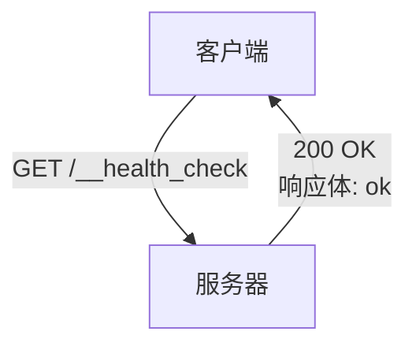
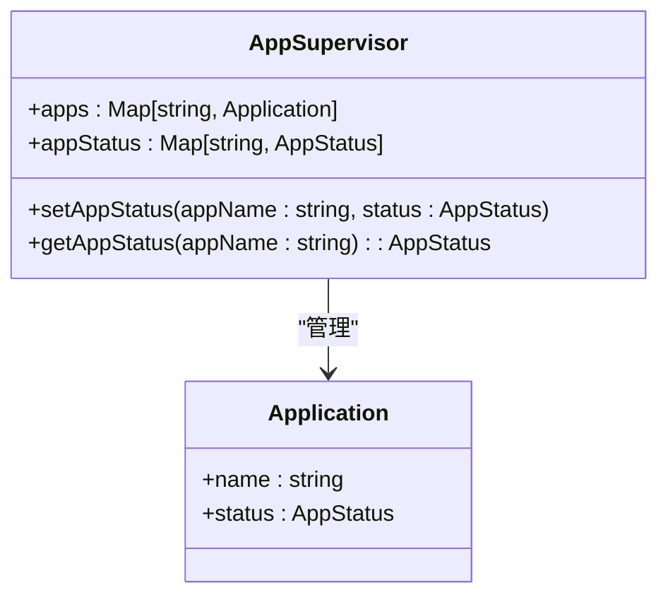
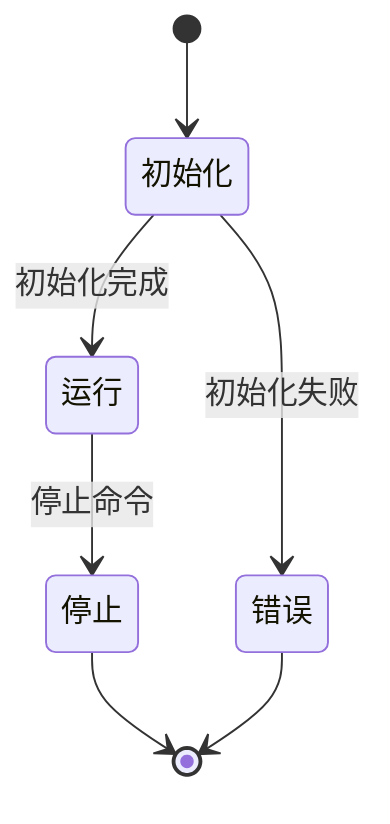
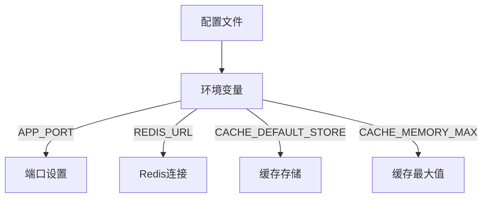

# 健康检查API

<cite>
**本文档引用文件**   
- [index.ts](file://packages/core/server/src/gateway/index.ts)
- [errors.ts](file://packages/core/server/src/gateway/errors.ts)
- [app-supervisor.ts](file://packages/core/server/src/app-supervisor.ts)
- [PluginCard.tsx](file://packages/core/client/src/pm/PluginCard.tsx)
- [commands.test.ts](file://packages/core/app/src/__tests__/commands.test.ts)
- [cache.ts](file://packages/core/app/src/config/cache.ts)
</cite>

## 目录
1. [简介](#简介)
2. [HTTP端点与响应格式](#http端点与响应格式)
3. [健康检查机制](#健康检查机制)
4. [状态码定义](#状态码定义)
5. [配置选项](#配置选项)
6. [外部监控系统集成示例](#外部监控系统集成示例)
7. [结果解读与故障排查](#结果解读与故障排查)

## 简介
NocoBase的健康检查API提供了一种标准化的方式来监控服务器的运行状态。该API通过一个简单的HTTP端点来检查服务器是否正常运行，并返回相应的状态信息。健康检查机制不仅检查服务器本身的运行状态，还涵盖了数据库连接、缓存服务以及关键依赖组件的可用性。通过配置选项，用户可以自定义健康检查的超时设置和检查频率，以适应不同的部署环境和需求。

**Section sources**
- [index.ts](file://packages/core/server/src/gateway/index.ts#L327-L332)
- [errors.ts](file://packages/core/server/src/gateway/errors.ts#L121-L125)

## HTTP端点与响应格式
健康检查API的主要HTTP端点是`/__health_check`，该端点通过GET请求来检查服务器的健康状态。当请求成功时，服务器会返回HTTP状态码200，并在响应体中返回字符串"ok"。此端点的设计旨在提供一个轻量级的健康检查机制，确保服务器能够快速响应并返回结果。



**Diagram sources**
- [index.ts](file://packages/core/server/src/gateway/index.ts#L327-L332)

**Section sources**
- [index.ts](file://packages/core/server/src/gateway/index.ts#L327-L332)
- [commands.test.ts](file://packages/core/app/src/__tests__/commands.test.ts#L28-L30)

## 健康检查机制
NocoBase的健康检查机制通过`AppSupervisor`类来管理应用程序的状态。`AppSupervisor`负责监控应用程序的生命周期，包括初始化、运行、停止等状态。当健康检查请求到达时，系统会检查当前应用程序的状态，并根据状态返回相应的响应。如果应用程序处于运行状态，则返回200状态码；如果应用程序正在初始化或遇到错误，则返回相应的错误状态码。



**Diagram sources**
- [app-supervisor.ts](file://packages/core/server/src/app-supervisor.ts#L24-L43)
- [errors.ts](file://packages/core/server/src/gateway/errors.ts#L121-L125)

**Section sources**
- [app-supervisor.ts](file://packages/core/server/src/app-supervisor.ts#L24-L43)
- [errors.ts](file://packages/core/server/src/gateway/errors.ts#L121-L125)

## 状态码定义
健康检查API使用一系列预定义的状态码来表示不同的健康状态。主要状态码包括：
- **200**: 应用程序正在运行。
- **503**: 应用程序正在初始化、停止或遇到错误。
- **404**: 应用程序未找到。
- **500**: 未知错误。

这些状态码通过`errors.ts`文件中的`errors`对象进行定义，并在健康检查过程中根据应用程序的实际状态进行返回。



**Diagram sources**
- [errors.ts](file://packages/core/server/src/gateway/errors.ts#L36-L132)

**Section sources**
- [errors.ts](file://packages/core/server/src/gateway/errors.ts#L36-L132)

## 配置选项
NocoBase允许通过环境变量来配置健康检查的相关选项。例如，可以通过设置`APP_PORT`来指定健康检查端口，通过`REDIS_URL`或`CACHE_REDIS_URL`来配置缓存服务的连接信息。此外，还可以通过`CACHE_DEFAULT_STORE`和`CACHE_MEMORY_MAX`来设置缓存的默认存储方式和内存最大值。



**Diagram sources**
- [cache.ts](file://packages/core/app/src/config/cache.ts#L11-L28)
- [index.ts](file://packages/core/app/src/config/index.ts#L21-L23)

**Section sources**
- [cache.ts](file://packages/core/app/src/config/cache.ts#L11-L28)
- [index.ts](file://packages/core/app/src/config/index.ts#L21-L23)

## 外部监控系统集成示例
健康检查API可以轻松集成到外部监控系统中，如Prometheus或Nagios。以下是一个使用Prometheus进行监控的示例配置：

```yaml
scrape_configs:
  - job_name: 'nocobase'
    static_configs:
      - targets: ['localhost:13000']
    metrics_path: '/__health_check'
```

此配置将Prometheus设置为定期从NocoBase的健康检查端点获取数据，从而实现对服务器状态的持续监控。

**Section sources**
- [index.ts](file://packages/core/server/src/gateway/index.ts#L327-L332)
- [commands.test.ts](file://packages/core/app/src/__tests__/commands.test.ts#L28-L30)

## 结果解读与故障排查
健康检查的结果可以帮助运维人员快速识别服务器的问题。如果健康检查返回200状态码，则表示服务器运行正常。如果返回503状态码，则需要检查应用程序的日志以确定具体原因。常见的故障包括数据库连接失败、缓存服务不可用或关键依赖组件缺失。通过查看日志文件和监控指标，可以进一步定位问题并采取相应的解决措施。

**Section sources**
- [errors.ts](file://packages/core/server/src/gateway/errors.ts#L121-L125)
- [app-supervisor.ts](file://packages/core/server/src/app-supervisor.ts#L24-L43)