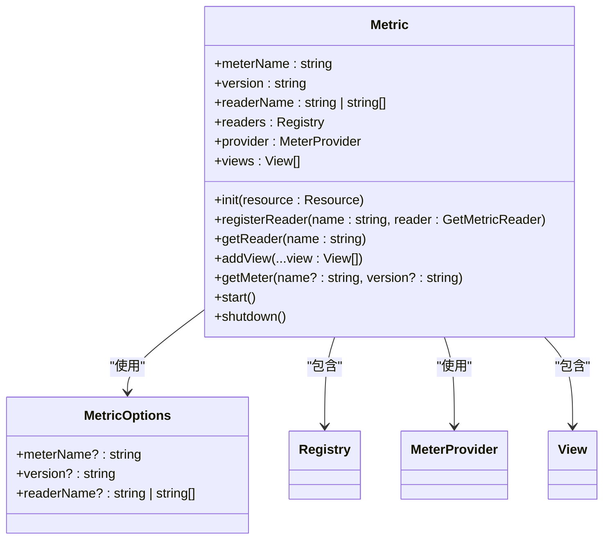
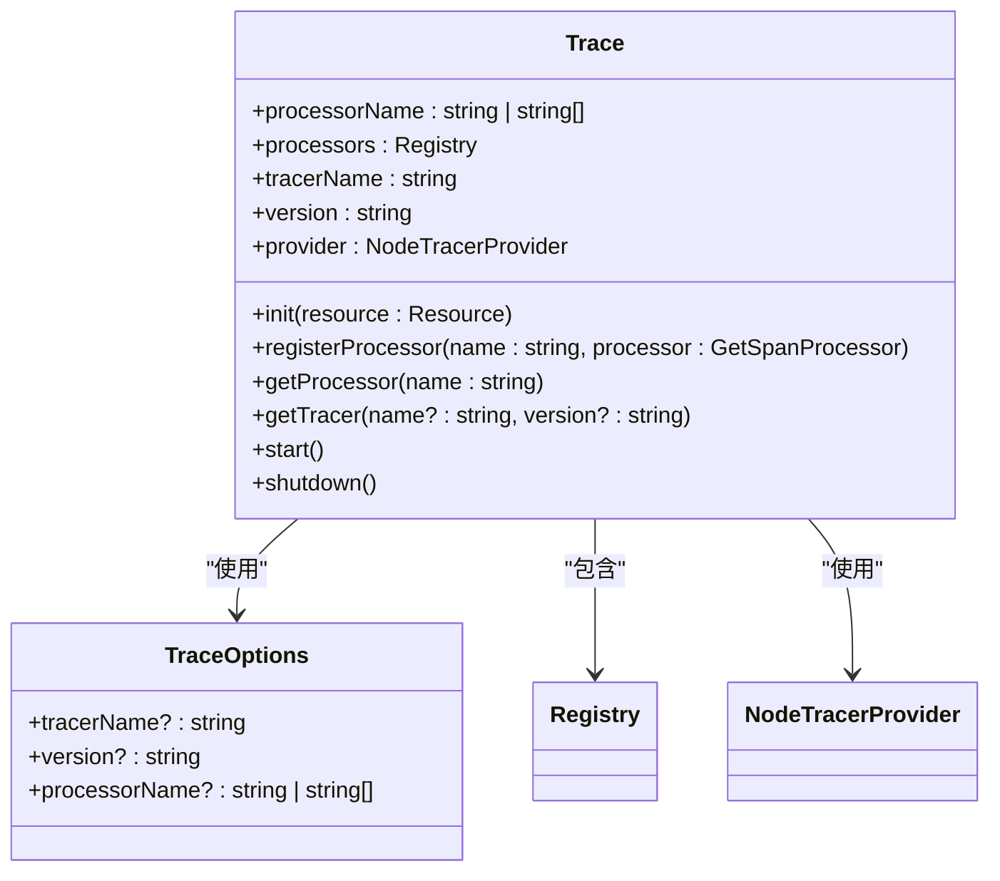
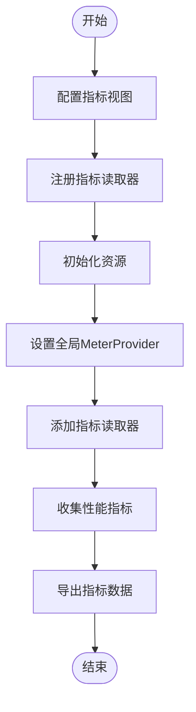
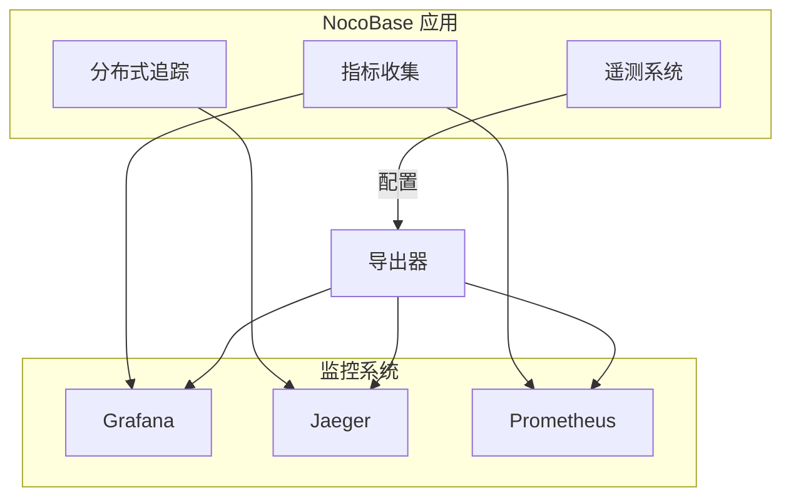
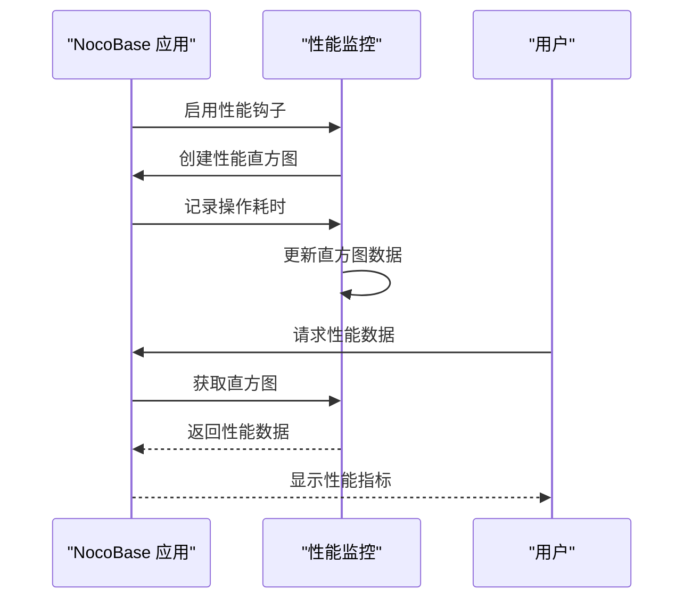
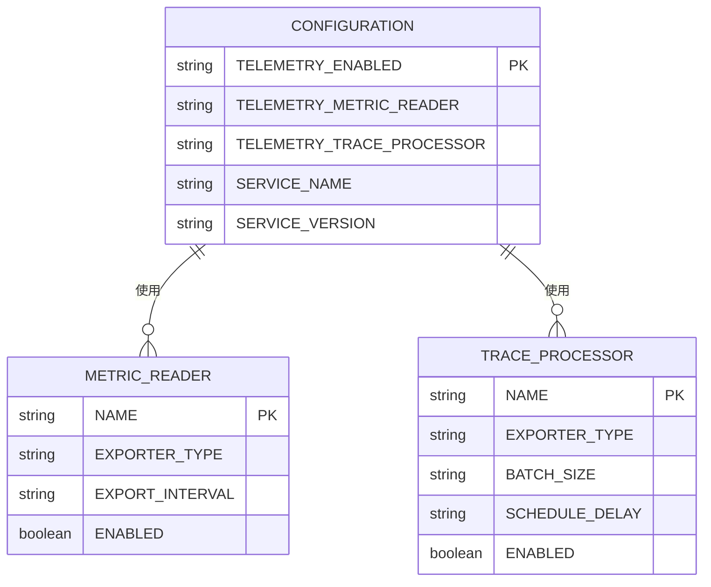
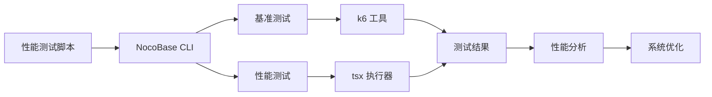

# 性能指标API

<cite>
**本文档中引用的文件**  
- [telemetry.ts](file://packages/core/app/src/config/telemetry.ts)
- [telemetry.ts](file://packages/core/telemetry/src/telemetry.ts)
- [trace.ts](file://packages/core/telemetry/src/trace.ts)
- [metric.ts](file://packages/core/telemetry/src/metric.ts)
- [helper.ts](file://packages/core/server/src/helper.ts)
- [index.js](file://benchmark/nocobase-server/index.js)
</cite>

## 目录
1. [简介](#简介)
2. [性能指标收集](#性能指标收集)
3. [分布式追踪](#分布式追踪)
4. [指标聚合与采样](#指标聚合与采样)
5. [监控系统集成](#监控系统集成)
6. [性能基线与异常分析](#性能基线与异常分析)
7. [配置与环境变量](#配置与环境变量)
8. [性能测试工具](#性能测试工具)

## 简介
NocoBase 提供了一套完整的性能监控和追踪系统，基于 OpenTelemetry 标准实现。该系统能够收集 CPU 使用率、内存占用、请求延迟、数据库查询性能等关键性能指标，并支持分布式追踪功能，帮助开发者分析性能瓶颈。系统通过可配置的指标收集器和追踪处理器，将数据导出到各种监控工具，如 Grafana 和 Jaeger。

**Section sources**
- [telemetry.ts](file://packages/core/app/src/config/telemetry.ts)
- [telemetry.ts](file://packages/core/telemetry/src/telemetry.ts)

## 性能指标收集
NocoBase 的性能指标收集系统基于 OpenTelemetry SDK Metrics 实现，能够收集和导出各种性能指标。系统提供了灵活的指标读取器（Metric Reader）机制，支持多种导出方式。

**Diagram sources **
- [metric.ts](file://packages/core/telemetry/src/metric.ts)

**Section sources**
- [metric.ts](file://packages/core/telemetry/src/metric.ts)

## 分布式追踪
NocoBase 的分布式追踪系统基于 OpenTelemetry SDK Trace 实现，支持跨服务的请求追踪。系统通过追踪处理器（Span Processor）将追踪数据导出到不同的后端系统。

**Diagram sources **
- [trace.ts](file://packages/core/telemetry/src/trace.ts)

**Section sources**
- [trace.ts](file://packages/core/telemetry/src/trace.ts)

## 指标聚合与采样
NocoBase 的性能监控系统支持灵活的指标聚合和采样策略。系统通过视图（View）机制定义指标的聚合方式，并通过配置控制采样率和存储周期。

**Diagram sources **
- [metric.ts](file://packages/core/telemetry/src/metric.ts)

**Section sources**
- [metric.ts](file://packages/core/telemetry/src/metric.ts)

## 监控系统集成
NocoBase 支持与多种监控工具集成，包括 Grafana 和 Jaeger。通过配置不同的指标读取器和追踪处理器，可以将性能数据导出到相应的监控系统。

**Diagram sources **
- [telemetry.ts](file://packages/core/telemetry/src/telemetry.ts)

**Section sources**
- [telemetry.ts](file://packages/core/telemetry/src/telemetry.ts)

## 性能基线与异常分析
NocoBase 提供了性能基线参考和异常指标解读方法，帮助用户进行系统优化和容量规划。系统通过性能直方图（Histogram）记录关键操作的执行时间分布。

**Diagram sources **
- [helper.ts](file://packages/core/server/src/helper.ts)

**Section sources**
- [helper.ts](file://packages/core/server/src/helper.ts)

## 配置与环境变量
NocoBase 的性能监控系统通过环境变量进行配置，支持灵活的启用和配置选项。主要配置项包括指标读取器和追踪处理器的选择。

**Diagram sources **
- [telemetry.ts](file://packages/core/app/src/config/telemetry.ts)

**Section sources**
- [telemetry.ts](file://packages/core/app/src/config/telemetry.ts)

## 性能测试工具
NocoBase 提供了专门的性能测试工具，用于评估系统在不同负载下的表现。这些工具可以帮助开发者识别性能瓶颈并进行优化。

**Diagram sources **
- [index.js](file://benchmark/nocobase-server/index.js)

**Section sources**
- [index.js](file://benchmark/nocobase-server/index.js)