# 日志API

<cite>
**本文档引用的文件**  
- [logger.ts](file://packages/core/logger/src/logger.ts)
- [config.ts](file://packages/core/logger/src/config.ts)
- [transports.ts](file://packages/core/logger/src/transports.ts)
- [format.ts](file://packages/core/logger/src/format.ts)
- [system-logger.ts](file://packages/core/logger/src/system-logger.ts)
- [request-logger.ts](file://packages/core/logger/src/request-logger.ts)
- [logger.ts](file://packages/plugins/@nocobase/plugin-logger/src/server/resourcer/logger.ts)
- [plugin.ts](file://packages/plugins/@nocobase/plugin-logger/src/server/plugin.ts)
</cite>

## 目录
1. [简介](#简介)
2. [日志查询接口](#日志查询接口)
3. [日志条目结构](#日志条目结构)
4. [分页与流式传输](#分页与流式传输)
5. [安全考虑](#安全考虑)
6. [系统集成](#系统集成)
7. [最佳实践](#最佳实践)

## 简介

NocoBase的日志系统提供了全面的日志访问和管理功能，支持按日志级别、时间范围和组件进行过滤查询。系统基于Winston日志库构建，提供了灵活的配置选项和安全的访问控制机制。日志API允许用户通过REST接口访问和下载日志文件，支持多种日志格式和传输方式。

**Section sources**
- [logger.ts](file://packages/core/logger/src/logger.ts#L1-L69)
- [config.ts](file://packages/core/logger/src/config.ts#L1-L24)

## 日志查询接口

NocoBase的日志查询接口提供了多种过滤选项，允许用户根据不同的条件检索日志信息。

### 按日志级别过滤

系统支持以下日志级别，按严重程度从高到低排列：
- **error**: 错误级别，记录系统错误和异常
- **warn**: 警告级别，记录潜在问题
- **info**: 信息级别，记录常规操作信息
- **debug**: 调试级别，记录详细的调试信息
- **trace**: 跟踪级别，记录最详细的执行跟踪

日志级别可以通过环境变量`LOGGER_LEVEL`进行配置，默认在开发环境中为`debug`，在生产环境中为`info`。

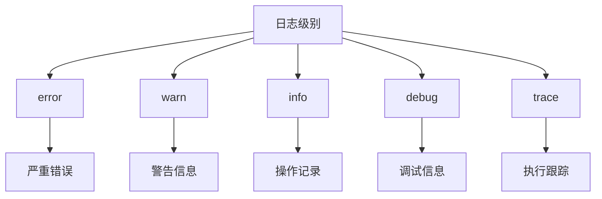

**Diagram sources**
- [logger.ts](file://packages/core/logger/src/logger.ts#L27-L33)
- [config.ts](file://packages/core/logger/src/config.ts#L12-L13)

### 按时间范围检索

日志系统支持按时间范围检索日志，通过`dailyRotateFile`传输器实现日志文件的按日轮转。用户可以通过文件名中的日期标识来定位特定时间段的日志。

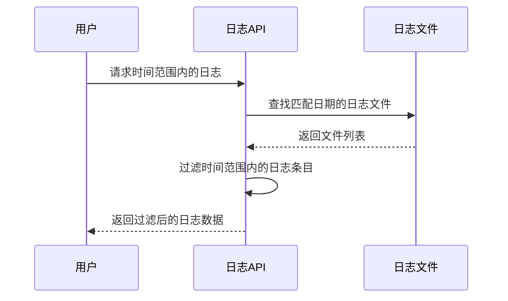

**Diagram sources**
- [transports.ts](file://packages/core/logger/src/transports.ts#L25-L30)
- [logger.ts](file://packages/plugins/@nocobase/plugin-logger/src/server/resourcer/logger.ts#L33-L53)

### 按组件筛选

日志系统支持按组件进行筛选，主要组件包括：
- **数据库**: SQL执行日志
- **认证**: 用户认证和授权日志
- **插件**: 各个插件的运行日志

通过`module`和`submodule`元数据字段，可以对不同组件的日志进行分类和筛选。

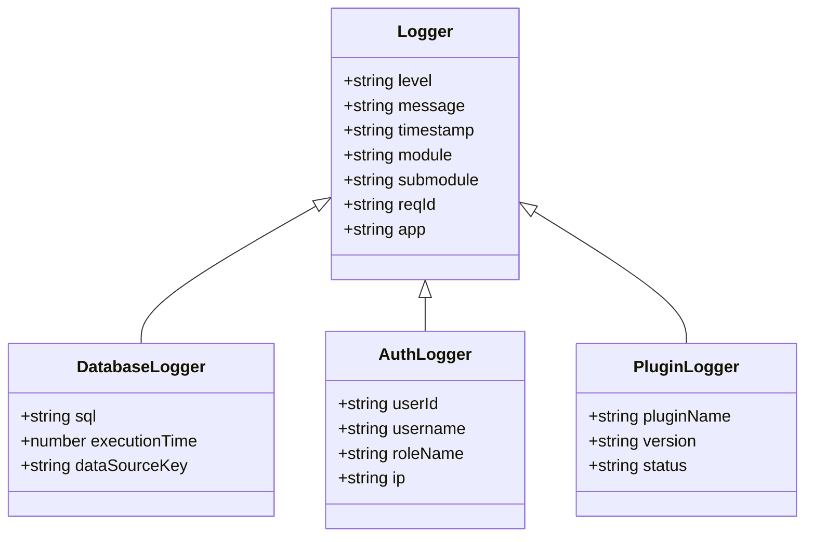

**Diagram sources**
- [request-logger.ts](file://packages/core/logger/src/request-logger.ts#L36-L92)
- [system-logger.ts](file://packages/core/logger/src/system-logger.ts#L17-L37)

## 日志条目结构

每个日志条目包含丰富的上下文信息，便于问题排查和系统监控。

### 基本字段

| 字段 | 类型 | 描述 |
|------|------|------|
| timestamp | string | ISO 8601格式的时间戳 |
| level | string | 日志级别 (error, warn, info, debug, trace) |
| message | string | 日志消息内容 |
| reqId | string | 请求唯一标识符 |
| app | string | 应用名称 |
| module | string | 模块名称 |
| submodule | string | 子模块名称 |

### 请求相关字段

当记录请求日志时，包含以下额外字段：

| 字段 | 类型 | 描述 |
|------|------|------|
| method | string | HTTP方法 (GET, POST, PUT, DELETE等) |
| path | string | 请求路径 |
| userId | number | 用户ID |
| username | string | 用户名 |
| status | number | HTTP状态码 |
| cost | number | 请求处理时间(毫秒) |
| bodySize | number | 响应体大小(字节) |

### 上下文数据

日志系统自动收集和记录上下文数据，包括：

- **请求上下文**: 请求头、查询参数、请求体(过滤敏感信息)
- **用户上下文**: 当前用户身份、角色、权限
- **系统上下文**: 应用环境、数据源、主机信息

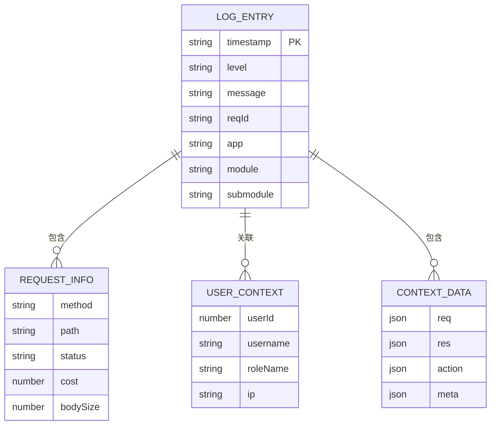

**Section sources**
- [request-logger.ts](file://packages/core/logger/src/request-logger.ts#L44-L83)
- [system-logger.ts](file://packages/core/logger/src/system-logger.ts#L63-L78)

## 分页与流式传输

### 分页查询

日志API支持分页查询功能，通过以下参数控制分页：

- **page**: 页码，从1开始
- **pageSize**: 每页大小，默认50条
- **sort**: 排序字段，支持按时间倒序

分页查询通过`list`接口实现，返回分页后的日志条目列表和总记录数。

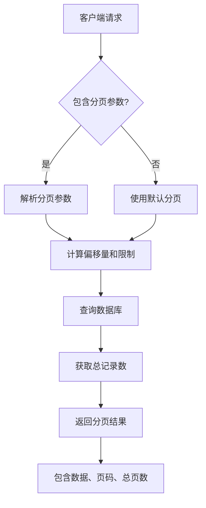

**Section sources**
- [data-source-manager\list.ts](file://packages/core/data-source-manager/src/default-actions/list.ts#L41-L77)

### 日志流式传输

对于大日志文件的处理，系统提供了流式传输功能：

1. **文件流式读取**: 逐块读取大日志文件，避免内存溢出
2. **压缩传输**: 支持Gzip压缩，减少网络传输量
3. **断点续传**: 支持HTTP Range请求，实现断点续传

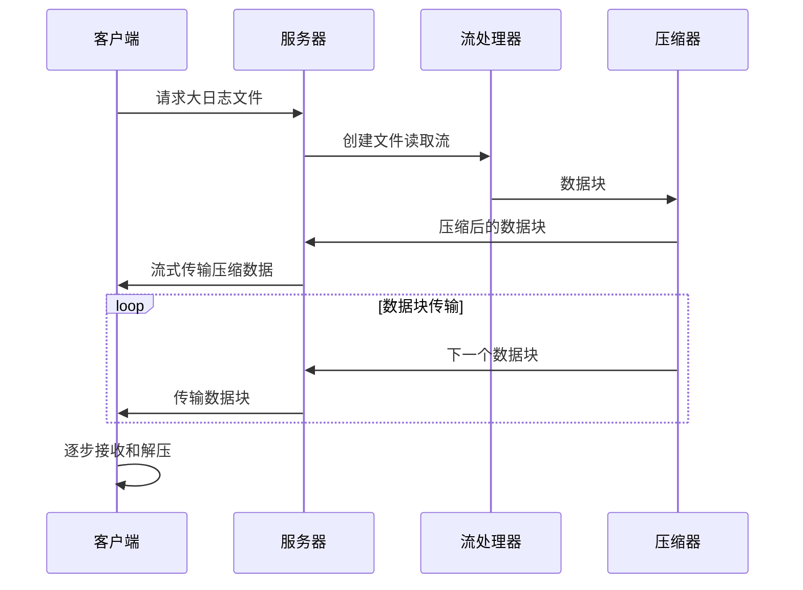

**Diagram sources**
- [logger.ts](file://packages/plugins/@nocobase/plugin-logger/src/server/resourcer/logger.ts#L55-L79)

## 安全考虑

### 访问权限控制

日志访问受到严格的权限控制，通过ACL(访问控制列表)系统实现：

- **角色权限**: 只有具有`logger:*`权限的角色才能访问日志
- **插件权限**: 日志插件注册了`pm.logger`权限片段
- **最小权限原则**: 默认不授予日志访问权限

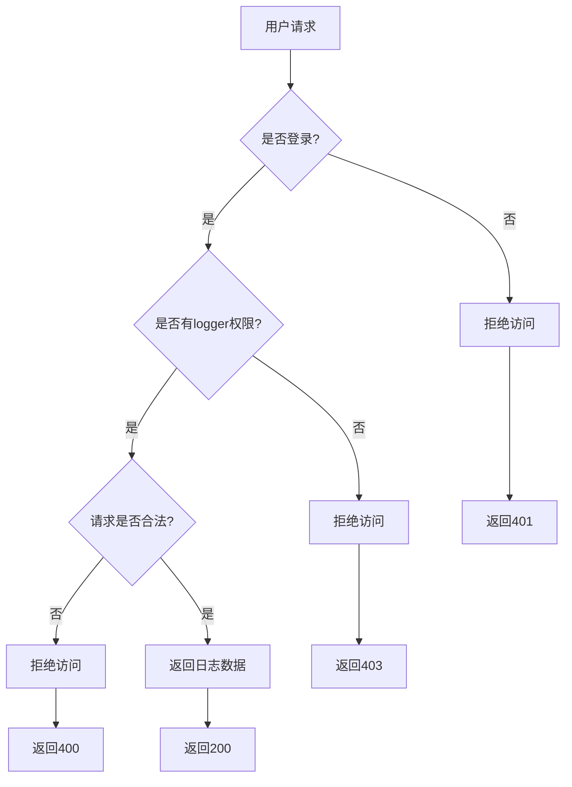

**Diagram sources**
- [plugin.ts](file://packages/plugins/@nocobase/plugin-logger/src/server/plugin.ts#L18-L23)
- [acl.ts](file://packages/core/acl/src/acl.ts#L339-L354)

### 敏感信息过滤

系统自动过滤和保护敏感信息：

1. **密码过滤**: 在日志中自动屏蔽密码字段
2. **路径安全检查**: 防止目录遍历攻击
3. **环境变量保护**: 仅暴露必要的环境变量

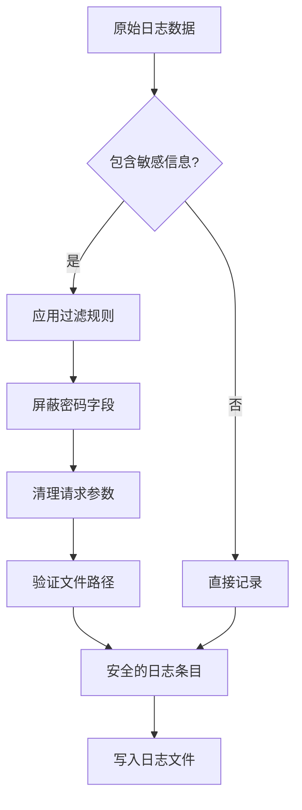

**Section sources**
- [request-logger.ts](file://packages/core/logger/src/request-logger.ts#L23-L28)
- [logger.ts](file://packages/plugins/@nocobase/plugin-logger/src/server/resourcer/logger.ts#L121-L135)

## 系统集成

### ELK栈集成

NocoBase日志系统可以与ELK(Elasticsearch, Logstash, Kibana)栈集成：

1. **日志格式**: 使用`json`格式输出，便于Logstash解析
2. **Filebeat采集**: 配置Filebeat监控日志目录
3. **Elasticsearch索引**: 自动创建索引模板

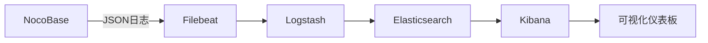

**Section sources**
- [format.ts](file://packages/core/logger/src/format.ts#L37-L39)

### Loki集成

与Grafana Loki的日志系统集成：

1. **日志标签**: 使用Prometheus风格的标签
2. **Push模式**: 通过Loki Push API发送日志
3. **查询语言**: 支持LogQL查询

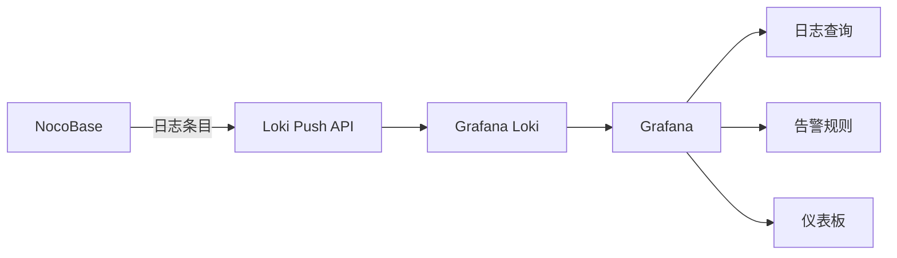

**Section sources**
- [config.ts](file://packages/core/logger/src/config.ts#L19-L20)

## 最佳实践

### 配置建议

1. **生产环境**: 设置`LOGGER_LEVEL=info`，避免过多调试日志
2. **日志轮转**: 启用`dailyRotateFile`，按日分割日志文件
3. **存储路径**: 使用`LOGGER_BASE_PATH`指定独立的存储位置

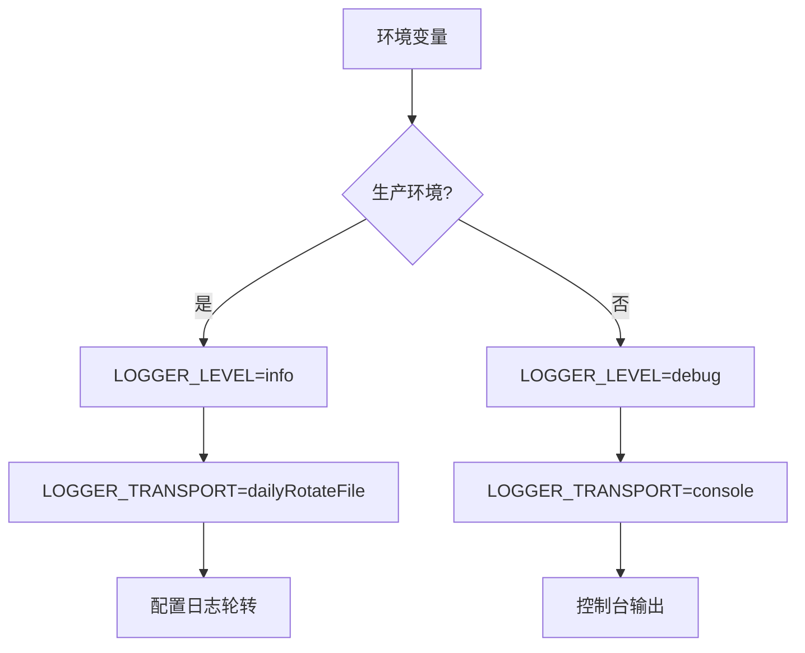

**Section sources**
- [config.ts](file://packages/core/logger/src/config.ts#L12-L20)

### 性能优化

1. **异步写入**: 确保日志写入不会阻塞主流程
2. **批量处理**: 对高频日志进行批量写入
3. **压缩存储**: 启用日志文件压缩，节省磁盘空间

### 故障排查

1. **请求ID追踪**: 使用`X-Request-Id`追踪完整请求链路
2. **错误上下文**: 记录足够的上下文信息便于问题定位
3. **定期清理**: 设置日志保留策略，避免磁盘空间耗尽

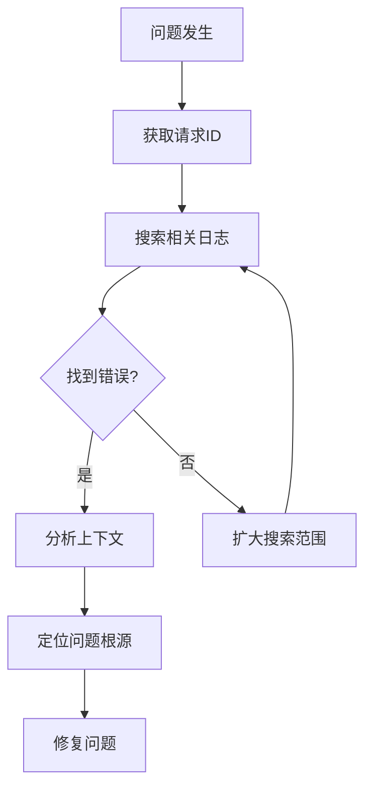

**Section sources**
- [request-logger.ts](file://packages/core/logger/src/request-logger.ts#L38-L40)
- [system-logger.ts](file://packages/core/logger/src/system-logger.ts#L63-L78)