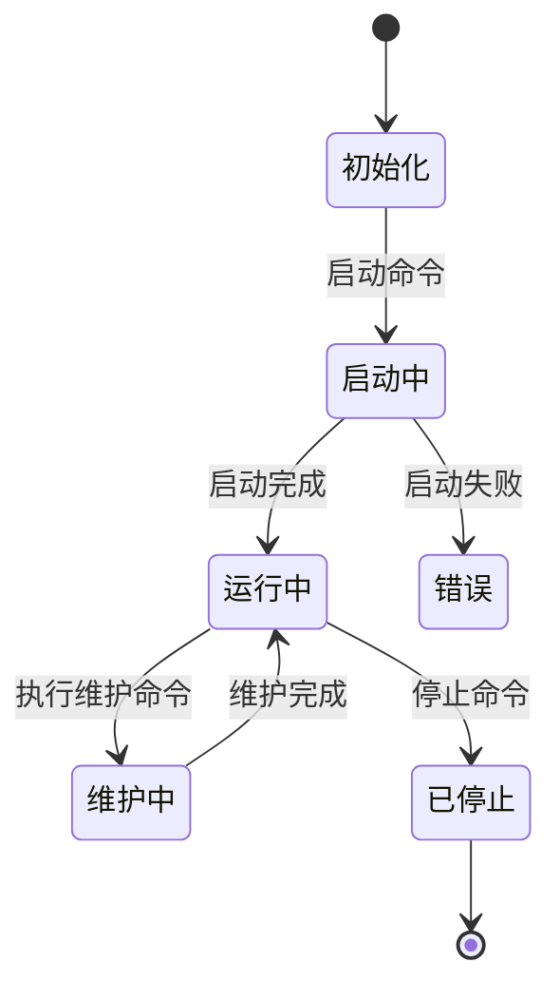
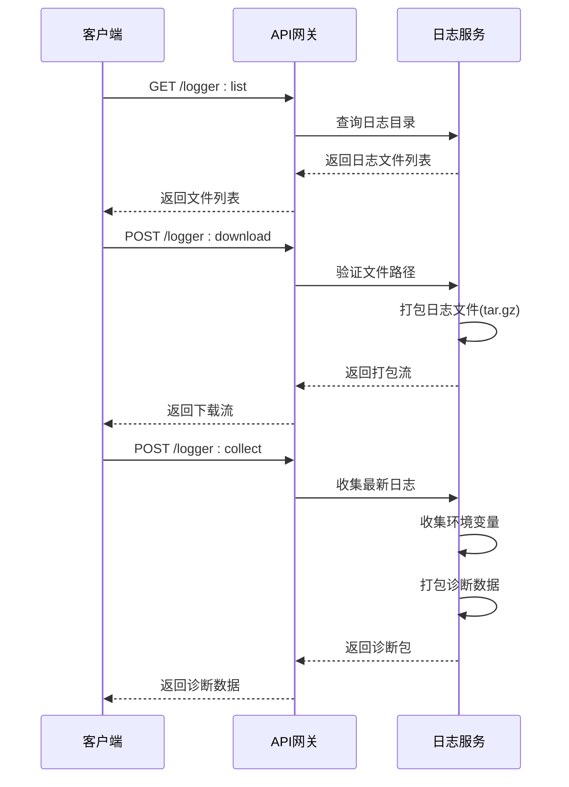
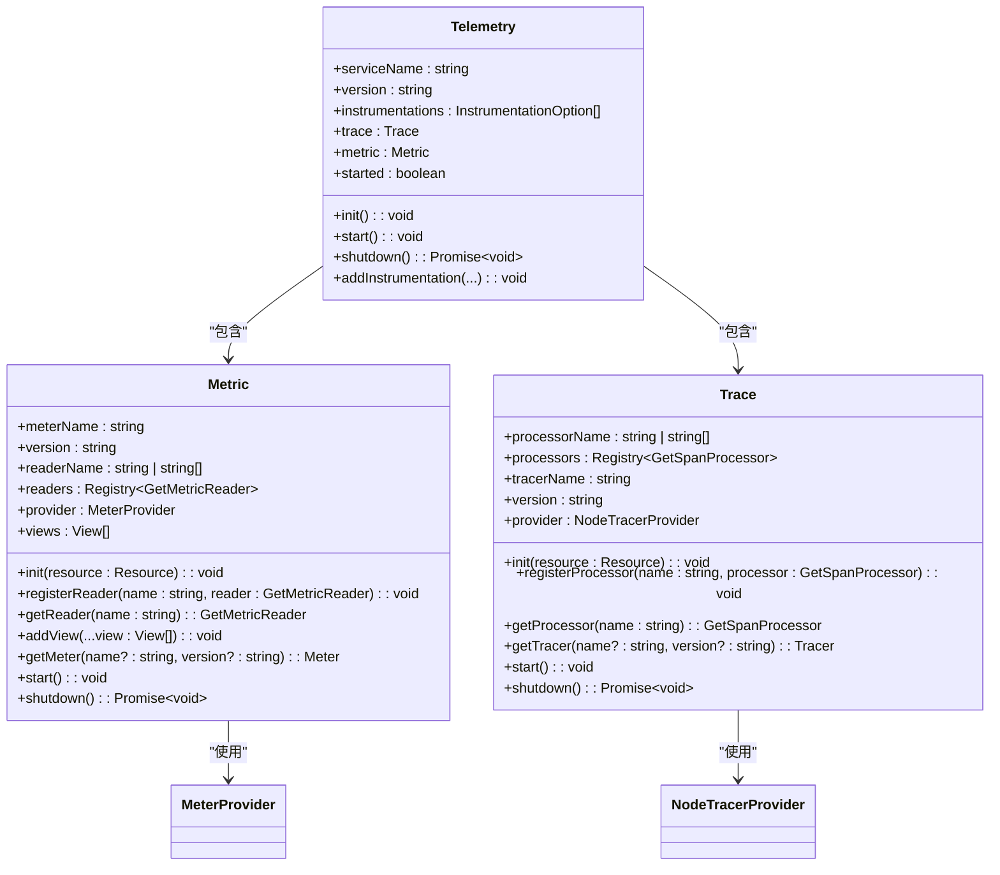
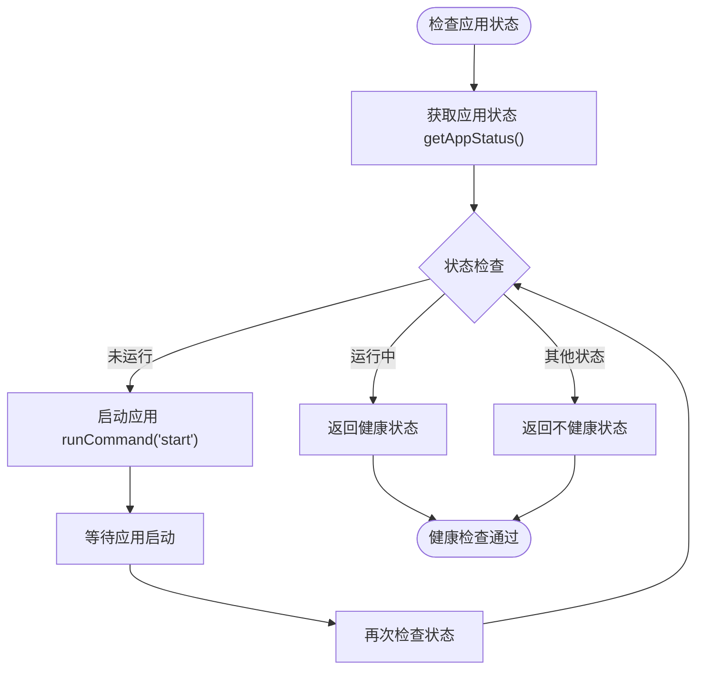
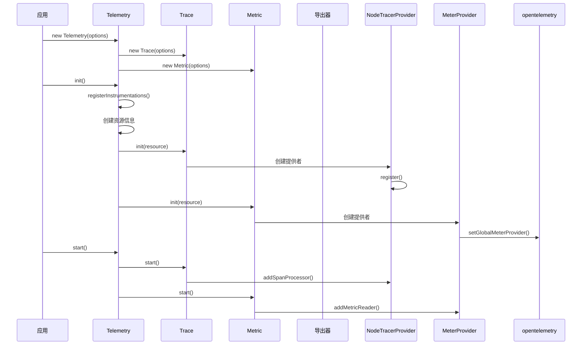
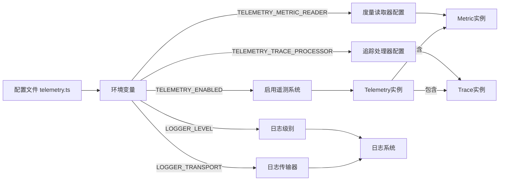

# 系统监控API

<cite>
**本文档中引用的文件**  
- [telemetry.ts](file://packages\core\telemetry\src\telemetry.ts)
- [metric.ts](file://packages\core\telemetry\src\metric.ts)
- [trace.ts](file://packages\core\telemetry\src\trace.ts)
- [telemetry.ts](file://packages\core\app\src\config\telemetry.ts)
- [logger.ts](file://packages\plugins\@nocobase\plugin-logger\src\server\resourcer\logger.ts)
- [errors.ts](file://packages\core\server\src\gateway\errors.ts)
- [index.ts](file://packages\core\server\src\gateway\index.ts)
</cite>

## 目录
1. [引言](#引言)
2. [系统状态查询API](#系统状态查询api)
3. [日志访问API](#日志访问api)
4. [性能指标与监控数据](#性能指标与监控数据)
5. [数据库、缓存与队列状态检查](#数据库缓存与队列状态检查)
6. [追踪与度量数据获取](#追踪与度量数据获取)
7. [配置与环境变量](#配置与环境变量)

## 引言
NocoBase系统提供了全面的监控和诊断API，用于系统健康检查、资源使用监控、日志管理、性能分析和故障排查。本文档详细说明了这些API的功能、使用方法和配置选项，帮助开发者和运维人员有效监控系统状态，确保系统稳定运行。

## 系统状态查询API

NocoBase提供了服务器健康检查接口，用于查询系统运行状态。系统通过HTTP端点`/__health_check`提供健康检查服务，当系统正常运行时返回HTTP状态码200和文本"ok"。

系统定义了多种应用状态，包括运行中（APP_RUNNING）、启动中（APP_STARTING）、已停止（APP_STOPPED）、初始化中（APP_INITIALIZING）等。这些状态通过错误码系统进行管理，每个状态对应特定的HTTP状态码和消息。例如，运行中状态返回200状态码，而维护状态返回503状态码。

**图表来源**
- [errors.ts](file://packages\core\server\src\gateway\errors.ts#L76-L125)
- [index.ts](file://packages\core\server\src\gateway\index.ts#L328-L331)

**章节来源**
- [errors.ts](file://packages\core\server\src\gateway\errors.ts#L76-L125)
- [index.ts](file://packages\core\server\src\gateway\index.ts#L328-L331)

## 日志访问API

NocoBase提供了完整的日志管理API，支持日志文件的列表查询、下载和诊断信息收集。日志API通过`logger`资源提供三个主要操作：`list`、`download`和`collect`。

`list`操作返回指定应用的日志文件列表，按目录结构组织。`download`操作允许下载指定的日志文件，支持单个或多个文件的批量下载，文件以tar.gz格式打包返回。`collect`操作用于诊断目的，收集最新的请求日志、SQL日志、系统日志和环境变量信息，并打包返回。

日志文件路径通过`getLoggerFilePath`函数确定，通常位于系统的`storage/logs`目录下。API实现了严格的安全检查，防止路径遍历攻击，确保只能访问合法的日志文件。

**图表来源**
- [logger.ts](file://packages\plugins\@nocobase\plugin-logger\src\server\resourcer\logger.ts#L85-L171)

**章节来源**
- [logger.ts](file://packages\plugins\@nocobase\plugin-logger\src\server\resourcer\logger.ts#L85-L171)

## 性能指标与监控数据

NocoBase集成了OpenTelemetry框架，提供全面的性能指标收集和监控数据导出功能。系统通过`Telemetry`类统一管理追踪（tracing）和度量（metrics）功能，支持多种数据导出器。

性能指标系统基于`Metric`类实现，支持注册不同的度量读取器（MetricReader）。系统默认配置了控制台导出器（ConsoleMetricExporter），可将指标数据输出到控制台。通过环境变量`TELEMETRY_METRIC_READER`可以配置其他导出器，支持多个导出器通过逗号分隔配置。

度量系统使用`MeterProvider`作为全局度量提供者，所有度量数据通过`getMeter`方法获取。系统支持视图（View）配置，可以对度量数据进行转换和聚合。`start`方法启动所有配置的读取器，开始收集和导出度量数据。

**图表来源**
- [telemetry.ts](file://packages\core\telemetry\src\telemetry.ts#L23-L71)
- [metric.ts](file://packages\core\telemetry\src\metric.ts#L29-L86)
- [trace.ts](file://packages\core\telemetry\src\trace.ts#L23-L71)

**章节来源**
- [telemetry.ts](file://packages\core\telemetry\src\telemetry.ts#L23-L71)
- [metric.ts](file://packages\core\telemetry\src\metric.ts#L29-L86)
- [trace.ts](file://packages\core\telemetry\src\trace.ts#L23-L71)

## 数据库缓存与队列状态检查

NocoBase通过应用监管器（AppSupervisor）管理多个应用实例的状态。每个应用实例的状态包括：运行中（running）、初始化中（initializing）、已停止（stopped）等。通过`getAppStatus`方法可以查询指定应用的状态。

系统在多应用管理器中集成了状态检查功能，在列出应用时自动注入状态信息。当请求到达网关时，会检查目标应用的状态，如果应用未运行则自动启动。网关通过`__health_check`端点提供健康检查服务，支持前端插件定期检查系统健康状态。

对于数据库连接，系统通过数据库管理器（DBManager）管理连接状态。缓存状态通过缓存管理器（Cache）实现，支持内存缓存和分布式缓存。计数器功能通过`MemoryCounter`和`LockCounter`实现，支持原子性递增操作和分布式锁保护。

**图表来源**
- [index.ts](file://packages\core\server\src\gateway\index.ts#L303-L324)
- [server.ts](file://packages\plugins\@nocobase\plugin-multi-app-manager\src\server\server.ts#L437-L438)

**章节来源**
- [index.ts](file://packages\core\server\src\gateway\index.ts#L303-L324)
- [server.ts](file://packages\plugins\@nocobase\plugin-multi-app-manager\src\server\server.ts#L437-L438)

## 追踪与度量数据获取

NocoBase的追踪系统基于OpenTelemetry SDK实现，通过`Trace`类管理追踪功能。系统支持注册不同的跨度处理器（SpanProcessor），默认配置了批量处理器（BatchSpanProcessor）和控制台导出器（ConsoleSpanExporter）。

追踪数据通过`NodeTracerProvider`管理，所有追踪器通过`getTracer`方法获取。`start`方法启动所有配置的处理器，开始收集和导出追踪数据。系统支持通过环境变量`TELEMETRY_TRACE_PROCESSOR`配置处理器，支持多个处理器通过逗号分隔配置。

追踪和度量系统在`Telemetry`类中统一初始化，通过`init`方法设置资源信息，包括服务名称和服务版本。`start`方法启动追踪和度量功能，`shutdown`方法优雅地关闭所有收集器。系统支持添加仪器化选项，用于自动收集框架和库的追踪数据。

**图表来源**
- [telemetry.ts](file://packages\core\telemetry\src\telemetry.ts#L39-L59)
- [trace.ts](file://packages\core\telemetry\src\trace.ts#L38-L43)
- [metric.ts](file://packages\core\telemetry\src\metric.ts#L51-L54)

**章节来源**
- [telemetry.ts](file://packages\core\telemetry\src\telemetry.ts#L39-L59)
- [trace.ts](file://packages\core\telemetry\src\trace.ts#L38-L43)
- [metric.ts](file://packages\core\telemetry\src\metric.ts#L51-L54)

## 配置与环境变量

NocoBase的监控功能通过配置文件和环境变量进行控制。核心配置位于`packages/core/app/src/config/telemetry.ts`文件中，通过环境变量控制各项功能的启用状态。

`TELEMETRY_ENABLED`环境变量控制整个遥测系统的启用状态，值为"on"时启用。`TELEMETRY_METRIC_READER`环境变量配置度量数据的读取器，`TELEMETRY_TRACE_PROCESSOR`环境变量配置追踪数据的处理器。这些配置在应用启动时读取，用于初始化`Telemetry`实例。

日志系统通过`LOGGER_TRANSPORT`和`LOGGER_LEVEL`环境变量配置日志传输器和日志级别。系统环境变量列表在`plugin-logger`插件中定义，包括`APP_ENV`、`APP_PORT`、`DB_DIALECT`等关键配置项，这些信息在诊断时会被收集。

**图表来源**
- [telemetry.ts](file://packages\core\app\src\config\telemetry.ts#L13-L20)
- [logger.ts](file://packages\plugins\@nocobase\plugin-logger\src\server\resourcer\logger.ts#L19-L31)

**章节来源**
- [telemetry.ts](file://packages\core\app\src\config\telemetry.ts#L13-L20)
- [logger.ts](file://packages\plugins\@nocobase\plugin-logger\src\server\resourcer\logger.ts#L19-L31)