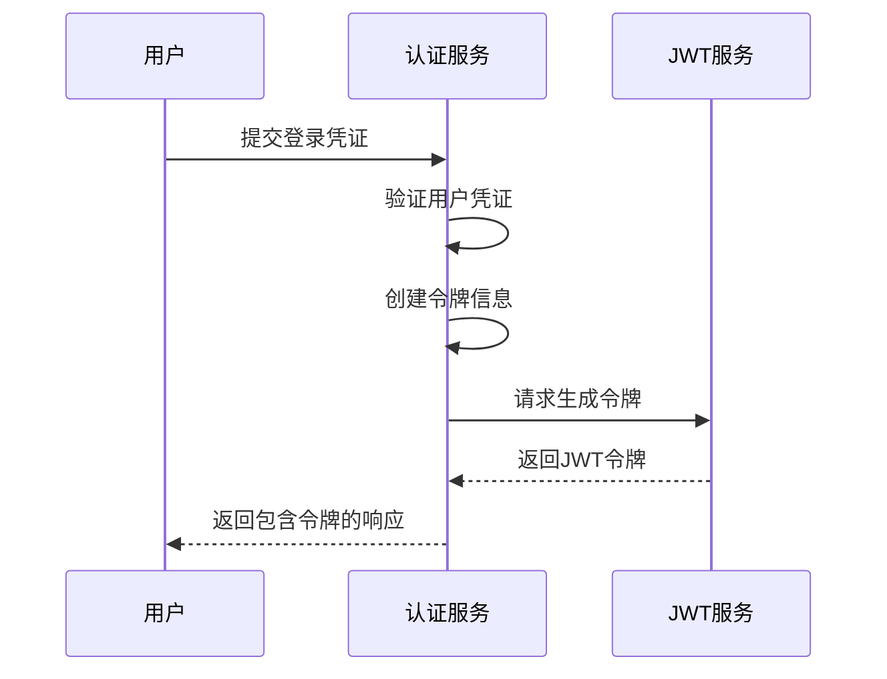
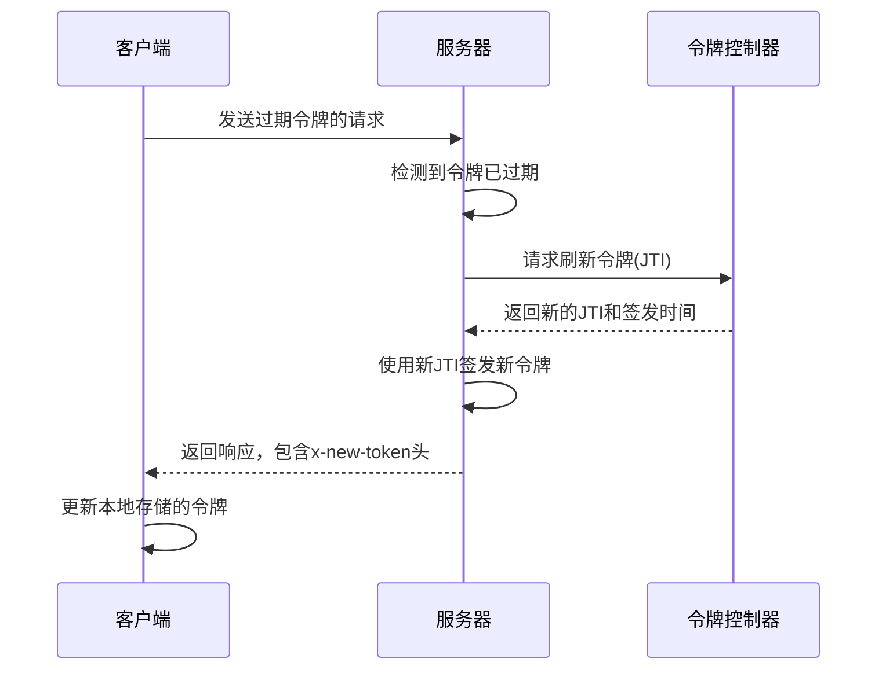
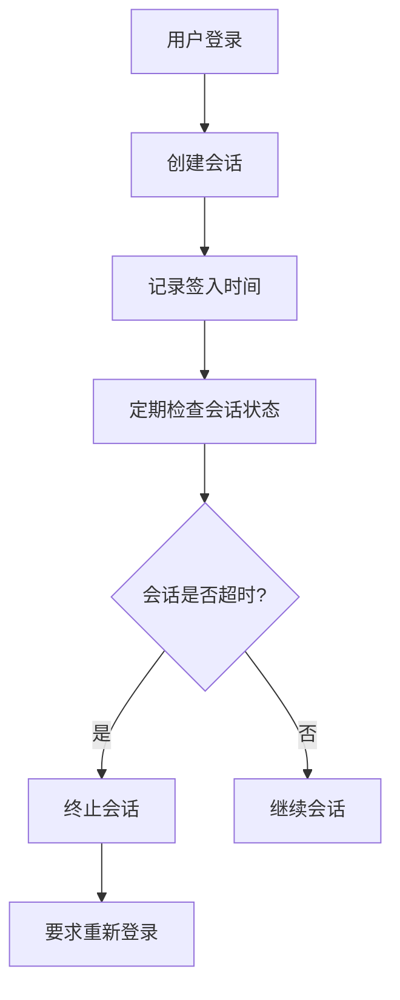
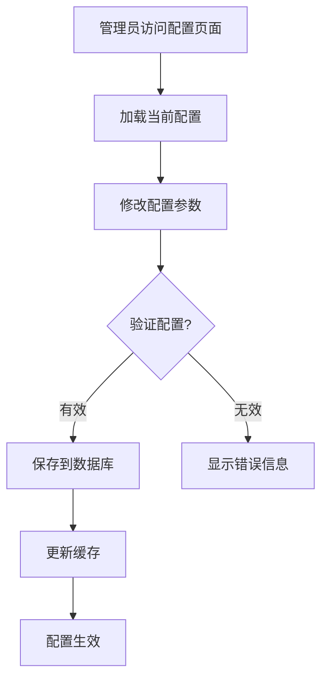

# 会话安全

<cite>
**本文档中引用的文件**  
- [auth-manager.ts](file://packages/core/auth/src/auth-manager.ts)
- [jwt-service.ts](file://packages/core/auth/src/base/jwt-service.ts)
- [token-controller.ts](file://packages/plugins/@nocobase/plugin-auth/src/server/token-controller.ts)
- [token-blacklist.ts](file://packages/plugins/@nocobase/plugin-auth/src/server/token-blacklist.ts)
- [base/auth.ts](file://packages/core/auth/src/base/auth.ts)
- [constants.ts](file://packages/plugins/@nocobase/plugin-auth/src/constants.ts)
- [token-policy-config.ts](file://packages/plugins/@nocobase/plugin-auth/src/server/collections/token-poilcy-config.ts)
- [token-blacklist.ts](file://packages/plugins/@nocobase/plugin-auth/src/server/collections/token-blacklist.ts)
- [plugin.ts](file://packages/plugins/@nocobase/plugin-auth/src/server/plugin.ts)
- [settings/token-policy/hooks.ts](file://packages/plugins/@nocobase/plugin-auth/src/client/settings/token-policy/hooks.ts)
</cite>

## 目录
1. [简介](#简介)
2. [JWT令牌机制](#jwt令牌机制)
3. [会话管理功能](#会话管理功能)
4. [令牌黑名单机制](#令牌黑名单机制)
5. [会话安全配置](#会话安全配置)
6. [最佳实践](#最佳实践)
7. [常见安全漏洞防范](#常见安全漏洞防范)

## 简介
NocoBase采用基于JWT（JSON Web Token）的会话安全机制，提供完整的身份验证和会话管理功能。系统通过JWT令牌实现无状态的身份验证，结合令牌控制服务和黑名单机制，确保会话的安全性和可控性。本文档详细解释JWT令牌的生成、验证、刷新机制，会话管理功能，以及相关的安全配置和最佳实践。

## JWT令牌机制

### 令牌生成
NocoBase的JWT令牌生成机制基于`JwtService`类实现。当用户成功登录时，系统会生成一个包含用户信息的JWT令牌。令牌的生成过程包括：

1. 创建包含用户ID、角色名、签发时间等信息的载荷（payload）
2. 使用预定义的密钥对载荷进行签名
3. 设置令牌的有效期

令牌生成的核心代码位于`BaseAuth`类的`signNewToken`方法中，该方法调用`JwtService`的`sign`方法生成令牌。



**Diagram sources**
- [base/auth.ts](file://packages/core/auth/src/base/auth.ts#L270-L285)
- [jwt-service.ts](file://packages/core/auth/src/base/jwt-service.ts#L39-L45)

### 令牌验证
令牌验证是NocoBase会话安全的核心环节。系统在每次请求时都会验证JWT令牌的有效性，验证过程包括：

1. 检查请求头中的Authorization字段是否存在
2. 解码JWT令牌并验证签名
3. 检查令牌是否已过期
4. 验证令牌是否在黑名单中
5. 检查用户会话是否已过期

令牌验证的主要逻辑在`BaseAuth`类的`checkToken`方法中实现，该方法会综合考虑令牌状态、用户信息和会话策略。

**Section sources**
- [base/auth.ts](file://packages/core/auth/src/base/auth.ts#L73-L204)

### 令牌刷新
NocoBase实现了智能的令牌刷新机制，允许在令牌过期后的一段时间内进行刷新，提升用户体验。令牌刷新流程如下：

1. 当检测到令牌已过期但仍在可刷新期限内时，触发刷新流程
2. 调用`TokenController`的`renew`方法生成新的JTI（JWT ID）
3. 使用新的JTI签发新的令牌
4. 将新令牌通过响应头`x-new-token`返回给客户端

令牌刷新机制避免了用户频繁重新登录，同时保持了系统的安全性。



**Diagram sources**
- [token-controller.ts](file://packages/plugins/@nocobase/plugin-auth/src/server/token-controller.ts#L113-L149)
- [base/auth.ts](file://packages/core/auth/src/base/auth.ts#L206-L263)

## 会话管理功能

### 会话超时设置
NocoBase提供了灵活的会话超时配置，通过`TokenPolicyConfig`接口定义了三种时间策略：

- `tokenExpirationTime`: 令牌有效期，指单个JWT令牌的有效时间
- `sessionExpirationTime`: 会话有效期，指用户连续活动的最大时间
- `expiredTokenRenewLimit`: 过期令牌刷新期限，指令牌过期后仍可刷新的时间窗口

这些配置存储在数据库的`tokenControlConfig`集合中，可以通过管理界面进行配置。



**Diagram sources**
- [token-controller.ts](file://packages/plugins/@nocobase/plugin-auth/src/server/token-controller.ts#L52-L63)
- [token-poilcy-config.ts](file://packages/plugins/@nocobase/plugin-auth/src/server/collections/token-poilcy-config.ts#L14-L37)

### 并发登录控制
NocoBase通过`issuedTokens`集合管理用户的已签发令牌，实现并发登录控制。当用户登录时，系统会：

1. 为用户生成唯一的JTI（JWT ID）
2. 在`issuedTokens`集合中记录令牌信息
3. 定期清理过期的会话令牌

通过这种方式，系统可以追踪用户的每个活动会话，并在需要时进行管理。

**Section sources**
- [token-controller.ts](file://packages/plugins/@nocobase/plugin-auth/src/server/token-controller.ts#L87-L111)

### 会话固定攻击防护
NocoBase通过以下机制防止会话固定攻击：

1. 每次登录都生成全新的JTI，确保令牌的唯一性
2. 登录成功后立即使旧会话失效
3. 使用强随机算法生成JTI（基于`randomUUID`）
4. 令牌与特定的签入时间绑定

这些措施确保攻击者无法通过预测或重用令牌来劫持用户会话。

## 令牌黑名单机制

### 黑名单实现
NocoBase的令牌黑名单机制通过`TokenBlacklistService`类实现，主要功能包括：

1. 将已注销的令牌添加到黑名单
2. 快速检查令牌是否在黑名单中
3. 定期清理过期的黑名单条目

系统使用Bloom Filter优化黑名单查询性能，对于大量令牌的检查操作，Bloom Filter提供了空间效率和查询速度的平衡。

```mermaid
classDiagram
class ITokenBlacklistService {
<<interface>>
+has(token : string) : Promise<boolean>
+add(values : { token : string; expiration : string | Date }) : Promise<any>
}
class TokenBlacklistService {
-repo : Repository
-cronJob : CronJob
-bloomFilter : BloomFilter
-cacheKey : string
+has(token : string) : Promise<boolean>
+add(values : any) : Promise<any>
+deleteExpiredTokens() : Promise<any>
}
ITokenBlacklistService <|.. TokenBlacklistService
```

**Diagram sources**
- [token-blacklist.ts](file://packages/plugins/@nocobase/plugin-auth/src/server/token-blacklist.ts#L16-L97)
- [token-blacklist-service.ts](file://packages/core/auth/src/base/token-blacklist-service.ts#L10-L12)

### 黑名单数据存储
黑名单数据存储在名为`tokenBlacklist`的数据库集合中，包含以下字段：

- `token`: 令牌标识（JTI或完整令牌）
- `expiration`: 过期时间

系统定期执行清理任务，删除已过期的黑名单条目，保持数据库的整洁。

**Section sources**
- [token-blacklist.ts](file://packages/plugins/@nocobase/plugin-auth/src/server/collections/token-blacklist.ts#L12-L31)

## 会话安全配置

### 配置管理
NocoBase的会话安全配置通过专门的管理界面进行，配置信息存储在`tokenControlConfig`集合中。配置项包括：

- 令牌有效期
- 会话有效期
- 过期令牌刷新期限

前端通过`useSubmitActionProps`钩子函数实现配置验证，确保令牌有效期必须小于会话有效期，防止配置错误导致的安全问题。



**Diagram sources**
- [hooks.ts](file://packages/plugins/@nocobase/plugin-auth/src/client/settings/token-policy/hooks.ts#L37-L66)

### JWT密钥管理
NocoBase的JWT密钥管理遵循安全最佳实践：

1. 优先使用环境变量`APP_KEY`中的密钥
2. 如果环境变量未设置，则生成32字节的随机密钥
3. 将生成的密钥保存到`storage/apps/main/jwt_secret.dat`文件中
4. 文件权限设置为600，防止未授权访问

密钥管理逻辑在`AuthManager`类的`getDefaultJWTSecret`方法中实现。

**Section sources**
- [auth-manager.ts](file://packages/core/auth/src/auth-manager.ts#L154-L172)

## 最佳实践

### 安全的令牌签名算法
NocoBase默认使用HMAC-SHA256算法进行令牌签名，这是目前广泛认可的安全算法。建议：

1. 避免使用不安全的算法如HS256以外的算法
2. 使用足够长度的密钥（至少32字节）
3. 定期轮换密钥（虽然当前版本未直接支持）

### 令牌存储策略
客户端应遵循以下令牌存储策略：

1. 使用HttpOnly Cookie存储令牌，防止XSS攻击
2. 如果必须使用LocalStorage，应实施额外的XSS防护措施
3. 在内存中缓存令牌，避免频繁的磁盘读写
4. 实现安全的令牌刷新机制，减少用户重新登录的频率

### 配置建议
推荐的会话安全配置：

- 令牌有效期：15-30分钟（平衡安全性和用户体验）
- 会话有效期：7-14天（根据应用需求调整）
- 过期令牌刷新期限：5-15分钟（允许网络延迟导致的短暂过期）

## 常见安全漏洞防范

### 令牌泄露防护
为防止令牌泄露，NocoBase实现了多层防护：

1. 通过HTTPS传输所有包含令牌的请求
2. 使用短有效期的令牌，限制泄露后的影响时间
3. 实现快速的令牌撤销机制
4. 在响应头中返回新令牌而非在响应体中，减少日志记录风险

### 重放攻击防护
通过JTI（JWT ID）机制防止重放攻击：

1. 每个令牌都有唯一的JTI
2. 服务器记录已使用的JTI
3. 拒绝重复使用的JTI
4. 结合时间戳验证，确保请求的时效性

### 并发会话管理
NocoBase通过`issuedTokens`集合精确管理用户的并发会话：

1. 每个登录会话生成独立的令牌记录
2. 支持查看和管理所有活动会话
3. 允许管理员或用户主动终止特定会话
4. 实现会话级别的安全控制