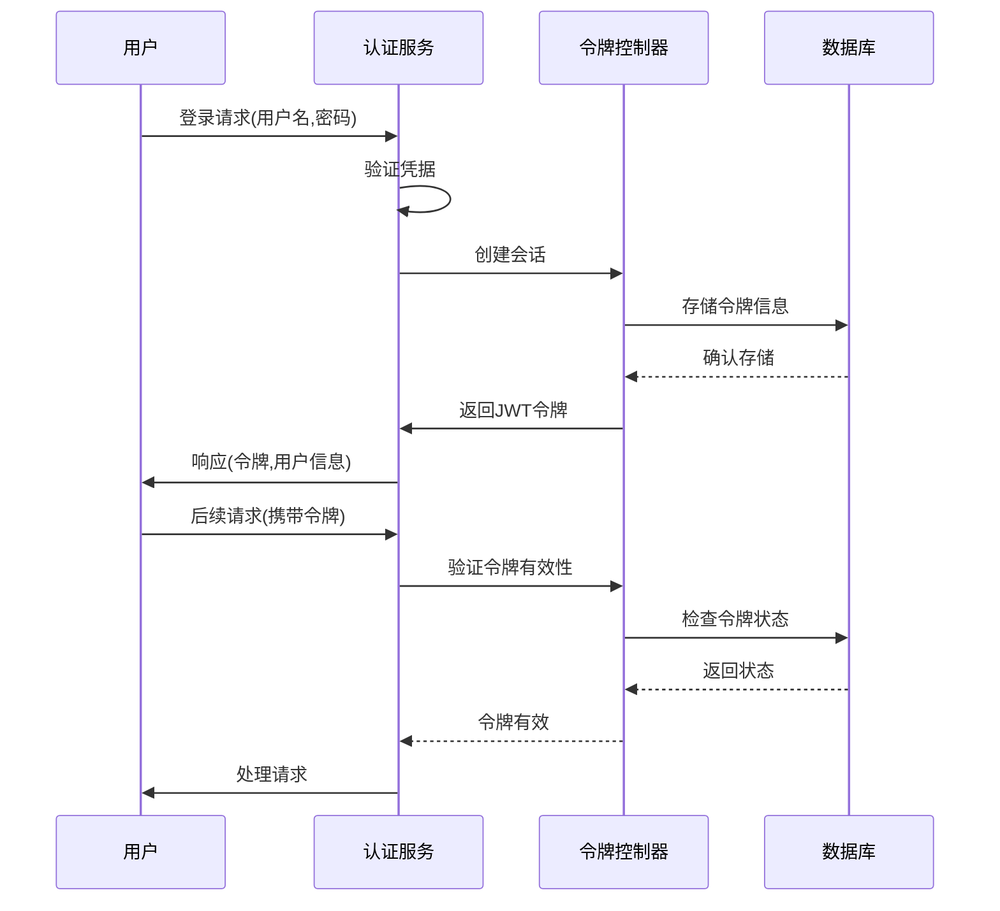
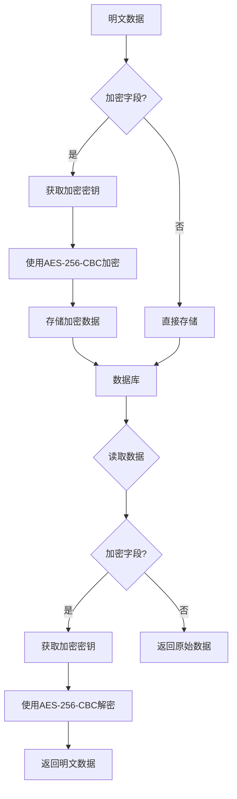
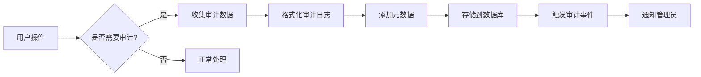

# 安全最佳实践

<cite>
**本文档引用的文件**   
- [auth-manager.ts](file://packages/core/auth/src/auth-manager.ts)
- [plugin.ts](file://packages/plugins/@nocobase/plugin-auth/src/server/plugin.ts)
- [basic-auth.ts](file://packages/plugins/@nocobase/plugin-auth/src/server/basic-auth.ts)
- [encryption-field.ts](file://packages/core/database/src/fields/encryption-field/encryption-field.ts)
- [utils.ts](file://packages/core/database/src/fields/encryption-field/utils.ts)
- [token-controller.ts](file://packages/core/auth/src/base/token-controller.ts)
- [audit-manager/index.ts](file://packages/core/server/src/audit-manager/index.ts)
- [SECURITY.md](file://SECURITY.md)
- [plugin-audit-logs](file://packages/plugins/@nocobase/plugin-audit-logs)
</cite>

## 目录
1. [密码安全策略](#密码安全策略)
2. [会话管理机制](#会话管理机制)
3. [Web攻击防护](#web攻击防护)
4. [数据安全实践](#数据安全实践)
5. [安全审计日志](#安全审计日志)
6. [安全合规性建议](#安全合规性建议)

## 密码安全策略

NocoBase平台实施了严格的密码安全策略，确保用户账户的安全性。系统通过`basic-auth.ts`文件中的`signUp`方法处理用户注册过程，对密码进行验证和存储。

密码复杂度要求通过前端表单配置实现，用户在注册时必须提供有效的用户名或邮箱以及密码。系统在`presetAuthType`中定义了公共选项，确保至少有一个身份验证字段（用户名或邮箱）是必需的。

密码存储采用安全的哈希算法。在用户注册和登录过程中，密码不会以明文形式存储或传输。系统通过认证中间件处理身份验证请求，确保密码信息的安全性。在审计日志记录中，系统会自动过滤掉密码字段，防止敏感信息泄露。

**Section sources**
- [basic-auth.ts](file://packages/plugins/@nocobase/plugin-auth/src/server/basic-auth.ts#L114-L139)
- [plugin.ts](file://packages/plugins/@nocobase/plugin-auth/src/server/plugin.ts#L75-L111)

## 会话管理机制

NocoBase实现了基于JWT（JSON Web Token）的会话管理机制，提供安全的用户会话控制。系统在`auth-manager.ts`中通过`getDefaultJWTSecret`方法生成和管理JWT密钥，确保令牌的安全性。

**Diagram sources**
- [auth-manager.ts](file://packages/core/auth/src/auth-manager.ts#L154-L172)
- [token-controller.ts](file://packages/core/auth/src/base/token-controller.ts#L46-L50)

会话超时和并发登录控制通过令牌策略实现。系统在安装时会创建默认的令牌策略配置，包括：
- 令牌过期时间（tokenExpirationTime）：1天
- 会话过期时间（sessionExpirationTime）：7天
- 过期令牌续期限制（expiredTokenRenewLimit）：1天

系统还实现了会话固定攻击防护机制。每次用户成功登录时，系统会生成新的JWT ID（jti），并在`issuedTokens`表中记录令牌信息。当检测到会话过期时，系统会自动清除过期的会话令牌。

**Section sources**
- [auth-manager.ts](file://packages/core/auth/src/auth-manager.ts#L154-L172)
- [token-controller.ts](file://packages/core/auth/src/base/token-controller.ts#L52-L71)
- [plugin.ts](file://packages/plugins/@nocobase/plugin-auth/src/server/plugin.ts#L307-L317)

## Web攻击防护

NocoBase平台内置了多种Web攻击防护机制，确保系统的安全性。

### CSRF防护
系统通过在API请求中使用认证令牌（Bearer Token）来防止跨站请求伪造（CSRF）攻击。所有需要身份验证的API端点都要求在请求头中包含有效的JWT令牌，这有效地防止了未经授权的跨站请求。

### XSS过滤
在数据输出和模板渲染过程中，系统实现了适当的输出编码机制，防止跨站脚本（XSS）攻击。前端组件在渲染用户提供的内容时会进行适当的转义处理，确保恶意脚本无法执行。

### SQL注入预防
NocoBase基于Sequelize ORM框架构建，该框架通过参数化查询自动防止SQL注入攻击。所有数据库查询都使用参数化方法，确保用户输入的数据不会被解释为SQL代码。

### API速率限制
虽然代码库中没有直接的速率限制实现，但系统通过中间件架构为速率限制提供了扩展点。开发者可以通过自定义中间件实现API请求的速率限制策略，保护系统免受暴力破解和拒绝服务攻击。

**Section sources**
- [auth-manager.ts](file://packages/core/auth/src/auth-manager.ts#L126-L152)
- [helper.ts](file://packages/core/server/src/helper.ts#L85-L89)
- [plugin.ts](file://packages/plugins/@nocobase/plugin-auth/src/server/plugin.ts#L120-L125)

## 数据安全实践

NocoBase提供了全面的数据安全实践，保护敏感信息的安全。

### 敏感数据加密
系统通过`encryption-field`模块实现字段级数据加密。该功能使用AES-256-CBC加密算法，确保敏感数据在存储时的安全性。

**Diagram sources**
- [encryption-field.ts](file://packages/core/database/src/fields/encryption-field/encryption-field.ts#L20-L91)
- [utils.ts](file://packages/core/database/src/fields/encryption-field/utils.ts#L19-L73)

加密密钥通过环境变量`ENCRYPTION_FIELD_KEY`配置，必须是32个字符的字符串。初始化向量（IV）可以通过`ENCRYPTION_FIELD_IV`环境变量配置，默认值为'Vc53-4G(rTi0vg@a'。系统在加密前会验证密钥的有效性，确保加密过程的安全性。

### 字段级权限控制
系统通过ACL（访问控制列表）机制实现字段级权限控制。在`plugin.ts`文件中，系统为不同的操作设置了相应的权限规则：
- 允许公开访问：`authenticators:publicList`
- 登录和注册：`auth:signIn`, `auth:signUp`
- 登出和更改密码：`auth:signOut`, `auth:changePassword`（需要登录）
- 密码重置：`auth:lostPassword`, `auth:resetPassword`（公开访问）

### 行级安全策略
通过数据过滤和访问控制机制，系统实现了行级安全策略。在数据查询时，系统会根据当前用户的角色和权限自动添加过滤条件，确保用户只能访问其有权查看的数据记录。

**Section sources**
- [encryption-field.ts](file://packages/core/database/src/fields/encryption-field/encryption-field.ts#L20-L91)
- [utils.ts](file://packages/core/database/src/fields/encryption-field/utils.ts#L13-L105)
- [plugin.ts](file://packages/plugins/@nocobase/plugin-auth/src/server/plugin.ts#L120-L125)

## 安全审计日志

NocoBase提供了全面的安全审计日志功能，帮助管理员监控和响应安全事件。

### 审计日志配置
系统通过`audit-manager`组件实现审计日志功能。在`plugin.ts`文件中，系统注册了多个审计动作，包括：
- `auth:signIn` - 用户登录
- `auth:signUp` - 用户注册
- `auth:changePassword` - 更改密码
- `auth:signOut` - 用户登出

**Diagram sources**
- [audit-manager/index.ts](file://packages/core/server/src/audit-manager/index.ts#L266-L306)
- [plugin.ts](file://packages/plugins/@nocobase/plugin-auth/src/server/plugin.ts#L192-L272)

### 审计日志内容
审计日志记录了详细的操作信息，包括：
- 操作资源和动作
- 用户ID和角色名
- IP地址和用户代理
- 操作状态（HTTP状态码）
- 请求和响应的元数据

在记录敏感信息时，系统会自动过滤掉密码等敏感字段，确保审计日志本身的安全性。

### 安全事件监控
系统通过WebSocket连接监控认证令牌状态，实时响应安全事件。当检测到无效或过期的令牌时，系统会立即断开连接并记录安全事件。

**Section sources**
- [audit-manager/index.ts](file://packages/core/server/src/audit-manager/index.ts#L266-L306)
- [plugin.ts](file://packages/plugins/@nocobase/plugin-auth/src/server/plugin.ts#L192-L272)
- [plugin-audit-logs](file://packages/plugins/@nocobase/plugin-audit-logs)

## 安全合规性建议

NocoBase平台的设计考虑了多种安全合规性要求，为满足GDPR、HIPAA等法规提供了基础支持。

### GDPR合规性
系统通过以下方式支持GDPR合规性：
- 提供数据主体权利支持，包括访问、更正和删除个人数据
- 实现数据最小化原则，只收集必要的用户信息
- 提供数据加密功能，保护个人数据的机密性
- 记录详细的审计日志，支持数据处理活动的可追溯性

### HIPAA合规性
对于医疗健康数据的处理，建议采取以下措施：
- 使用字段级加密保护所有受保护的健康信息（PHI）
- 实施严格的访问控制，确保只有授权人员可以访问敏感数据
- 配置详细的审计日志，记录所有对健康数据的访问和修改
- 定期审查和更新安全策略，确保持续合规

### 通用安全建议
- 定期更新系统和依赖库，及时修复已知的安全漏洞
- 使用强密码策略，并定期轮换密码
- 配置安全的环境变量，特别是加密密钥和数据库密码
- 限制管理员权限，遵循最小权限原则
- 定期备份数据，并测试恢复流程

**Section sources**
- [SECURITY.md](file://SECURITY.md)
- [LICENSE.txt](file://LICENSE.txt)
- [plugin.ts](file://packages/plugins/@nocobase/plugin-auth/src/server/plugin.ts)