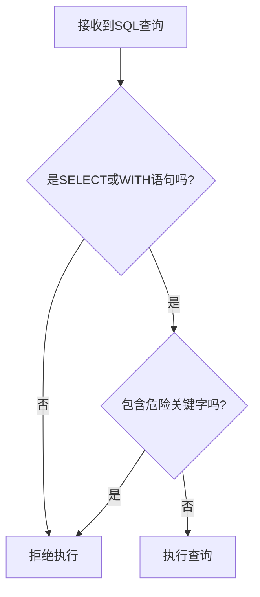
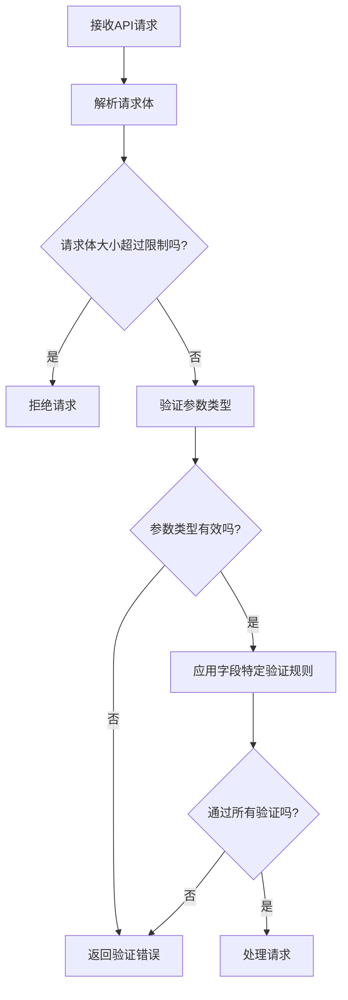
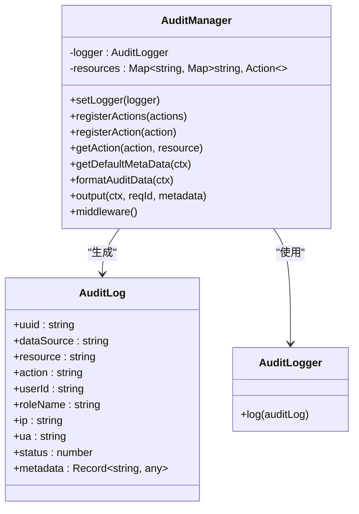

# 攻击防护

<cite>
**本文档中引用的文件**  
- [SECURITY.md](file://SECURITY.md)
- [helper.ts](file://packages/core/server/src/helper.ts)
- [auth-manager.ts](file://packages/core/auth/src/auth-manager.ts)
- [audit-manager/index.ts](file://packages/core/server/src/audit-manager/index.ts)
- [plugin.ts](file://packages/core/server/src/plugin.ts)
- [application.ts](file://packages/core/server/src/application.ts)
- [error-handler.ts](file://packages/plugins/@nocobase/plugin-error-handler/src/server/error-handler.ts)
- [input-interface.ts](file://packages/core/database/src/interfaces/input-interface.ts)
- [collection-manager/constants.ts](file://packages/core/client/src/collection-manager/constants.ts)
- [FieldValidation.tsx](file://packages/core/client/src/collection-manager/Configuration/components/FieldValidation.tsx)
- [wrap-middleware.ts](file://packages/core/utils/src/wrap-middleware.ts)
- [plugin-auth/server/plugin.ts](file://packages/plugins/@nocobase/plugin-auth/src/server/plugin.ts)
- [checkSQL.ts](file://packages/plugins/@nocobase/plugin-collection-sql/src/server/utils.ts)
</cite>

## 目录
1. [引言](#引言)
2. [CSRF防护机制](#csrf防护机制)
3. [XSS过滤策略](#xss过滤策略)
4. [SQL注入预防措施](#sql注入预防措施)
5. [API参数验证和过滤机制](#api参数验证和过滤机制)
6. [API速率限制与DDoS防护](#api速率限制与ddos防护)
7. [安全审计日志](#安全审计日志)
8. [攻击防护配置示例](#攻击防护配置示例)
9. [总结](#总结)

## 引言

NocoBase平台提供了一套全面的安全防护机制，旨在保护系统免受各种Web攻击。本指南将详细介绍NocoBase的攻击防护功能，包括CSRF防护、XSS过滤、SQL注入预防、API参数验证、速率限制和安全审计等关键安全特性。通过理解这些机制，管理员可以更好地配置和维护系统的安全性。

**Section sources**
- [SECURITY.md](file://SECURITY.md)

## CSRF防护机制

NocoBase通过多种机制来防止跨站请求伪造（CSRF）攻击。系统在每个请求中生成唯一的请求ID，用于跟踪和验证请求的合法性。在`helper.ts`文件中，`registerMiddlewares`函数注册了一个生成请求ID的中间件，该中间件为每个请求分配一个唯一的UUID。

此外，NocoBase使用JWT（JSON Web Token）进行身份验证，这本身就提供了一定程度的CSRF防护。JWT令牌存储在客户端，并在每个请求中作为Bearer Token发送。由于同源策略的限制，恶意网站无法访问存储在浏览器中的JWT令牌，从而防止了CSRF攻击。

系统还通过`x-authenticator`头部来指定身份验证类型，确保请求的身份验证上下文正确。这种多层防护机制有效地防止了CSRF攻击。

**Section sources**
- [helper.ts](file://packages/core/server/src/helper.ts#L44-L47)
- [auth-manager.ts](file://packages/core/auth/src/auth-manager.ts#L123-L152)

## XSS过滤策略

NocoBase平台实施了多层次的XSS（跨站脚本）过滤策略来防止恶意脚本注入。在客户端，系统提供了HTML编码功能，可以将潜在的恶意HTML内容转换为安全的文本表示。在`shared.ts`文件中，`HTMLEncode`函数使用DOM API的安全特性来编码HTML内容，确保特殊字符被正确转义。

在字段验证层面，NocoBase提供了丰富的验证规则，可以限制输入内容的类型和格式。例如，对于URL字段，系统提供了多种验证选项，包括允许相对URI、限制仅相对URI、允许查询字符串中的方括号等。这些验证规则可以在`constants.ts`文件中找到，通过配置这些规则，可以有效防止恶意脚本通过URL参数注入。

此外，系统在处理用户输入时，会对输入值进行类型验证。在`input-interface.ts`文件中，`InputInterface`类的`validate`方法确保输入值是字符串或数字类型，防止了非预期的数据类型导致的安全问题。

**Section sources**
- [shared.ts](file://packages/core/client/src/schema-component/antd/input/shared.ts#L10-L16)
- [constants.ts](file://packages/core/client/src/collection-manager/constants.ts#L179-L200)
- [input-interface.ts](file://packages/core/database/src/interfaces/input-interface.ts#L25-L27)

## SQL注入预防措施

NocoBase平台采取了严格的措施来防止SQL注入攻击。系统使用Sequelize ORM框架来处理数据库操作，该框架自动对查询参数进行转义，防止了基本的SQL注入攻击。在`query-interface-builder.ts`文件中，系统根据不同的数据库类型（MySQL、PostgreSQL、SQLite）构建相应的查询接口，确保查询语句的安全性。

对于自定义SQL查询，NocoBase提供了专门的安全检查机制。在`plugin-collection-sql`插件的`utils.ts`文件中，`checkSQL`函数对SQL语句进行严格验证，确保只允许SELECT语句或WITH子句，禁止执行可能危险的操作。

该函数还检查SQL语句中是否包含危险关键字，如`pg_read_file`、`LOAD_FILE`、`sqlite3_load_extension`等，这些关键字可能被用于文件读取、系统命令执行等恶意操作。如果检测到危险关键字，系统会抛出错误，阻止查询执行。



**Diagram sources**
- [utils.ts](file://packages/plugins/@nocobase/plugin-collection-sql/src/server/utils.ts#L10-L43)
- [query-interface-builder.ts](file://packages/core/database/src/query-interface/query-interface-builder.ts#L15-L34)

## API参数验证和过滤机制

NocoBase平台提供了强大的API参数验证和过滤机制，以防止恶意输入和数据篡改。系统在多个层面实施验证，确保输入数据的安全性和有效性。

在中间件层面，`registerMiddlewares`函数注册了`bodyParser`中间件，用于解析请求体并设置大小限制。通过`getBodyLimit`函数，系统可以配置请求体的最大大小，默认为10MB，防止了大型请求导致的资源耗尽攻击。

在数据验证层面，系统提供了丰富的验证规则。在`FieldValidation.tsx`文件中，实现了多种验证规则的处理逻辑，包括域名验证、TLD（顶级域名）验证等。系统支持多种验证模式，如允许IANA标准TLD、禁用TLD验证、允许特定TLD列表或拒绝特定TLD列表。

对于数字类型字段，系统提供了范围验证规则，包括大于、小于、最大值、最小值等。这些规则可以在`constants.ts`文件中找到，通过配置这些规则，可以确保数值输入在预期范围内。



**Diagram sources**
- [helper.ts](file://packages/core/server/src/helper.ts#L69-L83)
- [FieldValidation.tsx](file://packages/core/client/src/collection-manager/Configuration/components/FieldValidation.tsx#L67-L103)
- [constants.ts](file://packages/core/client/src/collection-manager/constants.ts#L205-L228)

## API速率限制与DDoS防护

NocoBase平台通过多种机制来实现API速率限制和DDoS攻击防护。虽然代码中没有直接的速率限制实现，但系统提供了可扩展的架构，允许通过插件或中间件实现速率限制功能。

系统在`application.ts`中提供了完整的中间件注册机制，可以轻松集成第三方速率限制中间件。同时，系统记录详细的请求日志，包括请求ID、IP地址、用户代理等信息，这些信息可以用于分析异常请求模式，识别潜在的DDoS攻击。

在`audit-manager/index.ts`文件中，系统记录了每个请求的详细信息，包括IP地址、用户代理、请求路径等。这些审计日志可以与外部安全分析工具集成，实现基于行为的异常检测。

此外，系统通过`requestLogger`中间件记录请求信息，这些日志可以用于监控请求频率，识别异常的请求模式。管理员可以基于这些日志数据配置外部速率限制策略，如使用Nginx或云服务提供商的WAF（Web应用防火墙）功能。

**Section sources**
- [application.ts](file://packages/core/server/src/application.ts#L10-L200)
- [audit-manager/index.ts](file://packages/core/server/src/audit-manager/index.ts#L263-L273)

## 安全审计日志

NocoBase平台提供了全面的安全审计日志功能，用于监控异常行为和安全事件。在`audit-manager/index.ts`文件中，`AuditManager`类负责处理审计日志的记录和管理。

系统为每个请求生成唯一的审计日志条目，包含以下关键信息：
- 请求UUID
- 数据源
- 资源名称
- 操作名称
- 用户ID
- 角色名称
- IP地址
- 用户代理
- 请求状态
- 元数据（包括请求参数、查询、请求体等）

审计日志通过中间件自动记录，在请求处理完成后输出到日志系统。如果请求处理过程中发生错误，系统会在`finally`块中记录审计日志，确保即使在异常情况下也能记录安全事件。



**Diagram sources**
- [audit-manager/index.ts](file://packages/core/server/src/audit-manager/index.ts#L23-L354)

## 攻击防护配置示例

以下是一个完整的攻击防护配置示例，展示如何在实际部署中实施多层安全防护：

```javascript
// 应用配置示例
const appConfig = {
  // 安全相关的中间件配置
  cors: {
    exposeHeaders: ['content-disposition'],
    origin(ctx) {
      return ctx.get('origin');
    }
  },
  
  // 请求体大小限制
  bodyParser: {
    jsonLimit: '10mb',
    formLimit: '10mb',
    textLimit: '10mb'
  },
  
  // 数据包装配置
  dataWrapping: true,
  
  // 认证管理器配置
  authManager: {
    authKey: 'x-authenticator',
    default: 'jwt'
  },
  
  // 日志配置
  logger: {
    request: {
      level: 'info'
    },
    system: {
      level: 'info'
    }
  }
};

// 字段验证配置示例
const fieldValidationConfig = {
  url: {
    allowRelative: true,
    relativeOnly: false,
    allowQuerySquareBrackets: true,
    encodeUri: true,
    tlds: {
      allow: true // 允许所有IANA标准TLD
    }
  },
  number: {
    min: 0,
    max: 1000,
    greater: 0
  }
};
```

此配置示例展示了如何启用和配置各种安全功能，包括CORS策略、请求体大小限制、数据包装、认证管理和详细的字段验证规则。

**Section sources**
- [helper.ts](file://packages/core/server/src/helper.ts#L56-L67)
- [helper.ts](file://packages/core/server/src/helper.ts#L72-L77)
- [constants.ts](file://packages/core/client/src/collection-manager/constants.ts#L179-L200)
- [FieldValidation.tsx](file://packages/core/client/src/collection-manager/Configuration/components/FieldValidation.tsx#L67-L103)

## 总结

NocoBase平台通过多层次的安全机制提供了全面的攻击防护能力。从CSRF防护、XSS过滤到SQL注入预防，系统在各个层面都实施了严格的安全措施。API参数验证和过滤机制确保了输入数据的安全性，而详细的审计日志功能则提供了强大的安全监控能力。

通过合理配置这些安全功能，管理员可以有效保护系统免受各种Web攻击。建议定期审查安全配置，及时更新安全策略，并结合外部安全工具，构建纵深防御体系，确保系统的安全稳定运行。