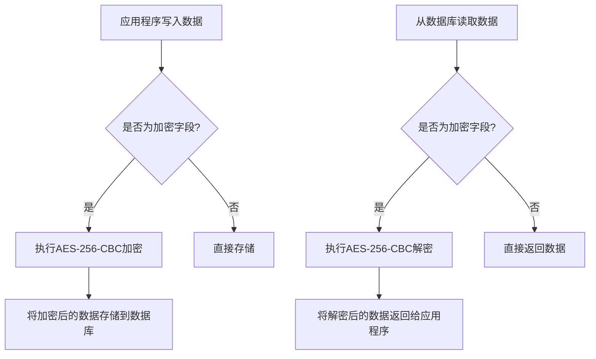
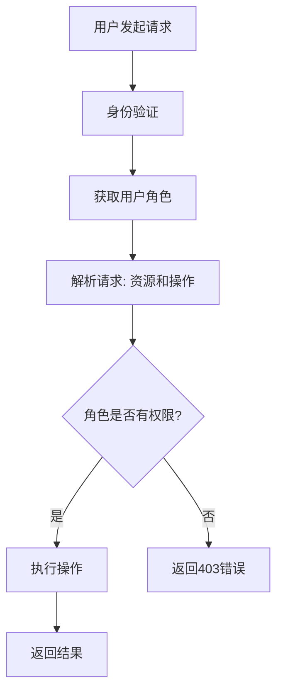
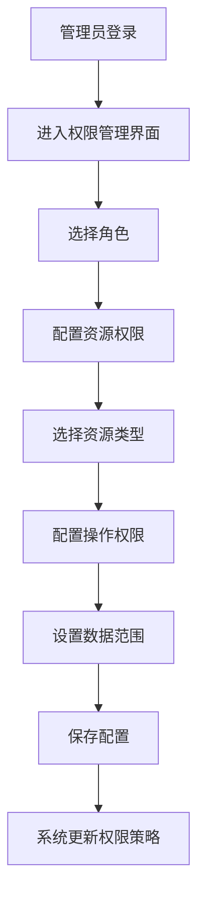
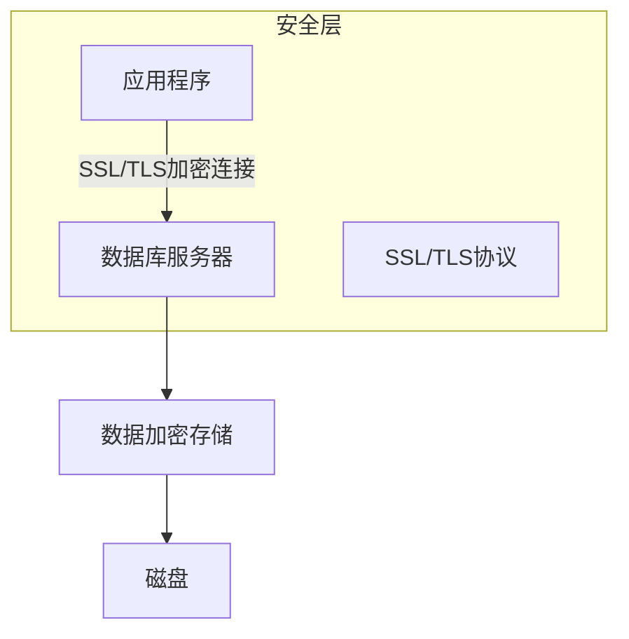
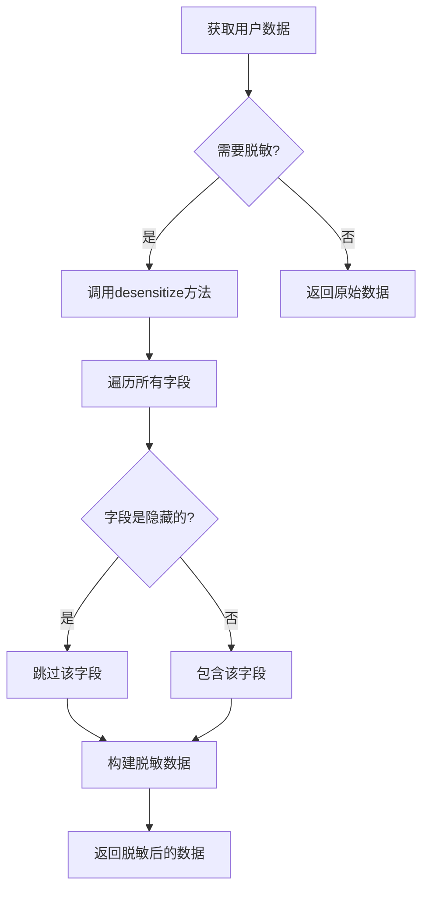
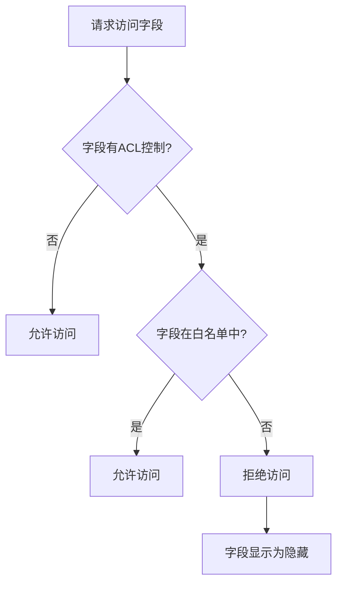

# 数据安全

<cite>
**本文档中引用的文件**  
- [encryption-field.ts](file://packages\core\database\src\fields\encryption-field\encryption-field.ts)
- [utils.ts](file://packages\core\database\src\fields\encryption-field\utils.ts)
- [plugin.ts](file://packages\plugins\@nocobase\plugin-environment-variables\src\server\plugin.ts)
- [helpers.ts](file://packages\core\database\src\helpers.ts)
- [UserModel.ts](file://packages\plugins\@nocobase\plugin-users\src\server\models\UserModel.ts)
- [check-association-operate.ts](file://packages\plugins\@nocobase\plugin-acl\src\server\middlewares\check-association-operate.ts)
- [ACLProvider.tsx](file://packages\core\client\src\acl\ACLProvider.tsx)
- [RolesResourcesActions.tsx](file://packages\core\client\src\acl\Configuration\RolesResourcesActions.tsx)
</cite>

## 目录
1. [引言](#引言)
2. [字段级加密机制](#字段级加密机制)
3. [行级安全策略与ACL配置](#行级安全策略与acl配置)
4. [敏感数据存储与传输安全](#敏感数据存储与传输安全)
5. [数据脱敏与字段权限控制](#数据脱敏与字段权限控制)
6. [数据安全最佳实践](#数据安全最佳实践)
7. [常见问题与解决方案](#常见问题与解决方案)
8. [结论](#结论)

## 引言

NocoBase是一个低代码开发平台，提供全面的数据安全保护机制。本指南详细介绍了NocoBase中的数据安全特性，包括字段级加密、行级安全策略、敏感数据存储与传输安全措施。通过深入分析加密算法选择、密钥管理、ACL配置和数据脱敏技术，本指南为开发者提供了保护用户隐私和业务敏感信息的完整解决方案。

## 字段级加密机制

NocoBase提供了强大的字段级加密功能，允许对特定字段的数据进行加密存储。该机制基于AES-256-CBC加密算法，确保敏感数据在数据库中的安全性。

### 加密算法与实现

字段级加密使用AES-256-CBC（Advanced Encryption Standard with 256-bit key in Cipher Block Chaining mode）算法。该算法是目前业界广泛认可的安全加密标准，具有高强度的加密能力。

加密过程在数据写入数据库之前自动执行，而解密过程在数据从数据库读取后自动进行。这种透明的加密/解密机制对应用程序逻辑没有影响，开发者可以像操作普通字段一样操作加密字段。



**图示来源**
- [encryption-field.ts](file://packages\core\database\src\fields\encryption-field\encryption-field.ts#L25-L91)
- [utils.ts](file://packages\core\database\src\fields\encryption-field\utils.ts#L19-L93)

### 密钥管理

密钥管理是加密系统安全性的核心。NocoBase通过环境变量来管理加密密钥，确保密钥与代码分离，提高安全性。

加密密钥通过`ENCRYPTION_FIELD_KEY`环境变量配置，必须满足以下要求：
- 必须是字符串类型
- 长度必须恰好为32个字符（对应AES-256的256位密钥）
- 如果未设置，系统将抛出错误

此外，系统还支持初始化向量（IV）的配置，通过`ENCRYPTION_FIELD_IV`环境变量设置。如果未指定，系统将使用默认的IV值。

```mermaid
flowchart TD
A[系统启动] --> B{检查ENCRYPTION_FIELD_KEY环境变量}
B --> |未设置| C[抛出错误: "必须设置ENCRYPTION_FIELD_KEY环境变量"]
B --> |已设置| D{验证密钥格式}
D --> |不是字符串| E[抛出错误: "ENCRYPTION_FIELD_KEY必须是字符串"]
D --> |长度不是32| F[抛出错误: "ENCRYPTION_FIELD_KEY必须是32个字符的字符串"]
D --> |格式正确| G[初始化加密模块]
G --> H[系统准备就绪]
```

**图示来源**
- [utils.ts](file://packages\core\database\src\fields\encryption-field\utils.ts#L95-L105)
- [encryption-field.ts](file://packages\core\database\src\fields\encryption-field\encryption-field.ts#L26-L30)

### 加密字段的使用方法

在NocoBase中使用加密字段非常简单。开发者只需在字段定义中指定类型为"encryption"，系统将自动处理加密和解密过程。

加密字段的使用流程包括：
1. 在数据模型中定义加密字段
2. 确保正确配置加密密钥环境变量
3. 正常进行数据的CRUD操作

系统会在以下时机自动触发加密/解密操作：
- `beforeSave`: 数据保存前对加密字段进行加密
- `beforeBulkCreate`: 批量创建前对加密字段进行加密
- `afterFind`: 数据查询后对加密字段进行解密

**本节来源**
- [encryption-field.ts](file://packages\core\database\src\fields\encryption-field\encryption-field.ts#L20-L91)
- [utils.ts](file://packages\core\database\src\fields\encryption-field\utils.ts#L19-L93)

## 行级安全策略与ACL配置

NocoBase通过基于角色的访问控制（RBAC）系统实现行级安全策略，允许精细控制不同用户角色对数据的访问权限。

### ACL实现原理

访问控制列表（ACL）系统基于角色、资源和操作的三元组进行权限判断。每个角色可以被授予对特定资源的特定操作权限，系统在执行操作前会检查当前用户角色是否具有相应权限。

权限检查流程如下：
1. 确定当前用户的角色
2. 确定请求的操作和资源
3. 检查角色是否被授予该操作权限
4. 如果有权限，继续执行；否则返回403错误



**图示来源**
- [check-association-operate.ts](file://packages\plugins\@nocobase\plugin-acl\src\server\middlewares\check-association-operate.ts#L13-L63)
- [ACLProvider.tsx](file://packages\core\client\src\acl\ACLProvider.tsx#L124-L159)

### 数据访问权限配置

通过ACL配置，可以实现复杂的行级安全策略。配置主要包括：
- 角色定义
- 资源定义
- 操作权限分配
- 数据范围限制

在NocoBase中，可以通过管理界面或API配置ACL策略。每个策略可以指定：
- 允许的操作（如：读取、创建、更新、删除）
- 数据范围（如：仅自己的记录、特定部门的记录）
- 字段级权限（如：仅能查看某些字段）



**图示来源**
- [RolesResourcesActions.tsx](file://packages\core\client\src\acl\Configuration\RolesResourcesActions.tsx#L140-L179)
- [check-association-operate.ts](file://packages\plugins\@nocobase\plugin-acl\src\server\middlewares\check-association-operate.ts#L35-L57)

### 复杂权限场景处理

NocoBase的ACL系统支持处理复杂的权限场景，如：
- 关联数据的权限检查
- 动态数据范围
- 条件性权限

例如，在处理"用户-部门"关系时，系统可以检查用户是否有权限操作特定部门的关联数据。这通过中间件`check-association-operate`实现，该中间件在处理关联操作前进行权限验证。

**本节来源**
- [check-association-operate.ts](file://packages\plugins\@nocobase\plugin-acl\src\server\middlewares\check-association-operate.ts#L13-L63)
- [ACLProvider.tsx](file://packages\core\client\src\acl\ACLProvider.tsx#L374-L422)

## 敏感数据存储与传输安全

NocoBase提供了多层次的安全措施来保护敏感数据的存储和传输安全。

### 数据库存储加密

数据库连接的安全性通过SSL/TLS加密实现。系统从环境变量中读取SSL配置，包括：
- SSL模式
- CA证书
- 客户端密钥
- 客户端证书
- 是否拒绝未授权连接

这些配置通过`DB_DIALECT_OPTIONS_SSL_*`系列环境变量设置，支持直接提供值或指向文件路径。



**图示来源**
- [helpers.ts](file://packages\core\database\src\helpers.ts#L57-L74)
- [helpers.ts](file://packages\core\database\src\helpers.ts#L117-L122)

### 环境变量加密存储

敏感的环境变量（如API密钥、数据库密码）可以通过加密方式存储。`plugin-environment-variables`插件提供了对环境变量的加密存储功能。

当设置环境变量时，如果标记为"secret"类型，系统会自动使用AES加密算法对其进行加密，然后存储到数据库中。读取时，系统自动解密并注入到运行时环境中。

```mermaid
flowchart TD
A[设置环境变量] --> B{类型是"secret"?}
B --> |是| C[使用AES加密]
B --> |否| D[明文存储]
C --> E[加密后存储到数据库]
F[读取环境变量] --> G{类型是"secret"?}
G --> |是| H[从数据库读取并解密]
G --> |否| I[直接返回值]
H --> J[注入到运行时环境]
```

**图示来源**
- [plugin.ts](file://packages\plugins\@nocobase\plugin-environment-variables\src\server\plugin.ts#L148-L195)
- [plugin.ts](file://packages\plugins\@nocobase\plugin-environment-variables\src\server\plugin.ts#L198-L215)

### 传输安全措施

除了数据库连接的SSL加密，NocoBase还支持其他传输安全措施：
- HTTPS应用层加密
- 安全的API认证机制
- 请求签名验证

这些措施共同确保数据在传输过程中的机密性和完整性。

**本节来源**
- [helpers.ts](file://packages\core\database\src\helpers.ts#L57-L74)
- [plugin.ts](file://packages\plugins\@nocobase\plugin-environment-variables\src\server\plugin.ts#L148-L215)

## 数据脱敏与字段权限控制

NocoBase提供了数据脱敏和字段级权限控制功能，以保护敏感信息。

### 数据脱敏机制

数据脱敏是指对敏感数据进行处理，使其在非授权场景下无法识别真实信息。NocoBase通过`desensitize`方法实现数据脱敏。

在`UserModel`中，`desensitize`方法会创建一个新的模型实例，只包含非隐藏字段的数据。这确保了在需要返回用户数据但又不能暴露所有信息的场景下，可以安全地返回脱敏后的数据。



**图示来源**
- [UserModel.ts](file://packages\plugins\@nocobase\plugin-users\src\server\models\UserModel.ts#L13-L23)

### 字段权限控制

字段级权限控制允许对每个字段设置不同的访问权限。通过`x-collection-field`和`x-acl-ignore`等元数据属性，可以精确控制哪些角色可以访问哪些字段。

字段权限控制的实现基于白名单机制。系统维护一个允许访问的字段白名单，只有在白名单中的字段才能被当前角色访问。



**图示来源**
- [ACLProvider.tsx](file://packages\core\client\src\acl\ACLProvider.tsx#L374-L417)
- [UserModel.ts](file://packages\plugins\@nocobase\plugin-users\src\server\models\UserModel.ts#L18-L20)

### 综合安全策略

通过结合字段级加密、行级安全策略、数据脱敏和字段权限控制，可以构建综合的数据安全策略。例如，对于用户身份证号码字段：
1. 使用字段级加密存储
2. 设置为隐藏字段，不在白名单中
3. 只有特定角色才能访问
4. 在非授权场景下返回脱敏数据

这种多层次的安全措施确保了敏感数据得到充分保护。

**本节来源**
- [UserModel.ts](file://packages\plugins\@nocobase\plugin-users\src\server\models\UserModel.ts#L13-L23)
- [ACLProvider.tsx](file://packages\core\client\src\acl\ACLProvider.tsx#L374-L417)
- [encryption-field.ts](file://packages\core\database\src\fields\encryption-field\encryption-field.ts#L15-L18)

## 数据安全最佳实践

基于NocoBase的数据安全特性，以下是保护用户隐私和业务敏感信息的最佳实践。

### 安全配置示例

#### 环境变量安全配置
```env
# 数据库连接信息
DB_DIALECT=postgres
DB_HOST=your-db-host
DB_PORT=5432
DB_DATABASE=your-db-name
DB_USER=your-db-user
DB_PASSWORD=your-db-password

# SSL连接配置
DB_DIALECT_OPTIONS_SSL_MODE=require
DB_DIALECT_OPTIONS_SSL_CA=/path/to/ca.crt
DB_DIALECT_OPTIONS_SSL_REJECT_UNAUTHORIZED=true

# 字段加密密钥（必须为32个字符）
ENCRYPTION_FIELD_KEY=your-32-character-encryption-key-here
ENCRYPTION_FIELD_IV=Vc53-4G(rTi0vg@a
```

#### 加密字段定义
```json
{
  "name": "ssn",
  "type": "encryption",
  "hidden": true,
  "uiSchema": {
    "title": "身份证号码",
    "type": "string",
    "x-component": "Input",
    "x-component-props": {
      "password": true
    }
  }
}
```

**本节来源**
- [helpers.ts](file://packages\core\database\src\helpers.ts#L100-L125)
- [utils.ts](file://packages\core\database\src\fields\encryption-field\utils.ts#L13-L14)
- [encryption-field.ts](file://packages\core\database\src\fields\encryption-field\encryption-field.ts#L15-L18)

### 实际应用中的安全保护

在实际应用中，建议采取以下措施保护敏感信息：

1. **分类敏感数据**：识别哪些数据是敏感的，如个人身份信息、财务信息、健康信息等。

2. **分层保护策略**：
   - 对高度敏感数据：使用字段级加密 + 隐藏字段 + 严格ACL
   - 对中等敏感数据：使用字段级加密 + ACL控制
   - 对低敏感数据：使用ACL控制

3. **最小权限原则**：只授予用户完成工作所需的最小权限。

4. **定期审计**：定期检查权限配置，确保没有过度授权。

5. **密钥轮换**：定期更换加密密钥，并提供密钥轮换机制。

### 安全开发流程

建议在开发流程中集成安全检查：

1. **设计阶段**：识别敏感数据，设计安全策略
2. **开发阶段**：实现加密、ACL等安全功能
3. **测试阶段**：测试安全功能是否按预期工作
4. **部署阶段**：确保生产环境的安全配置正确
5. **运维阶段**：监控安全事件，定期审计

**本节来源**
- [encryption-field.ts](file://packages\core\database\src\fields\encryption-field\encryption-field.ts)
- [plugin.ts](file://packages\plugins\@nocobase\plugin-environment-variables\src\server\plugin.ts)
- [helpers.ts](file://packages\core\database\src\helpers.ts)

## 常见问题与解决方案

### 加密相关问题

**问题1：加密失败，提示"Encryption failed"**

**原因**：加密过程出现错误，可能是密钥配置问题或数据格式问题。

**解决方案**：
1. 检查`ENCRYPTION_FIELD_KEY`环境变量是否设置
2. 确认密钥长度为32个字符
3. 确认密钥为字符串类型
4. 检查要加密的数据是否为字符串

**问题2：解密失败，提示"Decryption failed, the environment variable `ENCRYPTION_FIELD_KEY` may be incorrect"**

**原因**：解密时使用的密钥与加密时不同，可能是密钥被更改或环境变量配置错误。

**解决方案**：
1. 确认当前使用的密钥与加密时相同
2. 如果密钥已更改，需要使用原密钥解密数据，然后用新密钥重新加密
3. 检查环境变量配置是否正确加载

### ACL配置问题

**问题1：用户无法访问应该有权访问的数据**

**原因**：ACL配置不正确，角色未被授予相应权限。

**解决方案**：
1. 检查用户角色是否正确
2. 检查角色的ACL策略是否包含相应资源和操作
3. 检查数据范围设置是否过于严格

**问题2：权限更改后未生效**

**原因**：权限更改需要重新加载或缓存未及时更新。

**解决方案**：
1. 重启应用以确保权限配置重新加载
2. 检查是否有缓存机制需要清除
3. 确认权限更改已正确保存到数据库

### 数据库连接安全问题

**问题1：无法建立SSL数据库连接**

**原因**：SSL配置不正确或证书问题。

**解决方案**：
1. 检查SSL相关环境变量是否正确设置
2. 确认证书文件路径正确且可读
3. 检查数据库服务器是否支持SSL连接

**问题2：环境变量中的敏感信息泄露**

**原因**：环境变量以明文形式存储或显示。

**解决方案**：
1. 使用`plugin-environment-variables`插件加密存储敏感环境变量
2. 在管理界面中不显示敏感环境变量的值
3. 限制查看环境变量的权限

**本节来源**
- [utils.ts](file://packages\core\database\src\fields\encryption-field\utils.ts#L96-L104)
- [plugin.ts](file://packages\plugins\@nocobase\plugin-environment-variables\src\server\plugin.ts#L166-L168)
- [helpers.ts](file://packages\core\database\src\helpers.ts#L57-L74)

## 结论

NocoBase提供了全面的数据安全保护机制，包括字段级加密、行级安全策略、敏感数据存储与传输安全措施。通过合理配置和使用这些功能，可以有效保护用户隐私和业务敏感信息。

关键要点总结：
1. **字段级加密**：使用AES-256-CBC算法对敏感字段进行加密存储，密钥通过环境变量管理。
2. **行级安全策略**：基于ACL的访问控制，支持精细的权限配置和数据范围限制。
3. **存储安全**：支持数据库连接的SSL加密，确保数据在传输过程中的安全。
4. **数据脱敏**：通过`desensitize`方法和字段权限控制，防止敏感信息泄露。
5. **环境变量安全**：支持加密存储敏感环境变量，防止配置信息泄露。

通过结合这些安全特性，并遵循最佳实践，可以构建安全可靠的应用程序，满足各种数据保护要求。