# 安全考虑

<cite>
**本文档中引用的文件**  
- [auth-manager.ts](file://packages/core/auth/src/auth-manager.ts)
- [jwt-service.ts](file://packages/core/auth/src/base/jwt-service.ts)
- [token-blacklist-service.ts](file://packages/core/auth/src/base/token-blacklist-service.ts)
- [storer.ts](file://packages/plugins/@nocobase/plugin-auth/src/server/storer.ts)
- [acl.ts](file://packages/core/acl/src/acl.ts)
- [allow-manager.ts](file://packages/core/acl/src/allow-manager.ts)
- [acl-role.ts](file://packages/core/acl/src/acl-role.ts)
- [plugin.ts](file://packages/plugins/@nocobase/plugin-acl/src/server/server.ts)
- [plugin.ts](file://packages/plugins/@nocobase/plugin-auth/src/server/plugin.ts)
- [index.ts](file://packages/core/server/src/audit-manager/index.ts)
</cite>

## 目录
1. [引言](#引言)
2. [多层次安全架构](#多层次安全架构)
3. [JWT认证实现](#jwt认证实现)
4. [访问控制列表（ACL）系统](#访问控制列表acl系统)
5. [数据级别安全控制](#数据级别安全控制)
6. [安全最佳实践](#安全最佳实践)
7. [安全审计日志](#安全审计日志)
8. [合规性要求](#合规性要求)

## 引言

NocoBase平台提供了一套全面的安全机制，确保应用程序在认证、授权和审计方面的安全性。本文档详细解释了NocoBase的多层次安全架构，包括JWT认证的实现细节、访问控制列表（ACL）系统的权限模型、数据级别的安全控制，以及安全审计日志的配置和使用方法。

## 多层次安全架构

NocoBase的安全架构由多个组件协同工作，包括认证管理器、访问控制列表（ACL）系统和审计管理器。这些组件共同确保系统的安全性。

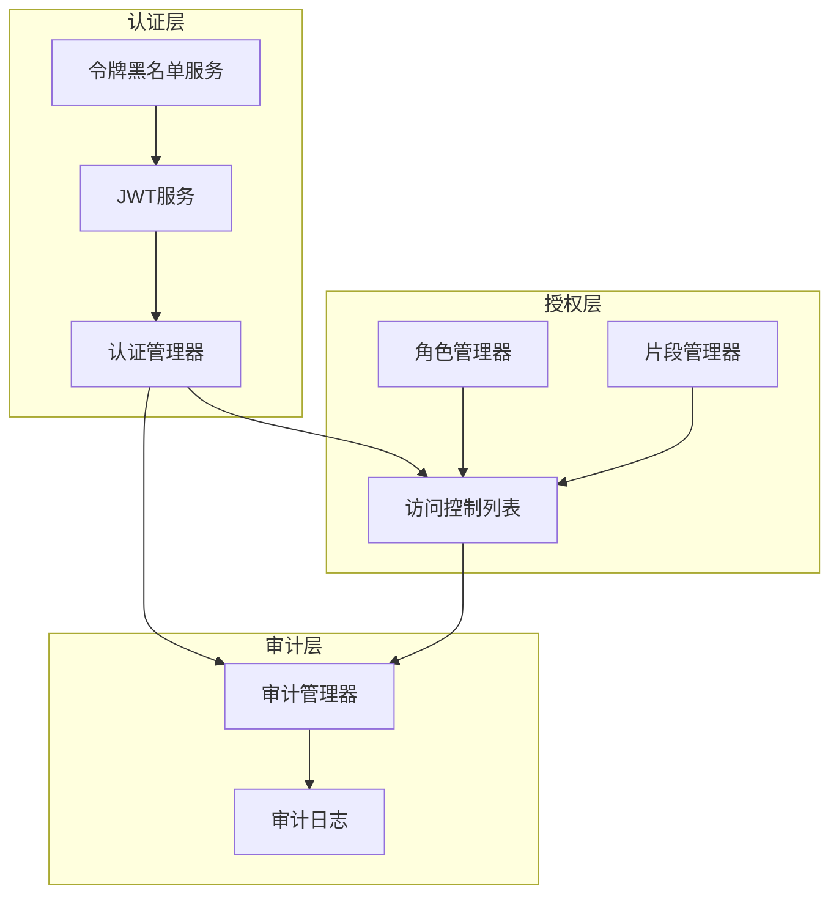

**Diagram sources**
- [auth-manager.ts](file://packages/core/auth/src/auth-manager.ts)
- [acl.ts](file://packages/core/acl/src/acl.ts)
- [index.ts](file://packages/core/server/src/audit-manager/index.ts)

**Section sources**
- [auth-manager.ts](file://packages/core/auth/src/auth-manager.ts#L42-L173)
- [acl.ts](file://packages/core/acl/src/acl.ts#L66-L603)
- [index.ts](file://packages/core/server/src/audit-manager/index.ts#L266-L306)

## JWT认证实现

NocoBase使用JWT（JSON Web Token）进行用户认证，确保安全的令牌生成、验证和刷新流程。

### 令牌生成与验证

JWT服务负责生成和验证令牌，使用HMAC SHA256算法进行签名，确保令牌的安全性。

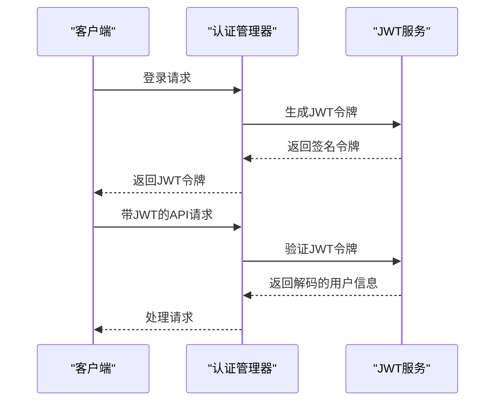

**Diagram sources**
- [auth-manager.ts](file://packages/core/auth/src/auth-manager.ts#L46-L61)
- [jwt-service.ts](file://packages/core/auth/src/base/jwt-service.ts#L20-L78)

**Section sources**
- [auth-manager.ts](file://packages/core/auth/src/auth-manager.ts#L54-L61)
- [jwt-service.ts](file://packages/core/auth/src/base/jwt-service.ts#L20-L78)

### JWT密钥管理

NocoBase采用多层密钥管理策略，确保JWT密钥的安全性。

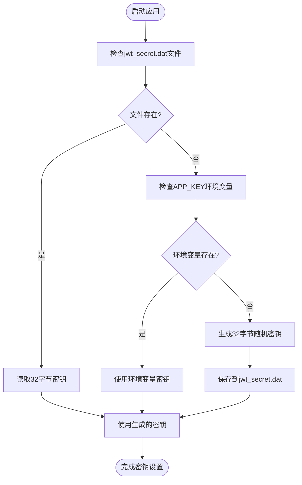

**Diagram sources**
- [auth-manager.ts](file://packages/core/auth/src/auth-manager.ts#L154-L172)

**Section sources**
- [auth-manager.ts](file://packages/core/auth/src/auth-manager.ts#L154-L172)

## 访问控制列表（ACL）系统

NocoBase的ACL系统提供了灵活的权限管理机制，支持基于角色的访问控制和细粒度的权限策略。

### 权限模型

ACL系统通过角色、策略和权限检查实现复杂的访问控制逻辑。

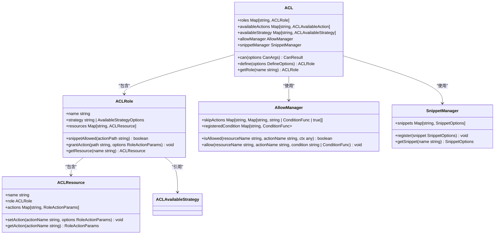

**Diagram sources**
- [acl.ts](file://packages/core/acl/src/acl.ts#L66-L603)
- [acl-role.ts](file://packages/core/acl/src/acl-role.ts#L49-L98)
- [allow-manager.ts](file://packages/core/acl/src/allow-manager.ts#L14-L112)

**Section sources**
- [acl.ts](file://packages/core/acl/src/acl.ts#L66-L603)
- [acl-role.ts](file://packages/core/acl/src/acl-role.ts#L49-L98)

### 角色管理

NocoBase支持灵活的角色管理，允许管理员定义不同角色的权限。

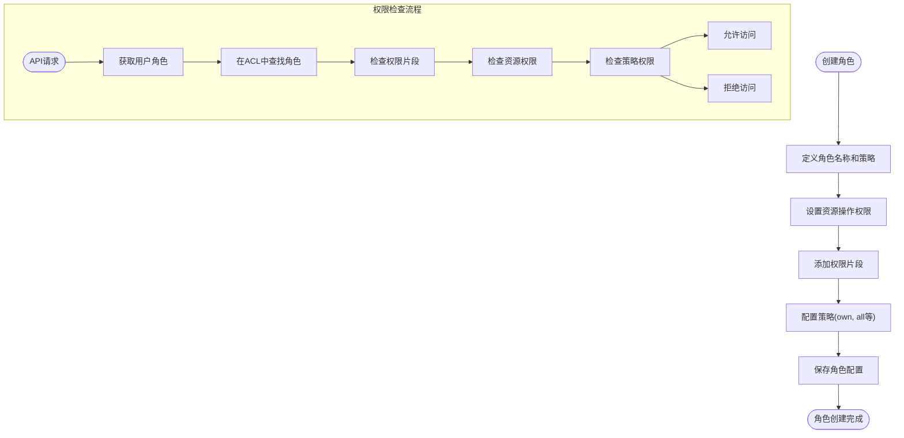

**Diagram sources**
- [plugin.ts](file://packages/plugins/@nocobase/plugin-acl/src/server/server.ts#L72-L523)
- [acl.ts](file://packages/core/acl/src/acl.ts#L151-L168)

**Section sources**
- [plugin.ts](file://packages/plugins/@nocobase/plugin-acl/src/server/server.ts#L72-L523)
- [acl.ts](file://packages/core/acl/src/acl.ts#L151-L168)

## 数据级别安全控制

NocoBase提供行级和字段级的安全控制，确保数据访问的精确性。

### 行级权限

通过过滤器实现行级权限控制，限制用户只能访问特定记录。

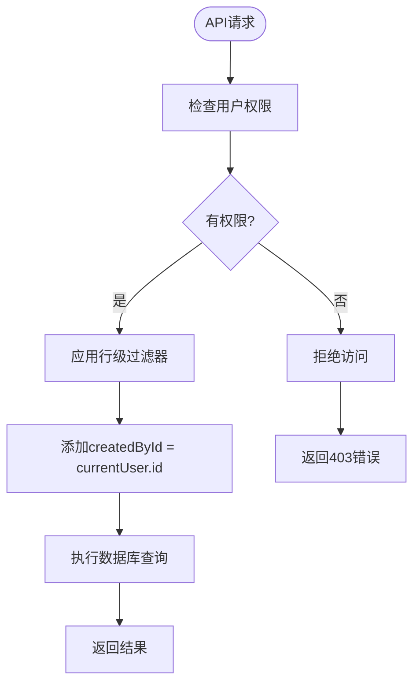

**Diagram sources**
- [acl.ts](file://packages/core/acl/src/acl.ts#L467-L493)

**Section sources**
- [acl.ts](file://packages/core/acl/src/acl.ts#L467-L493)

### 字段级权限

通过白名单机制实现字段级权限控制，限制用户只能访问特定字段。

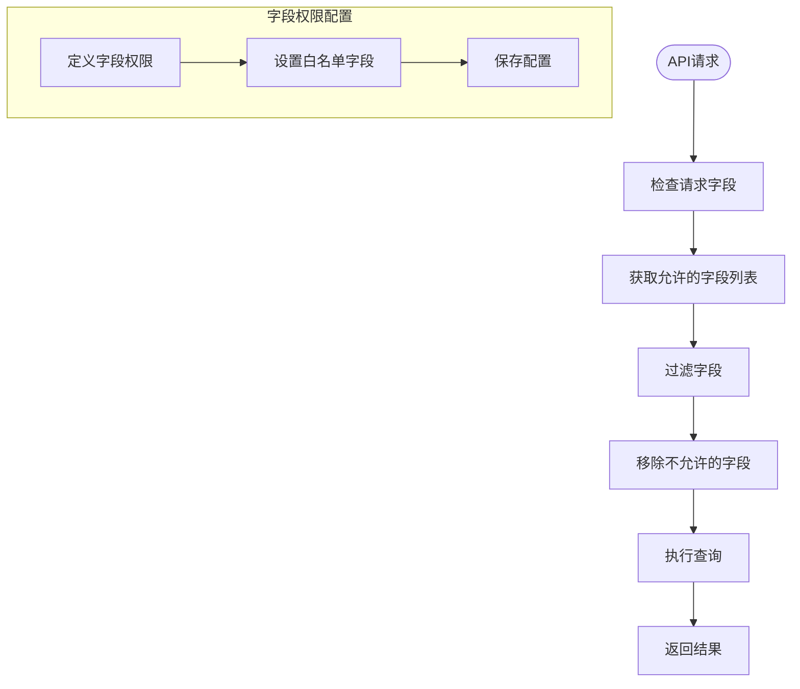

**Diagram sources**
- [acl.ts](file://packages/core/acl/src/acl.ts#L517-L557)

**Section sources**
- [acl.ts](file://packages/core/acl/src/acl.ts#L517-L557)

## 安全最佳实践

NocoBase遵循多项安全最佳实践，防止常见攻击并确保系统安全。

### 密码策略

实施严格的密码策略，确保用户账户安全。

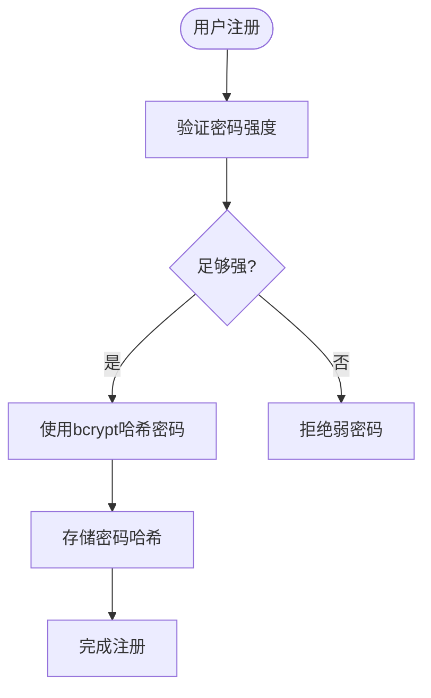

**Section sources**
- [plugin.ts](file://packages/plugins/@nocobase/plugin-auth/src/server/plugin.ts#L75-L93)

### 会话管理

采用安全的会话管理机制，防止会话劫持和固定攻击。

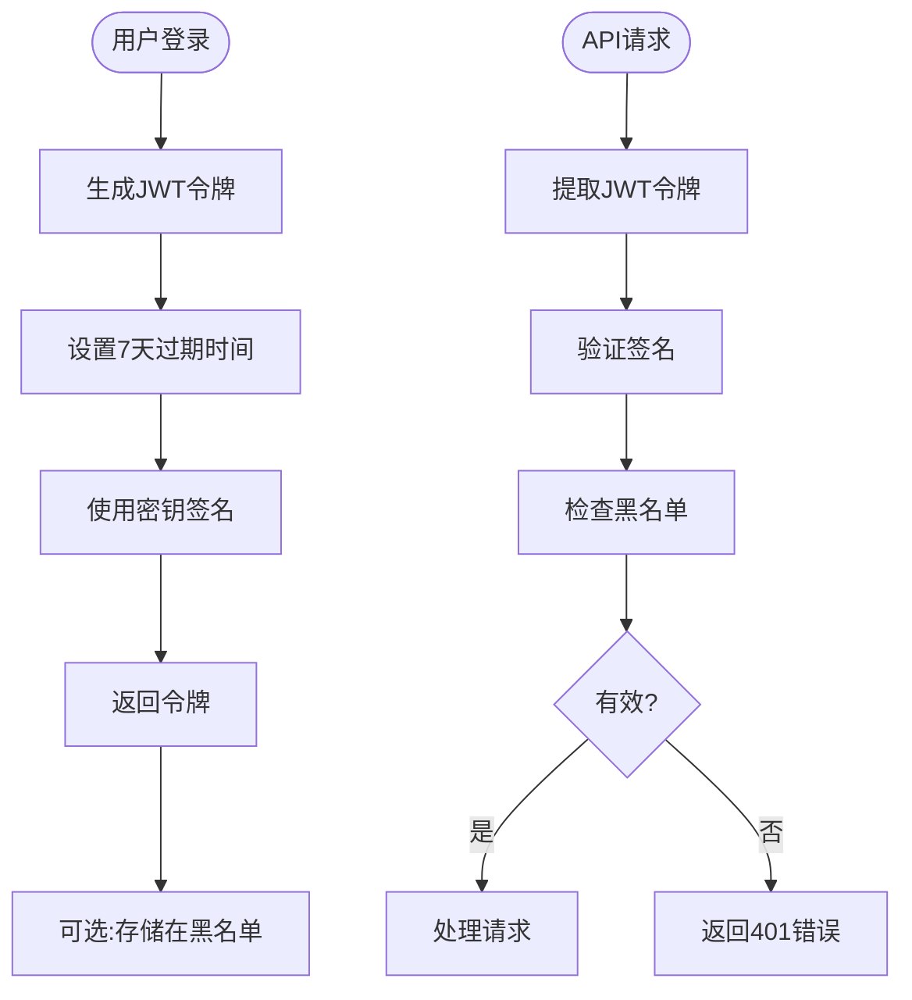

**Diagram sources**
- [jwt-service.ts](file://packages/core/auth/src/base/jwt-service.ts#L20-L78)
- [token-blacklist-service.ts](file://packages/core/auth/src/base/token-blacklist-service.ts#L10-L13)

**Section sources**
- [jwt-service.ts](file://packages/core/auth/src/base/jwt-service.ts#L20-L78)
- [token-blacklist-service.ts](file://packages/core/auth/src/base/token-blacklist-service.ts#L10-L13)

### 防止常见攻击

实施多项措施防止CSRF、XSS等常见攻击。

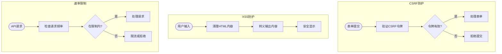

**Section sources**
- [plugin.ts](file://packages/plugins/@nocobase/plugin-auth/src/server/plugin.ts#L36-L38)
- [plugin.ts](file://packages/plugins/@nocobase/plugin-acl/src/server/server.ts#L505-L523)

## 安全审计日志

NocoBase提供全面的审计日志功能，记录所有关键操作。

### 审计日志结构

审计日志记录了操作的详细信息，包括用户、角色、IP地址和操作结果。

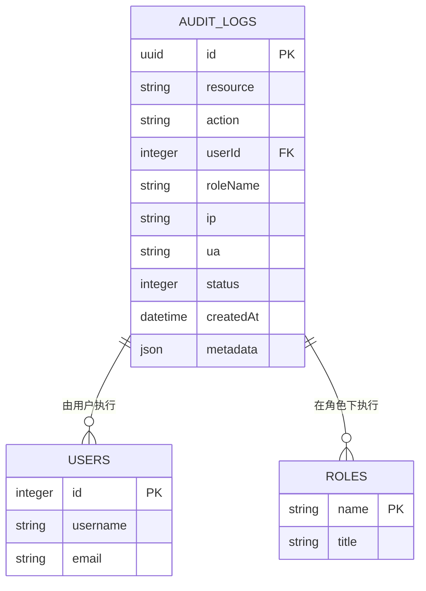

**Diagram sources**
- [index.ts](file://packages/core/server/src/audit-manager/index.ts#L266-L306)

**Section sources**
- [index.ts](file://packages/core/server/src/audit-manager/index.ts#L266-L306)

### 审计日志配置

审计日志可以针对不同操作进行精细配置。

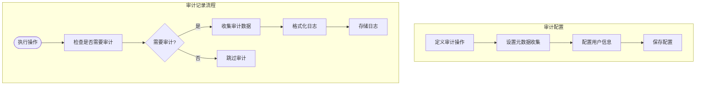

**Section sources**
- [plugin.ts](file://packages/plugins/@nocobase/plugin-auth/src/server/plugin.ts#L238-L272)
- [index.ts](file://packages/core/server/src/audit-manager/index.ts#L277-L306)

## 合规性要求

NocoBase设计符合多项合规性要求，确保数据安全和隐私保护。

### 数据保护

实施严格的数据保护措施，符合GDPR等法规要求。

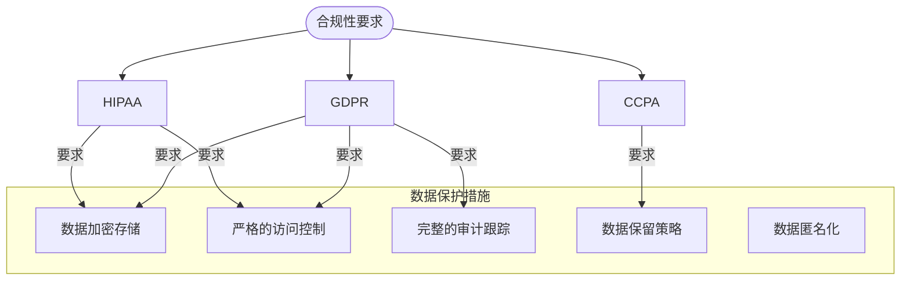

**Section sources**
- [plugin.ts](file://packages/plugins/@nocobase/plugin-audit-logs/src/client/deplicated/AuditLogs.tsx#L210-L524)
- [plugin.ts](file://packages/plugins/@nocobase/plugin-auth/src/server/plugin.ts#L238-L272)