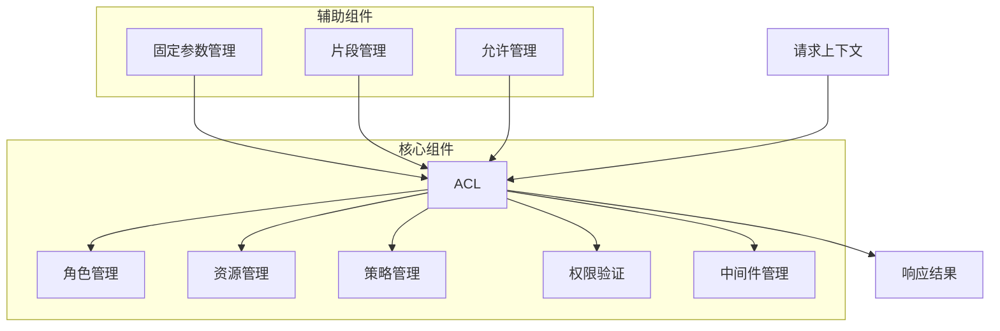
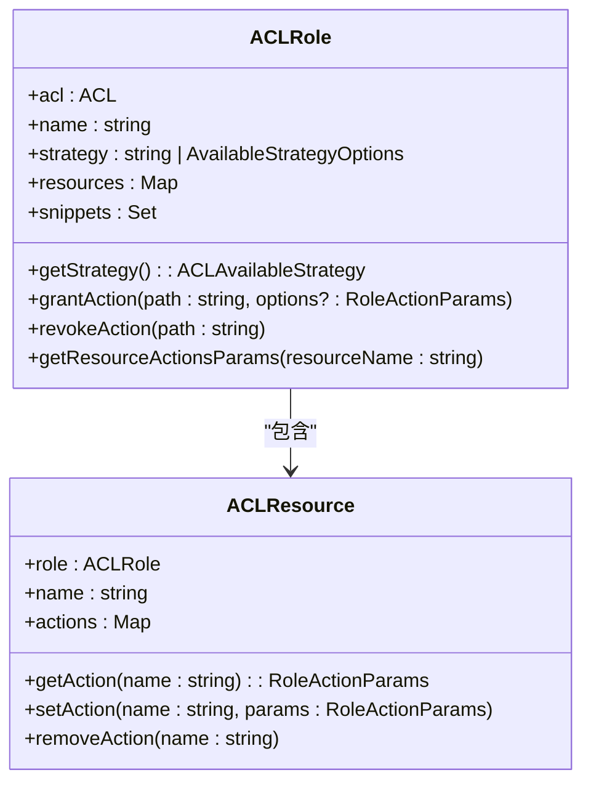
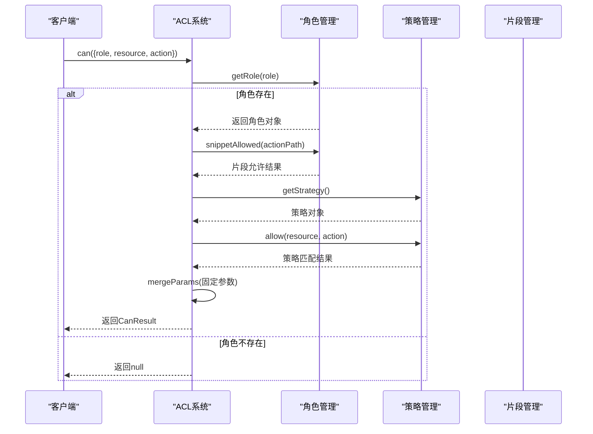
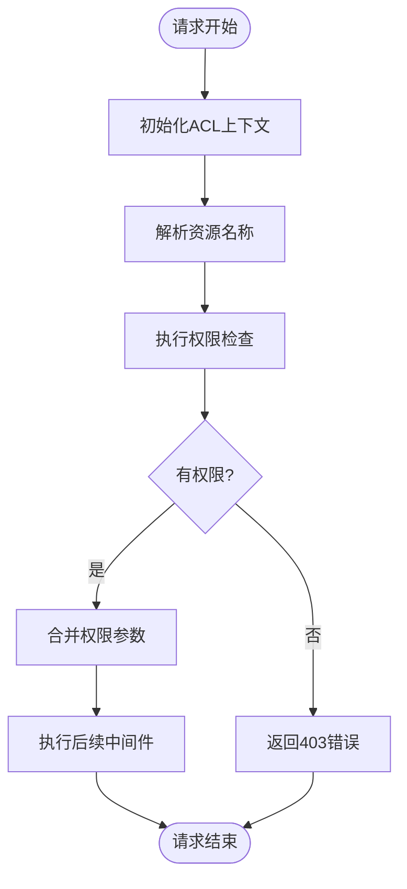
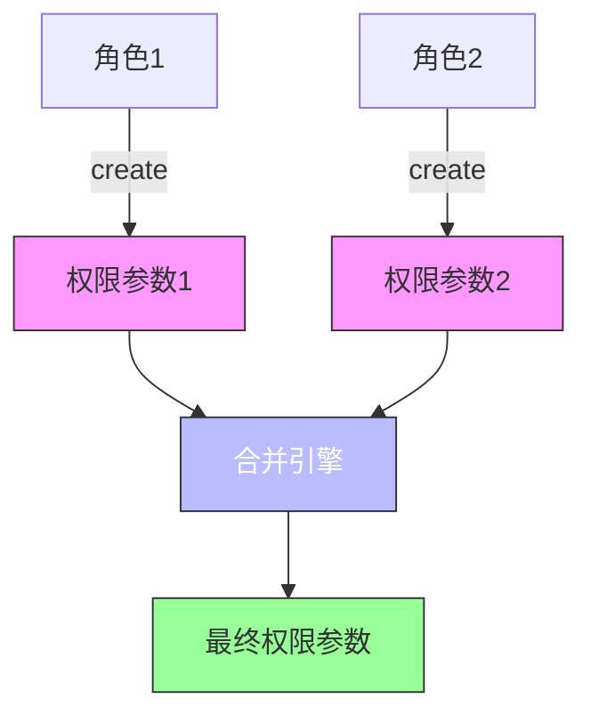
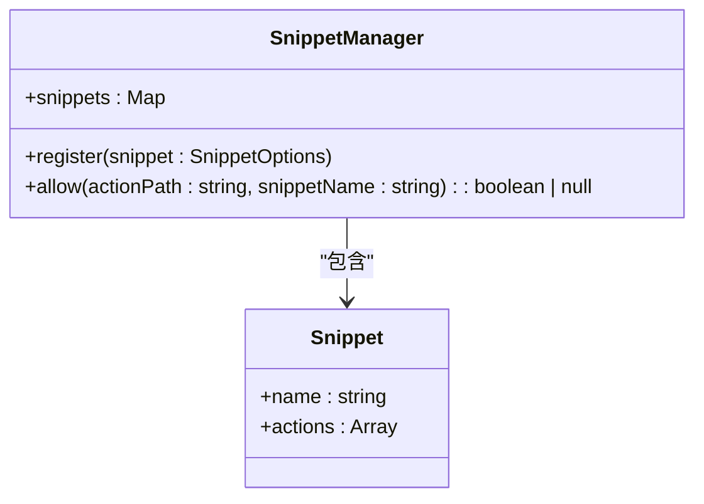
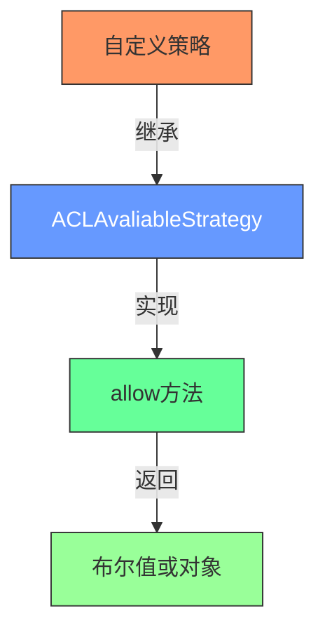
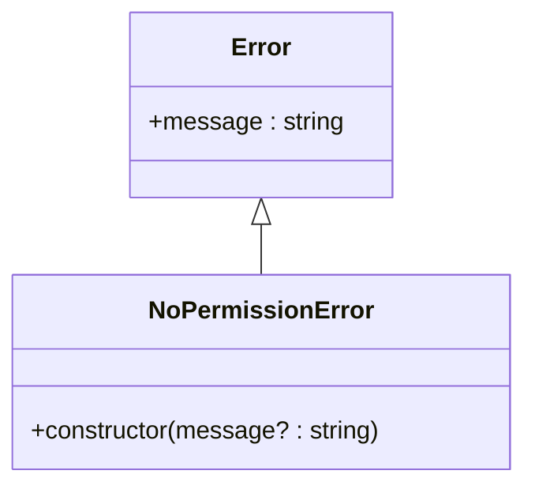

# ACL系统

<cite>
**本文档中引用的文件**  
- [Acl.ts](file://packages/core/acl/src/Acl.ts)
- [acl-role.ts](file://packages/core/acl/src/acl-role.ts)
- [acl-resource.ts](file://packages/core/acl/src/acl-resource.ts)
- [fixed-params-manager.ts](file://packages/core/acl/src/fixed-params-manager.ts)
- [snippet-manager.ts](file://packages/core/acl/src/snippet-manager.ts)
- [allow-manager.ts](file://packages/core/acl/src/allow-manager.ts)
- [acl-available-strategy.ts](file://packages/core/acl/src/acl-available-strategy.ts)
- [acl-available-action.ts](file://packages/core/acl/src/acl-available-action.ts)
- [skip-middleware.ts](file://packages/core/acl/src/skip-middleware.ts)
- [no-permission-error.ts](file://packages/core/acl/src/errors/no-permission-error.ts)
</cite>

## 目录
1. [简介](#简介)
2. [核心架构设计](#核心架构设计)
3. [权限资源与角色定义](#权限资源与角色定义)
4. [权限策略与验证机制](#权限策略与验证机制)
5. [ACL中间件执行流程](#acl中间件执行流程)
6. [权限继承与合并机制](#权限继承与合并机制)
7. [固定参数权限控制](#固定参数权限控制)
8. [细粒度访问控制实现](#细粒度访问控制实现)
9. [自定义权限策略](#自定义权限策略)
10. [权限拒绝处理](#权限拒绝处理)

## 简介
NocoBase ACL（访问控制列表）系统提供了一套完整的权限管理解决方案，支持基于角色的访问控制（RBAC）、权限继承、策略匹配和细粒度数据过滤。该系统通过模块化设计实现了灵活的权限配置，支持动态策略、固定参数注入和权限片段管理，确保系统安全性和可扩展性。

## 核心架构设计
NocoBase ACL系统采用分层架构设计，主要由权限资源、角色定义、权限策略、权限验证和中间件执行五个核心组件构成。系统通过事件驱动机制协调各组件间的交互，利用拓扑排序管理中间件执行顺序，确保权限检查的准确性和高效性。



**图示来源**  
- [Acl.ts](file://packages/core/acl/src/Acl.ts#L66-L603)
- [acl-role.ts](file://packages/core/acl/src/acl-role.ts#L33-L215)
- [acl-resource.ts](file://packages/core/acl/src/acl-resource.ts#L22-L84)

## 权限资源与角色定义
ACL系统通过`ACLRole`和`ACLResource`类实现角色和资源的管理。每个角色可以定义对多个资源的访问权限，权限配置支持字段白名单、数据过滤条件和所有权控制。

### 角色管理
`ACLRole`类负责管理角色的权限配置，包括策略设置、资源授权和权限片段管理。角色可以通过`grantAction`方法授予特定资源的操作权限，通过`revokeAction`方法撤销权限。

**代码路径**  
- `ACLRole.grantAction()` - [acl-role.ts#L82-L96](file://packages/core/acl/src/acl-role.ts#L82-L96)
- `ACLRole.revokeAction()` - [acl-role.ts#L103-L107](file://packages/core/acl/src/acl-role.ts#L103-L107)

### 资源管理
`ACLResource`类管理特定资源的权限配置，支持为不同操作（如create、update、read等）设置独立的权限参数。资源权限可以包含字段限制、数据过滤和关联数据加载等配置。



**图示来源**  
- [acl-role.ts](file://packages/core/acl/src/acl-role.ts#L33-L215)
- [acl-resource.ts](file://packages/core/acl/src/acl-resource.ts#L22-L84)

**本节来源**  
- [acl-role.ts](file://packages/core/acl/src/acl-role.ts#L33-L215)
- [acl-resource.ts](file://packages/core/acl/src/acl-resource.ts#L22-L84)

## 权限策略与验证机制
ACL系统通过`ACLAvaliableStrategy`类实现权限策略管理，支持预定义策略和自定义策略。权限验证通过`can`方法实现，支持单角色和多角色权限检查。

### 策略定义
权限策略通过`AvailableStrategyOptions`接口定义，支持操作匹配、显示名称和配置权限等属性。系统内置了"own"和"all"两种预定义谓词，分别表示用户自身数据和所有数据。

```mermaid
classDiagram
class ACLAvailableStrategy {
+acl : ACL
+options : AvailableStrategyOptions
+actionsAsObject : { [key : string] : string }
+allowConfigure : boolean
+matchAction(actionName : string) : boolean | object
+allow(resourceName : string, actionName : string) : boolean | object
}
class AvailableStrategyOptions {
+displayName? : string
+actions? : false | '*' | string | string[]
+allowConfigure? : boolean
}
```

**图示来源**  
- [acl-available-strategy.ts](file://packages/core/acl/src/acl-available-strategy.ts#L34-L81)

### 权限验证
权限验证通过`ACL.can()`方法实现，该方法支持角色、资源和操作的组合查询。验证过程考虑了权限继承、策略匹配和片段允许等因素，返回包含权限参数的结果对象。



**图示来源**  
- [Acl.ts](file://packages/core/acl/src/Acl.ts#L210-L323)
- [acl-available-strategy.ts](file://packages/core/acl/src/acl-available-strategy.ts#L77-L80)

**本节来源**  
- [Acl.ts](file://packages/core/acl/src/Acl.ts#L210-L323)
- [acl-available-strategy.ts](file://packages/core/acl/src/acl-available-strategy.ts#L15-L81)

## ACL中间件执行流程
ACL中间件是权限系统的核心执行单元，负责在请求处理过程中进行权限检查和参数合并。中间件通过拓扑排序管理执行顺序，确保权限逻辑的正确执行。

### 执行流程
1. 初始化ACL上下文
2. 解析资源名称和操作名称
3. 执行权限检查
4. 合并权限参数
5. 执行后续中间件



**图示来源**  
- [Acl.ts](file://packages/core/acl/src/Acl.ts#L381-L417)

### 核心中间件
系统内置了核心中间件，负责最终的权限验证和参数应用。该中间件在权限检查通过后，将权限参数合并到请求参数中，供后续业务逻辑使用。

**代码路径**  
- `ACL.addCoreMiddleware()` - [Acl.ts#L495-L574](file://packages/core/acl/src/Acl.ts#L495-L574)
- `ACL.middleware()` - [Acl.ts#L381-L417](file://packages/core/acl/src/Acl.ts#L381-L417)

**本节来源**  
- [Acl.ts](file://packages/core/acl/src/Acl.ts#L381-L574)

## 权限继承与合并机制
ACL系统支持多角色权限的继承和合并，允许用户同时拥有多个角色的权限。权限合并遵循特定的合并策略，确保权限配置的合理性和安全性。

### 权限继承
当用户拥有多个角色时，系统会依次检查每个角色的权限，并将结果进行合并。如果用户拥有"root"角色，则直接授予完全权限。

### 权限合并
权限合并通过`mergeAclActionParams`函数实现，采用特定的合并策略：
- filter：AND合并
- fields：交集
- appends：并集
- whitelist：交集
- blacklist：交集
- sort：覆盖



**图示来源**  
- [Acl.ts](file://packages/core/acl/src/Acl.ts#L224-L241)
- [utils.ts](file://packages/core/acl/src/utils.ts#L1-L10)

**本节来源**  
- [Acl.ts](file://packages/core/acl/src/Acl.ts#L224-L241)

## 固定参数权限控制
固定参数管理器（FixedParamsManager）用于实现固定参数的权限控制，允许在权限检查过程中注入固定的过滤条件、字段限制等参数。

### 实现机制
`FixedParamsManager`类通过`addParams`方法注册固定参数合并器，通过`getParams`方法获取合并后的参数。系统为不同参数类型定义了特定的合并策略。

```mermaid
classDiagram
class FixedParamsManager {
+merger : Map<ActionPath, Array<Merger>>
+addParams(resource : string, action : string, merger : Merger)
+getParams(resource : string, action : string, extraParams : any) : object
+static mergeParams(a : any, b : any)
}
class Merger {
<<function>>
() : object
}
FixedParamsManager --> Merger : "使用"
```

**图示来源**  
- [fixed-params-manager.ts](file://packages/core/acl/src/fixed-params-manager.ts#L19-L61)

### 合并策略
系统为不同类型的参数定义了特定的合并策略：
- filter：AND合并
- fields：交集
- appends：并集
- whitelist：交集
- blacklist：交集
- sort：覆盖

**代码路径**  
- `FixedParamsManager.mergeParams()` - [fixed-params-manager.ts#L49-L58](file://packages/core/acl/src/fixed-params-manager.ts#L49-L58)

**本节来源**  
- [fixed-params-manager.ts](file://packages/core/acl/src/fixed-params-manager.ts#L19-L61)

## 细粒度访问控制实现
ACL系统通过权限片段（Snippet）和允许管理器（AllowManager）实现细粒度的访问控制，支持基于条件的权限跳过和动态权限检查。

### 权限片段管理
`SnippetManager`类负责管理权限片段，支持通配符匹配和否定规则。权限片段可以关联多个操作路径，实现批量权限控制。



**图示来源**  
- [snippet-manager.ts](file://packages/core/acl/src/snippet-manager.ts#L29-L68)

### 允许管理器
`AllowManager`类提供条件允许功能，支持预定义条件（如loggedIn、public）和自定义条件函数。允许管理器可以在权限检查前跳过某些检查。

```mermaid
classDiagram
class AllowManager {
+skipActions : Map<string, Map<string, string | ConditionFunc | true>>
+registeredCondition : Map<string, ConditionFunc>
+allow(resourceName : string, actionName : string, condition? : string | ConditionFunc)
+isAllowed(resourceName : string, actionName : string, ctx : any) : boolean
+aclMiddleware() : KoaMiddleware
}
class ConditionFunc {
<<function>>
(ctx : any) : Promise<boolean> | boolean
}
AllowManager --> ConditionFunc : "使用"
```

**图示来源**  
- [allow-manager.ts](file://packages/core/acl/src/allow-manager.ts#L14-L112)

**本节来源**  
- [snippet-manager.ts](file://packages/core/acl/src/snippet-manager.ts#L29-L68)
- [allow-manager.ts](file://packages/core/acl/src/allow-manager.ts#L14-L112)

## 自定义权限策略
ACL系统支持自定义权限策略，开发者可以通过`setAvailableStrategy`方法注册自定义策略，实现特定的权限检查逻辑。

### 策略注册
通过`ACL.setAvailableStrategy`方法注册自定义策略，指定策略名称和配置选项。策略配置可以包含操作匹配规则、显示名称和配置权限。

**代码路径**  
- `ACL.setAvailableStrategy()` - [Acl.ts#L202-L204](file://packages/core/acl/src/Acl.ts#L202-L204)

### 自定义实现
自定义策略需要实现`ACLAvaliableStrategy`类，重写`allow`方法以提供特定的权限检查逻辑。策略可以基于上下文信息、用户属性或其他业务规则进行决策。



**图示来源**  
- [acl-available-strategy.ts](file://packages/core/acl/src/acl-available-strategy.ts#L34-L81)

**本节来源**  
- [Acl.ts](file://packages/core/acl/src/Acl.ts#L202-L204)
- [acl-available-strategy.ts](file://packages/core/acl/src/acl-available-strategy.ts#L34-L81)

## 权限拒绝处理
当权限检查失败时，系统会抛出`NoPermissionError`异常，并返回403状态码。权限拒绝处理机制确保未授权的访问被及时阻止。

### 错误处理
`NoPermissionError`类继承自`Error`类，用于表示权限拒绝错误。系统在权限检查失败时抛出此异常，由上层错误处理中间件捕获并返回适当的响应。



**图示来源**  
- [no-permission-error.ts](file://packages/core/acl/src/errors/no-permission-error.ts#L10)

### 中间件处理
核心中间件在权限检查失败时调用`ctx.throw(403, 'No permissions')`，确保请求被终止并返回403响应。系统还提供了`skip-middleware`用于条件性跳过权限检查。

**代码路径**  
- `核心中间件权限检查` - [Acl.ts#L507-L510](file://packages/core/acl/src/Acl.ts#L507-L510)
- `skip中间件` - [skip-middleware.ts#L10-L19](file://packages/core/acl/src/skip-middleware.ts#L10-L19)

**本节来源**  
- [no-permission-error.ts](file://packages/core/acl/src/errors/no-permission-error.ts#L10)
- [Acl.ts](file://packages/core/acl/src/Acl.ts#L507-L510)
- [skip-middleware.ts](file://packages/core/acl/src/skip-middleware.ts#L10-L19)