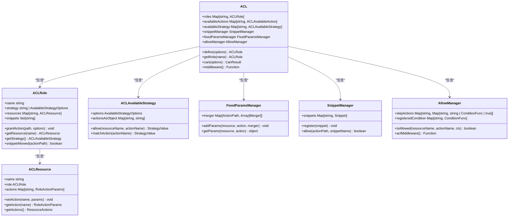
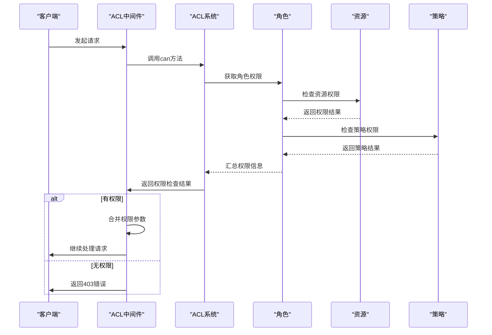
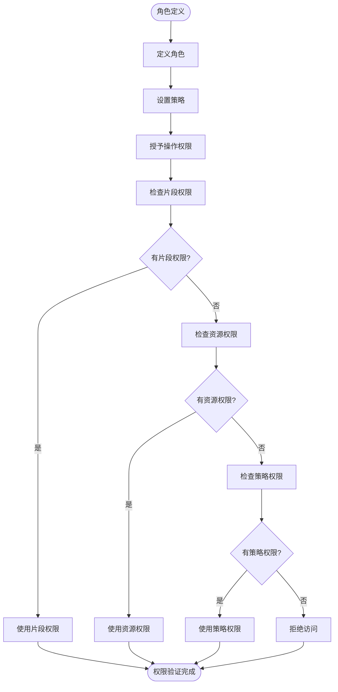
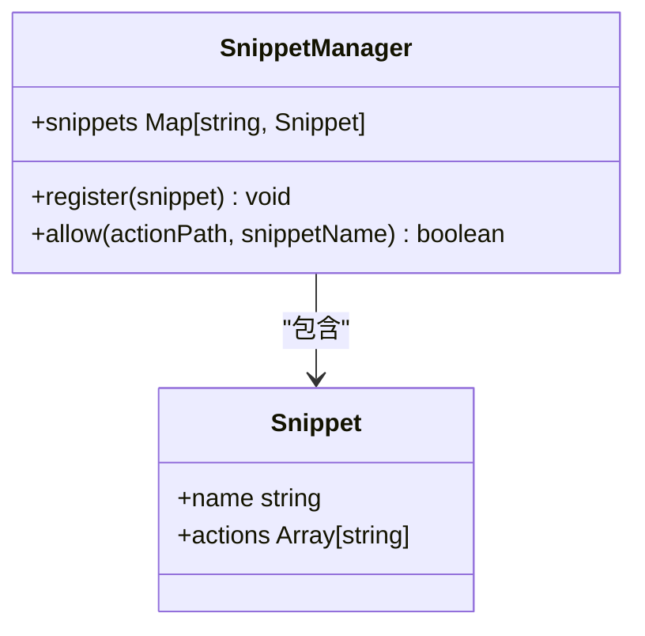
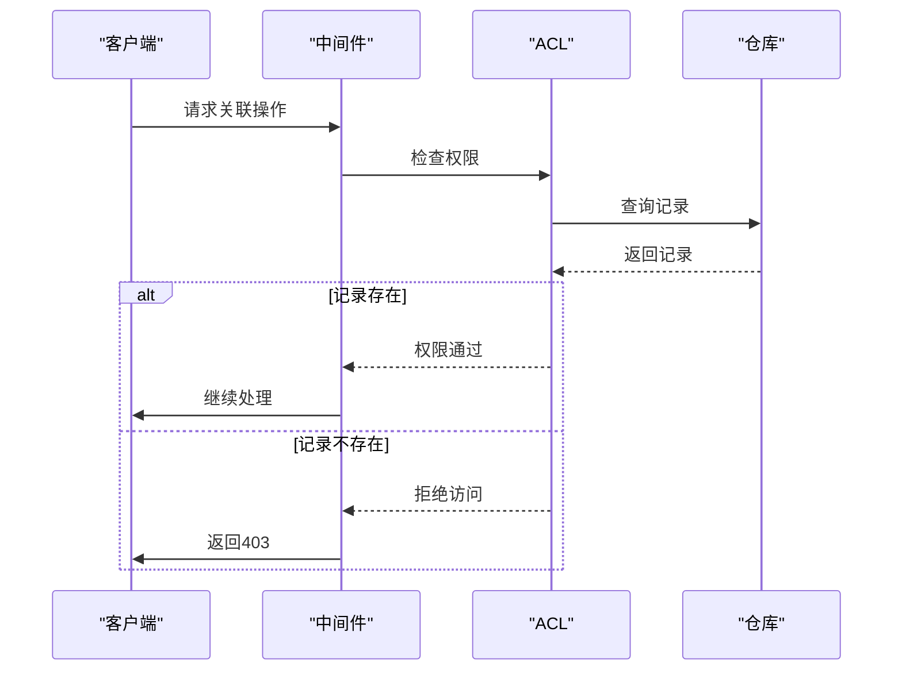
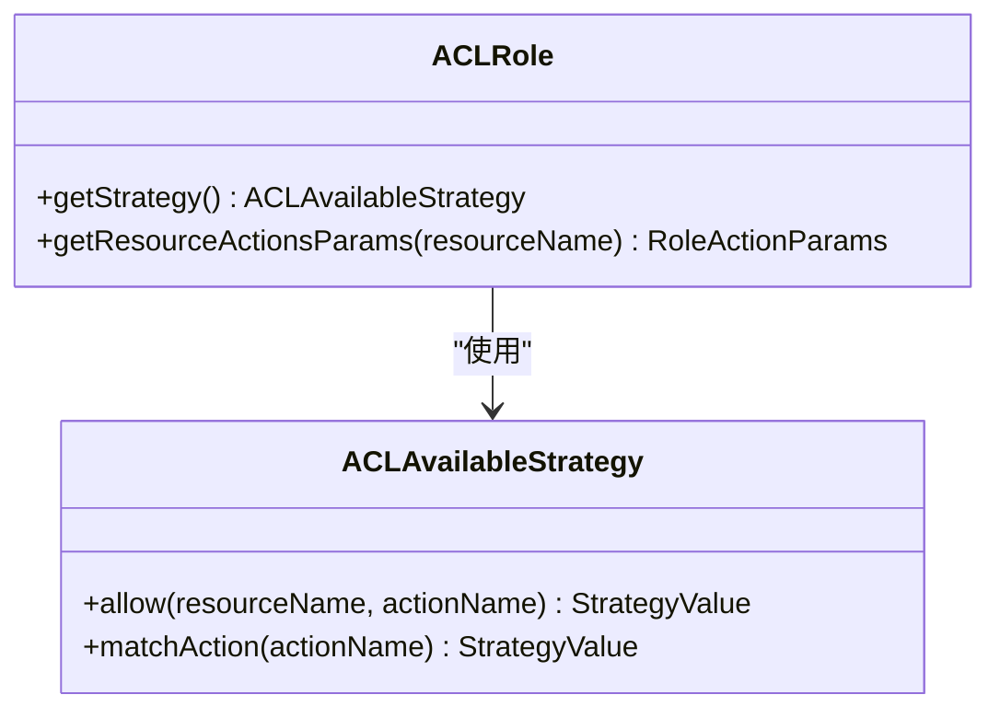

# 授权机制

<cite>
**本文档引用的文件**
- [acl.ts](file://packages\core\acl\src\acl.ts)
- [acl-role.ts](file://packages\core\acl\src\acl-role.ts)
- [acl-resource.ts](file://packages\core\acl\src\acl-resource.ts)
- [acl-available-strategy.ts](file://packages\core\acl\src\acl-available-strategy.ts)
- [fixed-params-manager.ts](file://packages\core\acl\src\fixed-params-manager.ts)
- [snippet-manager.ts](file://packages\core\acl\src\snippet-manager.ts)
- [allow-manager.ts](file://packages\core\acl\src\allow-manager.ts)
- [server.ts](file://packages\plugins\@nocobase\plugin-acl\src\server\server.ts)
- [check-association-operate.ts](file://packages\plugins\@nocobase\plugin-acl\src\server\middlewares\check-association-operate.ts)
</cite>

## 目录
1. [简介](#简介)
2. [核心组件](#核心组件)
3. [权限验证流程](#权限验证流程)
4. [角色与权限关联机制](#角色与权限关联机制)
5. [权限配置说明](#权限配置说明)
6. [细粒度访问控制](#细粒度访问控制)

## 简介
NocoBase的授权机制基于ACL（访问控制列表）系统，提供了一套完整的权限管理解决方案。该系统通过角色定义、权限策略、资源访问控制和权限继承机制来实现灵活的权限管理。系统支持固定权限和动态权限的实现方式，允许开发者根据业务需求进行细粒度的访问控制。

**本节不分析具体源文件**

## 核心组件

NocoBase的ACL系统由多个核心组件构成，包括ACL、ACLRole、ACLResource、ACLAvaliableStrategy等。这些组件共同协作，实现了完整的权限管理体系。



**图源**
- [acl.ts](file://packages\core\acl\src\acl.ts)
- [acl-role.ts](file://packages\core\acl\src\acl-role.ts)
- [acl-resource.ts](file://packages\core\acl\src\acl-resource.ts)
- [acl-available-strategy.ts](file://packages\core\acl\src\acl-available-strategy.ts)
- [fixed-params-manager.ts](file://packages\core\acl\src\fixed-params-manager.ts)
- [snippet-manager.ts](file://packages\core\acl\src\snippet-manager.ts)
- [allow-manager.ts](file://packages\core\acl\src\allow-manager.ts)

**本节源**
- [acl.ts](file://packages\core\acl\src\acl.ts)
- [acl-role.ts](file://packages\core\acl\src\acl-role.ts)
- [acl-resource.ts](file://packages\core\acl\src\acl-resource.ts)

## 权限验证流程

NocoBase的权限验证流程通过中间件链的方式实现，确保每个请求都经过严格的权限检查。流程包括权限检查、参数合并和访问拒绝处理等关键步骤。



**图源**
- [acl.ts](file://packages\core\acl\src\acl.ts)
- [server.ts](file://packages\plugins\@nocobase\plugin-acl\src\server\server.ts)

**本节源**
- [acl.ts](file://packages\core\acl\src\acl.ts)
- [server.ts](file://packages\plugins\@nocobase\plugin-acl\src\server\server.ts)

## 角色与权限关联机制

NocoBase通过角色定义和权限策略实现角色与权限的关联。系统支持固定权限和动态权限两种实现方式，提供了灵活的权限管理能力。



**图源**
- [acl.ts](file://packages\core\acl\src\acl.ts)
- [acl-role.ts](file://packages\core\acl\src\acl-role.ts)
- [snippet-manager.ts](file://packages\core\acl\src\snippet-manager.ts)

**本节源**
- [acl.ts](file://packages\core\acl\src\acl.ts)
- [acl-role.ts](file://packages\core\acl\src\acl-role.ts)
- [snippet-manager.ts](file://packages\core\acl\src\snippet-manager.ts)

## 权限配置说明

NocoBase的权限配置通过资源操作权限的定义和分配来实现。系统提供了多种配置方式，包括固定参数、片段管理和策略定义等。

### 固定参数配置
固定参数用于为特定资源和操作设置默认的权限参数。这些参数在权限检查时会被自动合并到请求参数中。

```mermaid
classDiagram
class FixedParamsManager {
+addParams(resource, action, merger) void
+getParams(resource, action) object
}
class Merger {
<<function>>
() => object
}
FixedParamsManager --> Merger : "使用"
```

**图源**
- [fixed-params-manager.ts](file://packages\core\acl\src\fixed-params-manager.ts)

**本节源**
- [fixed-params-manager.ts](file://packages\core\acl\src\fixed-params-manager.ts)

### 片段管理
片段管理允许将权限配置分组管理，通过通配符匹配实现批量权限控制。



**图源**
- [snippet-manager.ts](file://packages\core\acl\src\snippet-manager.ts)

**本节源**
- [snippet-manager.ts](file://packages\core\acl\src\snippet-manager.ts)

## 细粒度访问控制

NocoBase通过多种机制实现细粒度的访问控制，包括关联操作检查、参数过滤和权限继承等。

### 关联操作检查
对关联资源的操作进行权限检查，确保用户只能访问其有权限的关联数据。



**图源**
- [check-association-operate.ts](file://packages\plugins\@nocobase\plugin-acl\src\server\middlewares\check-association-operate.ts)

**本节源**
- [check-association-operate.ts](file://packages\plugins\@nocobase\plugin-acl\src\server\middlewares\check-association-operate.ts)

### 权限继承机制
通过角色继承和策略继承实现权限的层级管理，简化权限配置。



**图源**
- [acl-role.ts](file://packages\core\acl\src\acl-role.ts)
- [acl-available-strategy.ts](file://packages\core\acl\src\acl-available-strategy.ts)

**本节源**
- [acl-role.ts](file://packages\core\acl\src\acl-role.ts)
- [acl-available-strategy.ts](file://packages\core\acl\src\acl-available-strategy.ts)