# 权限管理

<cite>
**本文档中引用的文件**  
- [index.ts](file://packages/core/acl/src/index.ts)
- [acl.ts](file://packages/core/acl/src/acl.ts)
- [acl-role.ts](file://packages/core/acl/src/acl-role.ts)
- [acl-resource.ts](file://packages/core/acl/src/acl-resource.ts)
- [server.ts](file://packages/plugins/@nocobase/plugin-acl/src/server/server.ts)
- [RoleModel.ts](file://packages/plugins/@nocobase/plugin-acl/src/server/model/RoleModel.ts)
- [RolesManagement.tsx](file://packages/plugins/@nocobase/plugin-acl/src/client/RolesManagement.tsx)
- [Permissions.tsx](file://packages/plugins/@nocobase/plugin-acl/src/client/permissions/Permissions.tsx)
</cite>

## 目录
1. [介绍](#介绍)
2. [权限管理架构](#权限管理架构)
3. [核心组件分析](#核心组件分析)
4. [权限管理界面实现](#权限管理界面实现)
5. [权限管理API调用流程](#权限管理api调用流程)
6. [前端权限配置与后端ACL系统集成](#前端权限配置与后端acl系统集成)
7. [细粒度权限控制实现](#细粒度权限控制实现)
8. [实际使用示例](#实际使用示例)
9. [常见权限管理场景解决方案](#常见权限管理场景解决方案)
10. [结论](#结论)

## 介绍

NocoBase的权限管理系统提供了一套完整的角色基础访问控制（RBAC）机制，支持灵活的权限分配和细粒度的访问控制。该系统允许管理员通过直观的用户界面创建角色、分配权限、配置策略，并将角色与用户关联。权限管理功能贯穿整个应用，确保不同用户只能访问其被授权的资源和操作。

**权限管理**系统的核心是基于角色的访问控制模型，其中包含角色创建、权限分配、策略配置和用户角色关联等关键功能。系统通过前端界面与后端ACL（访问控制列表）系统的紧密集成，实现了动态的权限管理和实时的访问控制。

**Section sources**
- [index.ts](file://packages/core/acl/src/index.ts)

## 权限管理架构

NocoBase权限管理系统采用分层架构设计，将前端用户界面、后端服务逻辑和数据存储分离，确保系统的可维护性和可扩展性。系统的核心是ACL（访问控制列表）模块，它负责处理所有权限验证和访问控制逻辑。

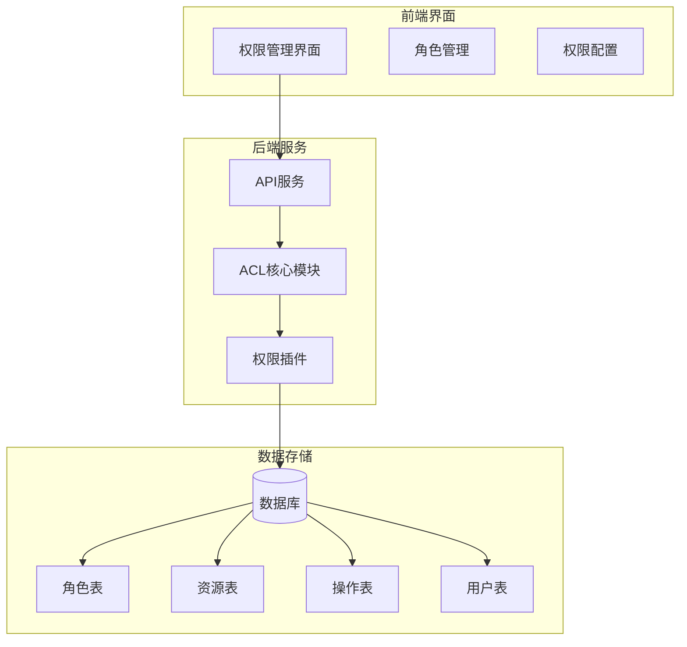

**Diagram sources**
- [server.ts](file://packages/plugins/@nocobase/plugin-acl/src/server/server.ts)
- [RolesManagement.tsx](file://packages/plugins/@nocobase/plugin-acl/src/client/RolesManagement.tsx)

## 核心组件分析

### ACL核心模块

ACL核心模块是权限管理系统的基础，负责定义和管理所有权限相关的逻辑。该模块提供了角色定义、权限验证、策略应用等核心功能。

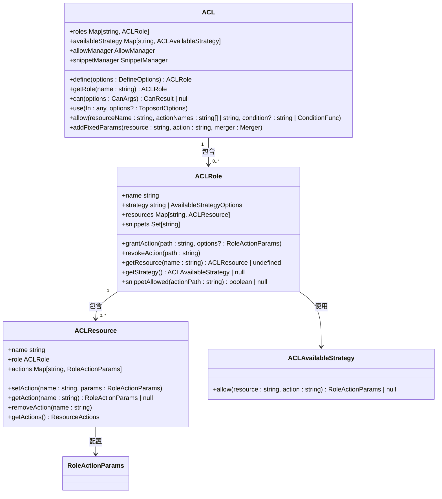

**Diagram sources**
- [acl.ts](file://packages/core/acl/src/acl.ts)
- [acl-role.ts](file://packages/core/acl/src/acl-role.ts)
- [acl-resource.ts](file://packages/core/acl/src/acl-resource.ts)

### 权限插件服务端

权限插件服务端实现了具体的权限管理功能，包括角色同步、权限写入、事件监听等。该组件负责将数据库中的角色和权限配置同步到ACL系统中。

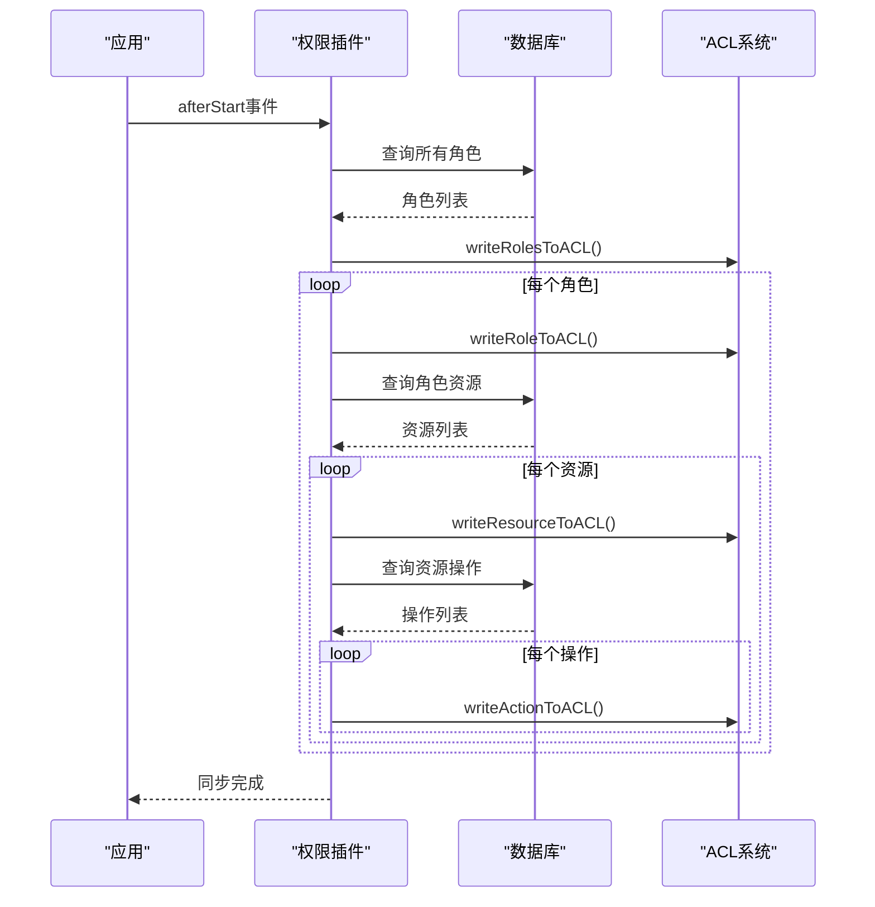

**Diagram sources**
- [server.ts](file://packages/plugins/@nocobase/plugin-acl/src/server/server.ts)

**Section sources**
- [server.ts](file://packages/plugins/@nocobase/plugin-acl/src/server/server.ts)

## 权限管理界面实现

### 角色管理界面

角色管理界面提供了创建、编辑和删除角色的功能，以及权限分配的可视化操作。界面采用卡片式布局，左侧显示角色列表，右侧显示当前选中角色的详细配置。

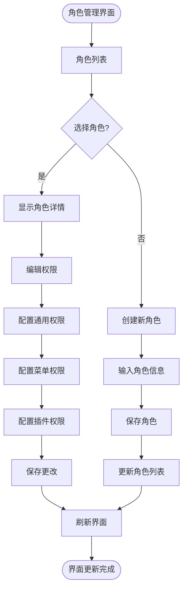

**Diagram sources**
- [RolesManagement.tsx](file://packages/plugins/@nocobase/plugin-acl/src/client/RolesManagement.tsx)

### 权限配置界面

权限配置界面允许管理员为角色分配具体的权限，包括资源访问权限、操作权限和字段级权限。界面采用标签页设计，将不同类型的权限分组管理。

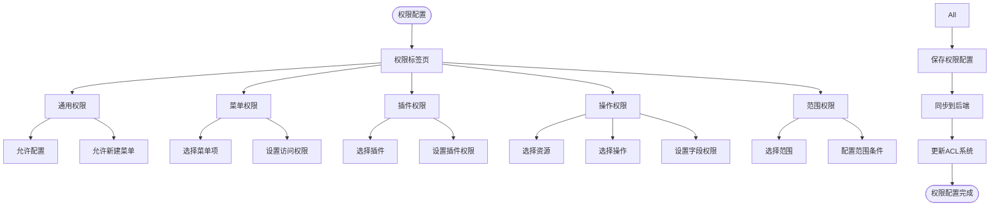

**Diagram sources**
- [Permissions.tsx](file://packages/plugins/@nocobase/plugin-acl/src/client/permissions/Permissions.tsx)

**Section sources**
- [RolesManagement.tsx](file://packages/plugins/@nocobase/plugin-acl/src/client/RolesManagement.tsx)
- [Permissions.tsx](file://packages/plugins/@nocobase/plugin-acl/src/client/permissions/Permissions.tsx)

## 权限管理API调用流程

### 角色CRUD操作

角色的创建、读取、更新和删除操作通过RESTful API进行，每个操作都经过ACL系统的权限验证。

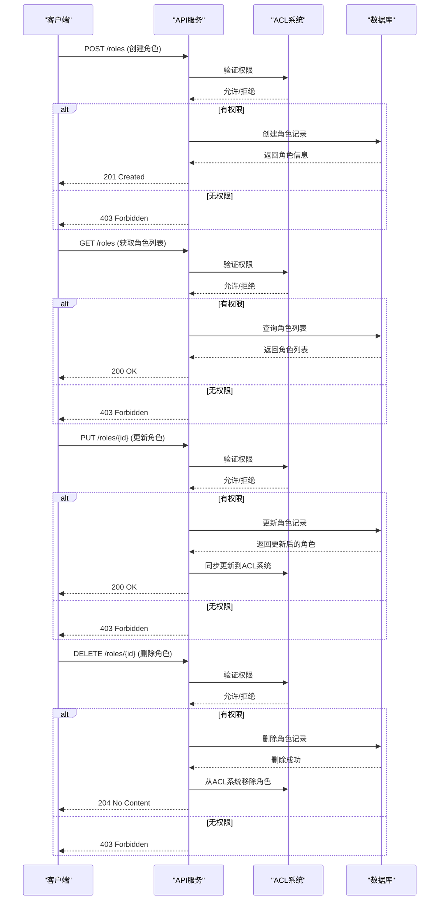

**Diagram sources**
- [server.ts](file://packages/plugins/@nocobase/plugin-acl/src/server/server.ts)

### 权限策略更新

权限策略更新流程涉及将新的权限配置同步到ACL系统，确保权限变更立即生效。

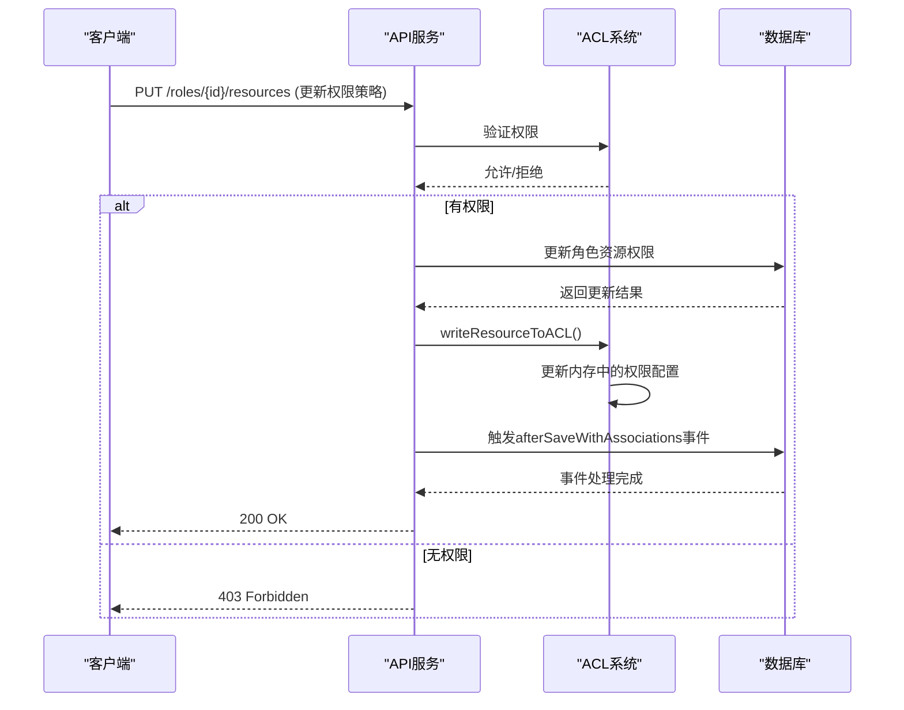

**Diagram sources**
- [server.ts](file://packages/plugins/@nocobase/plugin-acl/src/server/server.ts)

### 角色成员管理

角色成员管理涉及将用户与角色关联，包括添加用户到角色和从角色中移除用户。

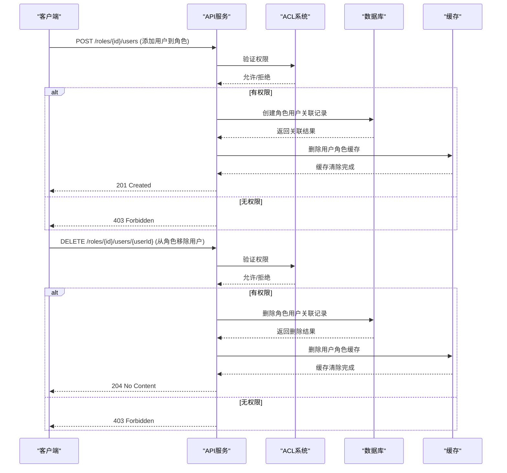

**Diagram sources**
- [server.ts](file://packages/plugins/@nocobase/plugin-acl/src/server/server.ts)

**Section sources**
- [server.ts](file://packages/plugins/@nocobase/plugin-acl/src/server/server.ts)

## 前端权限配置与后端ACL系统集成

### 集成架构

前端权限配置界面与后端ACL系统的集成通过API服务作为桥梁，实现配置的实时同步和权限的动态更新。

```mermaid
graph TB
subgraph "前端"
UI[权限配置界面]
Form[配置表单]
Submit[提交按钮]
end
subgraph "通信"
API[REST API]
WebSocket[WebSocket]
end
subgraph "后端"
Service[API服务]
ACL[ACL系统]
DB[(数据库)]
Cache[缓存]
end
UI --> Form
Form --> Submit
Submit --> API
API --> Service
Service --> ACL
Service --> DB
Service --> Cache
ACL --> Service
DB --> Service
Cache --> Service
Service --> API
API --> UI
WebSocket --> ACL : 实时通知
WebSocket --> UI : 实时更新
```

**Diagram sources**
- [server.ts](file://packages/plugins/@nocobase/plugin-acl/src/server/server.ts)
- [RolesManagement.tsx](file://packages/plugins/@nocobase/plugin-acl/src/client/RolesManagement.tsx)

### 数据同步机制

系统采用事件驱动的数据同步机制，确保权限配置变更能够及时反映到ACL系统中。

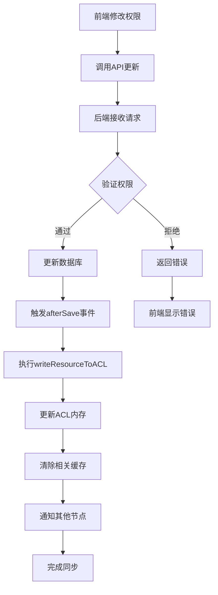

**Diagram sources**
- [server.ts](file://packages/plugins/@nocobase/plugin-acl/src/server/server.ts)

**Section sources**
- [server.ts](file://packages/plugins/@nocobase/plugin-acl/src/server/server.ts)

## 细粒度权限控制实现

### 字段级权限控制

系统支持字段级别的权限控制，允许管理员为不同角色配置对特定字段的访问权限。

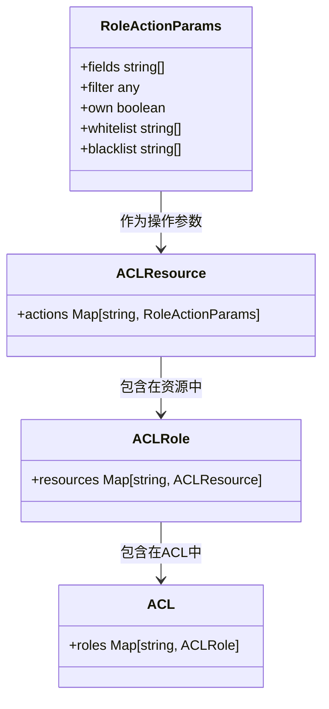

**Diagram sources**
- [acl-role.ts](file://packages/core/acl/src/acl-role.ts)

### 资源范围控制

系统提供资源范围控制功能，允许基于条件过滤用户可访问的数据记录。

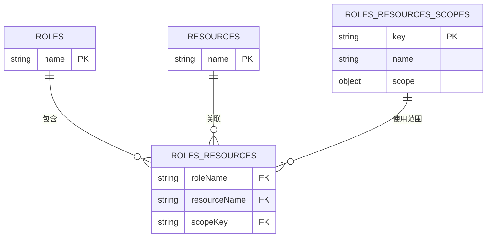

**Diagram sources**
- [server.ts](file://packages/plugins/@nocobase/plugin-acl/src/server/server.ts)

**Section sources**
- [acl-role.ts](file://packages/core/acl/src/acl-role.ts)
- [server.ts](file://packages/plugins/@nocobase/plugin-acl/src/server/server.ts)

## 实际使用示例

### 创建新角色并分配权限

以下示例展示如何通过界面创建新角色并分配权限。

```mermaid
flowchart TD
A[点击"新建角色"] --> B[输入角色名称和显示名]
B --> C[选择角色类型]
C --> D[配置通用权限]
D --> E[配置菜单访问权限]
E --> F[配置插件权限]
F --> G[配置资源操作权限]
G --> H[设置字段可见性]
H --> I[定义数据访问范围]
I --> J[保存角色配置]
J --> K[系统验证配置]
K --> L{验证通过?}
L --> |是| M[创建角色并同步到ACL]
L --> |否| N[显示错误信息]
M --> O[角色创建完成]
N --> B
```

**Diagram sources**
- [RolesManagement.tsx](file://packages/plugins/@nocobase/plugin-acl/src/client/RolesManagement.tsx)

### 用户角色关联流程

展示如何将用户与角色关联的完整流程。

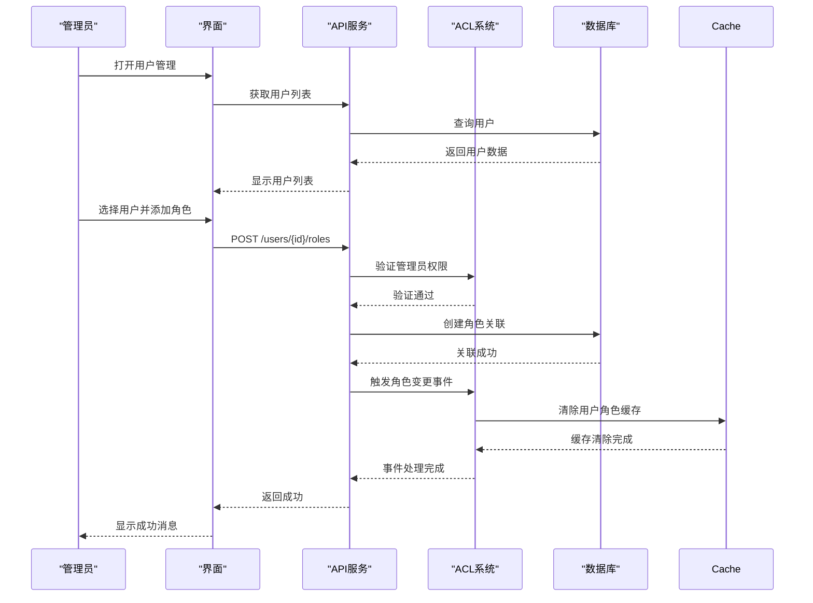

**Diagram sources**
- [server.ts](file://packages/plugins/@nocobase/plugin-acl/src/server/server.ts)

**Section sources**
- [server.ts](file://packages/plugins/@nocobase/plugin-acl/src/server/server.ts)

## 常见权限管理场景解决方案

### 多层级组织架构权限

针对多层级组织架构的权限管理需求，系统提供灵活的解决方案。

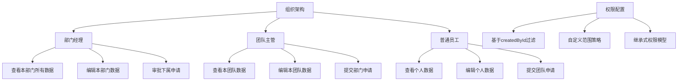

**Diagram sources**
- [server.ts](file://packages/plugins/@nocobase/plugin-acl/src/server/server.ts)

### 动态权限变更处理

系统如何处理动态权限变更的完整流程。

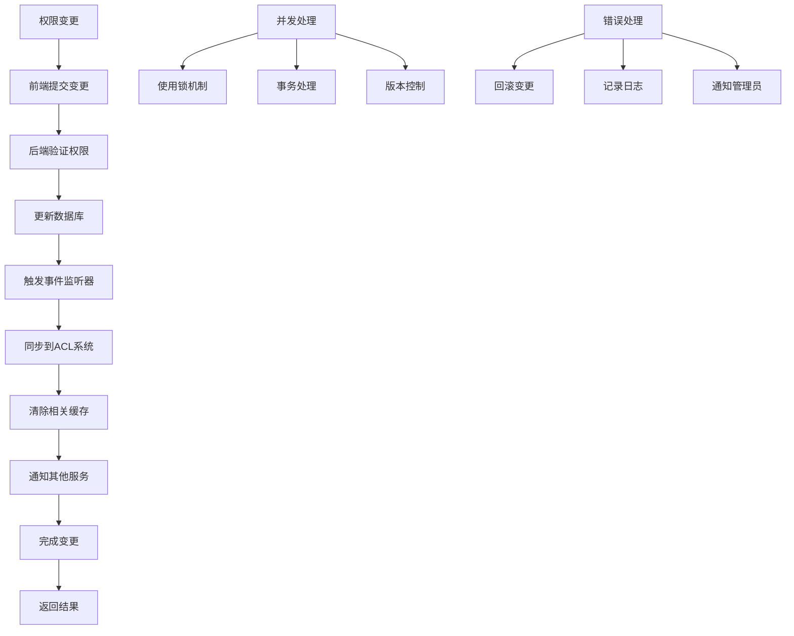

**Diagram sources**
- [server.ts](file://packages/plugins/@nocobase/plugin-acl/src/server/server.ts)

**Section sources**
- [server.ts](file://packages/plugins/@nocobase/plugin-acl/src/server/server.ts)

## 结论

NocoBase的权限管理系统提供了一套完整、灵活且可扩展的权限管理解决方案。通过前端直观的用户界面与后端强大的ACL系统的紧密集成，系统实现了角色创建、权限分配、策略配置和用户角色关联等核心功能。权限管理API提供了标准化的接口，支持角色CRUD操作、权限策略更新和角色成员管理等关键操作。

系统采用事件驱动的架构设计，确保权限配置变更能够实时同步到ACL系统中，并通过缓存机制优化性能。细粒度的权限控制功能支持字段级访问控制和自定义数据范围过滤，满足复杂业务场景的需求。

通过本文档的详细说明，管理员可以全面了解NocoBase权限管理系统的架构、实现原理和使用方法，从而有效地配置和管理系统的权限体系，确保数据安全和业务合规。

**Section sources**
- [index.ts](file://packages/core/acl/src/index.ts)
- [acl.ts](file://packages/core/acl/src/acl.ts)
- [server.ts](file://packages/plugins/@nocobase/plugin-acl/src/server/server.ts)