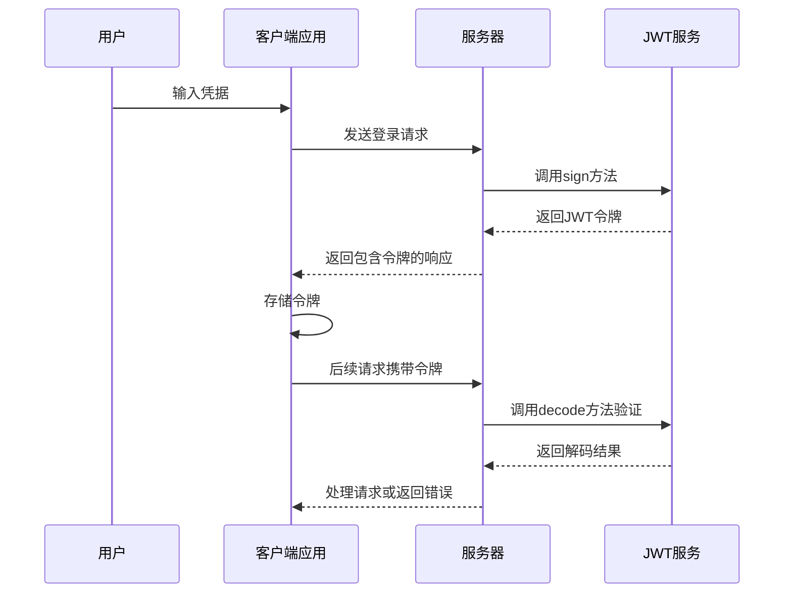
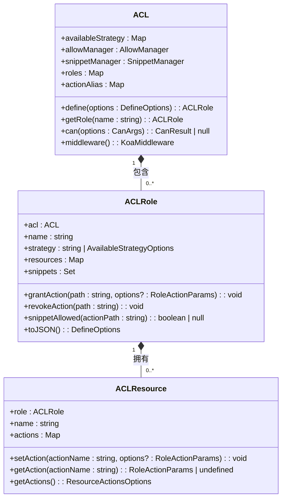
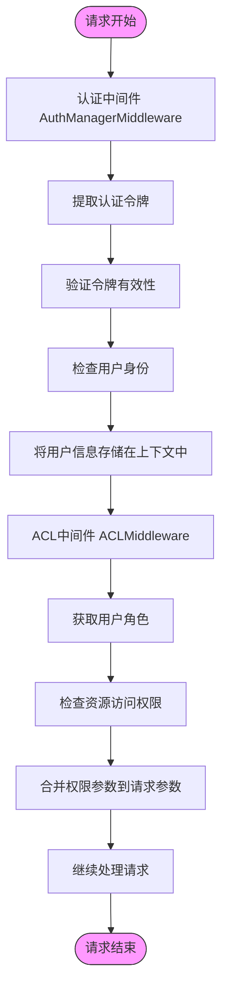

# 认证与授权机制

<cite>
**本文档引用的文件**  
- [auth.ts](file://packages/core/auth/src/auth.ts)
- [auth-manager.ts](file://packages/core/auth/src/auth-manager.ts)
- [jwt-service.ts](file://packages/core/auth/src/base/jwt-service.ts)
- [token-blacklist-service.ts](file://packages/core/auth/src/base/token-blacklist-service.ts)
- [acl.ts](file://packages/core/acl/src/acl.ts)
- [acl-role.ts](file://packages/core/acl/src/acl-role.ts)
- [acl-available-strategy.ts](file://packages/core/acl/src/acl-available-strategy.ts)
- [allow-manager.ts](file://packages/core/acl/src/allow-manager.ts)
</cite>

## 目录
1. [介绍](#介绍)
2. [JWT认证机制](#jwt认证机制)
3. [ACL访问控制列表系统](#acl访问控制列表系统)
4. [权限验证流程](#权限验证流程)
5. [认证配置与外部集成](#认证配置与外部集成)
6. [自定义认证策略](#自定义认证策略)
7. [结论](#结论)

## 介绍

NocoBase的认证与授权机制为系统提供了安全的用户身份验证和细粒度的权限控制。该机制基于JWT（JSON Web Token）实现用户认证，并通过ACL（访问控制列表）系统实现复杂的权限管理。系统支持多种认证方式，包括本地认证、OAuth2、LDAP等外部认证集成。ACL系统提供了角色定义、权限策略、资源访问控制和权限继承等核心功能，确保不同用户角色只能访问其被授权的资源和操作。

**本节来源**
- [auth.ts](file://packages/core/auth/src/auth.ts#L1-L100)
- [acl.ts](file://packages/core/acl/src/acl.ts#L1-L603)

## JWT认证机制

NocoBase使用JWT作为主要的认证机制，通过`JwtService`类实现令牌的生成、验证和管理。JWT服务在`AuthManager`中初始化，负责处理所有与JWT相关的操作。

### 令牌生成与签名

JWT令牌的生成由`JwtService`类的`sign`方法完成。系统使用HS256算法对令牌进行签名，确保令牌的完整性和安全性。令牌的密钥（secret）通过以下优先级确定：
1. 首先检查`storage/apps/main/jwt_secret.dat`文件是否存在，如果存在则使用文件中的32字节密钥
2. 如果文件不存在，则检查环境变量`APP_KEY`
3. 如果环境变量未设置，则生成一个随机的32字节密钥并保存到文件中

令牌的过期时间通过`expiresIn`参数配置，默认为7天，可以通过环境变量`JWT_EXPIRES_IN`或配置文件进行修改。

**图示来源**
- [jwt-service.ts](file://packages/core/auth/src/base/jwt-service.ts#L20-L46)
- [auth-manager.ts](file://packages/core/auth/src/auth-manager.ts#L54-L73)

### 令牌验证与过期处理

令牌验证通过`JwtService`的`decode`方法实现。该方法使用相同的密钥对令牌进行验证，检查签名的有效性和令牌是否过期。当令牌过期时，系统会返回相应的错误码`EXPIRED_TOKEN`。

系统还实现了令牌黑名单机制，通过`ITokenBlacklistService`接口定义。当用户注销或令牌被撤销时，可以将令牌加入黑名单，防止其继续使用。黑名单服务会检查令牌的JWT ID（jti）或完整令牌，确保已撤销的令牌无法通过验证。

### 令牌刷新机制

NocoBase的认证系统支持令牌刷新机制。当检测到令牌即将过期或已过期时，系统可以根据配置决定是否自动刷新令牌。刷新过程涉及生成新的JWT令牌并返回给客户端。系统通过`AuthErrorCode`枚举定义了多种与令牌相关的错误类型，包括`EMPTY_TOKEN`、`EXPIRED_TOKEN`、`INVALID_TOKEN`等，便于客户端根据不同的错误类型采取相应的处理策略。

**本节来源**
- [jwt-service.ts](file://packages/core/auth/src/base/jwt-service.ts#L49-L78)
- [auth.ts](file://packages/core/auth/src/auth.ts#L20-L29)
- [token-blacklist-service.ts](file://packages/core/auth/src/base/token-blacklist-service.ts#L10-L13)

## ACL访问控制列表系统

NocoBase的ACL系统提供了强大的访问控制功能，通过角色、权限策略和资源访问控制的组合，实现细粒度的权限管理。

### 角色定义与管理

ACL系统通过`ACLRole`类管理角色。每个角色包含以下核心属性：
- `name`: 角色名称
- `strategy`: 角色的权限策略
- `resources`: 角色拥有的资源权限映射
- `snippets`: 角色关联的权限片段

角色通过`define`方法创建，该方法接受`DefineOptions`配置对象，包括角色名称、权限策略、资源操作权限和权限片段等。系统内置了`root`角色，拥有所有资源的完全访问权限。

**图示来源**
- [acl.ts](file://packages/core/acl/src/acl.ts#L66-L603)
- [acl-role.ts](file://packages/core/acl/src/acl-role.ts#L33-L215)
- [acl-resource.ts](file://packages/core/acl/src/acl-resource.ts)

### 权限策略与资源访问控制

权限策略通过`ACCAvailableStrategy`类实现。系统支持多种预定义的权限策略，包括：
- `own`: 仅允许访问用户自己创建的资源
- `all`: 允许访问所有资源

权限策略可以通过`setAvailableStrategy`方法注册，并在角色定义时引用。当检查权限时，系统会根据角色的策略判断是否允许特定操作。

资源访问控制通过`ACLResource`类实现。每个资源可以定义对不同操作（如`create`、`read`、`update`、`delete`）的权限参数，包括：
- `fields`: 允许访问的字段列表
- `filter`: 查询过滤条件
- `whitelist`: 字段白名单
- `blacklist`: 字段黑名单

### 权限继承机制

NocoBase的ACL系统支持权限继承机制。当检查某个角色的权限时，系统会首先查找该角色对特定资源的直接权限。如果没有找到，则检查角色的权限策略是否允许该操作。这种机制允许通过策略定义通用的权限规则，同时支持对特定资源进行精细化的权限控制。

系统还支持权限片段（snippets），允许将一组权限规则打包并分配给角色。权限片段可以包含通配符匹配，实现灵活的权限管理。

**本节来源**
- [acl-available-strategy.ts](file://packages/core/acl/src/acl-available-strategy.ts#L34-L81)
- [acl-role.ts](file://packages/core/acl/src/acl-role.ts#L16-L24)
- [acl.ts](file://packages/core/acl/src/acl.ts#L324-L323)

## 权限验证流程

NocoBase的权限验证流程通过中间件机制实现，确保每个请求在处理前都经过权限检查。

### 中间件执行流程

权限验证主要通过两个中间件实现：`AuthManagerMiddleware`和`ACLMiddleware`。

`AuthManagerMiddleware`负责用户身份验证：
1. 从请求头中提取认证令牌
2. 使用`AuthManager`获取对应的认证实例
3. 调用认证实例的`check`方法验证用户身份
4. 将验证后的用户信息存储在上下文中

`ACLMiddleware`负责权限检查：
1. 从上下文中获取当前用户的角色
2. 根据请求的资源和操作构建权限检查参数
3. 调用`can`方法检查是否有权限执行该操作
4. 将权限检查结果存储在上下文中供后续处理使用

**图示来源**
- [auth-manager.ts](file://packages/core/auth/src/auth-manager.ts#L123-L152)
- [acl.ts](file://packages/core/acl/src/acl.ts#L381-L418)

### 权限检查逻辑

权限检查的核心逻辑在`can`方法中实现。该方法接受角色、资源和操作作为参数，返回是否有权限执行该操作。检查过程如下：
1. 如果指定了具体角色，则调用`getCanByRole`方法检查该角色的权限
2. 如果指定了角色列表，则依次检查每个角色的权限，并合并结果
3. 对于`root`角色，直接返回允许访问
4. 查找角色对特定资源的操作权限
5. 如果没有直接权限，则检查角色的权限策略是否允许该操作

权限检查结果包含允许访问的资源、操作和相关的权限参数。这些参数会被合并到请求参数中，用于后续的数据查询和过滤。

**本节来源**
- [acl.ts](file://packages/core/acl/src/acl.ts#L210-L323)
- [acl.ts](file://packages/core/acl/src/acl.ts#L495-L574)

## 认证配置与外部集成

NocoBase提供了灵活的认证配置机制，支持多种外部认证方式的集成。

### OAuth2集成

系统通过插件机制支持OAuth2认证。开发者可以创建自定义的认证类型，实现`Auth`抽象类，并在`AuthManager`中注册。OAuth2认证通常涉及以下步骤：
1. 配置OAuth2提供者的客户端ID和密钥
2. 实现授权码流程，处理重定向和令牌交换
3. 使用获取的访问令牌验证用户身份
4. 创建或更新本地用户记录

### LDAP集成

LDAP认证集成通过类似的插件机制实现。系统需要配置LDAP服务器的连接信息，包括：
- 服务器地址和端口
- 基本DN（Distinguished Name）
- 绑定DN和密码
- 用户搜索过滤器

认证时，系统会使用提供的凭据绑定到LDAP服务器，然后搜索匹配的用户条目进行验证。

### 认证配置管理

认证配置通过`AuthManagerOptions`接口定义，主要包括：
- `authKey`: 用于在请求中识别认证类型的键
- `default`: 默认认证类型
- `jwt`: JWT相关配置，包括密钥和过期时间

系统支持通过环境变量和配置文件进行认证配置，确保敏感信息的安全管理。

**本节来源**
- [auth-manager.ts](file://packages/core/auth/src/auth-manager.ts#L30-L34)
- [auth.ts](file://packages/core/auth/src/auth.ts#L13-L19)

## 自定义认证策略

NocoBase允许开发者通过插件机制自定义认证策略，满足特定的业务需求。

### 自定义认证实现

要实现自定义认证，需要创建一个继承自`Auth`抽象类的类，并实现以下抽象方法：
- `check()`: 验证用户身份并返回用户对象
- `checkToken()`: 检查令牌状态并返回详细信息
- `signIn()`: 处理用户登录
- `signOut()`: 处理用户注销

自定义认证类需要在`AuthManager`中注册，通过`registerTypes`方法添加新的认证类型。

### 自定义权限策略

自定义权限策略可以通过`setAvailableStrategy`方法注册。开发者可以创建新的`ACCAvailableStrategy`实例，定义特定的权限规则。例如，可以创建一个基于时间的权限策略，只允许在工作时间内访问特定资源。

### 插件开发

NocoBase的插件系统为自定义认证和授权提供了完整的开发框架。开发者可以创建插件包，包含前端界面和后端逻辑，实现复杂的认证授权功能。插件可以通过npm包的形式分发和安装，便于在不同项目间共享。

**本节来源**
- [auth.ts](file://packages/core/auth/src/auth.ts#L51-L99)
- [auth-manager.ts](file://packages/core/auth/src/auth-manager.ts#L83-L92)

## 结论

NocoBase的认证与授权机制提供了一套完整、灵活且安全的用户权限管理解决方案。基于JWT的认证机制确保了用户身份的安全验证，而ACL系统则提供了细粒度的访问控制能力。系统通过中间件链实现了认证和授权的分离，确保每个请求都经过严格的安全检查。

该机制的设计具有以下优势：
1. **模块化**: 认证和授权功能分离，便于独立扩展和维护
2. **灵活性**: 支持多种认证方式和自定义权限策略
3. **安全性**: 使用JWT和令牌黑名单机制，防止令牌滥用
4. **可扩展性**: 通过插件机制支持外部认证集成和自定义功能

开发者可以根据具体需求，利用NocoBase提供的API和插件系统，构建符合业务场景的认证授权方案，确保系统的安全性和可用性。