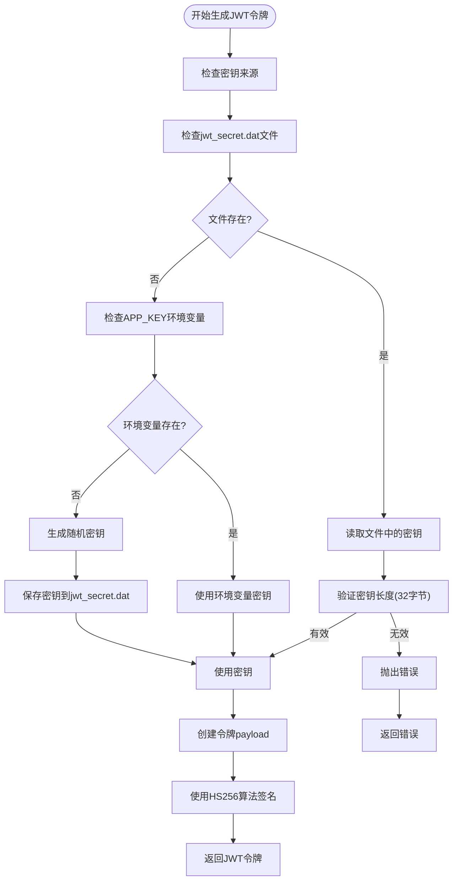
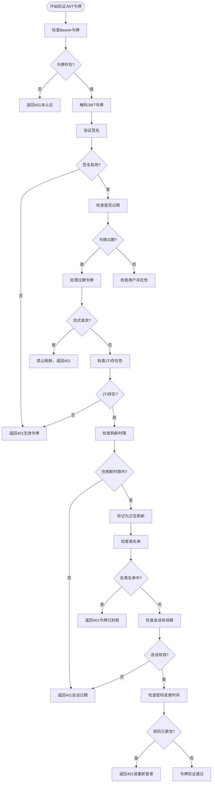
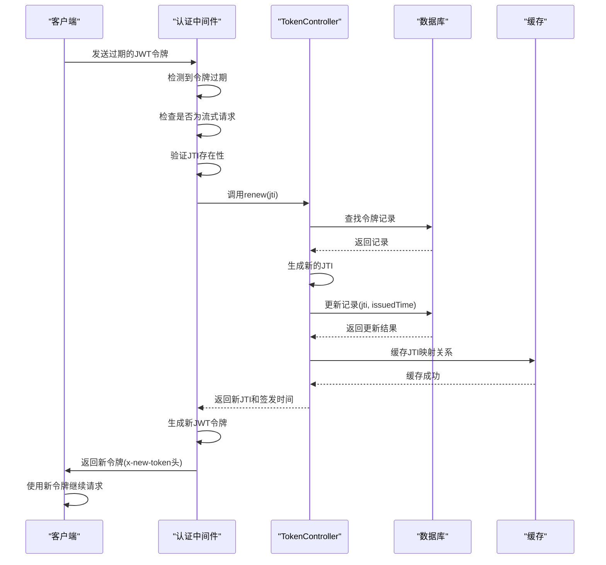

# JWT认证

<cite>
**本文档中引用的文件**  
- [jwt-service.ts](file://packages/core/auth/src/base/jwt-service.ts)
- [auth.ts](file://packages/core/auth/src/base/auth.ts)
- [token-controller.ts](file://packages/plugins/@nocobase/plugin-auth/src/server/token-controller.ts)
- [token-blacklist.ts](file://packages/plugins/@nocobase/plugin-auth/src/server/token-blacklist.ts)
- [auth-manager.ts](file://packages/core/auth/src/auth-manager.ts)
- [constants.ts](file://packages/plugins/@nocobase/plugin-auth/src/constants.ts)
- [auth.ts](file://packages/core/auth/src/auth.ts)
</cite>

## 目录
1. [JWT令牌生成](#jwt令牌生成)
2. [令牌验证流程](#令牌验证流程)
3. [刷新令牌机制](#刷新令牌机制)
4. [JWT服务配置](#jwt服务配置)
5. [安全最佳实践](#安全最佳实践)

## JWT令牌生成

NocoBase使用JSON Web Token（JWT）作为身份验证机制的核心。JWT令牌的生成过程遵循标准的JWT规范，使用HS256算法进行签名。令牌的生成由`JwtService`类负责，该类封装了jsonwebtoken库的功能。

JWT令牌的payload结构包含以下关键字段：
- `userId`：用户ID，用于标识用户身份
- `roleName`：角色名称，用于权限控制
- `temp`：临时标记，用于区分临时令牌
- `signInTime`：登录时间戳，用于会话管理
- `iat`：签发时间，用于令牌有效期检查
- `jti`：JWT ID，用于唯一标识令牌

令牌的签名密钥（secret）通过多层机制获取，优先级顺序为：
1. 从`storage/apps/main/jwt_secret.dat`文件读取
2. 从环境变量`APP_KEY`获取
3. 自动生成32字节的随机密钥并保存到文件



**Diagram sources**
- [auth-manager.ts](file://packages/core/auth/src/auth-manager.ts#L154-L172)
- [jwt-service.ts](file://packages/core/auth/src/base/jwt-service.ts#L20-L45)

**Section sources**
- [jwt-service.ts](file://packages/core/auth/src/base/jwt-service.ts#L1-L78)
- [auth-manager.ts](file://packages/core/auth/src/auth-manager.ts#L54-L60)

## 令牌验证流程

NocoBase的JWT令牌验证流程包含多个安全检查层，确保令牌的有效性和安全性。验证过程由`BaseAuth`类的`checkToken`方法实现，遵循以下步骤：

1. **令牌存在性检查**：首先检查请求头中是否存在Bearer令牌
2. **JWT解码与签名验证**：使用密钥验证令牌签名的有效性
3. **过期时间检查**：验证令牌是否已过期
4. **用户存在性验证**：检查关联用户是否存在于系统中
5. **黑名单校验**：检查令牌是否已被列入黑名单
6. **会话有效期检查**：验证会话是否已过期
7. **密码变更检查**：如果用户密码已更改，则使旧令牌失效

当令牌过期但仍在可刷新时间内，系统会自动触发令牌刷新机制。对于流式API请求（accept头为text/event-stream），系统禁止令牌刷新以防止安全风险。



**Diagram sources**
- [auth.ts](file://packages/core/auth/src/base/auth.ts#L73-L204)
- [auth.ts](file://packages/core/auth/src/auth.ts#L70-L82)

**Section sources**
- [auth.ts](file://packages/core/auth/src/base/auth.ts#L73-L204)
- [auth.ts](file://packages/core/auth/src/auth.ts#L20-L39)

## 刷新令牌机制

NocoBase实现了安全的令牌刷新机制，允许在令牌过期后生成新的有效令牌，同时使旧令牌失效。刷新机制的核心是`TokenController`类的`renew`方法，通过更新数据库中的JTI（JWT ID）来实现令牌轮换。

刷新令牌的工作流程如下：
1. 接收过期令牌的JTI作为输入
2. 在数据库中查找对应的令牌记录
3. 生成新的JTI并更新记录
4. 将新令牌通过`x-new-token`响应头返回给客户端
5. 在缓存中记录JTI映射关系，防止重复刷新

刷新令牌的安全策略包括：
- **JTI轮换**：每次刷新都生成新的JTI，确保旧令牌无法再使用
- **缓存保护**：使用缓存记录已刷新的JTI，防止重放攻击
- **并发控制**：对SQLite数据库进行特殊处理，避免并发操作问题
- **会话绑定**：令牌与用户的登录会话绑定，会话过期后无法刷新
- **流式请求限制**：禁止在流式API请求中刷新令牌



**Diagram sources**
- [token-controller.ts](file://packages/plugins/@nocobase/plugin-auth/src/server/token-controller.ts#L113-L149)
- [auth.ts](file://packages/core/auth/src/base/auth.ts#L211-L245)

**Section sources**
- [token-controller.ts](file://packages/plugins/@nocobase/plugin-auth/src/server/token-controller.ts#L113-L149)
- [auth.ts](file://packages/core/auth/src/base/auth.ts#L206-L263)

## JWT服务配置

NocoBase提供了灵活的JWT服务配置选项，允许管理员根据安全需求调整认证策略。配置主要通过`TokenController`类实现，支持运行时动态调整。

### 配置选项

| 配置项 | 说明 | 默认值 | 配置方式 |
|-------|------|-------|--------|
| tokenExpirationTime | 令牌有效期 | 7天 | 数据库配置 |
| sessionExpirationTime | 会话有效期 | 30天 | 数据库配置 |
| expiredTokenRenewLimit | 过期令牌刷新时限 | 7天 | 数据库配置 |
| JWT_SECRET | 签名密钥 | 自动生成 | 文件或环境变量 |

配置存储在名为`tokenControlConfig`的数据库集合中，使用`token-policy-config`作为记录键。配置信息会被缓存以提高性能，避免频繁的数据库查询。

```mermaid
classDiagram
class JwtOptions {
+secret : Buffer | string
+expiresIn? : string
}
class JwtService {
-options : JwtOptions
+blacklist : ITokenBlacklistService
+sign(payload, options) : string
+decode(token) : Promise~JwtPayload~
+block(token) : Promise~any~
}
class TokenPolicyConfig {
+tokenExpirationTime : string
+sessionExpirationTime : string
+expiredTokenRenewLimit : string
}
class NumericTokenPolicyConfig {
+tokenExpirationTime : millisecond
+sessionExpirationTime : millisecond
+expiredTokenRenewLimit : millisecond
}
class ITokenControlService {
+getConfig() : Promise~NumericTokenPolicyConfig~
+setConfig(config) : Promise~any~
+renew(jti) : Promise~{jti, issuedTime}~
+add(userId) : Promise~TokenInfo~
+removeSessionExpiredTokens(userId) : Promise~any~
}
class TokenController {
+cache : Cache
+app : Application
+db : Database
+logger : SystemLogger
+getConfig() : Promise~NumericTokenPolicyConfig~
+setConfig(config) : Promise~any~
+renew(jti) : Promise~{jti, issuedTime}~
+add(userId) : Promise~TokenInfo~
+removeSessionExpiredTokens(userId) : Promise~any~
}
class ITokenBlacklistService {
+has(token) : Promise~boolean~
+add(values) : Promise~any~
}
class TokenBlacklistService {
+repo : Repository
+cronJob : CronJob
+bloomFilter : BloomFilter
+cacheKey : string
+has(token) : Promise~boolean~
+add(values) : Promise~any~
}
JwtService --> ITokenBlacklistService : "依赖"
TokenController --> ITokenControlService : "实现"
TokenBlacklistService --> ITokenBlacklistService : "实现"
TokenController --> Database : "使用"
TokenController --> Cache : "使用"
TokenController --> Logger : "使用"
```

**Diagram sources**
- [jwt-service.ts](file://packages/core/auth/src/base/jwt-service.ts#L13-L16)
- [token-controller.ts](file://packages/plugins/@nocobase/plugin-auth/src/server/token-controller.ts#L10-L17)
- [token-blacklist.ts](file://packages/plugins/@nocobase/plugin-auth/src/server/token-blacklist.ts#L16-L21)
- [constants.ts](file://packages/plugins/@nocobase/plugin-auth/src/constants.ts#L10-L14)

**Section sources**
- [token-controller.ts](file://packages/plugins/@nocobase/plugin-auth/src/server/token-controller.ts#L52-L71)
- [constants.ts](file://packages/plugins/@nocobase/plugin-auth/src/constants.ts#L10-L14)

## 安全最佳实践

NocoBase的JWT认证机制遵循多项安全最佳实践，确保系统的安全性和可靠性。

### 防止重放攻击

系统通过JTI（JWT ID）机制防止重放攻击。每个令牌都有唯一的JTI，当令牌被刷新时，旧的JTI会被标记为已使用。系统还使用缓存记录已刷新的JTI，有效期为10秒（RENEWED_JTI_CACHE_MS = 10000），防止短时间内重复刷新。

### 令牌泄露防护

- **黑名单机制**：提供`block`方法将令牌加入黑名单，即使令牌未过期也无法使用
- **Bloom Filter**：使用Bloom Filter数据结构高效检查令牌是否在黑名单中，减少数据库查询
- **自动清理**：定期清理过期的黑名单条目，保持数据库性能

### 密钥轮换策略

- **文件存储**：密钥优先存储在`storage/apps/main/jwt_secret.dat`文件中，权限设置为600
- **环境变量**：支持通过`APP_KEY`环境变量配置密钥
- **自动生成**：若无配置则自动生成32字节的随机密钥
- **长度验证**：严格验证密钥长度，确保安全性

### 会话管理

- **会话绑定**：令牌与用户的登录会话绑定，会话过期后无法刷新
- **多设备支持**：同一用户可在多个设备上登录，每个会话独立管理
- **过期清理**：定期清理过期的会话令牌，减少数据库负担

### 错误处理

系统定义了详细的错误码，便于客户端处理不同的认证状态：

```mermaid
stateDiagram-v2
[*] --> EMPTY_TOKEN
[*] --> INVALID_TOKEN
[*] --> EXPIRED_TOKEN
[*] --> BLOCKED_TOKEN
[*] --> EXPIRED_SESSION
[*] --> NOT_EXIST_USER
[*] --> SKIP_TOKEN_RENEW
[*] --> TOKEN_RENEW_FAILED
EMPTY_TOKEN : EMPTY_TOKEN
note right
未提供令牌
HTTP 401
end note
INVALID_TOKEN : INVALID_TOKEN
note right
令牌无效或签名错误
HTTP 401
end note
EXPIRED_TOKEN : EXPIRED_TOKEN
note right
令牌已过期
HTTP 401
end note
BLOCKED_TOKEN : BLOCKED_TOKEN
note right
令牌已在黑名单中
HTTP 401
end note
EXPIRED_SESSION : EXPIRED_SESSION
note right
会话已过期
HTTP 401
end note
NOT_EXIST_USER : NOT_EXIST_USER
note right
用户不存在
HTTP 401
end note
SKIP_TOKEN_RENEW : SKIP_TOKEN_RENEW
note right
禁止刷新令牌
HTTP 401
end note
TOKEN_RENEW_FAILED : TOKEN_RENEW_FAILED
note right
令牌刷新失败
HTTP 401
end note
```

**Diagram sources**
- [auth.ts](file://packages/core/auth/src/auth.ts#L20-L29)
- [token-blacklist.ts](file://packages/plugins/@nocobase/plugin-auth/src/server/token-blacklist.ts#L16-L35)

**Section sources**
- [auth.ts](file://packages/core/auth/src/auth.ts#L20-L39)
- [token-blacklist.ts](file://packages/plugins/@nocobase/plugin-auth/src/server/token-blacklist.ts#L16-L35)