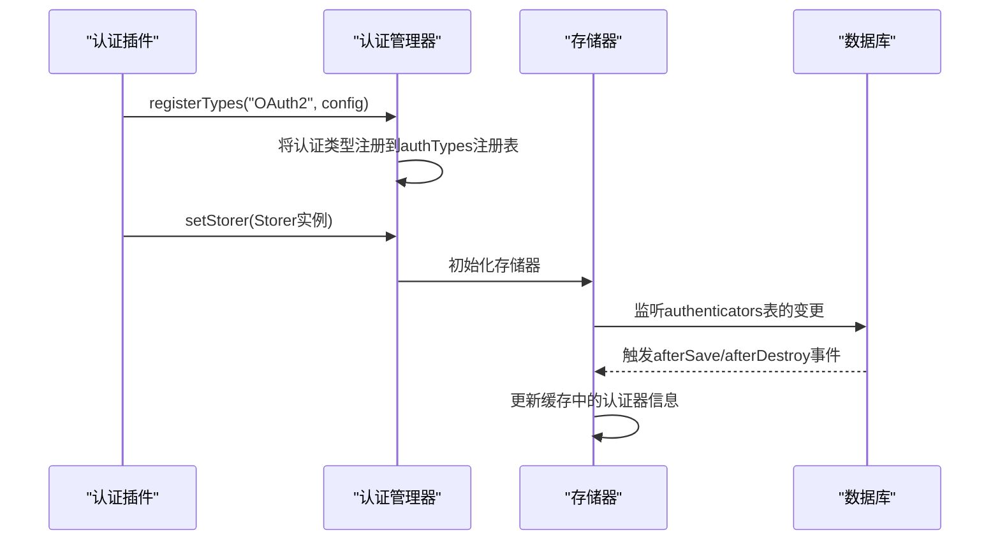
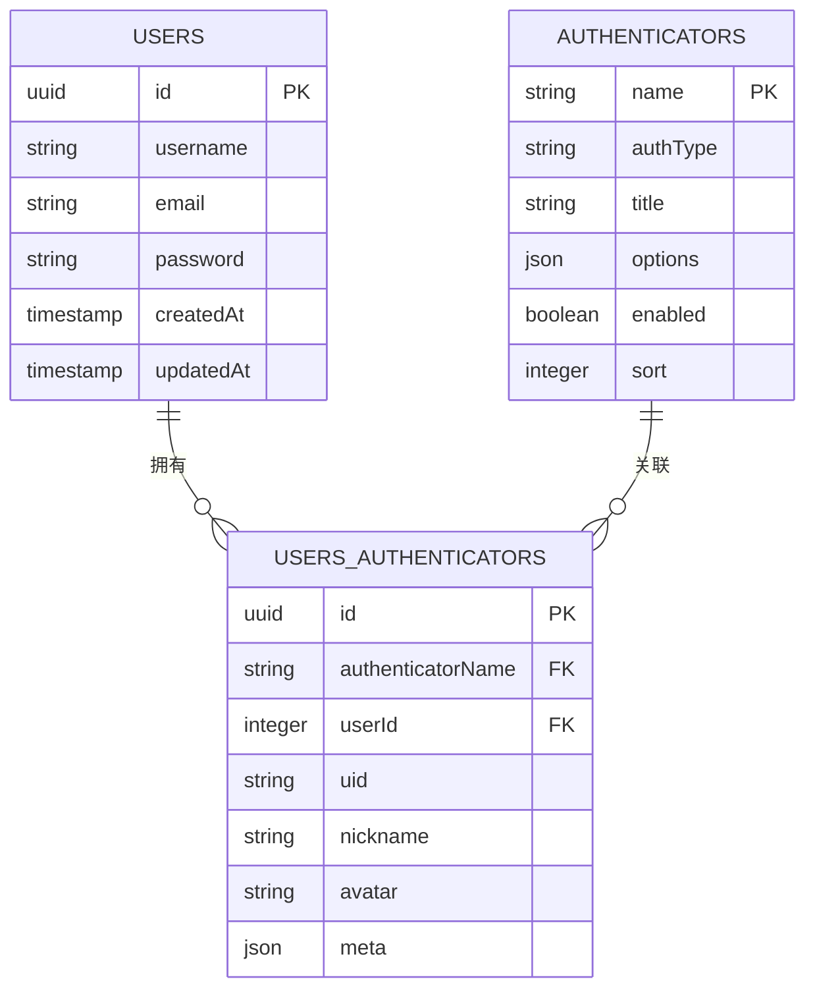
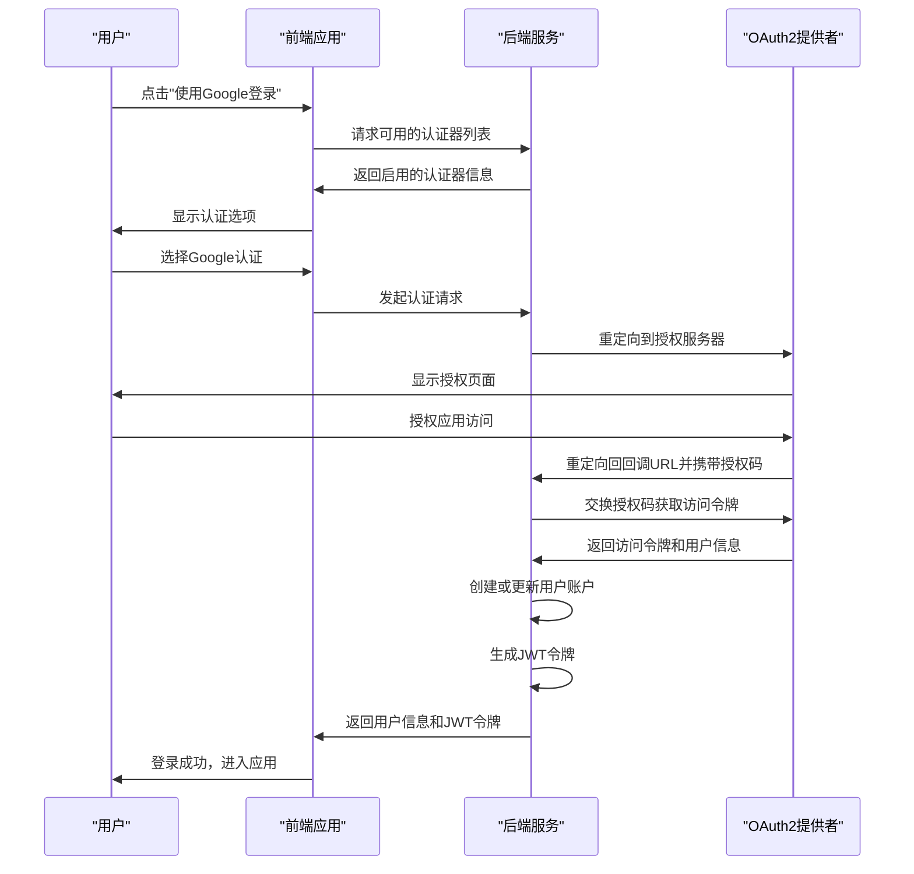
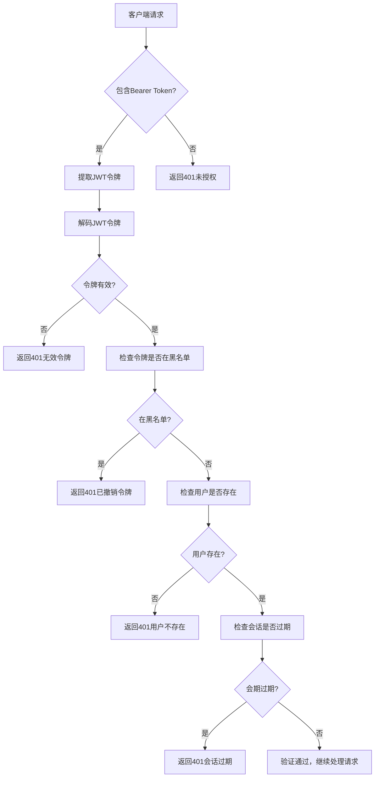
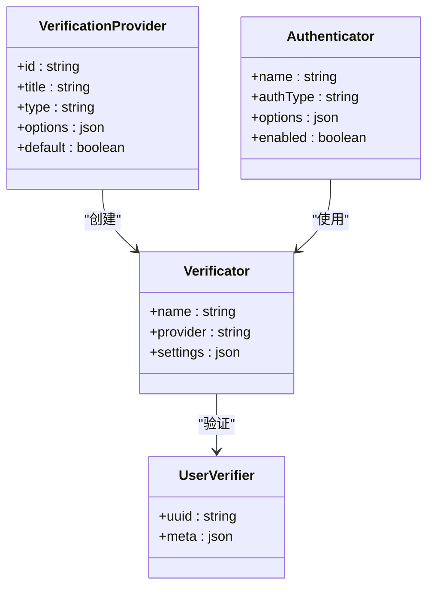
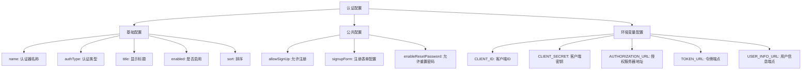
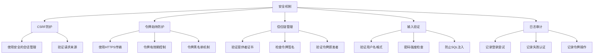

# 外部认证集成

<cite>
**本文档中引用的文件**  
- [auth-manager.ts](file://packages/core/auth/src/auth-manager.ts)
- [plugin.ts](file://packages/plugins/@nocobase/plugin-auth/src/server/plugin.ts)
- [storer.ts](file://packages/plugins/@nocobase/plugin-auth/src/server/storer.ts)
- [basic-auth.ts](file://packages/plugins/@nocobase/plugin-auth/src/server/basic-auth.ts)
- [authenticators.ts](file://packages/plugins/@nocobase/plugin-auth/src/server/actions/authenticators.ts)
- [collections/authenticators.ts](file://packages/plugins/@nocobase/plugin-auth/src/server/collections/authenticators.ts)
- [collections/users-authenticators.ts](file://packages/plugins/@nocobase/plugin-auth/src/server/collections/users-authenticators.ts)
- [preset.ts](file://packages/plugins/@nocobase/plugin-auth/src/preset.ts)
- [users-verifiers.ts](file://packages/plugins/@nocobase/plugin-verification/src/server/collections/users-verifiers.ts)
- [verifications_providers.ts](file://packages/plugins/@nocobase/plugin-verification/src/server/collections/verifications_providers.ts)
</cite>

## 目录
1. [简介](#简介)
2. [认证管理器架构](#认证管理器架构)
3. [外部认证协议集成](#外部认证协议集成)
4. [认证流程详解](#认证流程详解)
5. [多因素认证支持](#多因素认证支持)
6. [配置管理](#配置管理)
7. [安全考虑](#安全考虑)
8. [故障排除指南](#故障排除指南)
9. [结论](#结论)

## 简介

NocoBase 提供了灵活的外部认证集成机制，支持多种认证协议如 OAuth2、LDAP、SAML 等。系统通过认证管理器（AuthManager）统一管理不同的认证策略，实现了可扩展的认证架构。本文档将深入探讨 NocoBase 的外部认证集成机制，包括认证流程、令牌交换、用户信息映射、多因素认证场景处理以及安全考虑等方面。

**Section sources**
- [auth-manager.ts](file://packages/core/auth/src/auth-manager.ts#L42-L174)
- [plugin.ts](file://packages/plugins/@nocobase/plugin-auth/src/server/plugin.ts#L24-L324)

## 认证管理器架构

NocoBase 的认证管理器（AuthManager）是外部认证系统的核心组件，负责注册、管理和执行各种认证策略。认证管理器通过插件化架构实现了高度的可扩展性。

```mermaid
classDiagram
class AuthManager {
+jwt : JwtService
+tokenController : ITokenControlService
-options : AuthManagerOptions
-authTypes : Registry~AuthConfig~
-storer : Storer
+registerTypes(authType : string, authConfig : AuthConfig)
+listTypes()
+getAuthConfig(authType : string)
+get(name : string, ctx : Context)
+middleware()
}
class Storer {
+db : Database
+cache : Cache
+app : Application
+authManager : AuthManager
+key = 'authenticators'
+get(name : string)
+getCache()
+setCache(authenticators : AuthModel[])
+renderJsonTemplate(authenticator : any)
}
class AuthConfig {
+auth : AuthExtend~Auth~
+title? : string
+getPublicOptions? : (options : Record~string, any~) => Record~string, any~
}
AuthManager --> Storer : "使用"
AuthManager --> AuthConfig : "管理"
Storer --> "authenticators" : "数据存储"
Storer --> "Cache" : "缓存"
```

**Diagram sources**
- [auth-manager.ts](file://packages/core/auth/src/auth-manager.ts#L42-L174)
- [storer.ts](file://packages/plugins/@nocobase/plugin-auth/src/server/storer.ts#L16-L93)

**Section sources**
- [auth-manager.ts](file://packages/core/auth/src/auth-manager.ts#L42-L174)
- [storer.ts](file://packages/plugins/@nocobase/plugin-auth/src/server/storer.ts#L16-L93)

## 外部认证协议集成

NocoBase 通过认证类型注册机制支持多种外部认证协议。系统预设了基本认证（Email/Password），并可通过插件扩展支持 OAuth2、LDAP、SAML 等协议。

### 认证类型注册

认证管理器通过 `registerTypes` 方法注册新的认证类型，每个认证类型都有唯一的名称和相应的配置。



**Diagram sources**
- [auth-manager.ts](file://packages/core/auth/src/auth-manager.ts#L83-L85)
- [plugin.ts](file://packages/plugins/@nocobase/plugin-auth/src/server/plugin.ts#L75-L111)
- [storer.ts](file://packages/plugins/@nocobase/plugin-auth/src/server/storer.ts#L39-L48)

### 用户信息映射

外部认证系统通过 `users-authenticators` 表实现用户信息映射，将外部认证标识与内部用户账户关联。



**Diagram sources**
- [collections/authenticators.ts](file://packages/plugins/@nocobase/plugin-auth/src/server/collections/authenticators.ts#L15-L57)
- [collections/users-authenticators.ts](file://packages/plugins/@nocobase/plugin-auth/src/server/collections/users-authenticators.ts#L1-L78)

**Section sources**
- [collections/authenticators.ts](file://packages/plugins/@nocobase/plugin-auth/src/server/collections/authenticators.ts#L15-L57)
- [collections/users-authenticators.ts](file://packages/plugins/@nocobase/plugin-auth/src/server/collections/users-authenticators.ts#L1-L78)

## 认证流程详解

NocoBase 的外部认证流程包括重定向、令牌交换和用户信息获取等关键步骤。

### OAuth2 认证流程



**Diagram sources**
- [authenticators.ts](file://packages/plugins/@nocobase/plugin-auth/src/server/actions/authenticators.ts#L31-L55)
- [basic-auth.ts](file://packages/plugins/@nocobase/plugin-auth/src/server/basic-auth.ts#L16-L361)

### 令牌交换与验证

认证管理器使用 JWT（JSON Web Token）进行安全的令牌交换和验证。



**Diagram sources**
- [auth-manager.ts](file://packages/core/auth/src/auth-manager.ts#L123-L152)
- [base\auth.ts](file://packages/core/auth/src/base/auth.ts#L73-L204)

**Section sources**
- [auth-manager.ts](file://packages/core/auth/src/auth-manager.ts#L123-L152)
- [base\auth.ts](file://packages/core/auth/src/base/auth.ts#L73-L204)

## 多因素认证支持

NocoBase 通过验证管理插件（plugin-verification）支持多因素认证场景，包括短信验证码、邮箱验证等。

### 多因素认证架构



**Diagram sources**
- [verifications_providers.ts](file://packages/plugins/@nocobase/plugin-verification/src/server/collections/verifications_providers.ts#L12-L42)
- [users-verifiers.ts](file://packages/plugins/@nocobase/plugin-verification/src/server/collections/users-verifiers.ts#L16-L41)

**Section sources**
- [verifications_providers.ts](file://packages/plugins/@nocobase/plugin-verification/src/server/collections/verifications_providers.ts#L12-L42)
- [users-verifiers.ts](file://packages/plugins/@nocobase/plugin-verification/src/server/collections/users-verifiers.ts#L16-L41)

## 配置管理

外部认证的配置通过数据库和环境变量进行管理，支持动态配置更新。

### 配置结构



**Section sources**
- [authenticators.ts](file://packages/plugins/@nocobase/plugin-auth/src/server/collections/authenticators.ts#L27-L57)
- [basic-auth.ts](file://packages/plugins/@nocobase/plugin-auth/src/server/basic-auth.ts#L117-L139)

## 安全考虑

NocoBase 在外部认证集成中实施了多项安全措施，确保系统的安全性。

### 安全机制



**Section sources**
- [auth-manager.ts](file://packages/core/auth/src/auth-manager.ts#L67-L69)
- [base\auth.ts](file://packages/core/auth/src/base/auth.ts#L132-L138)
- [basic-auth.ts](file://packages/plugins/@nocobase/plugin-auth/src/server/basic-auth.ts#L24-L38)

## 故障排除指南

### 常见问题及解决方案

| 问题 | 可能原因 | 解决方案 |
|------|---------|---------|
| 令牌无效 | 令牌过期或被撤销 | 检查令牌有效期，重新登录获取新令牌 |
| 用户映射失败 | 外部标识与内部用户不匹配 | 检查users-authenticators表中的映射关系 |
| 认证重定向失败 | 回调URL配置错误 | 验证OAuth2配置中的回调URL是否正确 |
| 无法获取用户信息 | 权限不足或API端点变更 | 检查OAuth2作用域权限，验证API端点 |
| 多因素认证不工作 | 验证提供者配置错误 | 检查verifications_providers表中的配置 |

**Section sources**
- [auth-manager.ts](file://packages/core/auth/src/auth-manager.ts#L104-L117)
- [basic-auth.ts](file://packages/plugins/@nocobase/plugin-auth/src/server/basic-auth.ts#L44-L47)

## 结论

NocoBase 的外部认证集成提供了灵活、安全且可扩展的认证机制。通过认证管理器架构，系统能够轻松集成多种认证协议，支持复杂的认证场景。文档详细介绍了认证流程、配置管理、安全考虑和故障排除等方面，为开发者提供了全面的指导。未来可以通过扩展更多认证插件来支持更多的身份提供商，进一步增强系统的认证能力。