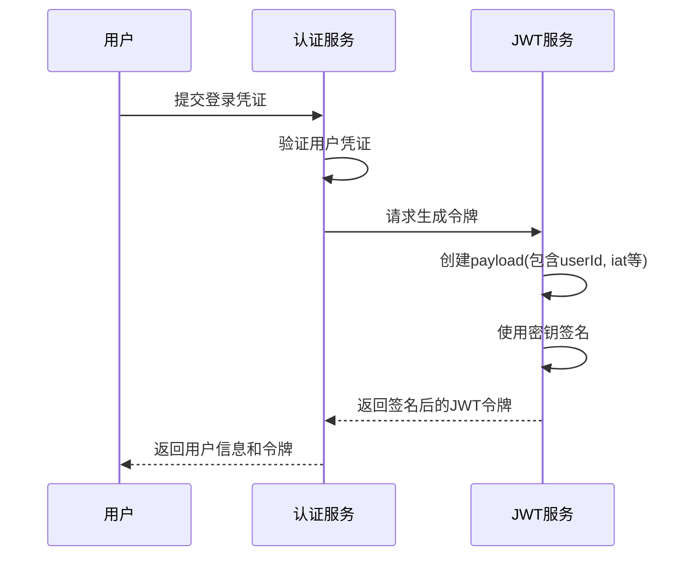
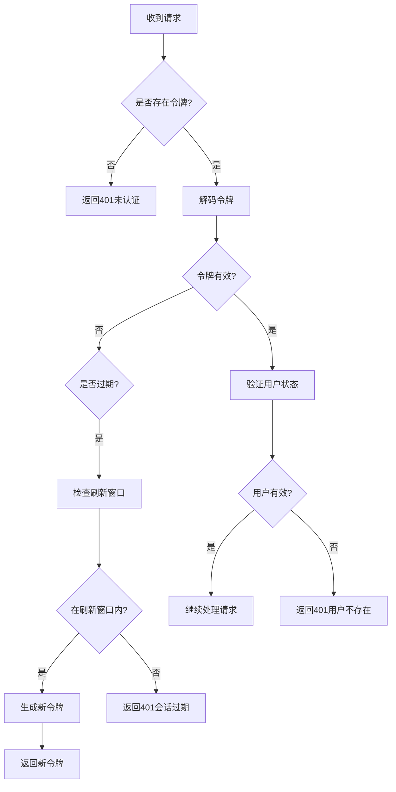
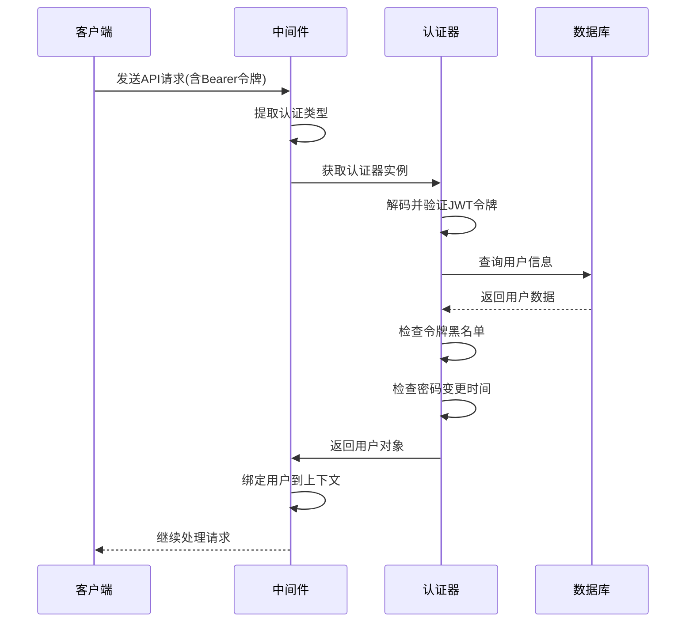

# 认证机制

<cite>
**本文档中引用的文件**  
- [auth-manager.ts](file://packages/core/auth/src/auth-manager.ts)
- [jwt-service.ts](file://packages/core/auth/src/base/jwt-service.ts)
- [auth.ts](file://packages/core/auth/src/base/auth.ts)
- [token-controller.ts](file://packages/plugins/@nocobase/plugin-auth/src/server/token-controller.ts)
- [token-blacklist-service.ts](file://packages/core/auth/src/base/token-blacklist-service.ts)
- [token-control-service.ts](file://packages/core/auth/src/base/token-control-service.ts)
- [constants.ts](file://packages/plugins/@nocobase/plugin-auth/src/constants.ts)
</cite>

## 目录
1. [简介](#简介)
2. [JWT认证实现原理](#jwt认证实现原理)
3. [认证服务架构设计](#认证服务架构设计)
4. [服务器端认证中间件流程](#服务器端认证中间件流程)
5. [认证配置说明](#认证配置说明)
6. [外部认证方式集成](#外部认证方式集成)
7. [安全考虑](#安全考虑)
8. [结论](#结论)

## 简介
NocoBase采用基于JWT（JSON Web Token）的认证机制，为系统提供安全可靠的用户身份验证功能。该机制通过令牌的生成、验证、过期处理和刷新等流程，确保用户会话的安全性。认证系统采用模块化设计，支持多种认证策略的注册与管理，并通过中间件拦截请求，实现用户身份的绑定与验证。本文档将深入解析NocoBase认证机制的各个组成部分，包括JWT的实现细节、认证服务的架构设计、中间件的执行流程以及相关的安全考虑。

## JWT认证实现原理

### 令牌生成与签名
NocoBase使用`jsonwebtoken`库实现JWT令牌的生成和验证。当用户成功登录时，系统会生成一个包含用户信息的JWT令牌。令牌的生成过程由`JwtService`类负责，该类在`packages/core/auth/src/base/jwt-service.ts`中定义。生成令牌时，系统会将用户ID、签发时间、登录时间等信息作为payload，并使用预设的密钥进行签名。

密钥的获取遵循以下优先级顺序：首先检查环境变量`APP_KEY`，如果未设置，则检查是否存在`storage/apps/main/jwt_secret.dat`文件，若文件不存在则生成一个32字节的随机密钥并保存到文件中。这种设计确保了密钥的持久性和安全性。



**Diagram sources**
- [auth.ts](file://packages/core/auth/src/base/auth.ts#L270-L285)
- [jwt-service.ts](file://packages/core/auth/src/base/jwt-service.ts#L40-L45)

### 令牌验证与解析
令牌验证是认证过程中的关键环节。当客户端发送请求时，服务器会从请求头中提取Bearer令牌，并通过`JwtService`的`decode`方法进行验证。验证过程包括检查令牌的签名有效性、过期时间等。如果令牌已过期但仍在可刷新范围内，系统会自动触发令牌刷新机制。

在`BaseAuth`类的`checkToken`方法中，系统首先尝试解码令牌，如果遇到`TokenExpiredError`异常，则将令牌状态标记为"expired"并继续处理。系统还会检查用户是否存在于数据库中，以及令牌是否已被列入黑名单。

### 过期处理与刷新机制
NocoBase实现了完善的令牌过期处理和刷新机制。系统通过`TokenController`类管理令牌策略，包括令牌有效期、会话有效期和过期令牌的刷新限制。当令牌过期时，系统会检查是否在刷新窗口内，如果是则生成新的令牌。

令牌刷新过程涉及更新数据库中的`jti`（JWT ID）值，确保旧令牌无法再次使用。同时，系统会将新的令牌通过`x-new-token`响应头返回给客户端，客户端应更新本地存储的令牌。



**Diagram sources**
- [auth.ts](file://packages/core/auth/src/base/auth.ts#L73-L204)
- [token-controller.ts](file://packages/plugins/@nocobase/plugin-auth/src/server/token-controller.ts#L113-L149)

**Section sources**
- [auth.ts](file://packages/core/auth/src/base/auth.ts#L73-L204)
- [token-controller.ts](file://packages/plugins/@nocobase/plugin-auth/src/server/token-controller.ts#L113-L149)

## 认证服务架构设计

### AuthManager职责
`AuthManager`是NocoBase认证系统的核心管理器，负责协调各种认证相关的服务和组件。它在`packages/core/auth/src/auth-manager.ts`中定义，主要职责包括：

1. 管理JWT服务实例，处理令牌的生成和验证
2. 管理令牌控制服务，处理令牌的生命周期
3. 注册和管理不同类型的认证策略
4. 提供认证中间件，用于拦截和处理认证请求

`AuthManager`通过依赖注入的方式获取必要的服务实例，并在构造函数中初始化JWT服务。它还提供了`registerTypes`方法，允许插件注册新的认证类型。

### 认证策略的注册与管理
NocoBase采用插件化架构，支持多种认证策略的动态注册。通过`AuthManager`的`registerTypes`方法，可以注册新的认证类型。每个认证类型包含一个认证类、显示名称和公共选项获取方法。

例如，在`plugin-auth`插件中，通过以下代码注册基本认证类型：
```typescript
this.app.authManager.registerTypes(presetAuthType, {
  auth: BasicAuth,
  title: tval('Password', { ns: namespace }),
  getPublicOptions: (options) => { /* ... */ }
});
```

这种设计使得系统可以轻松扩展支持OAuth2、LDAP等外部认证方式，而无需修改核心认证逻辑。

```mermaid
classDiagram
class AuthManager {
+jwt : JwtService
+tokenController : ITokenControlService
+registerTypes(authType, authConfig)
+listTypes()
+get(name, ctx)
+middleware()
}
class JwtService {
+secret : string
+expiresIn : string
+sign(payload, options)
+decode(token)
+block(token)
}
class ITokenControlService {
+getConfig()
+setConfig(config)
+renew(jti)
+add({userId})
+removeSessionExpiredTokens(userId)
}
class ITokenBlacklistService {
+has(token)
+add(values)
}
AuthManager --> JwtService : "使用"
AuthManager --> ITokenControlService : "使用"
AuthManager --> ITokenBlacklistService : "使用"
JwtService --> ITokenBlacklistService : "引用"
```

**Diagram sources**
- [auth-manager.ts](file://packages/core/auth/src/auth-manager.ts#L42-L173)
- [jwt-service.ts](file://packages/core/auth/src/base/jwt-service.ts#L20-L78)
- [token-control-service.ts](file://packages/core/auth/src/base/token-control-service.ts#L30-L36)
- [token-blacklist-service.ts](file://packages/core/auth/src/base/token-blacklist-service.ts#L10-L12)

**Section sources**
- [auth-manager.ts](file://packages/core/auth/src/auth-manager.ts#L42-L173)

## 服务器端认证中间件流程

### 请求拦截与处理
NocoBase的认证中间件由`AuthManager`的`middleware`方法生成，负责拦截所有请求并进行认证处理。中间件的执行流程如下：

1. 从请求头中获取认证类型标识
2. 根据标识获取相应的认证器实例
3. 调用认证器的`check`方法验证用户身份
4. 将用户信息绑定到上下文对象中

中间件首先尝试获取认证器实例，如果获取失败则记录警告并继续处理后续中间件。如果认证器存在且不需要跳过检查，则调用`check`方法验证用户身份。

### 令牌解析与用户绑定
在`BaseAuth`类的`check`方法中，系统首先调用`checkToken`方法验证令牌状态。如果令牌已过期但可刷新，系统会调用`tokenController`的`renew`方法生成新的`jti`，并创建新的令牌。

用户身份验证成功后，系统将用户对象绑定到`ctx.auth.user`属性上，供后续的业务逻辑使用。同时，用户的当前角色信息会设置到请求头的`x-role`字段中，用于后续的权限控制。



**Diagram sources**
- [auth-manager.ts](file://packages/core/auth/src/auth-manager.ts#L123-L152)
- [auth.ts](file://packages/core/auth/src/base/auth.ts#L206-L263)

**Section sources**
- [auth-manager.ts](file://packages/core/auth/src/auth-manager.ts#L123-L152)
- [auth.ts](file://packages/core/auth/src/base/auth.ts#L206-L263)

## 认证配置说明

### 密钥管理
NocoBase的JWT密钥管理遵循安全最佳实践，支持多种密钥来源：

1. **环境变量**：通过`APP_KEY`环境变量设置密钥
2. **文件存储**：在`storage/apps/main/jwt_secret.dat`文件中存储密钥
3. **自动生成**：如果以上两种方式都不存在，则生成随机密钥并保存到文件

密钥文件的权限设置为`0o600`，确保只有文件所有者可以读写，提高了安全性。系统还检查密钥长度是否为32字节，确保密钥强度。

### 令牌有效期设置
令牌有效期通过`TokenPolicyConfig`接口进行配置，包含三个关键参数：

- `tokenExpirationTime`：令牌有效期，如"7d"表示7天
- `sessionExpirationTime`：会话有效期，超过此时间即使令牌未过期也需要重新登录
- `expiredTokenRenewLimit`：过期令牌的刷新窗口期

这些配置存储在数据库的`tokenControlConfig`集合中，并通过缓存提高访问性能。系统使用`ms`库将时间字符串转换为毫秒值，便于计算和比较。

### 刷新策略
令牌刷新策略设计考虑了安全性和用户体验的平衡。当令牌过期时，系统会检查是否在刷新窗口期内。如果是，则生成新的`jti`并更新数据库中的记录，同时返回新的令牌。

为了防止并发问题，系统在更新`jti`时使用数据库的原子操作，并通过缓存记录已刷新的`jti`，避免重复刷新。对于SQLite数据库，由于不支持并发操作，系统会同步执行会话过期令牌的清理。

**Section sources**
- [token-controller.ts](file://packages/plugins/@nocobase/plugin-auth/src/server/token-controller.ts#L52-L71)
- [constants.ts](file://packages/plugins/@nocobase/plugin-auth/src/constants.ts#L10-L14)

## 外部认证方式集成

### OAuth2集成
NocoBase通过插件机制支持OAuth2认证。外部认证方式的集成通常涉及以下步骤：

1. 创建新的认证类型插件
2. 实现相应的认证类，继承`BaseAuth`
3. 在插件初始化时注册认证类型
4. 提供必要的配置选项和用户界面

对于OAuth2，系统需要实现授权码流程，包括重定向到授权服务器、处理回调、交换访问令牌等步骤。用户信息从用户信息端点获取，并与本地用户账户关联。

### LDAP集成
LDAP认证的集成需要实现LDAP协议的客户端功能，包括连接LDAP服务器、执行搜索查询、验证用户凭证等。由于LDAP通常用于企业内部系统，集成时需要考虑SSL/TLS加密、连接池、超时设置等网络相关配置。

所有外部认证方式都遵循相同的接口规范，确保与核心认证系统的无缝集成。用户信息存储在`usersVerifiers`集合中，包含外部系统的用户标识和元数据。

**Section sources**
- [users-verifiers.ts](file://packages/plugins/@nocobase/plugin-verification/src/server/collections/users-verifiers.ts#L1-L41)
- [users-authenticators.ts](file://packages/plugins/@nocobase/plugin-auth/src/server/collections/users-authenticators.ts#L50-L78)

## 安全考虑

### 防止重放攻击
NocoBase通过多种机制防止重放攻击：

1. **令牌黑名单**：使用`ITokenBlacklistService`接口，将已注销的令牌加入黑名单
2. **唯一标识符**：每个令牌都有唯一的`jti`，在刷新时更新，确保旧令牌失效
3. **时间戳验证**：检查令牌的签发时间和用户密码变更时间，防止使用旧令牌

当用户登出时，系统会调用`jwt.block(token)`方法，将令牌加入黑名单。对于刷新的令牌，旧的`jti`也会被记录，防止重复使用。

### 防止令牌泄露
为了防止令牌泄露，系统采取了以下措施：

1. **安全存储**：JWT密钥存储在文件系统中，权限设置为仅所有者可读写
2. **环境变量保护**：建议在生产环境中通过环境变量设置密钥，避免硬编码
3. **HTTPS强制**：在生产环境中应强制使用HTTPS，防止令牌在传输过程中被截获
4. **短有效期**：设置合理的令牌有效期，减少令牌泄露后的风险窗口

系统还提供了会话级别的控制，即使令牌未过期，超过会话有效期也需要重新认证，进一步提高了安全性。

**Section sources**
- [jwt-service.ts](file://packages/core/auth/src/base/jwt-service.ts#L64-L77)
- [auth.ts](file://packages/core/auth/src/base/auth.ts#L310-L318)

## 结论
NocoBase的认证机制采用现代化的JWT技术，结合模块化和插件化的架构设计，提供了安全、灵活且可扩展的用户身份验证解决方案。通过清晰的职责划分和良好的接口设计，系统既保证了核心功能的稳定性，又支持各种外部认证方式的集成。完善的令牌管理和安全机制确保了用户会话的安全性，为构建企业级应用提供了可靠的基础。