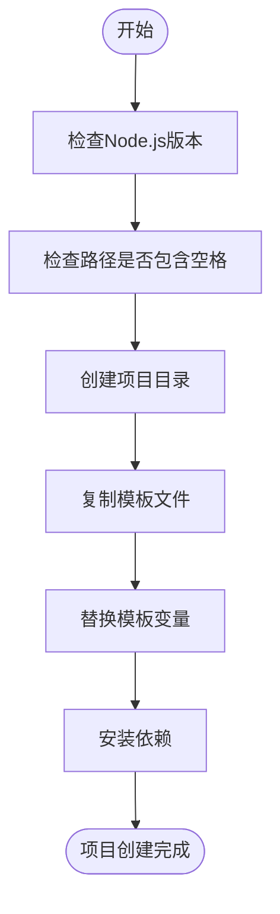
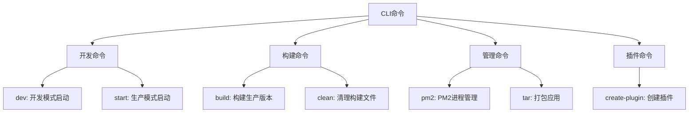
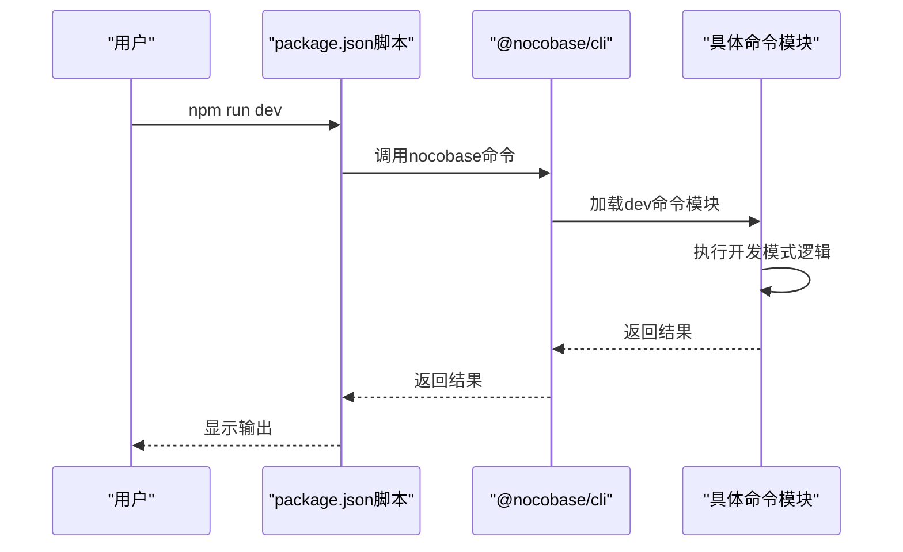
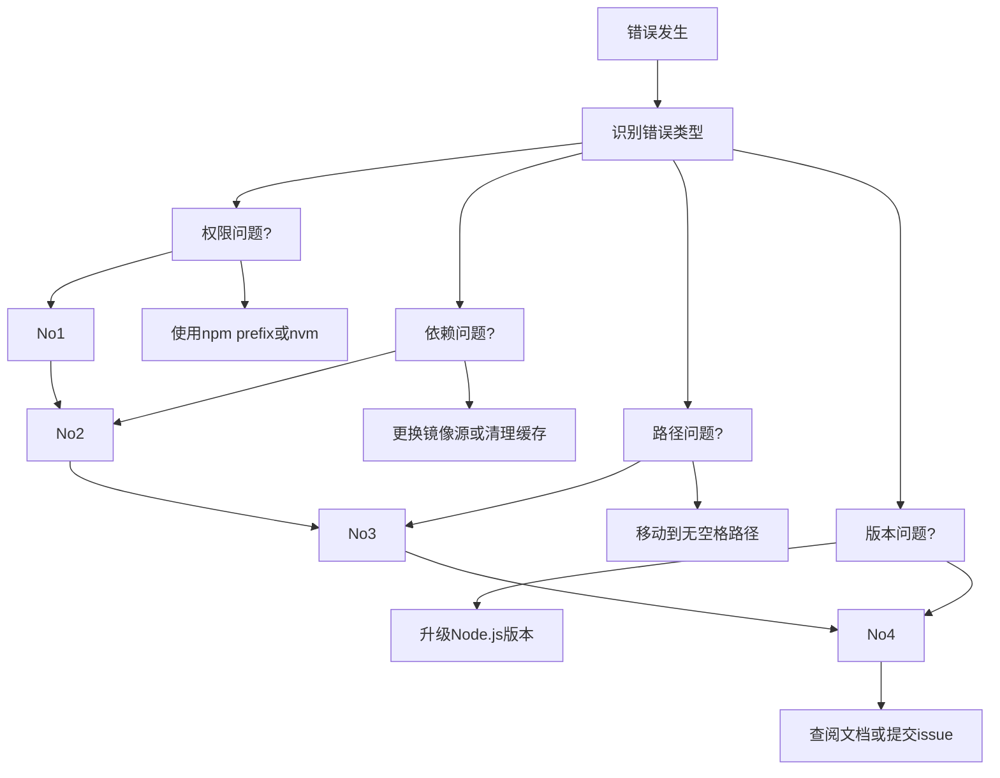

# CLI安装

<cite>
**本文档中引用的文件**  
- [create-nocobase-app/package.json](file://packages/core/create-nocobase-app/package.json)
- [cli/package.json](file://packages/core/cli/package.json)
- [create-nocobase-app/bin/index.js](file://packages/core/create-nocobase-app/bin/index.js)
- [create-nocobase-app/src/cli.js](file://packages/core/create-nocobase-app/src/cli.js)
- [cli/bin/index.js](file://packages/core/cli/bin/index.js)
- [cli/src/commands/index.js](file://packages/core/cli/src/commands/index.js)
- [cli/src/util.js](file://packages/core/cli/src/util.js)
- [create-nocobase-app/templates/app/package.json](file://packages/core/create-nocobase-app/templates/app/package.json)
</cite>

## 目录
1. [简介](#简介)
2. [CLI工具安装](#cli工具安装)
3. [项目初始化](#项目初始化)
4. [核心命令详解](#核心命令详解)
5. [package.json脚本解析](#packagejson脚本解析)
6. [高级用法](#高级用法)
7. [常见问题诊断与解决方案](#常见问题诊断与解决方案)
8. [自动化部署脚本编写指南](#自动化部署脚本编写指南)
9. [总结](#总结)

## 简介
NocoBase CLI工具是一套完整的命令行接口，用于快速创建、开发和管理NocoBase应用。该工具包含两个主要组件：`create-nocobase-app`用于初始化新项目，`@nocobase/cli`用于项目开发和管理。本指南将详细介绍CLI工具的安装、使用方法和高级功能。

**Section sources**
- [create-nocobase-app/package.json](file://packages/core/create-nocobase-app/package.json)
- [cli/package.json](file://packages/core/cli/package.json)

## CLI工具安装
NocoBase CLI工具通过npm包管理器进行分发，包含两个核心包：`create-nocobase-app`和`@nocobase/cli`。

### 安装要求
- Node.js版本 >= 16
- npm包管理器
- 系统路径不能包含空格

### 安装步骤
1. 全局安装`create-nocobase-app`：
```bash
npm install -g create-nocobase-app
```

2. 创建新项目：
```bash
create-nocobase-app my-app
```

3. 项目创建完成后，`@nocobase/cli`会自动作为开发依赖安装在项目中，提供后续的开发和管理命令。

**Section sources**
- [cli/bin/index.js](file://packages/core/cli/bin/index.js)
- [create-nocobase-app/bin/index.js](file://packages/core/create-nocobase-app/bin/index.js)

## 项目初始化
`create-nocobase-app`命令负责初始化新的NocoBase项目，包括创建目录结构、复制模板文件和安装依赖。

### create-nocobase-app参数选项
- 项目名称：指定新项目的目录名称
- 模板选择：支持不同的项目模板（通过模板目录配置）
- 版本指定：可以指定NocoBase版本进行安装

### 初始化流程
1. 验证Node.js版本和系统路径
2. 创建项目目录
3. 复制模板文件（位于`packages/core/create-nocobase-app/templates/app/`）
4. 替换模板变量（如项目名称、版本等）
5. 安装项目依赖



**Diagram sources**
- [create-nocobase-app/src/cli.js](file://packages/core/create-nocobase-app/src/cli.js)
- [create-nocobase-app/templates/app/](file://packages/core/create-nocobase-app/templates/app/)

**Section sources**
- [create-nocobase-app/src/cli.js](file://packages/core/create-nocobase-app/src/cli.js)
- [create-nocobase-app/templates/app/](file://packages/core/create-nocobase-app/templates/app/)

## 核心命令详解
`@nocobase/cli`提供了丰富的命令用于项目开发和管理。

### 主要命令分类


**Diagram sources**
- [cli/src/commands/index.js](file://packages/core/cli/src/commands/index.js)
- [cli/src/commands/](file://packages/core/cli/src/commands/)

### 命令注册机制
CLI命令通过模块化方式注册，`cli/src/commands/index.js`文件负责加载所有可用命令：

```javascript
module.exports = (cli) => {
  generateAppDir();
  require('./global')(cli);
  require('./create-nginx-conf')(cli);
  require('./locale')(cli);
  // ... 其他命令
  if (isPackageValid('@umijs/utils')) {
    require('./create-plugin')(cli);
  }
};
```

条件性命令（如`create-plugin`）仅在依赖包有效时才注册。

**Section sources**
- [cli/src/commands/index.js](file://packages/core/cli/src/commands/index.js)
- [cli/src/util.js](file://packages/core/cli/src/util.js)

## package.json脚本解析
NocoBase项目在初始化时会生成标准的package.json文件，包含一系列预定义脚本。

### 标准脚本命令
- `dev`: 启动开发服务器
- `start`: 启动生产服务器
- `build`: 构建生产版本
- `test`: 运行测试
- `e2e`: 运行端到端测试
- `pm2:start`: 使用PM2启动应用
- `pm2:stop`: 停止PM2进程

### 脚本执行流程


**Diagram sources**
- [create-nocobase-app/templates/app/package.json](file://packages/core/create-nocobase-app/templates/app/package.json)
- [cli/src/commands/dev.js](file://packages/core/cli/src/commands/dev.js)

**Section sources**
- [create-nocobase-app/templates/app/package.json](file://packages/core/create-nocobase-app/templates/app/package.json)

## 高级用法
### 插件管理
通过`create-plugin`命令可以快速创建新的插件：

```bash
npx nocobase create-plugin my-plugin
```

插件模板位于`packages/core/cli/templates/plugin/`，包含客户端和服务端的基本结构。

### 环境配置
CLI工具支持多种环境配置：
- `.env`: 通用环境变量
- `.env.tpl`: 环境变量模板
- `nocobase.conf.tpl`: NocoBase配置模板

### 自定义构建
通过`build`命令的参数可以自定义构建行为：
- `--analyzer`: 启用构建分析器
- `--minify`: 控制代码压缩
- `--sourcemap`: 生成source map

**Section sources**
- [cli/src/commands/create-plugin.js](file://packages/core/cli/src/commands/create-plugin.js)
- [cli/templates/plugin/](file://packages/core/cli/templates/plugin/)
- [cli/src/commands/build.js](file://packages/core/cli/src/commands/build.js)

## 常见问题诊断与解决方案
### 权限问题
**问题**: 全局安装时出现权限错误
**解决方案**: 
- 使用npm配置prefix避免权限问题：
```bash
npm config set prefix ~/.npm-global
export PATH=~/.npm-global/bin:$PATH
```
- 或使用Node版本管理器（如nvm）

### 依赖安装失败
**问题**: 依赖包下载失败
**解决方案**:
- 更换npm镜像源：
```bash
npm config set registry https://registry.npmmirror.com
```
- 清理缓存后重试：
```bash
npm cache clean --force
```

### 路径配置错误
**问题**: 路径包含空格导致CLI无法运行
**解决方案**:
- 错误信息：`The path cannot contain spaces`
- 解决方法：将项目移动到不包含空格的路径

### Node.js版本不兼容
**问题**: Node.js版本过低
**解决方案**:
- 错误信息：`Node.js version must be >= 16`
- 升级Node.js到16或更高版本



**Diagram sources**
- [cli/bin/index.js](file://packages/core/cli/bin/index.js)
- [cli/src/util.js](file://packages/core/cli/src/util.js)

**Section sources**
- [cli/bin/index.js](file://packages/core/cli/bin/index.js)

## 自动化部署脚本编写指南
### 基础部署脚本
```bash
#!/bin/bash
# deploy.sh
set -e

echo "开始部署NocoBase应用..."

# 1. 拉取最新代码
git pull origin main

# 2. 安装依赖
npm install

# 3. 构建生产版本
npm run build

# 4. 停止现有PM2进程
npm run pm2:stop

# 5. 启动新版本
npm run pm2:start

echo "部署完成!"
```

### CI/CD集成
```yaml
# .github/workflows/deploy.yml
name: Deploy
on:
  push:
    branches: [main]

jobs:
  deploy:
    runs-on: ubuntu-latest
    steps:
      - uses: actions/checkout@v3
      
      - name: Setup Node.js
        uses: actions/setup-node@v3
        with:
          node-version: 18
        
      - name: Install dependencies
        run: npm install
        
      - name: Build
        run: npm run build
        
      - name: Deploy via SSH
        uses: appleboy/ssh-action@v0.1.5
        with:
          host: ${{ secrets.HOST }}
          username: ${{ secrets.USERNAME }}
          key: ${{ secrets.SSH_KEY }}
          script: |
            cd /path/to/app
            git pull origin main
            npm install
            npm run build
            npm run pm2:restart
```

### Docker部署
```dockerfile
# Dockerfile
FROM node:18-alpine

WORKDIR /app

COPY package*.json ./
RUN npm install -g @nocobase/cli && npm install

COPY . .

RUN npm run build

EXPOSE 13000

CMD ["npx", "nocobase", "start"]
```

**Section sources**
- [cli/src/commands/pm2.js](file://packages/core/cli/src/commands/pm2.js)
- [cli/src/commands/build.js](file://packages/core/cli/src/commands/build.js)

## 总结
NocoBase CLI工具提供了一套完整的开发工作流，从项目创建到部署维护。通过`create-nocobase-app`可以快速初始化项目，`@nocobase/cli`提供了丰富的命令用于日常开发。理解CLI工具的工作原理和常见问题解决方案，可以大大提高开发效率。建议在生产环境中使用PM2进行进程管理，并结合CI/CD工具实现自动化部署。