# Docker安装

<cite>
**本文档中引用的文件**  
- [Dockerfile](file://Dockerfile)
- [Dockerfile.pro](file://Dockerfile.pro)
- [docker-compose.yml](file://docker-compose.yml)
- [.env.example](file://.env.example)
- [docker/nocobase/Dockerfile](file://docker/nocobase/Dockerfile)
- [docker/nocobase/Dockerfile-full](file://docker/nocobase/Dockerfile-full)
- [docker/nocobase/docker-entrypoint.sh](file://docker/nocobase/docker-entrypoint.sh)
- [docker/nocobase/nocobase.conf](file://docker/nocobase/nocobase.conf)
- [docker/app-mysql/docker-compose.yml](file://docker/app-mysql/docker-compose.yml)
- [docker/app-postgres/docker-compose.yml](file://docker/app-postgres/docker-compose.yml)
- [docker/app-mariadb/docker-compose.yml](file://docker/app-mariadb/docker-compose.yml)
- [docker/app-sqlite/docker-compose.yml](file://docker/app-sqlite/docker-compose.yml)
</cite>

## 目录
1. [简介](#简介)
2. [项目结构](#项目结构)
3. [核心组件](#核心组件)
4. [架构概述](#架构概述)
5. [详细组件分析](#详细组件分析)
6. [依赖分析](#依赖分析)
7. [性能考虑](#性能考虑)
8. [故障排除指南](#故障排除指南)
9. [结论](#结论)

## 简介
本文档提供了NocoBase的完整Docker部署指南，涵盖使用`docker-compose.yml`文件部署NocoBase的详细步骤。文档详细解释了各个服务的配置说明（nocobase、数据库等）、Dockerfile中的构建指令、docker-entrypoint.sh中的初始化脚本、环境变量配置（包括数据库连接、端口映射和存储卷设置）、Docker网络配置、容器间通信和安全最佳实践。同时提供常见问题的解决方案，如容器启动失败、数据库初始化问题和网络连接错误，并包含生产环境部署的最佳实践和性能优化建议。

## 项目结构
NocoBase的Docker相关文件组织在`docker/`目录下，包含多个预配置的`docker-compose.yml`文件用于不同的数据库后端，以及nocobase服务的Docker构建文件。

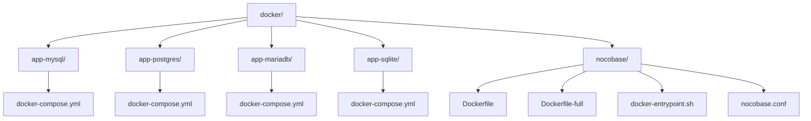

**图示来源**
- [docker/app-mysql/docker-compose.yml](file://docker/app-mysql/docker-compose.yml)
- [docker/app-postgres/docker-compose.yml](file://docker/app-postgres/docker-compose.yml)
- [docker/app-mariadb/docker-compose.yml](file://docker/app-mariadb/docker-compose.yml)
- [docker/app-sqlite/docker-compose.yml](file://docker/app-sqlite/docker-compose.yml)
- [docker/nocobase/Dockerfile](file://docker/nocobase/Dockerfile)

**章节来源**
- [docker/](file://docker/)

## 核心组件
NocoBase的Docker部署包含两个主要组件：应用服务（nocobase）和数据库服务。应用服务基于Node.js构建，通过Nginx提供静态文件服务，而数据库服务支持多种数据库后端，包括MySQL、PostgreSQL、MariaDB和SQLite。

**章节来源**
- [docker/nocobase/Dockerfile](file://docker/nocobase/Dockerfile#L1-L49)
- [docker/app-mysql/docker-compose.yml](file://docker/app-mysql/docker-compose.yml#L1-L38)

## 架构概述
NocoBase的Docker部署采用多容器架构，其中应用容器和数据库容器通过自定义Docker网络进行通信。应用容器暴露80端口，通过端口映射将外部请求的13000端口转发到容器内部的80端口。

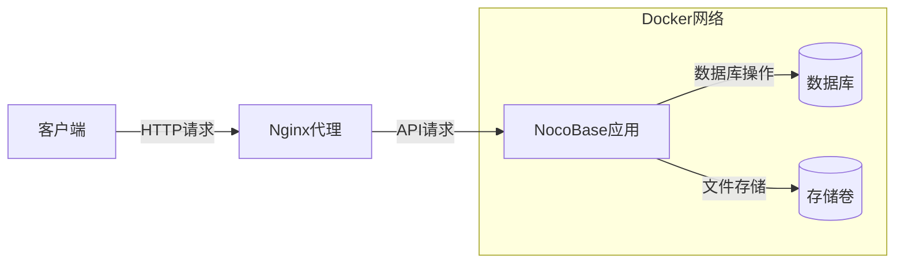

**图示来源**
- [docker/app-mysql/docker-compose.yml](file://docker/app-mysql/docker-compose.yml#L1-L38)
- [docker/nocobase/nocobase.conf](file://docker/nocobase/nocobase.conf#L1-L91)

## 详细组件分析

### NocoBase应用服务分析
NocoBase应用服务是部署的核心组件，负责处理所有业务逻辑和API请求。服务通过Dockerfile构建，并在启动时执行初始化脚本。

#### Dockerfile构建指令
NocoBase的Dockerfile采用多阶段构建策略，第一阶段使用Node.js基础镜像创建应用包，第二阶段将包复制到精简的运行时镜像中。

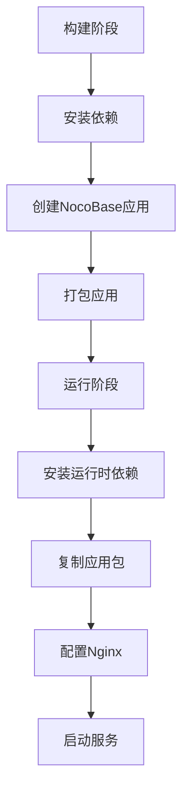

**图示来源**
- [docker/nocobase/Dockerfile](file://docker/nocobase/Dockerfile#L1-L49)

**章节来源**
- [docker/nocobase/Dockerfile](file://docker/nocobase/Dockerfile#L1-L49)

#### docker-entrypoint.sh初始化脚本
初始化脚本负责在容器启动时执行必要的设置步骤，包括解压附加组件、创建应用目录、生成Nginx配置和启动服务。

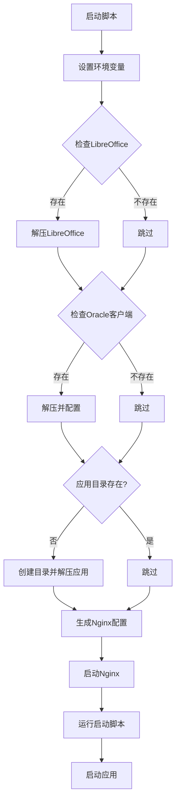

**图示来源**
- [docker/nocobase/docker-entrypoint.sh](file://docker/nocobase/docker-entrypoint.sh#L1-L56)

**章节来源**
- [docker/nocobase/docker-entrypoint.sh](file://docker/nocobase/docker-entrypoint.sh#L1-L56)

### 数据库服务配置
NocoBase支持多种数据库后端，每种数据库都有对应的docker-compose配置文件。

#### MySQL数据库配置
MySQL数据库服务配置包括环境变量设置、数据卷挂载和网络配置。

```mermaid
classDiagram
class MySQLConfig {
+image : mysql : latest
+environment : Map[string,string]
+volumes : List[string]
+networks : List[string]
+restart : always
}
MySQLConfig : MYSQL_DATABASE : nocobase
MySQLConfig : MYSQL_USER : nocobase
MySQLConfig : MYSQL_PASSWORD : nocobase
MySQLConfig : MYSQL_ROOT_PASSWORD : nocobase
```

**图示来源**
- [docker/app-mysql/docker-compose.yml](file://docker/app-mysql/docker-compose.yml#L1-L38)

**章节来源**
- [docker/app-mysql/docker-compose.yml](file://docker/app-mysql/docker-compose.yml#L1-L38)

#### PostgreSQL数据库配置
PostgreSQL数据库服务配置与MySQL类似，但包含特定的WAL级别设置以支持逻辑复制。

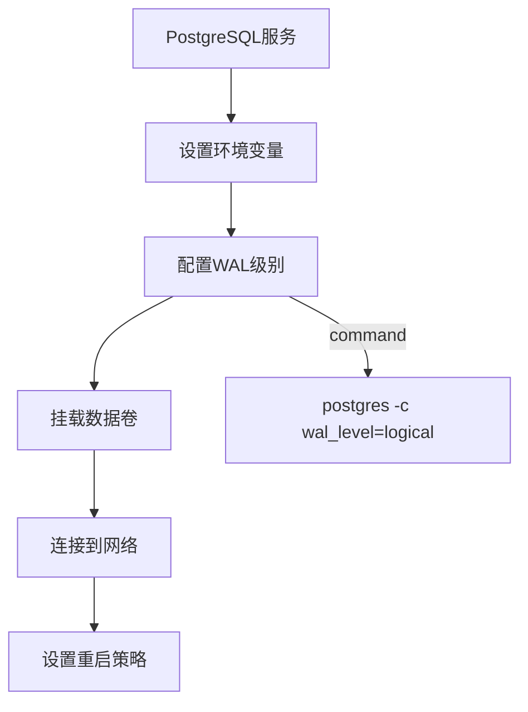

**图示来源**
- [docker/app-postgres/docker-compose.yml](file://docker/app-postgres/docker-compose.yml#L1-L37)

**章节来源**
- [docker/app-postgres/docker-compose.yml](file://docker/app-postgres/docker-compose.yml#L1-L37)

#### MariaDB数据库配置
MariaDB数据库服务配置与MySQL几乎相同，使用MariaDB镜像替代MySQL镜像。


**图示来源**
- [docker/app-mariadb/docker-compose.yml](file://docker/app-mariadb/docker-compose.yml#L1-L39)

**章节来源**
- [docker/app-mariadb/docker-compose.yml](file://docker/app-mariadb/docker-compose.yml#L1-L39)

#### SQLite数据库配置
SQLite数据库服务配置最为简单，因为SQLite是文件型数据库，不需要独立的数据库服务。

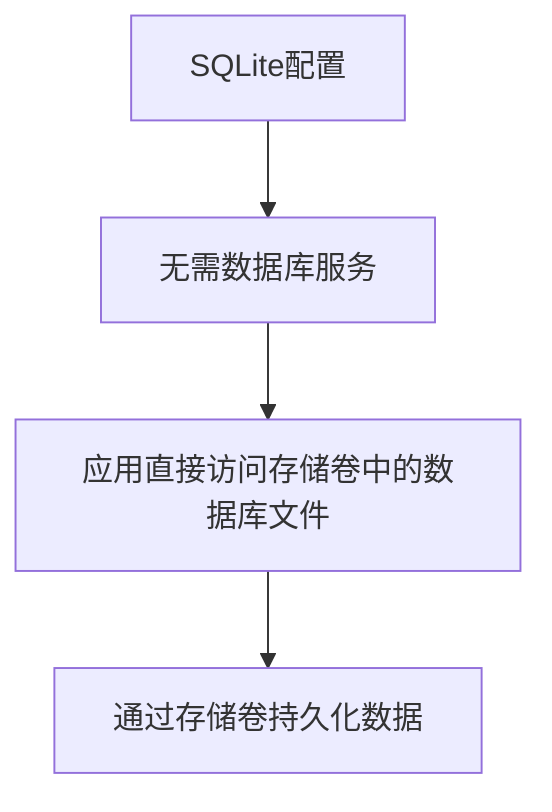

**图示来源**
- [docker/app-sqlite/docker-compose.yml](file://docker/app-sqlite/docker-compose.yml#L1-L15)

**章节来源**
- [docker/app-sqlite/docker-compose.yml](file://docker/app-sqlite/docker-compose.yml#L1-L15)

### Nginx配置分析
NocoBase使用Nginx作为反向代理服务器，处理静态文件服务和API请求转发。

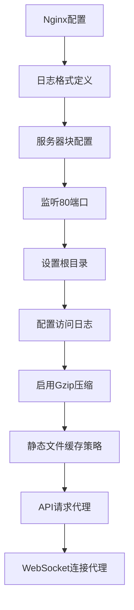

**图示来源**
- [docker/nocobase/nocobase.conf](file://docker/nocobase/nocobase.conf#L1-L91)

**章节来源**
- [docker/nocobase/nocobase.conf](file://docker/nocobase/nocobase.conf#L1-L91)

## 依赖分析
NocoBase的Docker部署依赖于多个外部组件和服务，包括数据库服务、存储卷和网络配置。

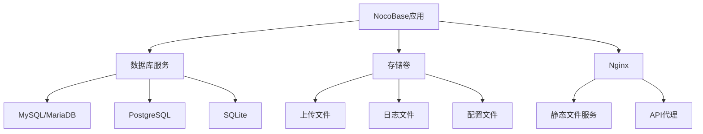

**图示来源**
- [docker/app-mysql/docker-compose.yml](file://docker/app-mysql/docker-compose.yml#L1-L38)
- [docker/app-postgres/docker-compose.yml](file://docker/app-postgres/docker-compose.yml#L1-L37)
- [docker/nocobase/nocobase.conf](file://docker/nocobase/nocobase.conf#L1-L91)

**章节来源**
- [docker/app-mysql/docker-compose.yml](file://docker/app-mysql/docker-compose.yml#L1-L38)
- [docker/app-postgres/docker-compose.yml](file://docker/app-postgres/docker-compose.yml#L1-L37)
- [docker/nocobase/nocobase.conf](file://docker/nocobase/nocobase.conf#L1-L91)

## 性能考虑
在生产环境中部署NocoBase时，需要考虑多个性能优化因素，包括数据库连接池配置、静态文件缓存和资源限制。

### 数据库连接池配置
通过环境变量可以配置数据库连接池的大小和行为，以优化数据库性能。

```mermaid
graph TD
A[数据库连接池] --> B[最大连接数]
A --> C[最小连接数]
A --> D[空闲超时]
A --> E[获取超时]
A --> F[驱逐间隔]
A --> G[最大使用次数]
B --> |DB_POOL_MAX| H[默认值: 5]
C --> |DB_POOL_MIN| I[默认值: 0]
D --> |DB_POOL_IDLE| J[默认值: 10000ms]
E --> |DB_POOL_ACQUIRE| K[默认值: 60000ms]
F --> |DB_POOL_EVICT| L[默认值: 1000ms]
G --> |DB_POOL_MAX_USES| M[默认值: 0 (无限)]
```

**章节来源**
- [.env.example](file://.env.example#L60-L67)

### 静态文件缓存策略
Nginx配置了针对不同文件类型的缓存策略，以提高静态文件的访问性能。

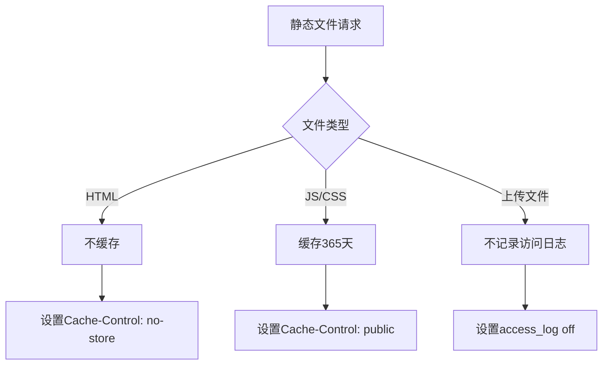

**章节来源**
- [docker/nocobase/nocobase.conf](file://docker/nocobase/nocobase.conf#L26-L37)

## 故障排除指南
本节提供常见问题的解决方案，帮助用户解决部署过程中可能遇到的问题。

### 容器启动失败
当容器无法启动时，可能的原因包括端口冲突、存储卷权限问题或环境变量配置错误。

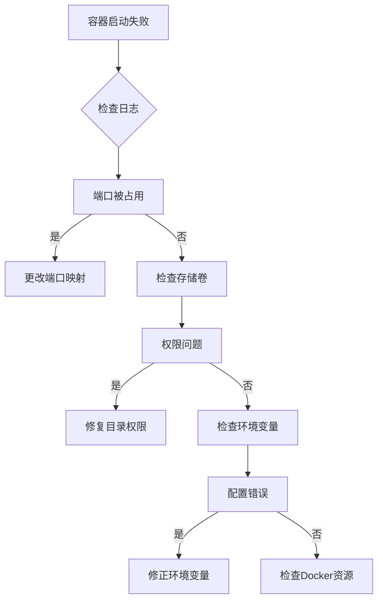

**章节来源**
- [docker/app-mysql/docker-compose.yml](file://docker/app-mysql/docker-compose.yml#L24)
- [docker/nocobase/docker-entrypoint.sh](file://docker/nocobase/docker-entrypoint.sh#L35)

### 数据库初始化问题
数据库初始化问题通常与连接配置、用户权限或数据卷挂载有关。

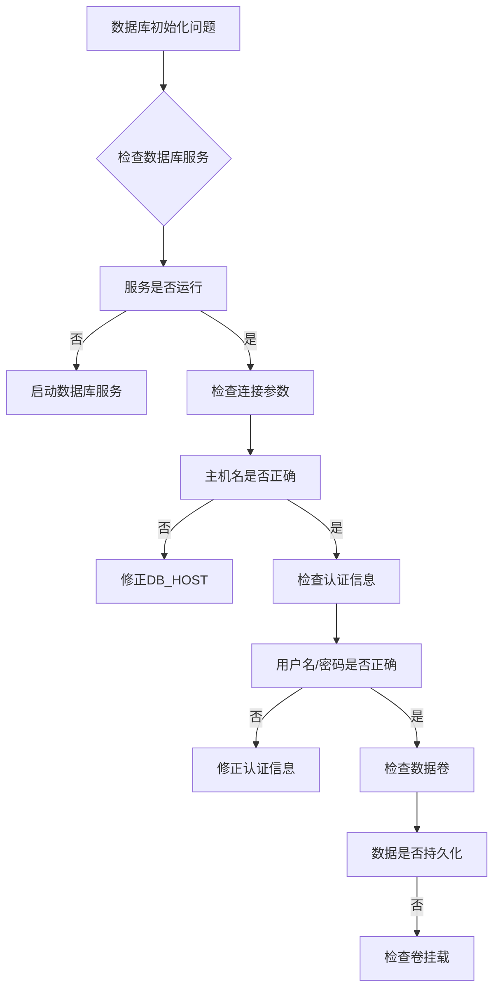

**章节来源**
- [docker/app-mysql/docker-compose.yml](file://docker/app-mysql/docker-compose.yml#L16-L19)
- [docker/app-postgres/docker-compose.yml](file://docker/app-postgres/docker-compose.yml#L14-L17)

### 网络连接错误
网络连接错误通常是由于Docker网络配置不当或服务依赖关系错误导致的。

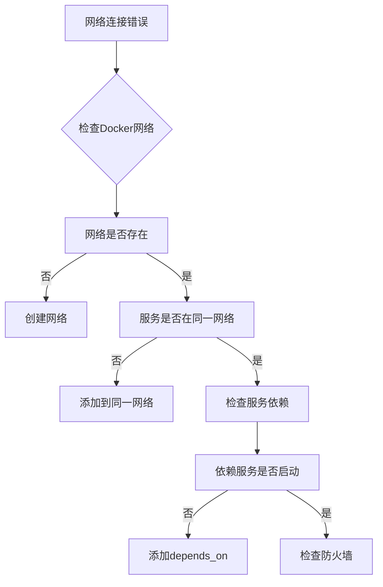

**章节来源**
- [docker/app-mysql/docker-compose.yml](file://docker/app-mysql/docker-compose.yml#L2-L4)
- [docker/app-postgres/docker-compose.yml](file://docker/app-postgres/docker-compose.yml#L2-L4)

## 结论
NocoBase提供了完善的Docker部署方案，通过预配置的`docker-compose.yml`文件可以轻松部署到各种环境中。文档详细介绍了各个组件的配置方法、环境变量设置、网络配置和常见问题的解决方案。在生产环境中部署时，建议根据实际需求调整数据库连接池配置、存储卷设置和资源限制，以获得最佳性能。同时，遵循安全最佳实践，如使用强密码、定期备份数据和监控系统日志，可以确保系统的稳定和安全运行。