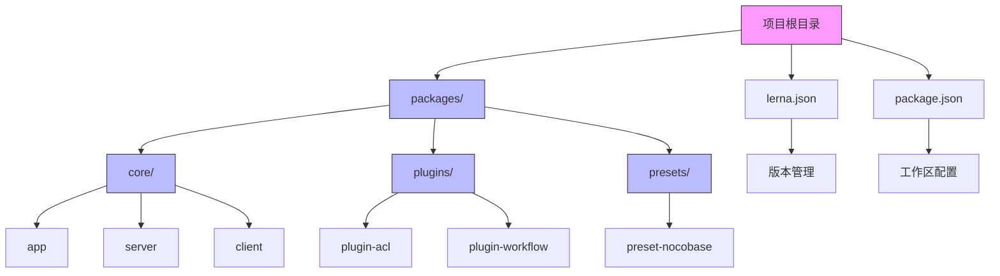

# 源码安装

<cite>
**本文档中引用的文件**  
- [package.json](file://package.json)
- [lerna.json](file://lerna.json)
- [tsconfig.json](file://tsconfig.json)
- [packages/core/app/package.json](file://packages/core/app/package.json)
- [packages/core/server/package.json](file://packages/core/server/package.json)
- [packages/core/client/package.json](file://packages/core/client/package.json)
- [packages/core/build/tsup.config.ts](file://packages/core/build/tsup.config.ts)
- [packages/core/devtools/umiConfig.js](file://packages/core/devtools/umiConfig.js)
- [packages/core/build/src/constant.ts](file://packages/core/build/src/constant.ts)
- [vitest.config.mts](file://vitest.config.mts)
- [playwright.config.ts](file://playwright.config.ts)
</cite>

## 目录
1. [简介](#简介)
2. [开发环境准备](#开发环境准备)
3. [项目结构与Monorepo配置](#项目结构与monorepo配置)
4. [依赖管理与安装](#依赖管理与安装)
5. [TypeScript配置详解](#typescript配置详解)
6. [构建与编译流程](#构建与编译流程)
7. [开发服务器启动与热重载](#开发服务器启动与热重载)
8. [常见问题与解决方案](#常见问题与解决方案)
9. [贡献代码的开发环境设置](#贡献代码的开发环境设置)

## 简介

NocoBase是一个高度可扩展的AI驱动的无代码平台，支持通过源码进行深度定制和开发。本指南将详细介绍从源码构建和运行NocoBase的完整流程，包括开发环境准备、依赖安装、项目构建、配置文件解析以及常见问题的解决方案。

**Section sources**
- [README.md](file://README.md#L1-L96)

## 开发环境准备

在开始构建NocoBase之前，需要确保开发环境满足以下要求：

- **Node.js版本**：必须使用Node.js 18或更高版本。项目中`package.json`文件的`engines`字段明确指定了`"node": ">=18"`。
- **Yarn包管理器**：项目使用Yarn作为包管理工具，并在`.yarnrc`文件中配置了国内镜像源`registry "https://registry.npmmirror.com"`以提高依赖安装速度。
- **Volta工具**：项目使用Volta来锁定Node.js和Yarn的版本，在`package.json`中指定了`"node": "20.14.0"`和`"yarn": "1.22.19"`，确保团队成员使用统一的开发环境。

安装完成后，可以通过以下命令验证环境：
```bash
node --version
yarn --version
```

**Section sources**
- [package.json](file://package.json#L9-L11)
- [.yarnrc](file://.yarnrc#L1-L2)
- [package.json](file://package.json#L97-L98)

## 项目结构与Monorepo配置

NocoBase采用Monorepo架构，使用Lerna和Yarn Workspaces来管理多个包。项目根目录下的`lerna.json`和`package.json`文件共同定义了这种多包管理结构。

### Monorepo结构特点

- **Yarn Workspaces配置**：在`package.json`中，`workspaces`字段定义了包的路径模式：
  ```json
  "workspaces": [
    "packages/*/*",
    "packages/*/*/*"
  ]
  ```
  这表示所有位于`packages`目录下两级子目录中的包都将被Yarn统一管理，实现依赖的扁平化和共享。

- **Lerna配置**：`lerna.json`文件配置了Lerna的行为：
  - `"version": "1.9.32"`：当前项目版本
  - `"npmClient": "yarn"`：指定使用Yarn作为包管理客户端
  - `"useWorkspaces": true`：启用Yarn Workspaces集成
  - `"npmClientArgs": ["--ignore-engines"]`：在安装依赖时忽略引擎版本检查

这种配置使得所有包可以共享依赖，同时保持独立的版本管理和发布流程。



**Diagram sources**
- [package.json](file://package.json#L4-L7)
- [lerna.json](file://lerna.json#L1-L14)

**Section sources**
- [package.json](file://package.json#L4-L7)
- [lerna.json](file://lerna.json#L1-L14)

## 依赖管理与安装

NocoBase的依赖管理分为多个层次，包括根目录的全局依赖和各个包的局部依赖。

### 根目录依赖

在项目根目录的`package.json`中：
- **devDependencies**：包含开发工具，如TypeScript、ESLint、Vitest等。
- **resolutions**：使用Yarn的`resolutions`字段强制指定某些依赖的版本，解决依赖冲突问题，例如：
  ```json
  "resolutions": {
    "@types/react": "18.3.18",
    "react": "^18.0.0",
    "antd": "5.24.2"
  }
  ```
  这确保了整个项目使用统一版本的React和Ant Design组件库。

### 核心包依赖关系

NocoBase的核心功能由多个包组成，它们之间有明确的依赖关系：

- **@nocobase/app**：应用入口包，依赖`@nocobase/server`和`@nocobase/preset-nocobase`。
- **@nocobase/server**：后端服务核心，依赖Koa框架、数据库模块、ACL权限控制等。
- **@nocobase/client**：前端客户端，基于React和Ant Design，依赖Formily表单解决方案。

这些包的`package.json`文件中都使用了精确版本号（如`"1.9.32"`），确保了版本的一致性。

```mermaid
graph LR
A[@nocobase/app] --> B[@nocobase/server]
A --> C[@nocobase/preset-nocobase]
A --> D[@nocobase/client]
B --> E[@nocobase/database]
B --> F[@nocobase/acl]
B --> G[@nocobase/auth]
D --> H[@formily/antd-v5]
D --> I[antd]
D --> J[react]
style A fill:#f96,stroke:#333
style B fill:#69f,stroke:#333
style D fill:#69f,stroke:#333
```

**Diagram sources**
- [packages/core/app/package.json](file://packages/core/app/package.json#L1-L23)
- [packages/core/server/package.json](file://packages/core/server/package.json#L1-L64)
- [packages/core/client/package.json](file://packages/core/client/package.json#L1-L89)

**Section sources**
- [package.json](file://package.json#L76-L94)
- [packages/core/app/package.json](file://packages/core/app/package.json#L1-L23)

## TypeScript配置详解

NocoBase使用TypeScript进行类型安全的开发，其配置主要在`tsconfig.json`文件中定义。

### 编译器选项

`tsconfig.json`中的`compilerOptions`包含以下关键配置：
- `"esModuleInterop": true`：启用ES模块互操作性
- `"moduleResolution": "node"`：使用Node.js的模块解析策略
- `"jsx": "react"`：支持JSX语法
- `"target": "esnext"`：编译目标为最新ECMAScript标准
- `"module": "esnext"`：模块系统使用ES模块
- `"declaration": true`：生成.d.ts类型声明文件
- `"experimentalDecorators": true`：支持装饰器语法

### 路径映射与包含

- `"extends": "./tsconfig.paths.json"`：继承路径配置文件，支持别名导入
- `"include"`：指定需要编译的文件路径，包括所有packages目录下的代码
- `"exclude"`：排除不需要编译的目录，如node_modules和构建输出目录

这些配置确保了大型Monorepo项目的类型检查和编译效率。

**Section sources**
- [tsconfig.json](file://tsconfig.json#L1-L37)

## 构建与编译流程

NocoBase的构建流程由`@nocobase/build`包管理，使用Tsup作为构建工具。

### 构建配置

`packages/core/build/tsup.config.ts`文件定义了构建配置：
- 使用`fast-glob`库扫描`src/**`目录下的所有源文件
- 构建输出目录为`lib`
- `clean: true`：每次构建前清理输出目录
- `loader: { '.d.ts': 'copy' }`：直接复制类型声明文件
- `skipNodeModulesBundle: true`：跳过node_modules的打包

### 构建脚本

项目根目录的`package.json`中定义了构建相关脚本：
- `"build": "nocobase build"`：执行完整构建
- `"tar": "nocobase tar"`：打包发布文件
- `"clean": "nocobase clean"`：清理构建产物

构建过程会遍历所有包，根据`packages/core/build/src/constant.ts`中的配置决定每个包的构建方式（ESM或CJS）。

**Section sources**
- [packages/core/build/tsup.config.ts](file://packages/core/build/tsup.config.ts#L1-L21)
- [packages/core/build/src/constant.ts](file://packages/core/build/src/constant.ts#L1-L78)
- [package.json](file://package.json#L25-L26)

## 开发服务器启动与热重载

NocoBase提供了完善的开发服务器支持，包含热重载和代理配置。

### 开发脚本

通过`package.json`中的脚本启动开发服务器：
- `"dev": "nocobase dev"`：启动全栈开发服务器
- `"dev-server": "nocobase dev --server"`：仅启动后端服务器

### 热重载配置

`packages/core/devtools/umiConfig.js`文件配置了开发服务器的代理和热重载：
- **代理配置**：将API请求代理到后端服务器，避免跨域问题
- **环境变量注入**：通过`define`选项将版本号、API地址等注入到前端代码
- **插件热加载**：`IndexGenerator`类动态生成插件索引，支持插件的热重载

开发服务器会监听文件变化，自动重新编译并刷新浏览器，极大提升了开发效率。

**Section sources**
- [package.json](file://package.json#L22-L23)
- [packages/core/devtools/umiConfig.js](file://packages/core/devtools/umiConfig.js#L1-L279)

## 常见问题与解决方案

在源码构建过程中可能会遇到一些常见问题，以下是解决方案。

### 依赖冲突

由于Monorepo中存在大量包，可能出现依赖版本冲突。解决方案：
- 使用Yarn的`resolutions`字段强制统一版本
- 运行`yarn install --ignore-engines`忽略引擎版本检查
- 清理`node_modules`和yarn缓存后重新安装

### 编译错误

TypeScript编译错误可能由类型不匹配引起。建议：
- 确保所有包使用兼容的TypeScript版本（5.1.3）
- 检查`tsconfig.json`的继承关系
- 验证路径别名配置正确

### 版本兼容性

NocoBase对Node.js版本有严格要求。如果遇到兼容性问题：
- 使用Volta安装指定版本的Node.js（20.14.0）
- 或在`.nvmrc`文件中指定Node.js版本
- 验证Yarn版本（1.22.19）

### 环境变量配置

开发时需要正确设置环境变量，如`APP_PORT`、`API_BASE_URL`等，这些变量在`umiConfig.js`中被读取并注入到应用中。

**Section sources**
- [package.json](file://package.json#L49-L60)
- [packages/core/devtools/umiConfig.js](file://packages/core/devtools/umiConfig.js#L10-L16)
- [package.json](file://package.json#L97-L98)

## 贡献代码的开发环境设置

对于希望贡献代码的开发者，需要设置完整的开发环境。

### 初始化步骤

1. 克隆仓库：`git clone https://github.com/nocobase/nocobase.git`
2. 安装依赖：`yarn install`
3. 启动开发服务器：`yarn dev`

### 测试配置

项目使用Vitest进行单元测试，Playwright进行端到端测试：
- `vitest.config.mts`：Vitest配置文件，继承自`@nocobase/test/vitest.mjs`
- `playwright.config.ts`：Playwright配置文件，继承自`@nocobase/test/e2e`

### 代码规范

项目集成了ESLint、Prettier和Commitlint：
- `.eslintrc`：ESLint配置
- `.prettierrc`：代码格式化配置
- `commitlint.config.js`：提交信息规范

这些工具通过`lint-staged`和`ghooks`在提交代码时自动运行，确保代码质量。

**Section sources**
- [vitest.config.mts](file://vitest.config.mts#L1-L4)
- [playwright.config.ts](file://playwright.config.ts#L1-L4)
- [package.json](file://package.json#L62-L75)