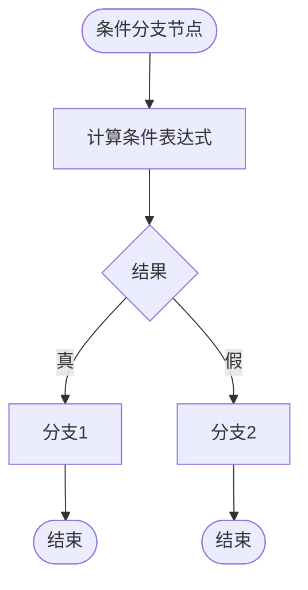
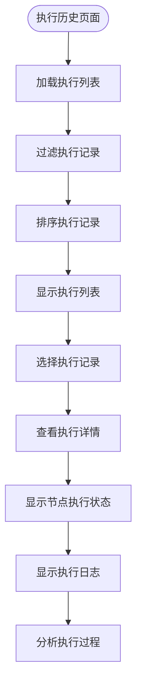

# 工作流自动化

<cite>
**本文档引用文件**   
- [Plugin.ts](file://packages\plugins\@nocobase\plugin-workflow\src\server\Plugin.ts)
- [Processor.ts](file://packages\plugins\@nocobase\plugin-workflow\src\server\Processor.ts)
- [WorkflowCanvas.tsx](file://packages\plugins\@nocobase\plugin-workflow\src\client\WorkflowCanvas.tsx)
- [RequestInstruction.ts](file://packages\plugins\@nocobase\plugin-workflow-request\src\server\RequestInstruction.ts)
- [MailerInstruction.ts](file://packages\plugins\@nocobase\plugin-workflow-mailer\src\server\MailerInstruction.ts)
- [DelayInstruction.ts](file://packages\plugins\@nocobase\plugin-workflow-delay\src\server\DelayInstruction.ts)
- [LoopInstruction.ts](file://packages\plugins\@nocobase\plugin-workflow-loop\src\server\LoopInstruction.ts)
- [ParallelInstruction.ts](file://packages\plugins\@nocobase\plugin-workflow-parallel\src\server\ParallelInstruction.ts)
- [ExecutionPage.tsx](file://packages\plugins\@nocobase\plugin-workflow\src\client\ExecutionPage.tsx)
- [ExecutionCanvas.tsx](file://packages\plugins\@nocobase\plugin-workflow\src\client\ExecutionCanvas.tsx)
</cite>

## 目录
1. [工作流引擎架构](#工作流引擎架构)
2. [可视化工作流设计器](#可视化工作流设计器)
3. [内置动作节点](#内置动作节点)
4. [复杂流程控制](#复杂流程控制)
5. [工作流调试与监控](#工作流调试与监控)
6. [实际应用场景](#实际应用场景)

## 工作流引擎架构

NocoBase工作流引擎采用插件化架构设计，核心由触发器（Trigger）、动作节点（Node）和执行处理器（Processor）组成。工作流插件通过注册机制管理各种触发器和指令，实现灵活的流程控制。

工作流的执行由Processor类负责，它通过prepare方法准备执行环境，包括加载工作流定义、节点和作业。start方法启动工作流执行，resume方法用于恢复挂起的作业。Processor维护了节点和作业的映射关系，通过双链表结构组织节点，确保流程的正确执行顺序。

```mermaid
classDiagram
class WorkflowPlugin {
+instructions : Registry
+triggers : Registry
+enabledCache : Map
+getLogger(workflowId)
+isWorkflowSync(workflow)
+registerTrigger(type, trigger)
+registerInstruction(type, instruction)
+trigger(workflow, context, options)
+run(pending)
+resume(job)
+createProcessor(execution, options)
}
class Processor {
+execution : ExecutionModel
+options : ProcessorOptions
+logger : Logger
+transaction : Transaction
+mainTransaction : Transaction
+nodes : FlowNodeModel[]
+nodesMap : Map
+jobsMapByNodeKey : { [key : string] : JobModel }
+jobResultsMapByNodeKey : { [key : string] : any }
+jobsToSave : Map
+lastSavedJob : JobModel
+prepare()
+start()
+resume(job)
+exec(instruction, node, prevJob)
+run(node, input)
+end(node, job)
+recall(node, job)
+exit(s)
+saveJob(payload)
+getBranches(node)
+findBranchStartNode(node, parent)
+findBranchParentNode(node)
+findBranchEndNode(node)
+findBranchParentJob(job, node)
+findBranchLastJob(node, job)
+getScope(sourceNodeId, includeSelfScope)
+getParsedValue(value, sourceNodeId, options)
}
class Trigger {
<<abstract>>
+title : string
+description : string
+fieldset : object
+sync : boolean
+on(workflow)
+off(workflow)
+execute(workflow, values, options)
+validate(config)
}
class Instruction {
<<abstract>>
+run(node, prevJob, processor)
+resume(node, job, processor)
+getScope(node, result, processor)
+test(config)
}
WorkflowPlugin --> Processor : "创建"
WorkflowPlugin --> Trigger : "注册"
WorkflowPlugin --> Instruction : "注册"
Processor --> Instruction : "执行"
Processor --> JobModel : "管理"
Processor --> FlowNodeModel : "管理"
```

**图源**
- [Plugin.ts](file://packages\plugins\@nocobase\plugin-workflow\src\server\Plugin.ts)
- [Processor.ts](file://packages\plugins\@nocobase\plugin-workflow\src\server\Processor.ts)

**节源**
- [Plugin.ts](file://packages\plugins\@nocobase\plugin-workflow\src\server\Plugin.ts#L1-L551)
- [Processor.ts](file://packages\plugins\@nocobase\plugin-workflow\src\server\Processor.ts#L1-L508)

## 可视化工作流设计器

NocoBase提供直观的可视化工作流设计器，用户可以通过拖拽方式创建和配置工作流。设计器界面包含工具栏、节点画布和属性面板，支持节点的添加、删除、连接和配置。

工作流设计器的核心组件是WorkflowCanvas，它使用FlowContext提供工作流数据和操作方法。用户可以通过ExecuteActionButton执行工作流，通过RevisionsDropdown切换不同版本。AddNodeContextProvider和RemoveNodeContextProvider分别管理节点的添加和删除操作。


**图源**
- [WorkflowCanvas.tsx](file://packages\plugins\@nocobase\plugin-workflow\src\client\WorkflowCanvas.tsx)

**节源**
- [WorkflowCanvas.tsx](file://packages\plugins\@nocobase\plugin-workflow\src\client\WorkflowCanvas.tsx#L1-L578)

## 内置动作节点

NocoBase提供了丰富的内置动作节点，包括数据操作、HTTP请求、邮件发送和延迟执行等。每个动作节点都是一个指令（Instruction）的实现，通过注册机制集成到工作流引擎中。

### HTTP请求节点

HTTP请求节点允许工作流向外部API发送HTTP请求。节点配置包括URL、方法、参数、请求头和请求体。支持同步和异步执行模式，异步模式下请求会挂起工作流，等待响应后再继续执行。


**图源**
- [RequestInstruction.ts](file://packages\plugins\@nocobase\plugin-workflow-request\src\server\RequestInstruction.ts)

**节源**
- [RequestInstruction.ts](file://packages\plugins\@nocobase\plugin-workflow-request\src\server\RequestInstruction.ts#L1-L250)

### 邮件发送节点

邮件发送节点通过SMTP协议发送电子邮件。节点配置包括收件人、抄送、密送、主题、内容和邮件服务器设置。支持HTML和纯文本格式，可以配置是否忽略发送失败。


**图源**
- [MailerInstruction.ts](file://packages\plugins\@nocobase\plugin-workflow-mailer\src\server\MailerInstruction.ts)

**节源**
- [MailerInstruction.ts](file://packages\plugins\@nocobase\plugin-workflow-mailer\src\server\MailerInstruction.ts#L1-L171)

### 延迟执行节点

延迟执行节点用于在指定时间后继续执行工作流。节点配置包括延迟时间和结束状态。延迟期间工作流处于挂起状态，不会占用系统资源。


**图源**
- [DelayInstruction.ts](file://packages\plugins\@nocobase\plugin-workflow-delay\src\server\DelayInstruction.ts)

**节源**
- [DelayInstruction.ts](file://packages\plugins\@nocobase\plugin-workflow-delay\src\server\DelayInstruction.ts#L1-L54)

## 复杂流程控制

NocoBase工作流支持条件分支、并行执行和循环等复杂流程控制机制，通过特定的节点类型实现。

### 条件分支

条件分支节点根据表达式的结果决定执行路径。支持多种计算引擎和表达式语法，可以基于上下文数据进行复杂判断。



### 并行执行

并行执行节点同时执行多个分支，支持多种完成模式：全部完成、任一完成或全部已决。


**图源**
- [ParallelInstruction.ts](file://packages\plugins\@nocobase\plugin-workflow-parallel\src\server\ParallelInstruction.ts)

**节源**
- [ParallelInstruction.ts](file://packages\plugins\@nocobase\plugin-workflow-parallel\src\server\ParallelInstruction.ts#L40-L84)

### 循环

循环节点重复执行内部分支，支持基于目标长度或条件表达式的循环。


**图源**
- [LoopInstruction.ts](file://packages\plugins\@nocobase\plugin-workflow-loop\src\server\LoopInstruction.ts)

**节源**
- [LoopInstruction.ts](file://packages\plugins\@nocobase\plugin-workflow-loop\src\server\LoopInstruction.ts#L1-L215)

## 工作流调试与监控

NocoBase提供完善的工作流调试和监控工具，帮助用户查看执行日志和跟踪状态。

### 执行历史

执行历史页面显示工作流的所有执行记录，包括触发时间、状态和结果。用户可以查看详细执行日志，了解每个节点的执行情况。



**图源**
- [ExecutionPage.tsx](file://packages\plugins\@nocobase\plugin-workflow\src\client\ExecutionPage.tsx)
- [ExecutionCanvas.tsx](file://packages\plugins\@nocobase\plugin-workflow\src\client\ExecutionCanvas.tsx)

**节源**
- [ExecutionPage.tsx](file://packages\plugins\@nocobase\plugin-workflow\src\client\ExecutionPage.tsx#L1-L40)
- [ExecutionCanvas.tsx](file://packages\plugins\@nocobase\plugin-workflow\src\client\ExecutionCanvas.tsx#L284-L334)

### 状态跟踪

工作流执行过程中，系统会实时更新执行状态，包括待处理、进行中、已完成、失败等。用户可以通过状态指示器快速了解工作流的执行情况。


## 实际应用场景

NocoBase工作流可以应用于多种实际场景，如审批流程、数据同步和事件响应。

### 审批流程

审批流程是工作流的典型应用场景，通过条件分支和手动节点实现多级审批。


### 数据同步

数据同步场景通过定时触发器和HTTP请求节点实现系统间的数据同步。


### 事件响应

事件响应场景通过集合事件触发器监听数据变化，并执行相应的响应动作。

