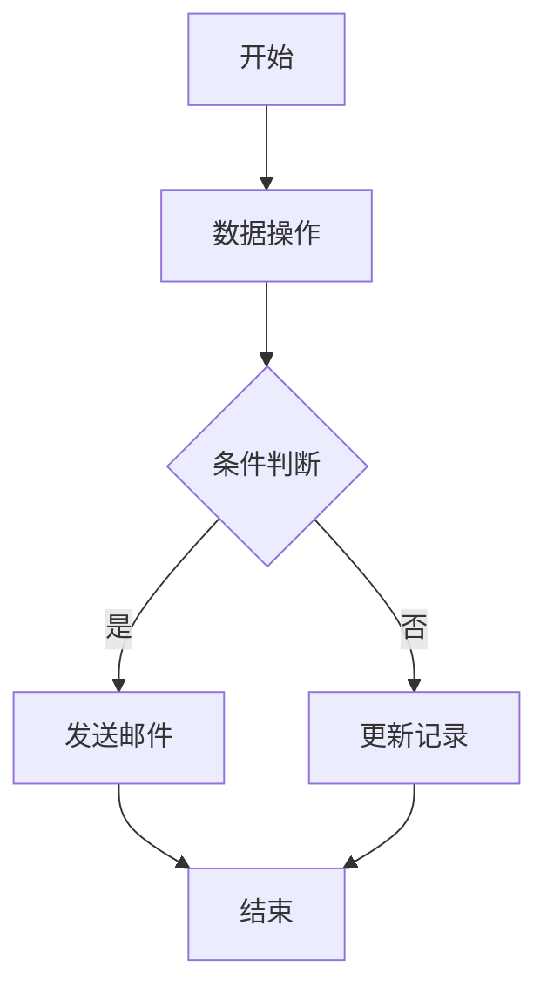
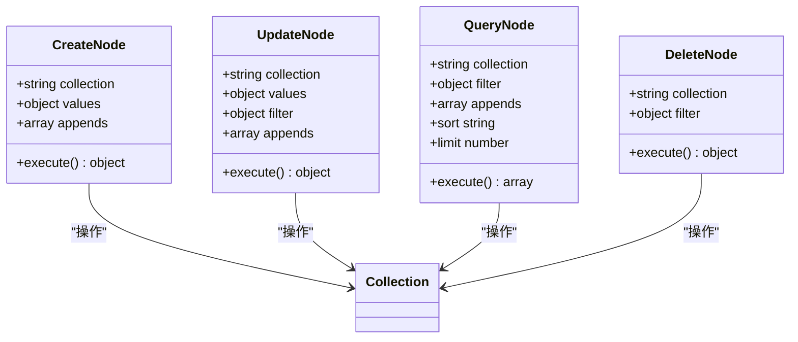
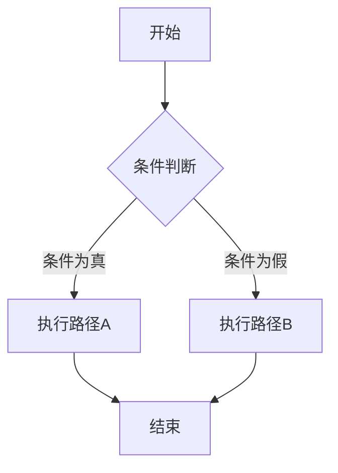
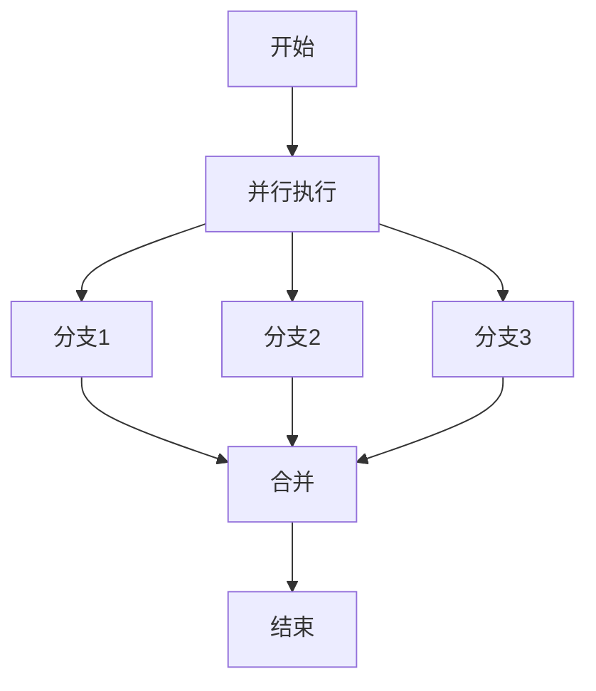
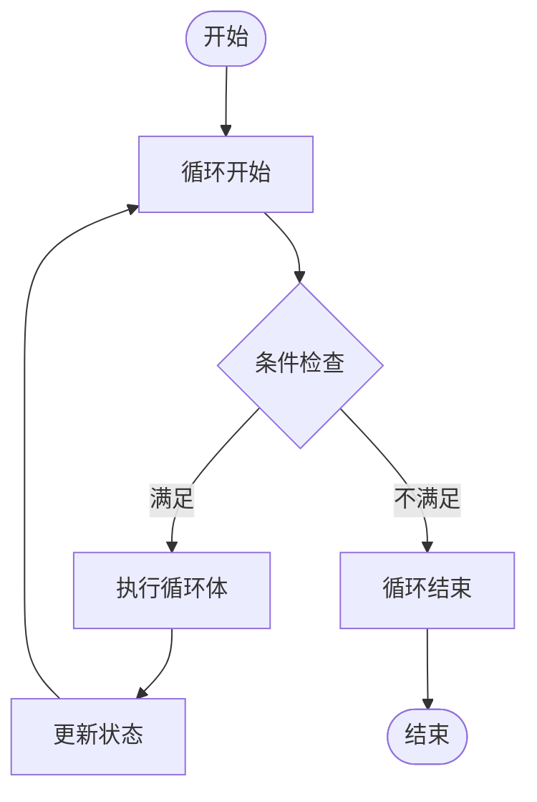
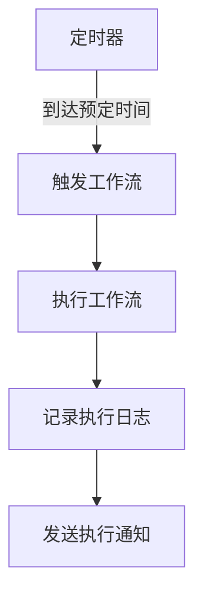
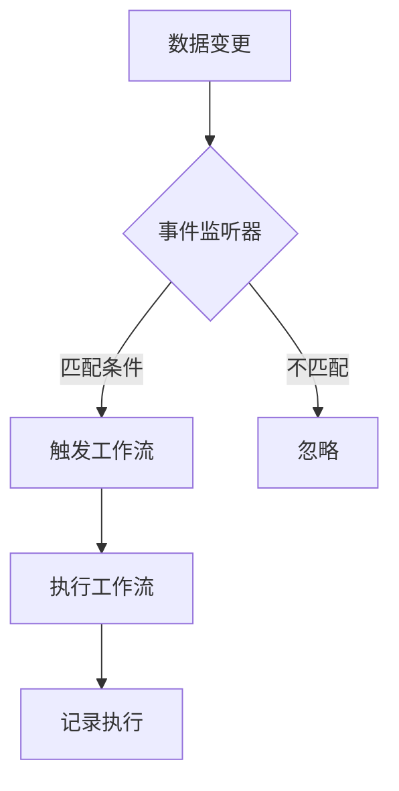

# 工作流设计指南

<cite>
**本文档中引用的文件**  
- [plugin-workflow\src\client\index.tsx](file://packages\plugins\@nocobase\plugin-workflow\src\client\index.tsx)
- [plugin-workflow\src\client\WorkflowCanvas.tsx](file://packages\plugins\@nocobase\plugin-workflow\src\client\WorkflowCanvas.tsx)
- [plugin-workflow\src\client\CanvasContent.tsx](file://packages\plugins\@nocobase\plugin-workflow\src\client\CanvasContent.tsx)
- [plugin-workflow\src\client\nodes\condition.tsx](file://packages\plugins\@nocobase\plugin-workflow\src\client\nodes\condition.tsx)
- [plugin-workflow-parallel\src\client\ParallelInstruction.tsx](file://packages\plugins\@nocobase\plugin-workflow-parallel\src\client\ParallelInstruction.tsx)
- [plugin-workflow-loop\src\client\LoopInstruction.tsx](file://packages\plugins\@nocobase\plugin-workflow-loop\src\client\LoopInstruction.tsx)
- [plugin-workflow\src\client\triggers\index.tsx](file://packages\plugins\@nocobase\plugin-workflow\src\client\triggers\index.tsx)
- [plugin-workflow\src\client\triggers\schedule\index.tsx](file://packages\plugins\@nocobase\plugin-workflow\src\client\triggers\schedule\index.tsx)
- [plugin-workflow\src\client\triggers\collection.tsx](file://packages\plugins\@nocobase\plugin-workflow\src\client\triggers\collection.tsx)
- [plugin-workflow\src\client\nodes\create.tsx](file://packages\plugins\@nocobase\plugin-workflow\src\client\nodes\create.tsx)
- [plugin-workflow-request\src\client\RequestInstruction.tsx](file://packages\plugins\@nocobase\plugin-workflow-request\src\client\RequestInstruction.tsx)
- [plugin-workflow-mailer\src\client\MailerInstruction.tsx](file://packages\plugins\@nocobase\plugin-workflow-mailer\src\client\MailerInstruction.tsx)
- [plugin-workflow-delay\src\client\DelayInstruction.tsx](file://packages\plugins\@nocobase\plugin-workflow-delay\src\client\DelayInstruction.tsx)
</cite>

## 目录
1. [简介](#简介)
2. [可视化工作流设计器](#可视化工作流设计器)
3. [内置动作节点](#内置动作节点)
4. [复杂流程控制](#复杂流程控制)
5. [节点参数配置](#节点参数配置)
6. [触发器配置](#触发器配置)
7. [实际应用场景](#实际应用场景)
8. [最佳实践](#最佳实践)

## 简介

NocoBase工作流系统提供了一个强大的可视化设计器，允许用户通过拖拽、连接和配置节点来创建复杂的自动化流程。工作流设计器支持多种内置动作节点，包括数据操作、HTTP请求、邮件发送和延迟执行等。系统还提供了条件分支、并行执行和循环等高级流程控制机制，使用户能够构建复杂的业务逻辑。

工作流设计器的核心是基于节点的可视化编程模型，每个节点代表一个特定的操作或决策点。用户可以通过拖拽节点到画布上，然后连接它们来定义执行顺序。每个节点都可以进行详细配置，包括参数设置、变量映射和表达式计算。

**Section sources**
- [plugin-workflow\src\client\index.tsx](file://packages\plugins\@nocobase\plugin-workflow\src\client\index.tsx)

## 可视化工作流设计器

### 节点拖拽与连接

NocoBase工作流设计器提供了一个直观的画布界面，用户可以通过拖拽操作将各种节点添加到工作流中。设计器支持多种类型的节点，包括触发器、动作节点和控制节点。用户只需从左侧的节点面板中选择所需的节点类型，然后将其拖拽到画布的适当位置即可。

节点之间的连接是通过自动连线功能实现的。当用户将一个节点放置在画布上时，系统会自动显示连接点，用户只需点击一个节点的输出连接点，然后拖动到另一个节点的输入连接点即可建立连接。这种直观的连接方式使得创建工作流变得简单而高效。

**Diagram sources**
- [plugin-workflow\src\client\WorkflowCanvas.tsx](file://packages\plugins\@nocobase\plugin-workflow\src\client\WorkflowCanvas.tsx)
- [plugin-workflow\src\client\CanvasContent.tsx](file://packages\plugins\@nocobase\plugin-workflow\src\client\CanvasContent.tsx)

### 节点配置界面

每个节点都提供了一个详细的配置界面，用户可以通过双击节点或点击配置按钮来打开。配置界面采用表单形式，包含了该节点所有可配置的参数。界面设计遵循一致性原则，确保用户在配置不同类型的节点时有相似的体验。

配置界面支持实时预览功能，用户在修改参数时可以立即看到变化效果。对于复杂的配置，系统还提供了分步向导，引导用户完成配置过程。此外，配置界面还集成了上下文帮助，用户可以随时查看每个参数的详细说明。

**Section sources**
- [plugin-workflow\src\client\WorkflowCanvas.tsx](file://packages\plugins\@nocobase\plugin-workflow\src\client\WorkflowCanvas.tsx)
- [plugin-workflow\src\client\nodes\index.tsx](file://packages\plugins\@nocobase\plugin-workflow\src\client\nodes\index.tsx)

## 内置动作节点

### 数据操作节点

数据操作节点允许用户对数据库中的记录进行增删改查操作。系统提供了四种基本的数据操作节点：创建记录、更新记录、查询记录和删除记录。每个节点都支持复杂的参数配置，包括字段值映射、关联数据处理和查询条件设置。

创建记录节点允许用户指定目标集合，并为新记录的各个字段赋值。值可以是静态值，也可以是来自上游节点的变量或表达式计算结果。更新记录节点除了支持字段值更新外，还支持条件更新，只有满足特定条件的记录才会被更新。

**Diagram sources**
- [plugin-workflow\src\client\nodes\create.tsx](file://packages\plugins\@nocobase\plugin-workflow\src\client\nodes\create.tsx)
- [plugin-workflow\src\client\nodes\update.tsx](file://packages\plugins\@nocobase\plugin-workflow\src\client\nodes\update.tsx)
- [plugin-workflow\src\client\nodes\query.tsx](file://packages\plugins\@nocobase\plugin-workflow\src\client\nodes\query.tsx)
- [plugin-workflow\src\client\nodes\destroy.tsx](file://packages\plugins\@nocobase\plugin-workflow\src\client\nodes\destroy.tsx)

### HTTP请求节点

HTTP请求节点允许工作流与外部API进行交互。用户可以配置请求的URL、方法、头部信息和请求体。系统支持多种数据格式，包括JSON、表单数据和原始文本。对于需要身份验证的API，节点还支持各种认证方式，如API密钥、OAuth和基本认证。

请求节点支持动态URL和参数配置，用户可以使用变量和表达式来构建复杂的请求。响应处理功能允许用户提取响应中的特定数据，并将其作为变量传递给后续节点。错误处理机制确保在请求失败时能够进行适当的处理，如重试或发送通知。

**Section sources**
- [plugin-workflow-request\src\client\RequestInstruction.tsx](file://packages\plugins\@nocobase\plugin-workflow-request\src\client\RequestInstruction.tsx)

### 邮件发送节点

邮件发送节点提供了完整的邮件发送功能，支持SMTP配置、模板管理和附件处理。用户可以创建邮件模板，其中包含动态内容，这些内容可以来自工作流中的变量。系统支持HTML邮件格式，允许创建富文本邮件。

邮件节点支持批量发送功能，可以将邮件发送给多个收件人。发送状态跟踪功能允许用户监控邮件的发送状态，包括已发送、已读和错误状态。对于重要的邮件，系统还提供了发送确认和回执功能。

**Section sources**
- [plugin-workflow-mailer\src\client\MailerInstruction.tsx](file://packages\plugins\@nocobase\plugin-workflow-mailer\src\client\MailerInstruction.tsx)

### 延迟执行节点

延迟执行节点允许用户在工作流中引入时间延迟。用户可以配置延迟的时间长度，支持秒、分钟、小时和天等时间单位。延迟可以是固定的，也可以是动态的，基于变量或表达式计算得出。

该节点在处理需要等待特定时间间隔的场景时非常有用，如发送提醒邮件、执行定期任务或等待外部系统响应。延迟期间，工作流会暂停执行，直到延迟时间结束才会继续后续操作。

**Section sources**
- [plugin-workflow-delay\src\client\DelayInstruction.tsx](file://packages\plugins\@nocobase\plugin-workflow-delay\src\client\DelayInstruction.tsx)

## 复杂流程控制

### 条件分支

条件分支节点根据条件表达式的结果决定工作流的执行路径。用户可以配置一个布尔表达式，系统会评估该表达式并根据结果选择继续执行或分支执行。表达式可以基于字段值、变量或复杂的逻辑计算。

系统支持两种分支模式：二元分支和多路分支。二元分支根据条件的真/假值选择两个不同的执行路径，而多路分支可以根据不同的条件值选择多个执行路径。分支节点的配置界面提供了直观的条件构建器，帮助用户创建复杂的条件逻辑。

**Diagram sources**
- [plugin-workflow\src\client\nodes\condition.tsx](file://packages\plugins\@nocobase\plugin-workflow\src\client\nodes\condition.tsx)

### 并行执行

并行执行节点允许工作流同时执行多个分支。用户可以创建任意数量的并行分支，每个分支独立执行其任务。系统支持多种并行执行策略，包括"全部成功"、"任意成功"、"竞态模式"和"全部完成"。

"全部成功"模式要求所有分支都成功完成才会继续后续操作；"任意成功"模式只要有一个分支成功就会继续；"竞态模式"在任意分支成功或失败时都会结束并行执行；"全部完成"模式则无论分支成功与否，都会等待所有分支完成后才继续。

**Diagram sources**
- [plugin-workflow-parallel\src\client\ParallelInstruction.tsx](file://packages\plugins\@nocobase\plugin-workflow-parallel\src\client\ParallelInstruction.tsx)

### 循环执行

循环执行节点允许工作流重复执行一组操作。用户可以配置循环的目标，如数组、查询结果或固定次数。系统支持前置条件和后置条件检查，可以在每次循环开始前或结束后评估条件来决定是否继续循环。

循环节点提供了丰富的上下文变量，包括当前项、索引、序列号和总长度，这些变量可以在循环体内的节点中使用。用户还可以配置循环失败时的处理策略，如退出整个工作流、退出循环或继续下一次迭代。

**Diagram sources**
- [plugin-workflow-loop\src\client\LoopInstruction.tsx](file://packages\plugins\@nocobase\plugin-workflow-loop\src\client\LoopInstruction.tsx)

## 节点参数配置

### 变量映射

变量映射功能允许用户将上游节点的输出作为变量传递给下游节点。系统提供了自动变量发现功能，能够识别并列出所有可用的变量。用户可以通过简单的拖拽操作将变量映射到目标字段，也可以手动输入变量引用。

变量映射支持嵌套对象和数组的访问，使用点符号或方括号表示法。例如，`$jobsMapByNodeKey.createNode.data.id`可以访问创建节点输出数据的ID字段。系统还提供了变量预览功能，用户可以在配置时查看变量的实际值。

**Section sources**
- [plugin-workflow\src\client\variable.tsx](file://packages\plugins\@nocobase\plugin-workflow\src\client\variable.tsx)

### 表达式计算

表达式计算功能允许用户在节点参数中使用动态表达式。系统支持多种表达式引擎，包括基本计算、数学表达式和自定义公式。用户可以在任何支持表达式的字段中输入表达式，系统会在运行时计算其值。

表达式可以包含变量引用、算术运算、逻辑运算和函数调用。系统提供了表达式验证功能，在用户输入时实时检查语法正确性。对于复杂的表达式，还提供了调试工具，帮助用户理解和优化表达式逻辑。

**Section sources**
- [plugin-workflow\src\client\nodes\calculation.tsx](file://packages\plugins\@nocobase\plugin-workflow\src\client\nodes\calculation.tsx)

### 动态值设置

动态值设置功能允许用户根据上下文动态决定参数值。除了变量和表达式外，系统还支持条件值、默认值和备选值的设置。用户可以配置复杂的值解析逻辑，确保在不同情况下都能获得正确的值。

对于需要从外部系统获取值的场景，系统还支持异步值解析。用户可以配置一个HTTP请求或其他操作来获取值，然后将其用于后续处理。这种灵活性使得工作流能够适应各种复杂的业务需求。

**Section sources**
- [plugin-workflow\src\client\nodes\index.tsx](file://packages\plugins\@nocobase\plugin-workflow\src\client\nodes\index.tsx)

## 触发器配置

### 手动触发

手动触发器允许用户通过界面操作启动工作流。用户可以在工作流列表中找到目标工作流，然后点击执行按钮来手动触发。系统支持在触发时提供输入参数，这些参数可以作为工作流的初始变量。

手动触发器适用于需要人工干预的场景，如审批流程或数据验证。系统还提供了批量执行功能，允许用户一次性触发多个工作流实例。执行历史记录功能帮助用户跟踪所有手动触发的操作。

**Section sources**
- [plugin-workflow\src\client\triggers\index.tsx](file://packages\plugins\@nocobase\plugin-workflow\src\client\triggers\index.tsx)

### 定时触发

定时触发器允许工作流在预定的时间自动执行。用户可以配置一次性任务或周期性任务，支持cron表达式和自然语言描述两种配置方式。系统提供了直观的时间选择器，帮助用户设置复杂的调度规则。

定时触发器适用于需要定期执行的任务，如数据备份、报表生成或状态检查。系统支持时区配置，确保在不同时区的环境中都能正确执行。执行日志功能帮助用户监控定时任务的执行情况。

**Diagram sources**
- [plugin-workflow\src\client\triggers\schedule\index.tsx](file://packages\plugins\@nocobase\plugin-workflow\src\client\triggers\schedule\index.tsx)

### 事件触发

事件触发器监听系统中的特定事件并自动触发工作流。用户可以配置监听数据集合的增删改操作，或监听自定义事件。系统提供了灵活的过滤条件配置，确保只有满足特定条件的事件才会触发工作流。

事件触发器适用于需要实时响应的场景，如数据同步、通知发送或状态更新。系统支持事件去重和节流功能，防止在短时间内产生过多的工作流实例。上下文传递功能确保工作流能够获取触发事件的完整信息。

**Diagram sources**
- [plugin-workflow\src\client\triggers\collection.tsx](file://packages\plugins\@nocobase\plugin-workflow\src\client\triggers\collection.tsx)

## 实际应用场景

### 审批流程

审批流程是工作流系统的典型应用场景。用户可以创建工作流来管理各种审批请求，如请假申请、报销审批或合同审核。流程通常包括提交申请、多级审批、条件分支和结果通知等环节。

在审批流程中，系统可以根据申请金额或类型自动路由到不同的审批人。对于紧急申请，可以配置加急通道，缩短审批时间。流程完成后，系统会自动更新相关记录并通知申请人。

**Section sources**
- [plugin-workflow\src\client\nodes\condition.tsx](file://packages\plugins\@nocobase\plugin-workflow\src\client\nodes\condition.tsx)
- [plugin-workflow-mailer\src\client\MailerInstruction.tsx](file://packages\plugins\@nocobase\plugin-workflow-mailer\src\client\MailerInstruction.tsx)

### 数据同步

数据同步场景利用工作流在不同系统或数据库之间同步数据。用户可以配置定时触发器或事件触发器来检测数据变化，然后执行相应的同步操作。系统支持双向同步和冲突解决策略。

在数据同步流程中，可以包含数据转换、格式化和验证等步骤。对于大规模数据同步，系统提供了分批处理和错误恢复机制，确保数据完整性。同步日志功能帮助用户监控同步状态和排查问题。

**Section sources**
- [plugin-workflow\src\client\nodes\query.tsx](file://packages\plugins\@nocobase\plugin-workflow\src\client\nodes\query.tsx)
- [plugin-workflow\src\client\nodes\update.tsx](file://packages\plugins\@nocobase\plugin-workflow\src\client\nodes\update.tsx)

### 事件响应

事件响应场景利用工作流对系统事件做出实时反应。当特定事件发生时，如用户注册、订单创建或系统错误，工作流会自动执行预定义的操作序列。这种自动化响应提高了系统的可靠性和用户体验。

在事件响应流程中，可以包含通知发送、数据更新、外部系统调用等多个步骤。系统支持事件优先级设置，确保重要事件能够得到及时处理。错误处理机制确保在响应失败时能够进行适当的补救措施。

**Section sources**
- [plugin-workflow\src\client\triggers\collection.tsx](file://packages\plugins\@nocobase\plugin-workflow\src\client\triggers\collection.tsx)
- [plugin-workflow-request\src\client\RequestInstruction.tsx](file://packages\plugins\@nocobase\plugin-workflow-request\src\client\RequestInstruction.tsx)

## 最佳实践

### 工作流设计原则

设计高效的工作流应遵循模块化、可维护性和可扩展性原则。建议将复杂流程分解为多个小的、可重用的工作流模块。每个模块应有明确的输入输出定义，便于组合和测试。

避免创建过于复杂的工作流，单个工作流的节点数量应控制在合理范围内。对于复杂的业务逻辑，建议使用子工作流调用机制。定期审查和优化现有工作流，移除不再需要的节点和分支。

**Section sources**
- [plugin-workflow\src\client\index.tsx](file://packages\plugins\@nocobase\plugin-workflow\src\client\index.tsx)

### 性能优化建议

为确保工作流的高性能执行，应避免在循环中执行耗时操作。对于需要处理大量数据的场景，建议使用分批处理机制。合理配置并行执行的分支数量，避免过度并行导致系统资源耗尽。

使用适当的缓存策略，避免重复执行相同的查询或计算。对于外部API调用，配置合理的超时和重试策略。监控工作流的执行时间和资源消耗，及时发现和解决性能瓶颈。

**Section sources**
- [plugin-workflow\src\client\Processor.ts](file://packages\plugins\@nocobase\plugin-workflow\src\server\Processor.ts)

### 错误处理策略

完善的错误处理是可靠工作流的关键。每个关键节点都应配置适当的错误处理逻辑，如重试、降级或通知。对于无法自动恢复的错误，应提供清晰的错误信息和人工干预入口。

使用条件分支和异常捕获机制来处理预期的错误情况。记录详细的执行日志，包括输入输出和错误堆栈，便于问题排查。定期分析错误日志，识别常见问题并优化工作流设计。

**Section sources**
- [plugin-workflow\src\client\constants.tsx](file://packages\plugins\@nocobase\plugin-workflow\src\client\constants.tsx)