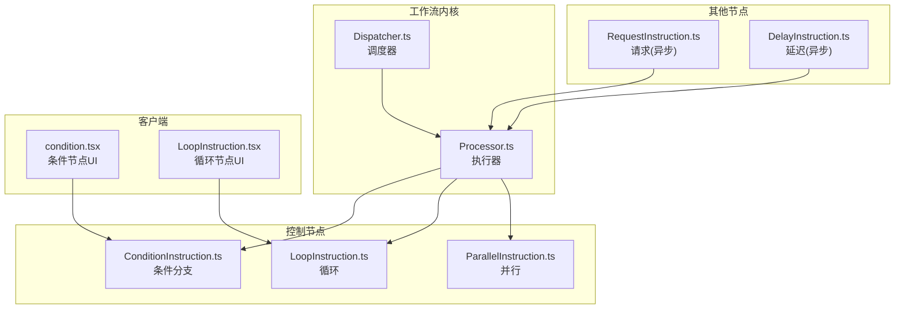
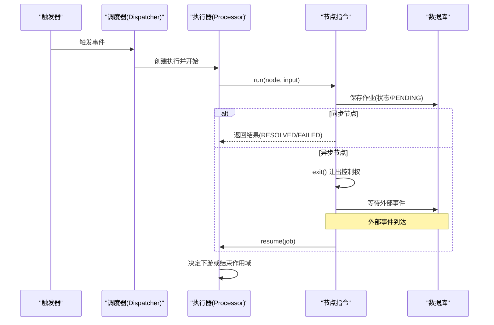
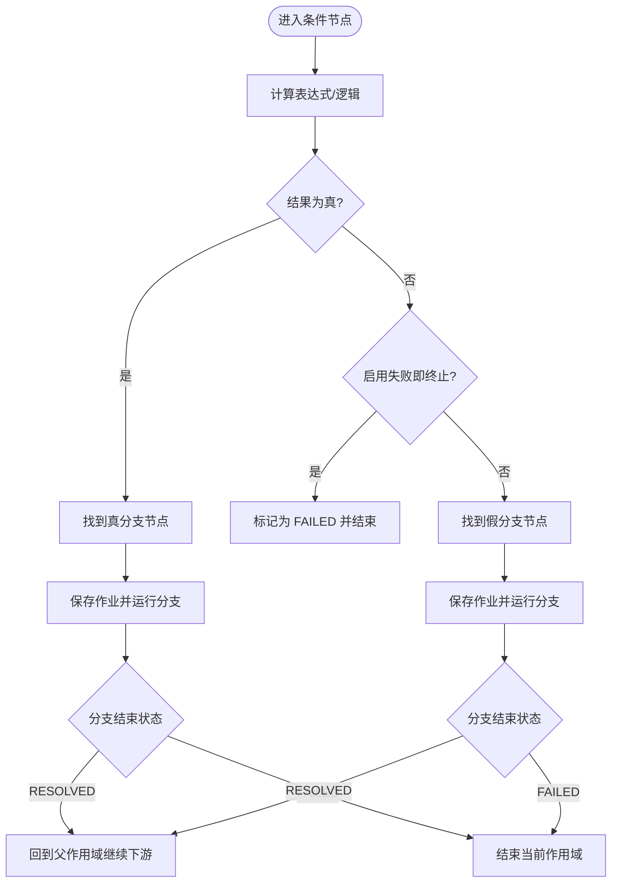
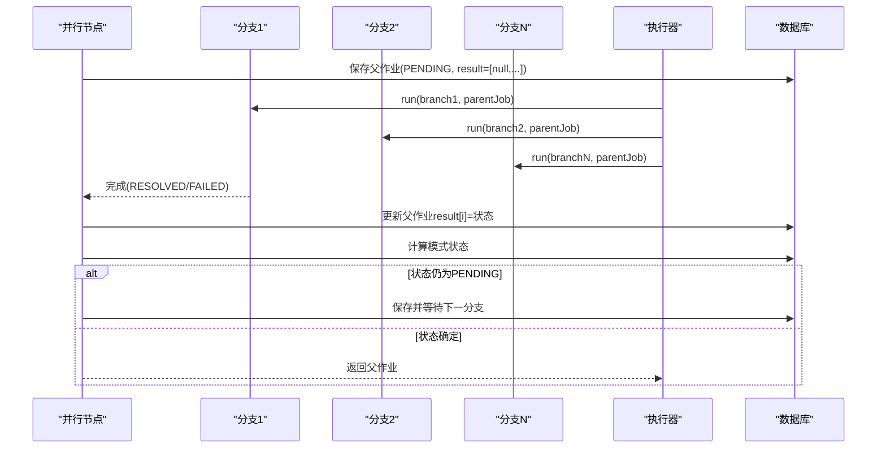
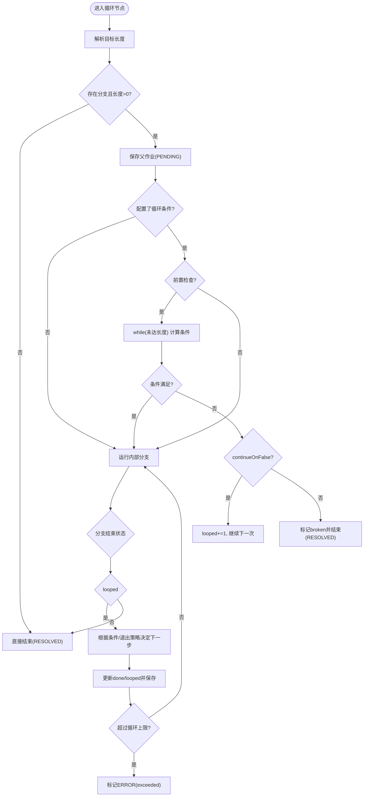
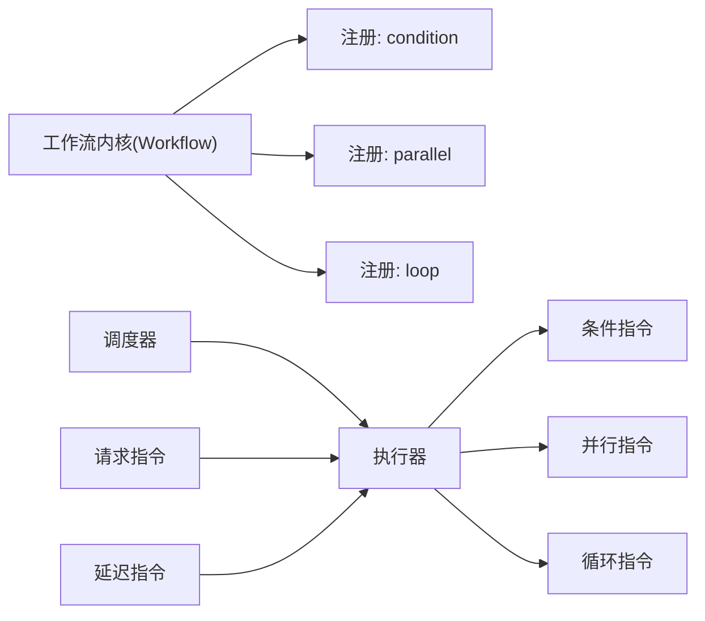

# 流程控制机制

<cite>
**本文引用的文件**
- [ConditionInstruction.ts](file://packages/plugins/@nocobase/plugin-workflow/src/server/Instructions/ConditionInstruction.ts)
- [condition.tsx](file://packages/plugins/@nocobase/plugin-workflow/src/client/nodes/condition.tsx)
- [ParallelInstruction.ts](file://packages/plugins/@nocobase/plugin-workflow-parallel/src/server/ParallelInstruction.ts)
- [LoopInstruction.ts](file://packages/plugins/@nocobase/plugin-workflow-loop/src/server/LoopInstruction.ts)
- [LoopInstruction.tsx](file://packages/plugins/@nocobase/plugin-workflow-loop/src/client/LoopInstruction.tsx)
- [Processor.ts](file://packages/plugins/@nocobase/plugin-workflow/src/server/Processor.ts)
- [Dispatcher.ts](file://packages/plugins/@nocobase/plugin-workflow/src/server/Dispatcher.ts)
- [RequestInstruction.ts](file://packages/plugins/@nocobase/plugin-workflow-request/src/server/RequestInstruction.ts)
- [DelayInstruction.ts](file://packages/plugins/@nocobase/plugin-workflow-delay/src/server/DelayInstruction.ts)
- [nodes.ts](file://packages/plugins/@nocobase/plugin-workflow/src/server/actions/nodes.ts)
- [Plugin.ts（Loop）](file://packages/plugins/@nocobase/plugin-workflow-loop/src/server/Plugin.ts)
- [Plugin.ts（Parallel）](file://packages/plugins/@nocobase/plugin-workflow-parallel/src/server/Plugin.ts)
- [.env.example（Loop）](file://packages/plugins/@nocobase/plugin-workflow-loop/.env.example)
</cite>

## 目录
1. [简介](#简介)
2. [项目结构](#项目结构)
3. [核心组件](#核心组件)
4. [架构总览](#架构总览)
5. [详细组件分析](#详细组件分析)
6. [依赖关系分析](#依赖关系分析)
7. [性能考量](#性能考量)
8. [故障排查指南](#故障排查指南)
9. [结论](#结论)
10. [附录](#附录)

## 简介
本文件系统性阐述 NocoBase 工作流的控制机制，重点覆盖以下三类控制节点：
- 条件分支节点：如何设置判断条件、配置不同分支路径以及处理默认情况
- 并行执行节点：如何配置多个并行分支，以及如何处理分支的合并与状态聚合
- 循环节点：如何进行基于数组或计数的循环，以及如何通过条件控制循环行为

同时，文档解释这些控制机制的执行逻辑（同步与异步）、超时处理与错误传播机制，并给出复杂流程设计示例与最佳实践建议。

## 项目结构
围绕工作流控制机制的相关模块主要分布在以下插件中：
- 条件分支：server 指令与客户端节点定义
- 并行执行：server 指令
- 循环：server 指令与客户端配置界面
- 执行器与调度器：统一的执行与恢复流程
- 其他辅助：请求、延迟等节点对同步/异步与错误传播有参考意义

图表来源
- [Processor.ts](file://packages/plugins/@nocobase/plugin-workflow/src/server/Processor.ts#L241-L286)
- [Dispatcher.ts](file://packages/plugins/@nocobase/plugin-workflow/src/server/Dispatcher.ts#L207-L315)
- [ConditionInstruction.ts](file://packages/plugins/@nocobase/plugin-workflow/src/server/instructions/ConditionInstruction.ts#L23-L68)
- [LoopInstruction.ts](file://packages/plugins/@nocobase/plugin-workflow-loop/src/server/LoopInstruction.ts#L55-L111)
- [ParallelInstruction.ts](file://packages/plugins/@nocobase/plugin-workflow-parallel/src/server/ParallelInstruction.ts#L77-L108)
- [RequestInstruction.ts](file://packages/plugins/@nocobase/plugin-workflow-request/src/server/RequestInstruction.ts#L166-L225)
- [DelayInstruction.ts](file://packages/plugins/@nocobase/plugin-workflow-delay/src/server/DelayInstruction.ts#L74-L100)

章节来源
- [Processor.ts](file://packages/plugins/@nocobase/plugin-workflow/src/server/Processor.ts#L241-L286)
- [Dispatcher.ts](file://packages/plugins/@nocobase/plugin-workflow/src/server/Dispatcher.ts#L207-L315)

## 核心组件
- 条件分支节点：根据表达式结果选择分支，支持“失败即终止”选项
- 并行执行节点：支持多种模式（全部完成、任意完成、竞态、全部结算），按模式聚合子任务状态
- 循环节点：支持数组/计数目标，可配置循环条件、检查点、失败退出策略与循环上限

章节来源
- [ConditionInstruction.ts](file://packages/plugins/@nocobase/plugin-workflow/src/server/instructions/ConditionInstruction.ts#L23-L68)
- [ParallelInstruction.ts](file://packages/plugins/@nocobase/plugin-workflow-parallel/src/server/ParallelInstruction.ts#L12-L75)
- [LoopInstruction.ts](file://packages/plugins/@nocobase/plugin-workflow-loop/src/server/LoopInstruction.ts#L19-L30)

## 架构总览
工作流执行由调度器触发，执行器负责逐节点运行指令，节点指令在运行后决定是否进入下游或结束当前作用域；异步节点通过保存作业并在事件到达时恢复执行。

图表来源
- [Dispatcher.ts](file://packages/plugins/@nocobase/plugin-workflow/src/server/Dispatcher.ts#L207-L315)
- [Processor.ts](file://packages/plugins/@nocobase/plugin-workflow/src/server/Processor.ts#L241-L286)
- [RequestInstruction.ts](file://packages/plugins/@nocobase/plugin-workflow-request/src/server/RequestInstruction.ts#L166-L225)
- [DelayInstruction.ts](file://packages/plugins/@nocobase/plugin-workflow-delay/src/server/DelayInstruction.ts#L74-L100)

## 详细组件分析

### 条件分支节点
- 配置要点
  - 判断引擎：支持表达式引擎或内置计算
  - 分支索引：真分支为 1，假分支为 0，未配置分支时仅返回结果不继续
  - 失败即终止：当结果为假且启用该选项时直接标记为 FAILED
- 执行逻辑
  - 计算结果后，定位对应分支节点并调用执行器运行
  - 若分支已结束且成功，则回到父作用域继续下游；若失败则向上层结束当前作用域
- 默认情况
  - 当未配置分支时，节点仅记录结果并结束当前作用域

图表来源
- [ConditionInstruction.ts](file://packages/plugins/@nocobase/plugin-workflow/src/server/instructions/ConditionInstruction.ts#L23-L68)
- [Processor.ts](file://packages/plugins/@nocobase/plugin-workflow/src/server/Processor.ts#L257-L286)

章节来源
- [ConditionInstruction.ts](file://packages/plugins/@nocobase/plugin-workflow/src/server/instructions/ConditionInstruction.ts#L23-L68)
- [condition.tsx](file://packages/plugins/@nocobase/plugin-workflow/src/client/nodes/condition.tsx#L30-L194)

### 并行执行节点
- 模式
  - ALL：所有分支必须完成，任一失败即失败
  - ANY：任一分支成功即成功，全部失败才失败
  - RACE：首个完成者决定结果
  - ALL_SETTLED：等待所有分支完成，未完成则保持 PENDING
- 执行逻辑
  - 保存一个父作业，记录每个子分支的状态
  - 使用顺序 reduce 调度子分支，避免并发写入数据库造成竞争
  - 子分支完成后，根据模式更新父作业状态并决定是否继续
- 数据聚合
  - 父作业 result 数组按子分支起始节点顺序记录各子作业最终状态

图表来源
- [ParallelInstruction.ts](file://packages/plugins/@nocobase/plugin-workflow-parallel/src/server/ParallelInstruction.ts#L77-L139)

章节来源
- [ParallelInstruction.ts](file://packages/plugins/@nocobase/plugin-workflow-parallel/src/server/ParallelInstruction.ts#L12-L75)
- [ParallelInstruction.ts](file://packages/plugins/@nocobase/plugin-workflow-parallel/src/server/ParallelInstruction.ts#L77-L139)

### 循环节点
- 目标类型
  - 数字：作为循环次数
  - 字符串：按字符遍历
  - 其他非数组值：转换为单元素数组
- 循环条件
  - 支持“前置检查”和“后置检查”
  - 可配置“条件不满足时”的行为：退出循环或继续下一个条目
- 退出策略
  - 节点内部失败时可选择：退出工作流、退出循环继续后续、继续循环到下一个条目
- 限制
  - 可通过环境变量设置循环上限，防止无限循环
- 执行逻辑
  - 初始化父作业，记录已循环次数与完成次数
  - 在每次迭代后根据条件与退出策略决定是否继续
  - 达到目标长度或条件满足时结束

图表来源
- [LoopInstruction.ts](file://packages/plugins/@nocobase/plugin-workflow-loop/src/server/LoopInstruction.ts#L55-L197)
- [.env.example（Loop）](file://packages/plugins/@nocobase/plugin-workflow-loop/.env.example#L1-L3)

章节来源
- [LoopInstruction.ts](file://packages/plugins/@nocobase/plugin-workflow-loop/src/server/LoopInstruction.ts#L19-L30)
- [LoopInstruction.ts](file://packages/plugins/@nocobase/plugin-workflow-loop/src/server/LoopInstruction.ts#L32-L44)
- [LoopInstruction.ts](file://packages/plugins/@nocobase/plugin-workflow-loop/src/server/LoopInstruction.ts#L46-L53)
- [LoopInstruction.ts](file://packages/plugins/@nocobase/plugin-workflow-loop/src/server/LoopInstruction.ts#L55-L111)
- [LoopInstruction.ts](file://packages/plugins/@nocobase/plugin-workflow-loop/src/server/LoopInstruction.ts#L113-L197)
- [LoopInstruction.tsx](file://packages/plugins/@nocobase/plugin-workflow-loop/src/client/LoopInstruction.tsx#L60-L141)
- [LoopInstruction.tsx](file://packages/plugins/@nocobase/plugin-workflow-loop/src/client/LoopInstruction.tsx#L143-L198)

## 依赖关系分析
- 控制节点注册
  - 条件分支：由工作流插件内核注册
  - 并行：由 parallel 插件注册
  - 循环：由 loop 插件注册
- 执行器与调度器
  - 调度器负责创建执行并驱动执行器
  - 执行器负责节点运行、作业保存、作用域回溯与下游推进
- 异步节点
  - 请求与延迟节点采用“保存作业并让出控制权”，在事件到达后恢复执行

图表来源
- [Plugin.ts（Loop）](file://packages/plugins/@nocobase/plugin-workflow-loop/src/server/Plugin.ts#L15-L19)
- [Plugin.ts（Parallel）](file://packages/plugins/@nocobase/plugin-workflow-parallel/src/server/Plugin.ts#L15-L19)
- [Dispatcher.ts](file://packages/plugins/@nocobase/plugin-workflow/src/server/Dispatcher.ts#L207-L315)
- [Processor.ts](file://packages/plugins/@nocobase/plugin-workflow/src/server/Processor.ts#L241-L286)

章节来源
- [Plugin.ts（Loop）](file://packages/plugins/@nocobase/plugin-workflow-loop/src/server/Plugin.ts#L15-L19)
- [Plugin.ts（Parallel）](file://packages/plugins/@nocobase/plugin-workflow-parallel/src/server/Plugin.ts#L15-L19)
- [Dispatcher.ts](file://packages/plugins/@nocobase/plugin-workflow/src/server/Dispatcher.ts#L207-L315)
- [Processor.ts](file://packages/plugins/@nocobase/plugin-workflow/src/server/Processor.ts#L241-L286)

## 性能考量
- 并行度控制
  - 并行节点使用顺序 reduce 调度子分支，避免并发写入数据库导致的竞争
  - 建议在高并发场景下合理规划并行分支数量，避免数据库压力过大
- 循环上限
  - 通过环境变量设置循环上限，防止无限循环导致资源耗尽
- 异步节点
  - 异步节点在等待期间不会阻塞主线程，但需注意事件恢复的频率与数据库写入开销
- 作用域与内存
  - 控制节点会保存中间状态，长时间运行的流程应关注作业表增长与内存占用

章节来源
- [ParallelInstruction.ts](file://packages/plugins/@nocobase/plugin-workflow-parallel/src/server/ParallelInstruction.ts#L89-L107)
- [LoopInstruction.ts](file://packages/plugins/@nocobase/plugin-workflow-loop/src/server/LoopInstruction.ts#L14-L17)
- [LoopInstruction.ts](file://packages/plugins/@nocobase/plugin-workflow-loop/src/server/LoopInstruction.ts#L167-L181)

## 故障排查指南
- 条件分支
  - 表达式异常：节点会返回 ERROR 状态并记录错误信息
  - 未配置分支：仅返回结果，不继续下游
- 并行执行
  - 某一分支失败：根据模式决定整体状态
  - 模式配置不当：可能导致提前结束或长时间处于 PENDING
- 循环
  - 条件不满足且 continueOnFalse=false：循环被中断并标记 broken
  - 超过循环上限：标记 ERROR 并包含 exceeded 标记
  - 目标长度为 0：直接结束
- 异步节点
  - 请求节点：可配置忽略失败，否则失败时标记 FAILED
  - 延迟节点：定时器到期后恢复执行

章节来源
- [ConditionInstruction.ts](file://packages/plugins/@nocobase/plugin-workflow/src/server/instructions/ConditionInstruction.ts#L34-L39)
- [ParallelInstruction.ts](file://packages/plugins/@nocobase/plugin-workflow-parallel/src/server/ParallelInstruction.ts#L127-L131)
- [LoopInstruction.ts](file://packages/plugins/@nocobase/plugin-workflow-loop/src/server/LoopInstruction.ts#L94-L98)
- [LoopInstruction.ts](file://packages/plugins/@nocobase/plugin-workflow-loop/src/server/LoopInstruction.ts#L172-L177)
- [RequestInstruction.ts](file://packages/plugins/@nocobase/plugin-workflow-request/src/server/RequestInstruction.ts#L178-L183)
- [DelayInstruction.ts](file://packages/plugins/@nocobase/plugin-workflow-delay/src/server/DelayInstruction.ts#L85-L100)

## 结论
NocoBase 的工作流控制机制通过条件、并行与循环三大节点实现灵活的流程编排：
- 条件分支提供二选一或多分支的判定能力，并支持失败即终止
- 并行节点提供多种聚合模式，适合需要并行处理的场景
- 循环节点支持数组/计数与条件控制，具备退出策略与循环上限保护
配合统一的执行器与调度器，以及异步节点的事件恢复机制，能够构建从简单到复杂的各类业务流程。

## 附录

### 复杂流程设计示例
- 多级审批流程中的条件判断
  - 使用条件节点根据审批金额或角色分流到不同审批人
  - 审批通过进入下一节点，拒绝时可终止流程或退回上一步
- 数据批量处理中的并行执行
  - 使用并行节点对批量数据分片并行处理，聚合结果后继续下游
  - 注意控制并行度，避免数据库与网络拥塞
- 定时重试机制中的循环控制
  - 使用循环节点对失败操作进行重试，结合条件节点在达到阈值后停止
  - 设置循环上限，防止无限重试

### 最佳实践
- 避免无限循环
  - 明确循环目标类型与长度，必要时设置循环上限
- 控制并行度
  - 合理规划并行分支数量，避免系统过载
- 错误处理
  - 对关键节点配置失败后的退出策略，确保流程可控
- 异步节点
  - 明确异步节点的恢复条件与日志记录，便于问题定位