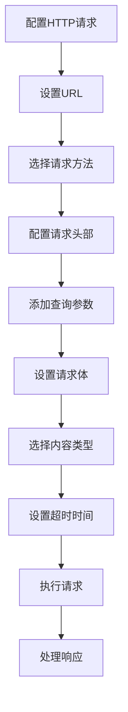
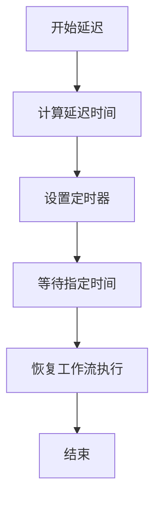
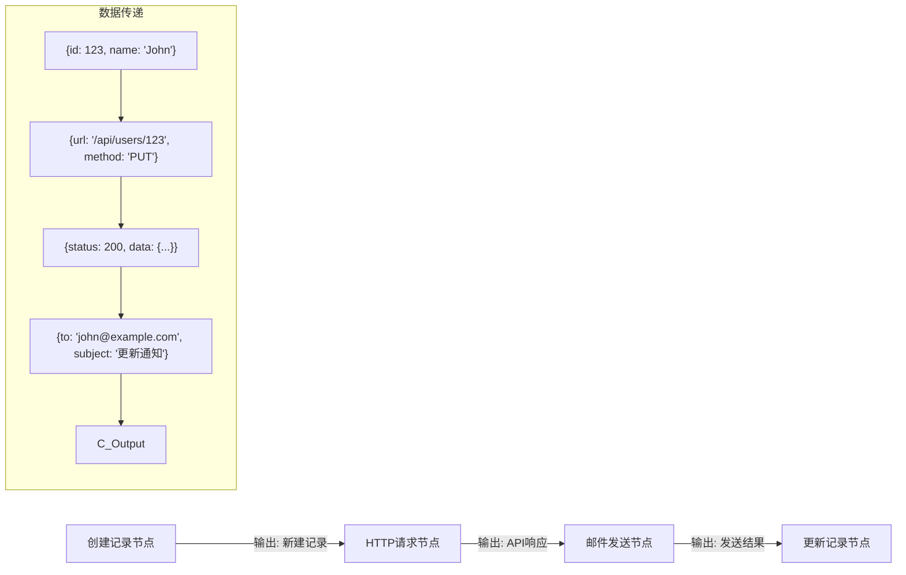

# 节点配置指南

<cite>
**本文档中引用的文件**  
- [CreateInstruction.ts](file://packages/plugins/@nocobase/plugin-workflow/src/server/instructions/CreateInstruction.ts)
- [UpdateInstruction.ts](file://packages/plugins/@nocobase/plugin-workflow/src/server/instructions/UpdateInstruction.ts)
- [DestroyInstruction.ts](file://packages/plugins/@nocobase/plugin-workflow/src/server/instructions/DestroyInstruction.ts)
- [RequestInstruction.ts](file://packages/plugins/@nocobase/plugin-workflow-request/src/server/RequestInstruction.ts)
- [MailerInstruction.ts](file://packages/plugins/@nocobase/plugin-workflow-mailer/src/server/MailerInstruction.ts)
- [DelayInstruction.ts](file://packages/plugins/@nocobase/plugin-workflow-delay/src/server/DelayInstruction.ts)
- [Instruction.ts](file://packages/plugins/@nocobase/plugin-workflow/src/server/instructions/index.ts)
</cite>

## 目录
1. [简介](#简介)
2. [数据操作节点配置](#数据操作节点配置)
3. [HTTP请求节点配置](#http请求节点配置)
4. [邮件发送节点配置](#邮件发送节点配置)
5. [延迟执行节点配置](#延迟执行节点配置)
6. [变量映射与表达式计算](#变量映射与表达式计算)
7. [上下文数据传递](#上下文数据传递)
8. [节点输入输出数据结构](#节点输入输出数据结构)
9. [最佳实践](#最佳实践)

## 简介
NocoBase工作流系统提供了一套完整的节点配置机制，支持多种内置动作节点的灵活配置。本文档详细说明了数据操作节点、HTTP请求节点、邮件发送节点和延迟执行节点的配置方法，以及变量映射、表达式计算和上下文数据传递等核心功能。

## 数据操作节点配置

### 创建记录节点
创建记录节点用于在指定数据表中创建新记录。节点配置包含collection（数据表名称）和params（创建参数）两个主要属性。params中的appends属性用于指定需要附加查询的关联字段。

**节点配置示例：**
- collection: 指定目标数据表的名称
- params: 包含创建记录所需的数据和选项
- appends: 指定需要附加查询的关联字段

**节点参数处理：**
处理器会解析节点配置中的参数值，支持动态值计算。创建完成后，系统会根据appends配置进行附加查询，获取完整的关联数据。

**Section sources**
- [CreateInstruction.ts](file://packages/plugins/@nocobase/plugin-workflow/src/server/instructions/CreateInstruction.ts#L18-L60)

### 更新记录节点
更新记录节点用于修改现有记录的数据。配置中包含collection（数据表名称）和params（更新参数）两个核心属性。系统会解析参数值并执行更新操作，返回受影响的记录数量。

**节点配置要点：**
- collection: 指定要更新的数据表
- params: 包含更新条件和新值
- 支持动态参数解析和事务处理

**Section sources**
- [UpdateInstruction.ts](file://packages/plugins/@nocobase/plugin-workflow/src/server/instructions/UpdateInstruction.ts#L17-L43)

### 删除记录节点
删除记录节点用于从数据表中移除记录。配置包含collection（数据表名称）和params（删除条件）属性。系统根据条件执行删除操作，并返回删除结果。

**配置注意事项：**
- collection: 指定目标数据表
- params: 定义删除条件
- 支持事务安全的删除操作

**Section sources**
- [DestroyInstruction.ts](file://packages/plugins/@nocobase/plugin-workflow/src/server/instructions/DestroyInstruction.ts#L17-L43)

## HTTP请求节点配置

### 基本配置
HTTP请求节点允许向外部服务发送HTTP请求。配置包含URL、请求方法、头部、参数和请求体等关键属性。

**核心配置项：**
- url: 目标服务的完整URL
- method: HTTP方法（GET、POST、PUT、DELETE等）
- headers: 自定义请求头部
- params: URL查询参数
- data: 请求体数据
- timeout: 请求超时时间（毫秒）

**Diagram sources**
- [RequestInstruction.ts](file://packages/plugins/@nocobase/plugin-workflow-request/src/server/RequestInstruction.ts#L23-L28)

### 内容类型处理
系统支持多种内容类型，包括application/json、text/plain、application/x-www-form-urlencoded和multipart/form-data。不同类型的内容需要相应的数据格式转换。

**内容类型配置：**
- application/json: 默认类型，直接序列化JSON数据
- text/plain: 将数据转换为字符串
- application/x-www-form-urlencoded: 将数据转换为URL编码格式
- multipart/form-data: 支持文本字段和文件上传的混合表单

**Section sources**
- [RequestInstruction.ts](file://packages/plugins/@nocobase/plugin-workflow-request/src/server/RequestInstruction.ts#L42-L94)

### 错误处理与重试
HTTP请求节点内置了完善的错误处理机制。当请求失败时，可以根据ignoreFail配置决定是否继续执行后续节点。系统会记录详细的错误信息，包括响应状态码、错误消息和堆栈跟踪。

**错误处理策略：**
- ignoreFail: 忽略失败并继续执行
- 详细错误日志记录
- 支持异步请求的恢复机制

**Section sources**
- [RequestInstruction.ts](file://packages/plugins/@nocobase/plugin-workflow-request/src/server/RequestInstruction.ts#L171-L216)

## 邮件发送节点配置

### SMTP配置
邮件发送节点通过SMTP协议发送电子邮件。需要配置邮件服务器的主机、端口、安全连接和认证信息。

**SMTP服务器配置：**
- host: 邮件服务器主机名
- port: 服务器端口
- secure: 是否使用SSL/TLS加密
- auth: 认证凭据（用户名和密码）

**Section sources**
- [MailerInstruction.ts](file://packages/plugins/@nocobase/plugin-workflow-mailer/src/server/MailerInstruction.ts#L16-L24)

### 邮件内容配置
邮件内容配置包括收件人、抄送、密送、主题和正文等要素。支持纯文本和HTML两种格式的邮件正文。

**邮件内容要素：**
- to: 主要收件人列表
- cc: 抄送收件人列表
- bcc: 密送收件人列表
- subject: 邮件主题
- text: 纯文本正文
- html: HTML格式正文

**Section sources**
- [MailerInstruction.ts](file://packages/plugins/@nocobase/plugin-workflow-mailer/src/server/MailerInstruction.ts#L91-L113)

### 附件支持
系统支持在邮件中添加附件。附件可以是文件管理器中的文件记录，支持单个文件或文件列表。

**附件配置：**
- valueType: 指定为"file"
- name: 表单字段名称
- file: 文件记录或文件记录列表
- 自动处理文件流和MIME类型

**Section sources**
- [MailerInstruction.ts](file://packages/plugins/@nocobase/plugin-workflow-mailer/src/server/MailerInstruction.ts#L36-L40)

## 延迟执行节点配置

### 时间设置
延迟执行节点用于在工作流中引入时间延迟。可以设置具体的等待时间，并选择合适的时间单位。

**时间配置选项：**
- duration: 延迟时长
- unit: 时间单位（秒、分钟、小时、天、周）
- 支持动态值计算

**Diagram sources**
- [DelayInstruction.ts](file://packages/plugins/@nocobase/plugin-workflow-delay/src/server/DelayInstruction.ts#L20-L23)

### 执行状态控制
延迟节点支持配置延迟结束后的执行状态。可以选择成功完成或标记为失败，以适应不同的业务场景。

**状态控制配置：**
- endStatus: 延迟结束后的作业状态
- 支持与并行分支的协调
- 可用于实现超时机制

**Section sources**
- [DelayInstruction.ts](file://packages/plugins/@nocobase/plugin-workflow-delay/src/server/DelayInstruction.ts#L21-L22)

## 变量映射与表达式计算

### 变量映射机制
NocoBase工作流支持强大的变量映射功能，允许在节点间传递和转换数据。变量映射使用JSON格式的配置，支持嵌套属性访问。

**变量映射语法：**
- 使用双大括号{{}}包裹变量表达式
- 支持点号(.)访问嵌套属性
- 支持数组索引访问
- 可以组合静态文本和动态变量

### 表达式计算
系统内置表达式计算器，支持在节点配置中使用动态值。表达式可以在运行时解析，获取上下文中的数据。

**表达式功能：**
- 访问前一个节点的输出结果
- 使用上下文数据
- 支持基本的数学运算和字符串操作
- 可以调用内置函数

**Section sources**
- [Instruction.ts](file://packages/plugins/@nocobase/plugin-workflow/src/server/instructions/index.ts#L25-L26)

## 上下文数据传递

### 执行上下文
每个工作流执行都有独立的上下文环境，包含执行过程中的所有相关数据。上下文数据在节点间自动传递，确保数据的一致性。

**上下文数据结构：**
- execution: 当前执行的元数据
- stack: 执行堆栈信息
- input: 当前节点的输入数据
- result: 前一个节点的输出结果

### 数据流管理
系统通过作业(job)机制管理节点间的数据流。每个节点执行后生成作业记录，包含执行状态和输出结果，供后续节点使用。

**数据流特点：**
- 自动传递前一个节点的输出
- 支持条件分支的数据隔离
- 提供错误处理的数据上下文
- 支持并行分支的数据合并

**Section sources**
- [Instruction.ts](file://packages/plugins/@nocobase/plugin-workflow/src/server/instructions/index.ts#L17-L21)

## 节点输入输出数据结构

### 输入数据结构
节点的输入数据通常包含前一个节点的输出结果和上下文信息。输入数据以JSON格式传递，支持复杂的数据结构。

**输入数据组成：**
- result: 前一个节点的输出
- context: 执行上下文
- metadata: 执行元数据
- 动态解析的配置参数

### 输出数据结构
节点执行完成后生成标准化的输出结果，包含状态码和实际数据。输出结果用于后续节点的输入和工作流的状态管理。

**输出数据格式：**
- status: 执行状态（成功、失败、挂起等）
- result: 实际输出数据
- metadata: 执行相关的元数据
- error: 错误信息（如果存在）

**Section sources**
- [Instruction.ts](file://packages/plugins/@nocobase/plugin-workflow/src/server/instructions/index.ts#L17-L21)

## 最佳实践

### 错误处理配置
合理的错误处理配置可以提高工作流的健壮性。建议为关键节点配置适当的错误处理策略。

**错误处理建议：**
- 为HTTP请求节点设置合理的超时时间
- 配置ignoreFail选项以控制错误传播
- 记录详细的错误日志用于调试
- 实现重试机制应对临时性故障

### 超时设置
适当的超时设置可以防止工作流因外部服务响应缓慢而长时间挂起。

**超时配置原则：**
- 根据服务响应时间设置合理超时
- 考虑网络延迟和处理时间
- 为关键操作设置较短的超时
- 为批量操作设置较长的超时

### 重试策略
对于可能失败的操作，建议配置重试策略以提高成功率。

**重试策略要点：**
- 设置最大重试次数
- 使用指数退避算法
- 记录重试次数和时间
- 避免对幂等性操作的过度重试

### 数据转换示例
展示如何从一个节点的输出获取数据并传递给下一个节点：

**Diagram sources**
- [CreateInstruction.ts](file://packages/plugins/@nocobase/plugin-workflow/src/server/instructions/CreateInstruction.ts#L18-L60)
- [RequestInstruction.ts](file://packages/plugins/@nocobase/plugin-workflow-request/src/server/RequestInstruction.ts#L164-L250)
- [MailerInstruction.ts](file://packages/plugins/@nocobase/plugin-workflow-mailer/src/server/MailerInstruction.ts#L25-L170)
- [UpdateInstruction.ts](file://packages/plugins/@nocobase/plugin-workflow/src/server/instructions/UpdateInstruction.ts#L17-L43)