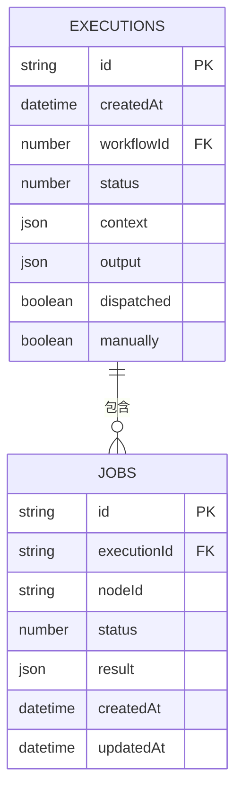
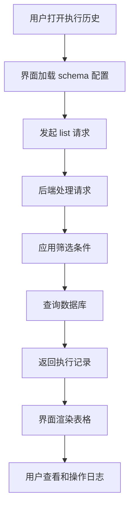
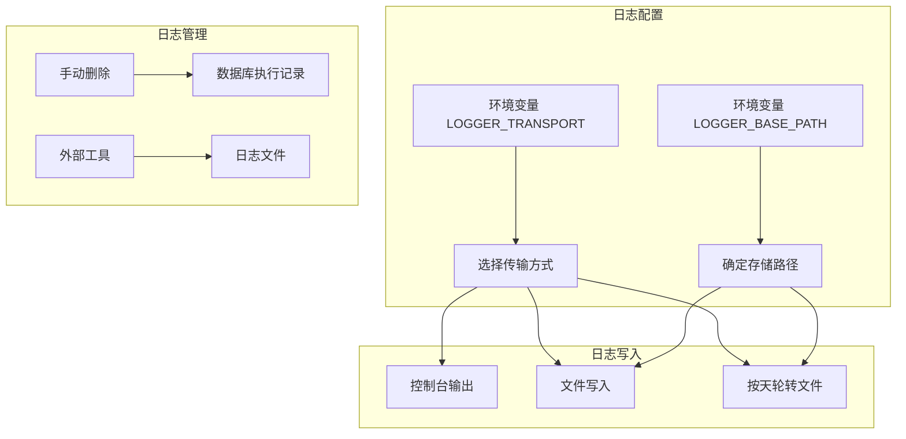

# 执行日志分析

<cite>
**本文档中引用的文件**  
- [Plugin.ts](file://packages/plugins/@nocobase/plugin-workflow/src/server/Plugin.ts)
- [Dispatcher.ts](file://packages/plugins/@nocobase/plugin-workflow/src/server/Dispatcher.ts)
- [Processor.ts](file://packages/plugins/@nocobase/plugin-workflow/src/server/Processor.ts)
- [executions.tsx](file://packages/plugins/@nocobase/plugin-workflow/src/client/schemas/executions.tsx)
- [logger.ts](file://packages/plugins/@nocobase/plugin-logger/src/server/resourcer/logger.ts)
- [constants.ts](file://packages/plugins/@nocobase/plugin-workflow/src/server/constants.ts)
- [config.ts](file://packages/core/logger/src/config.ts)
- [logger.ts](file://packages/core/logger/src/logger.ts)
- [executions.ts](file://packages/plugins/@nocobase/plugin-workflow/src/common/collections/executions.ts)
</cite>

## 目录
1. [简介](#简介)
2. [执行日志结构](#执行日志结构)
3. [管理界面中的日志查看与搜索](#管理界面中的日志查看与搜索)
4. [日志级别配置](#日志级别配置)
5. [日志存储策略与保留周期](#日志存储策略与保留周期)
6. [性能瓶颈分析](#性能瓶颈分析)
7. [实际案例：工作流优化与问题诊断](#实际案例：工作流优化与问题诊断)
8. [结论](#结论)

## 简介

NocoBase 工作流系统提供了全面的执行日志功能，用于记录和分析工作流的执行过程。执行日志是监控、调试和优化工作流的关键工具。通过详细的日志记录，用户可以追踪每个工作流实例的完整执行路径，包括时间戳、执行步骤、输入输出数据以及状态变更。本文档将深入探讨执行日志的各个方面，包括其结构、查看方法、配置选项以及如何利用日志数据进行性能分析和问题诊断。

**Section sources**
- [Plugin.ts](file://packages/plugins/@nocobase/plugin-workflow/src/server/Plugin.ts#L1-L551)
- [Dispatcher.ts](file://packages/plugins/@nocobase/plugin-workflow/src/server/Dispatcher.ts#L1-L474)

## 执行日志结构

NocoBase 工作流的执行日志结构设计用于完整记录每次执行的上下文和过程。日志数据主要存储在 `executions` 表中，其核心字段包括：

- **ID**: 执行实例的唯一标识符，使用雪花算法生成。
- **createdAt**: 执行触发的时间戳，精确到毫秒。
- **workflowId**: 关联的工作流版本ID，用于追溯执行来源。
- **status**: 执行状态，表示当前执行的进展或结果。
- **context**: 输入数据，包含触发工作流时的原始上下文信息。
- **output**: 输出数据，记录工作流执行完成后的结果。
- **dispatched**: 布尔值，指示执行是否已被调度处理。
- **manually**: 布尔值，指示执行是否由用户手动触发。

执行状态（`status`）使用预定义的常量来表示不同的执行结果：
- `QUEUEING` (null): 执行在队列中等待处理。
- `STARTED` (0): 执行已开始处理。
- `RESOLVED` (1): 执行成功完成。
- `FAILED` (-1): 执行因业务逻辑失败而终止。
- `ERROR` (-2): 执行因系统错误而终止。
- `ABORTED` (-3): 执行被中止。
- `CANCELED` (-4): 执行被取消。
- `REJECTED` (-5): 执行被拒绝。
- `RETRY_NEEDED` (-6): 执行需要重试。

每个执行实例由 `Processor` 类处理，该类负责协调工作流节点的执行。在执行过程中，每个节点的运行结果会被记录为 `Job` 模型实例，并与执行实例关联。这使得日志能够详细追踪到工作流中的每一个步骤。

**Diagram sources**
- [executions.ts](file://packages/plugins/@nocobase/plugin-workflow/src/common/collections/executions.ts#L1-L123)
- [constants.ts](file://packages/plugins/@nocobase/plugin-workflow/src/server/constants.ts#L1-L32)

**Section sources**
- [executions.ts](file://packages/plugins/@nocobase/plugin-workflow/src/common/collections/executions.ts#L1-L123)
- [constants.ts](file://packages/plugins/@nocobase/plugin-workflow/src/server/constants.ts#L1-L32)
- [Processor.ts](file://packages/plugins/@nocobase/plugin-workflow/src/server/Processor.ts#L1-L508)

## 管理界面中的日志查看与搜索

在 NocoBase 的管理界面中，用户可以通过专门的“执行历史”抽屉来查看和搜索工作流的执行日志。该界面基于 `executions` 集合的 schema 配置构建，提供了直观的数据表格和操作控件。

用户可以执行以下操作：
- **刷新**: 手动刷新日志列表以获取最新数据。
- **删除**: 删除单个或批量的执行记录。
- **清空**: 清除所有符合条件的执行记录。

日志列表默认按 `createdAt` 字段降序排列，确保最新的执行记录显示在最上方。表格列出了关键信息，如执行ID、触发时间、关联的工作流版本和当前状态。状态字段以可视化的方式（如标签或进度条）展示，便于快速识别执行结果。

搜索和筛选功能允许用户根据以下条件过滤日志：
- **工作流类型**: 通过 `workflowId` 或工作流分类进行筛选。
- **执行状态**: 使用状态下拉菜单选择特定状态（如成功、失败、进行中）。
- **时间范围**: 通过日期选择器指定 `createdAt` 的起止时间。

这些筛选条件通过 `request.params` 传递给后端 API，后端使用 `filter` 参数构建数据库查询，高效地返回匹配的执行记录。

**Diagram sources**
- [executions.tsx](file://packages/plugins/@nocobase/plugin-workflow/src/client/schemas/executions.tsx#L1-L271)

**Section sources**
- [executions.tsx](file://packages/plugins/@nocobase/plugin-workflow/src/client/schemas/executions.tsx#L1-L271)

## 日志级别配置

NocoBase 的日志系统支持多种日志级别，允许用户根据环境和需求调整日志的详细程度。日志级别由环境变量 `LOGGER_LEVEL` 控制，其默认值根据 `APP_ENV` 环境变量自动设定：
- 在 `development` 环境下，默认日志级别为 `debug`，提供最详细的输出，包括调试信息。
- 在其他环境下，默认日志级别为 `info`，仅记录重要信息、警告和错误。

支持的日志级别按严重性递增排序如下：
- **debug**: 用于开发和调试的详细信息，例如变量值、函数调用栈等。
- **info**: 记录常规的运行时信息，如服务启动、关键操作完成。
- **warn**: 记录潜在的问题或非致命的异常情况。
- **error**: 记录导致功能失败的错误。

日志级别配置在 `@nocobase/logger` 包中实现，通过 `getLoggerLevel()` 函数读取环境变量。此配置是全局的，影响系统日志、请求日志等所有日志输出。用户可以通过在 `.env` 文件中设置 `LOGGER_LEVEL` 来覆盖默认值，例如设置为 `warn` 以减少生产环境中的日志量。

**Section sources**
- [config.ts](file://packages/core/logger/src/config.ts#L1-L24)
- [logger.ts](file://packages/core/logger/src/logger.ts#L1-L15)

## 日志存储策略与保留周期

NocoBase 的日志存储策略由 `LOGGER_TRANSPORT` 环境变量配置，支持多种传输方式：
- **console**: 将日志输出到控制台，适用于开发和调试。
- **file**: 将日志写入文件。
- **dailyRotateFile**: 按天轮转日志文件，这是生产环境的推荐配置。

日志文件的存储路径由 `LOGGER_BASE_PATH` 环境变量决定，默认路径为 `storage/logs`。对于工作流日志，系统会为每个工作流创建独立的子目录，日志文件按日期命名（如 `%DATE%.log`），便于管理和归档。

关于日志保留周期，NocoBase 本身不提供自动清理机制，需要依赖外部工具（如操作系统的 `logrotate`）或手动管理。然而，执行记录（存储在数据库中）可以通过管理界面的“清空”功能进行批量删除。值得注意的是，删除执行记录不会重置工作流的“已执行次数”统计。

**Diagram sources**
- [config.ts](file://packages/core/logger/src/config.ts#L1-L24)
- [logger.ts](file://packages/plugins/@nocobase/plugin-logger/src/server/resourcer/logger.ts#L1-L172)

**Section sources**
- [config.ts](file://packages/core/logger/src/config.ts#L1-L24)
- [logger.ts](file://packages/plugins/@nocobase/plugin-logger/src/server/resourcer/logger.ts#L1-L172)

## 性能瓶颈分析

通过分析执行日志，可以有效地识别工作流中的性能瓶颈。关键的分析指标包括：

- **执行延迟**: 通过比较 `createdAt` 和后续处理时间戳，可以计算出从触发到开始处理的延迟。在 `Dispatcher` 类中，当事件被加入 `pending` 列表或发布到队列时，会记录相应的日志，这些日志是分析延迟的依据。
- **资源消耗异常**: 虽然日志本身不直接记录CPU或内存使用情况，但长时间运行的执行或频繁出现的错误日志可能暗示资源消耗过高。例如，一个状态长时间停留在 `STARTED` 可能表示节点处理逻辑存在性能问题。

分析步骤：
1. 在管理界面中，按 `createdAt` 排序，查找最近的执行记录。
2. 筛选状态为 `ERROR` 或 `FAILED` 的记录，检查其上下文和输出，定位错误原因。
3. 对于长时间运行的执行，检查其关联的 `jobs` 记录，找出耗时最长的节点。
4. 查看系统日志（`system.log`）中与工作流相关的 `debug` 或 `info` 级别日志，获取更详细的执行流程信息。

例如，`Dispatcher` 中的 `prepare` 和 `process` 方法会记录准备和处理执行的开始与结束，通过分析这些日志的时间间隔，可以评估调度器的性能。

**Section sources**
- [Dispatcher.ts](file://packages/plugins/@nocobase/plugin-workflow/src/server/Dispatcher.ts#L1-L474)
- [Processor.ts](file://packages/plugins/@nocobase/plugin-workflow/src/server/Processor.ts#L1-L508)

## 实际案例：工作流优化与问题诊断

**案例一：诊断执行失败**

**问题**: 用户报告一个数据同步工作流经常失败。

**诊断步骤**:
1. 在管理界面中，筛选该工作流的执行记录，状态选择 `ERROR`。
2. 查看失败执行的 `output` 字段，发现错误信息为“数据库连接超时”。
3. 检查 `context`，确认操作涉及大量数据。
4. 分析日志，发现 `Processor` 在执行 `QueryInstruction` 时耗时过长。
5. **结论**: 查询语句未优化，导致超时。**解决方案**: 为查询字段添加数据库索引，并分批处理数据。

**案例二：优化执行延迟**

**问题**: 工作流从触发到开始执行有明显延迟。

**诊断步骤**:
1. 查看 `Dispatcher` 的日志，发现 `events queue is empty` 后，`dispatch` 方法被调用。
2. 发现 `executing` 标志长时间为 `true`，表明有执行在长时间占用调度器。
3. 定位到一个执行时间长达数分钟的旧工作流实例。
4. **结论**: 长时间运行的执行阻塞了调度队列。**解决方案**: 优化该工作流的性能，或调整调度策略，确保关键工作流的优先级。

这些案例展示了如何结合数据库中的执行记录和文件系统中的详细日志，进行深入的问题诊断和性能优化。

**Section sources**
- [Dispatcher.ts](file://packages/plugins/@nocobase/plugin-workflow/src/server/Dispatcher.ts#L1-L474)
- [Processor.ts](file://packages/plugins/@nocobase/plugin-workflow/src/server/Processor.ts#L1-L508)
- [executions.ts](file://packages/plugins/@nocobase/plugin-workflow/src/common/collections/executions.ts#L1-L123)

## 结论

NocoBase 的工作流执行日志系统是一个强大而灵活的工具，为系统的可观测性提供了坚实的基础。通过理解日志的结构、掌握管理界面的使用方法、合理配置日志级别和存储策略，用户可以有效地监控工作流的健康状况。更重要的是，通过对日志数据的深入分析，能够快速诊断问题、识别性能瓶颈，并持续优化工作流设计，从而确保业务流程的稳定和高效运行。