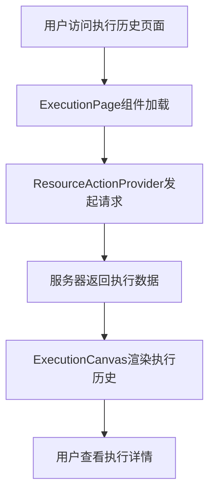
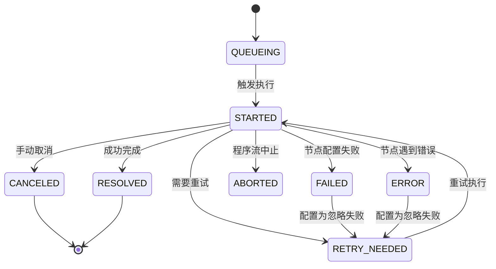
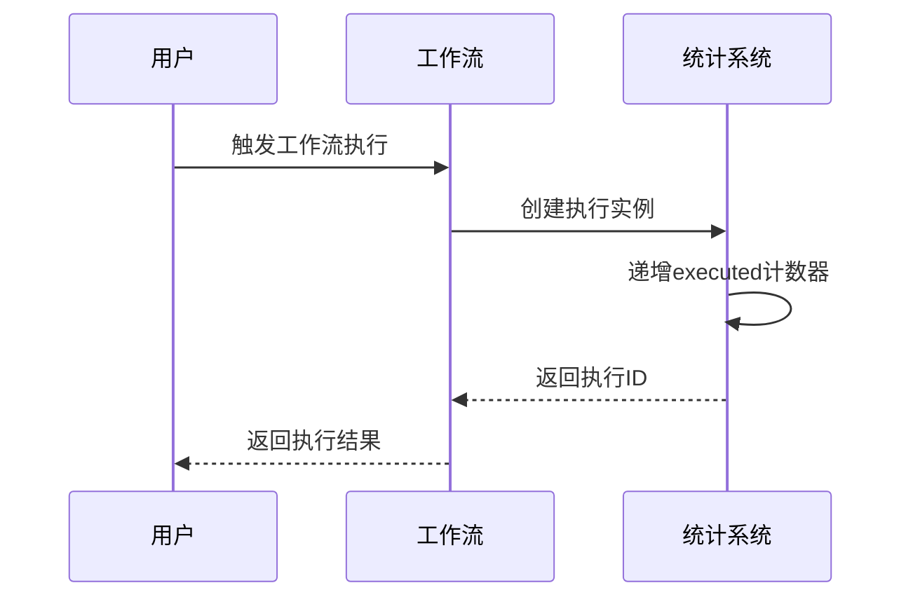
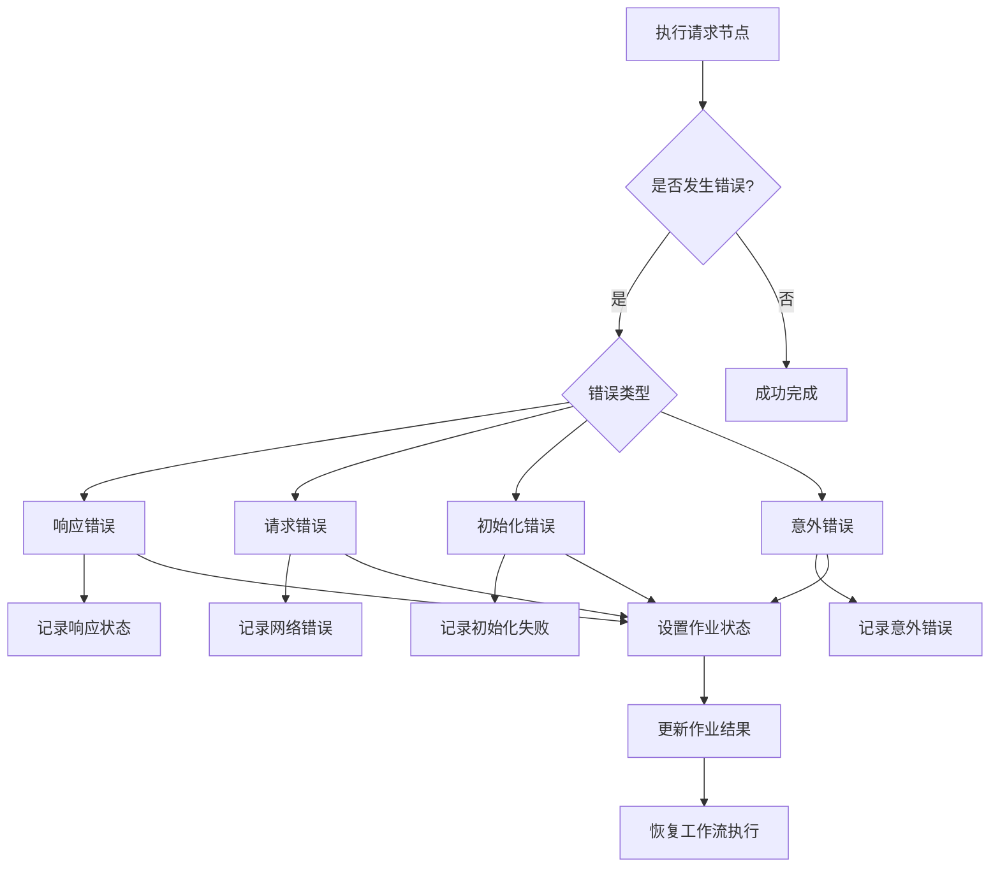

# 执行监控

<cite>
**本文档中引用的文件**  
- [useWorkflowExecuted.ts](file://packages/plugins/@nocobase/plugin-workflow/src/client/hooks/useWorkflowExecuted.ts)
- [executions.tsx](file://packages/plugins/@nocobase/plugin-workflow/src/client/schemas/executions.tsx)
- [Execution.ts](file://packages/plugins/@nocobase/plugin-workflow/src/server/types/Execution.ts)
- [Job.ts](file://packages/plugins/@nocobase/plugin-workflow/src/server/types/Job.ts)
- [constants.ts](file://packages/plugins/@nocobase/plugin-workflow/src/server/constants.ts)
- [constants.tsx](file://packages/plugins/@nocobase/plugin-workflow/src/client/constants.tsx)
- [Dispatcher.ts](file://packages/plugins/@nocobase/plugin-workflow/src/server/Dispatcher.ts)
- [Plugin.ts](file://packages/plugins/@nocobase/plugin-workflow/src/server/Plugin.ts)
- [workflowStats.ts](file://packages/plugins/@nocobase/plugin-workflow/src/common/collections/workflowStats.ts)
- [workflowVersionStats.ts](file://packages/plugins/@nocobase/plugin-workflow/src/common/collections/workflowVersionStats.ts)
- [ExecutionPage.tsx](file://packages/plugins/@nocobase/plugin-workflow/src/client/ExecutionPage.tsx)
- [ExecutionCanvas.tsx](file://packages/plugins/@nocobase/plugin-workflow/src/client/ExecutionCanvas.tsx)
- [RequestInstruction.ts](file://packages/plugins/@nocobase/plugin-workflow-request/src/server/RequestInstruction.ts)
- [workflows.ts](file://packages/plugins/@nocobase/plugin-workflow/src/server/actions/workflows.ts)
- [nodes.ts](file://packages/plugins/@nocobase/plugin-workflow/src/server/actions/nodes.ts)
</cite>

## 目录
1. [简介](#简介)
2. [执行日志查看](#执行日志查看)
3. [状态跟踪](#状态跟踪)
4. [性能分析](#性能分析)
5. [错误处理机制](#错误处理机制)
6. [监控指标说明](#监控指标说明)
7. [故障排查指南](#故障排查指南)
8. [总结](#总结)

## 简介

NocoBase工作流执行监控系统为用户提供全面的执行监控和调试能力。该系统通过详细的执行日志、状态跟踪、性能指标和错误处理机制，帮助用户深入了解工作流的执行过程，及时发现和解决问题。监控系统涵盖了从执行创建、状态变更到完成或失败的整个生命周期，为工作流的稳定运行提供了有力保障。

**Section sources**
- [Plugin.ts](file://packages/plugins/@nocobase/plugin-workflow/src/server/Plugin.ts#L1-L551)
- [Dispatcher.ts](file://packages/plugins/@nocobase/plugin-workflow/src/server/Dispatcher.ts#L1-L474)

## 执行日志查看

### 执行历史记录

NocoBase工作流系统提供了完整的执行历史记录功能，用户可以查看工作流实例的执行历史。执行历史通过`executions`集合进行存储和管理，每个执行记录包含以下关键信息：

- **ID**: 执行实例的唯一标识符
- **触发时间**: 执行被触发的时间戳
- **版本**: 关联的工作流版本
- **状态**: 当前执行的状态

执行历史的查看界面通过`ExecutionPage`组件实现，该组件使用`ResourceActionProvider`从服务器获取执行数据，并通过`ExecutionCanvas`组件进行可视化展示。



**Diagram sources**
- [ExecutionPage.tsx](file://packages/plugins/@nocobase/plugin-workflow/src/client/ExecutionPage.tsx#L1-L55)
- [ExecutionCanvas.tsx](file://packages/plugins/@nocobase/plugin-workflow/src/client/ExecutionCanvas.tsx#L202-L286)

### 详细执行步骤

工作流的详细执行步骤通过`jobs`集合进行记录。每个执行实例包含多个作业（job），每个作业代表工作流中的一个节点执行。通过分析作业序列，用户可以深入了解工作流的执行流程和每个节点的执行结果。

执行步骤的查看功能允许用户：
- 查看每个节点的执行状态
- 查看节点执行的输入和输出数据
- 跟踪节点间的执行顺序
- 分析节点执行的耗时

**Section sources**
- [executions.tsx](file://packages/plugins/@nocobase/plugin-workflow/src/client/schemas/executions.tsx#L1-L83)
- [Execution.ts](file://packages/plugins/@nocobase/plugin-workflow/src/server/types/Execution.ts#L1-L34)

## 状态跟踪

### 执行状态

NocoBase工作流系统定义了多种执行状态，用于准确描述工作流实例的生命周期。这些状态在服务器端和客户端都有定义，确保状态的一致性。

服务器端定义的状态包括：
- **QUEUEING (null)**: 排队中，已触发但仍在等待执行
- **STARTED (0)**: 进行中，已经开始执行
- **RESOLVED (1)**: 已解决，成功完成
- **FAILED (-1)**: 失败，未能满足节点配置
- **ERROR (-2)**: 错误，节点遇到错误
- **ABORTED (-3)**: 已中止，程序流中止了运行
- **CANCELED (-4)**: 已取消，手动取消了整个执行
- **REJECTED (-5)**: 已拒绝，从手动节点被拒绝
- **RETRY_NEEDED (-6)**: 需要重试，一般失败但应再次尝试



**Diagram sources**
- [constants.ts](file://packages/plugins/@nocobase/plugin-workflow/src/server/constants.ts#L10-L20)
- [constants.tsx](file://packages/plugins/@nocobase/plugin-workflow/src/client/constants.tsx#L24-L108)

### 作业状态

除了执行状态外，系统还定义了作业（job）的状态，用于跟踪工作流中每个节点的执行情况：

- **PENDING (0)**: 挂起，等待处理
- **RESOLVED (1)**: 已解决，成功完成
- **FAILED (-1)**: 失败，执行失败
- **ERROR (-2)**: 错误，遇到错误
- **ABORTED (-3)**: 已中止
- **CANCELED (-4)**: 已取消
- **REJECTED (-5)**: 已拒绝
- **RETRY_NEEDED (-6)**: 需要重试

作业状态与执行状态相互关联，共同构成了完整的工作流执行状态跟踪体系。

**Section sources**
- [constants.ts](file://packages/plugins/@nocobase/plugin-workflow/src/server/constants.ts#L22-L32)
- [constants.tsx](file://packages/plugins/@nocobase/plugin-workflow/src/client/constants.tsx#L116-L177)
- [Job.ts](file://packages/plugins/@nocobase/plugin-workflow/src/server/types/Job.ts#L1-L28)

## 性能分析

### 执行统计

NocoBase工作流系统提供了详细的执行统计功能，帮助用户分析工作流的性能表现。系统通过两个统计表来记录执行数据：

1. **workflowStats**: 记录工作流的整体执行统计
2. **workflowVersionStats**: 记录特定版本工作流的执行统计

这些统计信息包括：
- **executed**: 执行次数，使用bigInt类型存储，避免溢出

统计信息在工作流执行时自动更新。当创建新的执行实例时，系统会自动递增相应的统计计数器。



**Diagram sources**
- [workflowStats.ts](file://packages/plugins/@nocobase/plugin-workflow/src/common/collections/workflowStats.ts#L1-L38)
- [workflowVersionStats.ts](file://packages/plugins/@nocobase/plugin-workflow/src/common/collections/workflowVersionStats.ts#L1-L38)
- [Dispatcher.ts](file://packages/plugins/@nocobase/plugin-workflow/src/server/Dispatcher.ts#L308-L318)

### 执行时长分析

系统通过日志记录和状态变更时间戳来分析执行时长。关键的时间点包括：

- **createdAt**: 执行创建时间
- **updatedAt**: 执行最后更新时间

通过计算这两个时间戳的差值，可以得到工作流的总执行时长。此外，系统还记录了每个作业的执行时间，帮助用户分析工作流中各个节点的性能表现。

**Section sources**
- [Execution.ts](file://packages/plugins/@nocobase/plugin-workflow/src/server/types/Execution.ts#L23-L24)
- [Dispatcher.ts](file://packages/plugins/@nocobase/plugin-workflow/src/server/Dispatcher.ts#L284-L295)

## 错误处理机制

### 失败重试

NocoBase工作流系统支持失败重试机制。当节点执行失败时，系统会根据配置决定是否需要重试。如果配置了`ignoreFail`选项，即使节点失败，也会被视为成功（RESOLVED状态）。

对于需要重试的情况，系统会将状态设置为`RETRY_NEEDED`，并在适当的时候重新执行该节点。

### 异常捕获

系统通过try-catch机制捕获执行过程中的异常，并进行适当的处理。以请求节点为例，系统会区分不同类型的错误：

- **响应错误**: 有响应但状态码表示失败
- **请求错误**: 无响应，网络连接问题
- **初始化错误**: 请求发起失败
- **意外错误**: 其他未预期的错误



**Diagram sources**
- [RequestInstruction.ts](file://packages/plugins/@nocobase/plugin-workflow-request/src/server/RequestInstruction.ts#L202-L249)

### 告警通知配置

系统支持通过通知插件配置告警通知。当工作流执行失败或遇到错误时，可以通过邮件、站内消息等方式发送告警通知。通知配置包括：

- **通知渠道**: 邮件、短信、站内消息等
- **通知内容**: 自定义消息模板
- **触发条件**: 特定状态或错误类型

**Section sources**
- [RequestInstruction.ts](file://packages/plugins/@nocobase/plugin-workflow-request/src/server/RequestInstruction.ts#L202-L249)
- [NotificationInstruction.ts](file://packages/plugins/@nocobase/plugin-workflow-notification/src/server/NotificationInstruction.ts#L1-L123)

## 监控指标说明

### 执行时长

执行时长是衡量工作流性能的重要指标，表示从工作流触发到完成所花费的时间。系统通过以下方式计算执行时长：

- **总执行时长**: updatedAt - createdAt
- **节点执行时长**: 各作业的执行时间差

### 成功率

成功率是衡量工作流稳定性的重要指标，计算公式为：

```
成功率 = 成功执行次数 / 总执行次数 × 100%
```

成功执行指状态为`RESOLVED`的执行实例。

### 资源消耗

资源消耗指标包括：
- **执行次数**: 反映工作流的使用频率
- **并发执行数**: 反映系统的并发处理能力
- **数据库查询次数**: 反映对数据库的负载

这些指标帮助用户评估工作流对系统资源的影响。

**Section sources**
- [useWorkflowExecuted.ts](file://packages/plugins/@nocobase/plugin-workflow/src/client/hooks/useWorkflowExecuted.ts#L1-L20)
- [workflowStats.ts](file://packages/plugins/@nocobase/plugin-workflow/src/common/collections/workflowStats.ts#L1-L38)

## 故障排查指南

### 超时问题

当工作流执行超时时，建议检查以下方面：

1. **节点配置**: 检查是否有耗时较长的节点，如外部API调用
2. **网络连接**: 检查与外部服务的网络连接是否稳定
3. **系统资源**: 检查服务器CPU、内存使用情况
4. **数据库性能**: 检查数据库查询是否过慢

### 数据不一致

数据不一致问题可能由以下原因引起：

1. **并发执行**: 多个执行实例同时修改同一数据
2. **事务问题**: 数据库事务未正确提交或回滚
3. **缓存问题**: 缓存与数据库数据不一致

解决方案包括：
- 使用数据库事务确保数据一致性
- 实现适当的锁机制防止并发冲突
- 及时更新缓存

### 权限错误

权限错误通常由以下原因导致：

1. **角色权限配置**: 用户角色缺少必要的操作权限
2. **数据权限**: 用户无权访问特定数据
3. **API权限**: 工作流调用的API需要特定权限

检查和解决方法：
- 检查用户角色的权限配置
- 验证数据权限规则
- 确认API调用的认证信息

**Section sources**
- [Dispatcher.ts](file://packages/plugins/@nocobase/plugin-workflow/src/server/Dispatcher.ts#L277-L315)
- [workflows.ts](file://packages/plugins/@nocobase/plugin-workflow/src/server/actions/workflows.ts#L125-L174)
- [nodes.ts](file://packages/plugins/@nocobase/plugin-workflow/src/server/actions/nodes.ts#L282-L318)

## 总结

NocoBase工作流执行监控系统提供了全面的监控和调试工具，帮助用户有效管理和优化工作流。通过详细的执行日志、精确的状态跟踪、全面的性能分析和完善的错误处理机制，用户可以深入了解工作流的执行情况，及时发现和解决各种问题。系统的设计考虑了实际使用中的各种场景，为工作流的稳定运行提供了有力保障。

**Section sources**
- [Plugin.ts](file://packages/plugins/@nocobase/plugin-workflow/src/server/Plugin.ts#L1-L551)
- [Dispatcher.ts](file://packages/plugins/@nocobase/plugin-workflow/src/server/Dispatcher.ts#L1-L474)