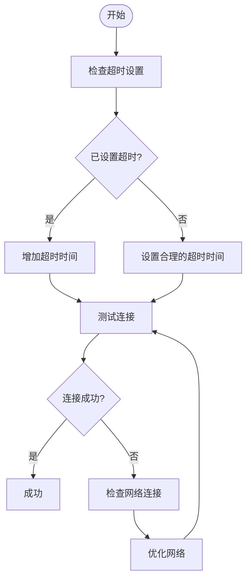
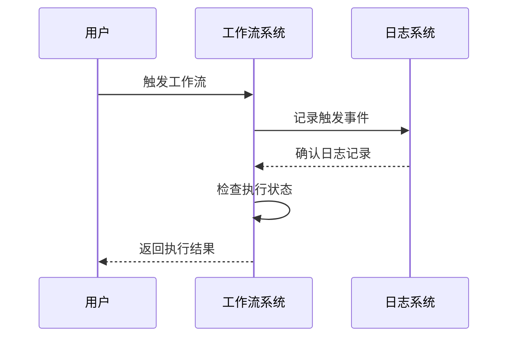

# 故障排查指南

<cite>
**本文档中引用的文件**   
- [RequestInstruction.ts](file://packages\plugins\@nocobase\plugin-workflow-request\src\server\RequestInstruction.ts)
- [Processor.ts](file://packages\plugins\@nocobase\plugin-workflow\src\server\Processor.ts)
- [Dispatcher.ts](file://packages\plugins\@nocobase\plugin-workflow\src\server\Dispatcher.ts)
- [Plugin.ts](file://packages\plugins\@nocobase\plugin-workflow\src\server\Plugin.ts)
- [constants.ts](file://packages\plugins\@nocobase\plugin-workflow\src\server\constants.ts)
- [EndInstruction.ts](file://packages\plugins\@nocobase\plugin-workflow\src\server\instructions\EndInstruction.ts)
- [nodes.ts](file://packages\plugins\@nocobase\plugin-workflow\src\server\actions\nodes.ts)
- [jobs.ts](file://packages\plugins\@nocobase\plugin-workflow\src\server\actions\jobs.ts)
- [executions.ts](file://packages\plugins\@nocobase\plugin-workflow\src\server\actions\executions.ts)
- [workflowStats.ts](file://packages\plugins\@nocobase\plugin-workflow\src\common\collections\workflowStats.ts)
- [workflowVersionStats.ts](file://packages\plugins\@nocobase\plugin-workflow\src\common\collections\workflowVersionStats.ts)
</cite>

## 目录
1. [引言](#引言)
2. [常见执行问题及解决方案](#常见执行问题及解决方案)
3. [分步诊断流程](#分步诊断流程)
4. [错误代码含义与修复建议](#错误代码含义与修复建议)
5. [重试机制配置与使用](#重试机制配置与使用)
6. [性能问题排查方法](#性能问题排查方法)
7. [实际故障案例分析](#实际故障案例分析)
8. [结论](#结论)

## 引言

NocoBase工作流系统是一个强大的自动化引擎，允许用户创建复杂的业务流程。然而，在实际使用过程中，可能会遇到各种执行问题，如连接超时、数据验证失败、权限不足和第三方服务不可用等。本指南旨在提供一个系统性的故障排查框架，帮助用户快速识别和解决这些问题。通过详细的日志分析、根本原因定位和有效的修复策略，用户可以确保工作流的稳定运行。

**本文档中引用的文件**   
- [Processor.ts](file://packages\plugins\@nocobase\plugin-workflow\src\server\Processor.ts#L1-L508)
- [Dispatcher.ts](file://packages\plugins\@nocobase\plugin-workflow\src\server\Dispatcher.ts#L1-L474)

## 常见执行问题及解决方案

### 连接超时

连接超时通常发生在工作流节点尝试与外部服务通信时。在`RequestInstruction.ts`文件中，可以看到请求配置包含一个`timeout`参数，默认值为5000毫秒。如果请求在此时间内未完成，将触发超时错误。解决方案包括增加超时时间、优化网络连接或检查目标服务的可用性。

**图表来源**
- [RequestInstruction.ts](file://packages\plugins\@nocobase\plugin-workflow-request\src\server\RequestInstruction.ts#L98)

**本节来源**
- [RequestInstruction.ts](file://packages\plugins\@nocobase\plugin-workflow-request\src\server\RequestInstruction.ts#L1-L250)

### 数据验证失败

数据验证失败可能由于输入数据不符合预期格式或规则。在`Processor.ts`中，`getParsedValue`方法负责解析和验证节点配置中的值。如果解析失败，可能导致工作流执行中断。建议检查输入数据的格式，并确保所有必需字段都已正确填写。

**本节来源**
- [Processor.ts](file://packages\plugins\@nocobase\plugin-workflow\src\server\Processor.ts#L495-L506)

### 权限不足

权限不足问题通常与用户角色和访问控制相关。在`ActionTrigger.ts`中，可以看到对用户权限的验证逻辑。如果用户没有足够的权限执行特定操作，将返回403错误。解决方案是检查用户角色配置，并确保其具有执行所需操作的权限。

**本节来源**
- [ActionTrigger.ts](file://packages\plugins\@nocobase\plugin-workflow-action-trigger\src\server\ActionTrigger.ts#L280-L307)

### 第三方服务不可用

当工作流依赖的第三方服务不可用时，可能导致执行失败。在`RequestInstruction.ts`中，错误处理逻辑区分了不同类型的错误，如`error.response`表示有响应但状态码错误，`error.request`表示无响应。建议实施重试机制，并监控第三方服务的健康状况。

**本节来源**
- [RequestInstruction.ts](file://packages\plugins\@nocobase\plugin-workflow-request\src\server\RequestInstruction.ts#L203-L213)

## 分步诊断流程

### 问题识别

问题识别是故障排查的第一步。通过监控工作流执行状态和日志，可以快速发现异常。在`Dispatcher.ts`中，`trigger`方法负责触发工作流执行，并记录相关日志。如果工作流未按预期触发，应首先检查触发条件和配置。

**图表来源**
- [Dispatcher.ts](file://packages\plugins\@nocobase\plugin-workflow\src\server\Dispatcher.ts#L77-L123)

**本节来源**
- [Dispatcher.ts](file://packages\plugins\@nocobase\plugin-workflow\src\server\Dispatcher.ts#L1-L474)

### 日志分析

日志分析是定位问题的关键步骤。NocoBase工作流系统使用`Logger`类记录详细的执行信息。在`Plugin.ts`中，`getLogger`方法根据工作流ID创建独立的日志实例。通过分析日志，可以追踪到具体的错误发生点。

**本节来源**
- [Plugin.ts](file://packages\plugins\@nocobase\plugin-workflow\src\server\Plugin.ts#L229-L245)

### 根本原因定位

根本原因定位需要结合日志和代码逻辑进行深入分析。在`Processor.ts`中，`run`方法负责执行工作流节点。如果某个节点执行失败，可以通过检查其输入参数和配置来确定问题根源。

**本节来源**
- [Processor.ts](file://packages\plugins\@nocobase\plugin-workflow\src\server\Processor.ts#L241-L255)

## 错误代码含义与修复建议

### 执行状态代码

NocoBase工作流系统定义了多种执行状态，这些状态在`constants.ts`文件中明确定义。例如，`EXECUTION_STATUS.STARTED`表示执行已开始，而`EXECUTION_STATUS.FAILED`表示执行失败。理解这些状态有助于快速判断工作流的当前状况。

| 状态代码 | 含义 | 修复建议 |
|---------|------|---------|
| QUEUEING | 排队中 | 检查系统负载和资源分配 |
| STARTED | 已开始 | 监控执行进度 |
| RESOLVED | 已解决 | 确认结果正确性 |
| FAILED | 失败 | 检查错误日志并修正配置 |
| ERROR | 错误 | 调试代码逻辑 |
| ABORTED | 已中止 | 检查中止条件 |
| CANCELED | 已取消 | 确认取消原因 |

**本节来源**
- [constants.ts](file://packages\plugins\@nocobase\plugin-workflow\src\server\constants.ts#L10-L20)

### 作业状态代码

作业状态代码反映了单个工作节点的执行情况。`JOB_STATUS.PENDING`表示作业待处理，`JOB_STATUS.RESOLVED`表示作业成功完成。这些状态对于跟踪工作流中每个节点的执行情况至关重要。

| 状态代码 | 含义 | 修复建议 |
|---------|------|---------|
| PENDING | 待处理 | 检查资源可用性 |
| RESOLVED | 已解决 | 验证输出结果 |
| FAILED | 失败 | 检查输入数据和配置 |
| ERROR | 错误 | 调试节点逻辑 |
| ABORTED | 已中止 | 检查中止条件 |
| CANCELED | 已取消 | 确认取消原因 |
| REJECTED | 已拒绝 | 检查权限和验证规则 |

**本节来源**
- [constants.ts](file://packages\plugins\@nocobase\plugin-workflow\src\server\constants.ts#L22-L31)

## 重试机制配置与使用

### 重试次数配置

重试机制允许在节点执行失败时自动重试。在`RequestInstruction.ts`中，虽然没有直接的重试次数配置，但可以通过`ignoreFail`选项控制失败后的行为。如果设置为`true`，即使请求失败，节点也会被视为成功。

**本节来源**
- [RequestInstruction.ts](file://packages\plugins\@nocobase\plugin-workflow-request\src\server\RequestInstruction.ts#L26-L27)

### 间隔时间与退避策略

间隔时间和退避策略对于避免频繁重试导致的服务压力非常重要。虽然当前代码中未实现复杂的退避算法，但可以通过外部调度器或自定义插件来实现指数退避等策略。

**本节来源**
- [RequestInstruction.ts](file://packages\plugins\@nocobase\plugin-workflow-request\src\server\RequestInstruction.ts#L122)

## 性能问题排查方法

### 识别长时间运行的节点

长时间运行的节点可能成为性能瓶颈。在`Processor.ts`中，`saveJob`方法记录了每个作业的创建和更新时间。通过分析这些时间戳，可以识别出执行时间过长的节点。

**本节来源**
- [Processor.ts](file://packages\plugins\@nocobase\plugin-workflow\src\server\Processor.ts#L365-L369)

### 优化数据处理逻辑

优化数据处理逻辑可以显著提升工作流性能。在`Processor.ts`中，`getParsedValue`方法使用模板解析技术来处理动态值。确保模板表达式简洁高效，避免复杂的计算和循环。

**本节来源**
- [Processor.ts](file://packages\plugins\@nocobase\plugin-workflow\src\server\Processor.ts#L495-L506)

## 实际故障案例分析

### 案例一：连接超时导致工作流中断

某用户报告其工作流在调用外部API时经常中断。通过检查日志，发现大量`request (#${node.id}) failed without response`错误。进一步分析发现，目标服务响应时间较长，而默认超时设置仅为5秒。解决方案是将超时时间增加到30秒，并实施重试机制。

**本节来源**
- [RequestInstruction.ts](file://packages\plugins\@nocobase\plugin-workflow-request\src\server\RequestInstruction.ts#L207)

### 案例二：权限不足导致审批流程失败

在一个审批流程中，用户无法提交审批请求。日志显示`403 Forbidden`错误。检查代码发现，`ActionTrigger.ts`中的权限验证逻辑要求用户必须是特定角色。解决方案是调整角色配置，确保相关用户具有必要的权限。

**本节来源**
- [ActionTrigger.ts](file://packages\plugins\@nocobase\plugin-workflow-action-trigger\src\server\ActionTrigger.ts#L280-L307)

## 结论

本指南系统地介绍了NocoBase工作流系统的故障排查方法。通过理解常见的执行问题、掌握分步诊断流程、熟悉错误代码含义以及合理配置重试机制，用户可以有效解决各种故障。此外，性能问题的排查和实际案例的分析为用户提供了宝贵的实践经验。建议定期审查工作流配置，监控系统日志，并及时更新插件以获得最新的功能和修复。