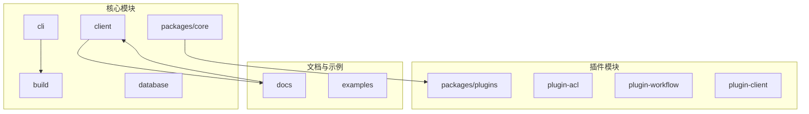
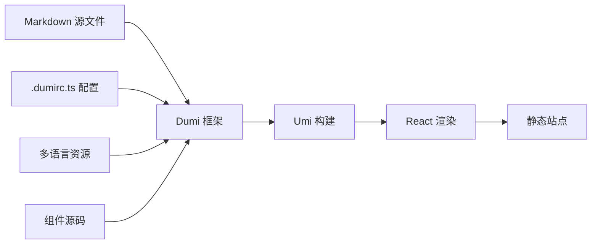
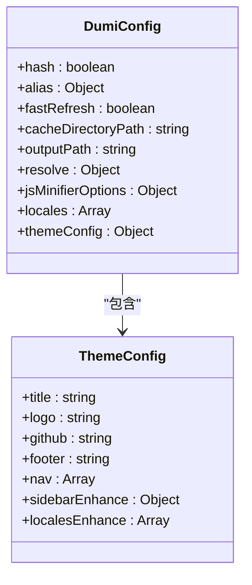
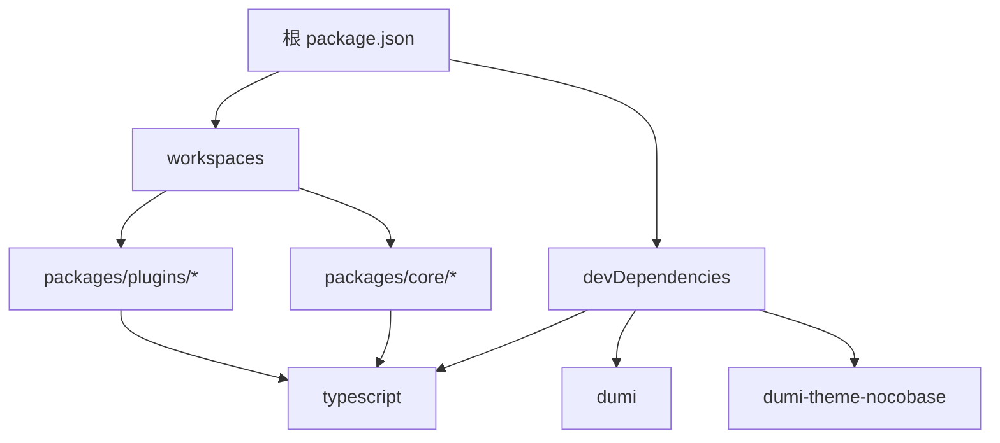

# 文档站点开发指南

<cite>
**本文档引用文件**  
- [文档站点开发指南.md](file://docs/文档站点开发指南.md)
- [package.json](file://package.json)
- [lerna.json](file://lerna.json)
- [.dumirc.ts](file://packages/core/client/.dumirc.ts)
- [README.md](file://README.md)
</cite>

## 目录
1. [简介](#简介)
2. [项目结构](#项目结构)
3. [核心组件](#核心组件)
4. [架构概述](#架构概述)
5. [详细组件分析](#详细组件分析)
6. [依赖分析](#依赖分析)
7. [性能考虑](#性能考虑)
8. [故障排除指南](#故障排除指南)
9. [结论](#结论)

## 简介

NocoBase 是一个高度可扩展的 AI 驱动无代码平台，提供完全控制和无限扩展能力。本指南旨在说明如何在本地开发、预览和贡献 NocoBase 官方文档。文档仓库（`nocobase/docs`）与主仓库（`nocobase/nocobase`）分工明确，文档仓库专注于官方文档站点的构建与维护，支持多语言文档的编写与校对。

**Section sources**
- [README.md](file://README.md#L10-L16)
- [文档站点开发指南.md](file://docs/文档站点开发指南.md#L3-L15)

## 项目结构

NocoBase 项目采用 Lerna 和 Yarn Workspaces 管理多个包，形成微内核插件架构。核心代码位于 `packages/core` 目录下，插件位于 `packages/plugins` 目录下。文档开发主要涉及 `docs` 目录和 `packages/core/client` 目录。`docs` 目录存放官方文档的 Markdown 源文件，而 `packages/core/client` 目录则使用 Dumi 框架为客户端组件生成文档站点。

**Diagram sources **
- [package.json](file://package.json#L4-L7)
- [lerna.json](file://lerna.json#L1-L4)

**Section sources**
- [package.json](file://package.json#L4-L7)
- [lerna.json](file://lerna.json#L1-L4)

## 核心组件

文档站点的核心组件包括 Dumi 文档框架、Umi 配置、多语言支持和导航配置。`packages/core/client` 目录下的 `.dumirc.ts` 文件是文档站点的主要配置文件，定义了输出路径、解析目录、主题配置和导航结构。文档站点支持中文（zh-CN）和英文（en-US）两种语言，通过环境变量 `DOC_LANG` 控制当前语言。

**Section sources**
- [.dumirc.ts](file://packages/core/client/.dumirc.ts#L1-L683)
- [package.json](file://package.json#L19-L37)

## 架构概述

NocoBase 的文档站点采用 Dumi 框架构建，基于 Umi 和 React 技术栈。文档源文件存放在 `docs` 目录下，按语言分类（如 `zh-CN`、`en-US`）。构建工具通过 `dumi-theme-nocobase` 主题定制化渲染文档，支持组件演示、API 文档和多语言切换。文档站点与主应用分离，确保文档开发不影响核心功能。

**Diagram sources **
- [.dumirc.ts](file://packages/core/client/.dumirc.ts#L11-L683)
- [package.json](file://package.json#L19-L37)

## 详细组件分析

### 文档配置组件分析

`.dumirc.ts` 文件是文档站点的核心配置，使用 `defineConfig` 函数定义构建选项。`resolve.docDirs` 指定文档源目录，`outputPath` 定义输出路径，`themeConfig.nav` 配置顶部导航菜单。多语言支持通过 `locales` 和 `localesEnhance` 实现，允许在不同语言版本间切换。

**Diagram sources **
- [.dumirc.ts](file://packages/core/client/.dumirc.ts#L11-L683)

**Section sources**
- [.dumirc.ts](file://packages/core/client/.dumirc.ts#L11-L683)

### 文档开发流程分析

文档贡献流程包括新建或修改 Markdown 文档、本地预览、提交 Pull Request 和代码审查。开发者需在 `nocobase/docs` 仓库中对应语言目录下编写文档，使用 `yarn dev` 命令启动本地服务器预览效果。文档变更需与主仓库功能更新同步，确保内容准确性和时效性。

**Section sources**
- [文档站点开发指南.md](file://docs/文档站点开发指南.md#L107-L128)

## 依赖分析

项目依赖通过 Yarn Workspaces 和 Lerna 管理，确保包间依赖一致性。`package.json` 中的 `workspaces` 字段定义了包的路径模式，`lerna.json` 配置了版本管理和发布策略。文档站点依赖 `dumi` 和 `dumi-theme-nocobase`，这些依赖在 `devDependencies` 中声明，确保开发环境的一致性。

**Diagram sources **
- [package.json](file://package.json#L4-L89)
- [lerna.json](file://lerna.json#L1-L4)

**Section sources**
- [package.json](file://package.json#L4-L89)
- [lerna.json](file://lerna.json#L1-L4)

## 性能考虑

文档站点构建性能受缓存机制和输出优化影响。`.dumirc.ts` 中的 `cacheDirectoryPath` 配置了缓存目录，避免重复构建。`jsMinifierOptions` 指定了目标浏览器版本，确保生成的 JavaScript 代码兼容性。建议在开发时使用 `yarn dev` 启动热更新服务器，在生产环境使用 `yarn build` 生成优化后的静态文件。

## 故障排除指南

常见问题包括文档站点启动失败、链接失效和多语言切换异常。若构建失败，应检查依赖是否完整安装、Markdown 语法是否正确、导航配置是否有效。切换语言时需停止当前服务器并启动对应语言的开发命令。本地预览时，确保端口未被占用，且环境变量 `DOC_LANG` 设置正确。

**Section sources**
- [文档站点开发指南.md](file://docs/文档站点开发指南.md#L134-L144)

## 结论

NocoBase 文档站点开发遵循清晰的流程和规范，利用 Dumi 框架和微内核架构实现高效、可扩展的文档管理。开发者可通过本地开发环境快速预览和测试文档变更，确保内容质量。文档与代码分离的设计模式，使得文档维护更加灵活，支持多语言国际化，为用户提供全面的技术支持。